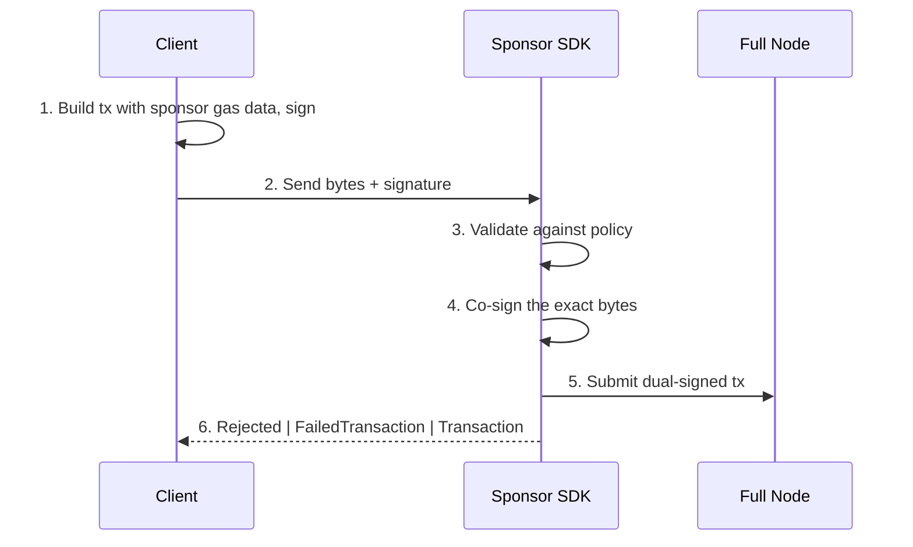

A gas station is a backend service that pays gas on behalf of users or agents.

The recommended approach is [`@mysten-incubation/sponsor`](https://www.npmjs.com/package/@mysten-incubation/sponsor), which handles validation and the dual-signature flow. You supply a signer keypair and a validation policy; the SDK handles the rest. Sponsors pay from address balance using an empty gas payment (`setGasPayment([])`), which avoids locking specific coin objects and enables parallel transaction execution without managing a gas coin pool.

## How it works

The sponsor handshake has six steps:

1. **Client builds a transaction with the sponsor's gas data.** The client sets the sender, sets the sponsor's address as gas owner, sets an empty gas payment (address-balance gas), a gas budget within the sponsor's policy, and a bounded epoch expiration.

2. **Client signs and sends the transaction bytes.** A user signature is only valid over exact bytes, so the client builds and signs the final transaction, then sends the bytes plus the signature to the sponsor.

3. **Sponsor validates the transaction.** The service runs its validators against the bytes, checks them against allowlists and budget caps, and rejects anything outside policy.

4. **Sponsor co-signs.** The user-signed bytes are final, so the sponsor never modifies them; it adds its own signature over the same bytes.

5. **Sponsor executes.** The sponsor submits the dual-signed transaction to a full node.

6. **Sponsor returns the result.** The result is a discriminated union: `Rejected` (policy declined, no execution), `FailedTransaction` (executed onchain but aborted, gas still charged), or `Transaction` (success).


```mermaid
sequenceDiagram
    participant C as Client
    participant S as Sponsor SDK
    participant N as Full Node
    C->>C: 1. Build tx with sponsor gas data, sign
    C->>S: 2. Send bytes + signature
    S->>S: 3. Validate against policy
    S->>S: 4. Co-sign the exact bytes
    S->>N: 5. Submit dual-signed tx
    S-->>C: 6. Rejected | FailedTransaction | Transaction
```

The SDK also supports a sponsor-builds flow (`signTransaction` without a user signature), where the sponsor sets itself as gas owner, builds the transaction, and returns sponsored bytes for the user to sign. This page uses the user-signed flow shown above.

## Using `@mysten-incubation/sponsor`

Install the package:

```sh npm2yarn
npm install @mysten-incubation/sponsor @mysten/sui
```

### Create a sponsor

Create a sponsor with a signer keypair, a client, and a validation policy. The `defaults()` bundle provides six built-in checks: `validSender`, `onlyAddressBalanceGas`, `gasCoinNotUsed`, `onlySenderWithdrawals`, `simulationSucceeds`, and `boundedExpiration`. These run automatically when you pass no `validate` array; once you pass your own, include `defaults()` explicitly to keep the baseline.

<ImportContent
  source="examples/onchain-finance/gas-station/src/sponsor-sdk.ts"
  mode="code"
  tag="sponsor-sdk-create"
/>

### Sponsor and execute a transaction

Pass the client's transaction bytes and signature. The result is a discriminated union with three outcomes:

<ImportContent
  source="examples/onchain-finance/gas-station/src/sponsor-sdk.ts"
  mode="code"
  tag="sponsor-sdk-sponsor"
/>

### Validation policy

The `defaults()` bundle provides a strong baseline. Layer additional validators to verify the user's signature, cap the gas budget, and restrict which Move functions are sponsored:

<ImportContent
  source="examples/onchain-finance/gas-station/src/sponsor-sdk.ts"
  mode="code"
  tag="sponsor-sdk-validate"
/>

### Built-in validators

| Validator | Rejects when |
|-----------|-------------|
| `validSender()` | sender unset or is gas owner |
| `onlyAddressBalanceGas()` | gas payment is not empty |
| `gasCoinNotUsed()` | a command uses the gas coin |
| `onlySenderWithdrawals()` | FundsWithdrawal is not the sender's |
| `userSignatureMatchesSender()` | user signature invalid or wrong signer |
| `gasBudget({ min?, max? })` | budget unset or out of range |
| `allowedPackages([...])` | MoveCall targets an unlisted package |
| `allowedFunctions([...])` | MoveCall targets an unlisted function |
| `simulationSucceeds()` | dry-run indicates failure |
| `boundedExpiration()` | expiration missing or beyond next epoch |

Only the first four plus `simulationSucceeds` and `boundedExpiration` are part of `defaults()`; add the others explicitly to match your policy. You can also write custom validators for application-specific checks such as authenticating callers or rate limiting senders.

For full API details, see the [`@mysten-incubation/sponsor` documentation](https://sdk.mystenlabs.com/sponsor).

## Sponsoring agent transactions

When sponsoring transactions for an autonomous agent rather than an interactive user, layer additional checks around the sponsor call:

- **Identity verification:** The agent authenticates with an API key or presents a signed challenge before the gas station validates the transaction itself.
- **Per-agent budgets:** Track cumulative gas spend per agent address and enforce daily or weekly caps.
- **Tight allowlists:** Restrict agents to the specific Move functions they need with `allowedFunctions`.

<ImportContent
	source="examples/onchain-finance/gas-station/src/agent-sponsor.ts"
	mode="code"
	tag="agent-sponsor"
/>

## Monitoring and cost control

Track these metrics for your gas station:

- **Sponsor address balance.** Alert before the balance drops below your expected daily spend.
- **Sponsorship volume.** Requests per minute, broken down by sender address.
- **Gas spend.** Total SUI spent on gas per hour. Compare against your budget.
- **Rejection rate.** Percentage of requests rejected by validation. A spike indicates possible abuse.

Set a maximum daily spend for the entire gas station. When the limit is reached, reject all new sponsorship requests until the next day or until an operator manually raises the limit.

For the protocol-level details of sponsored transactions (GasData structure, risk considerations, sequence diagrams), see [Sponsored Transactions](/develop/transaction-payment/sponsor-txn).
