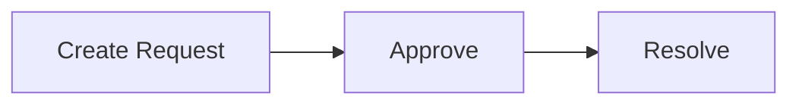
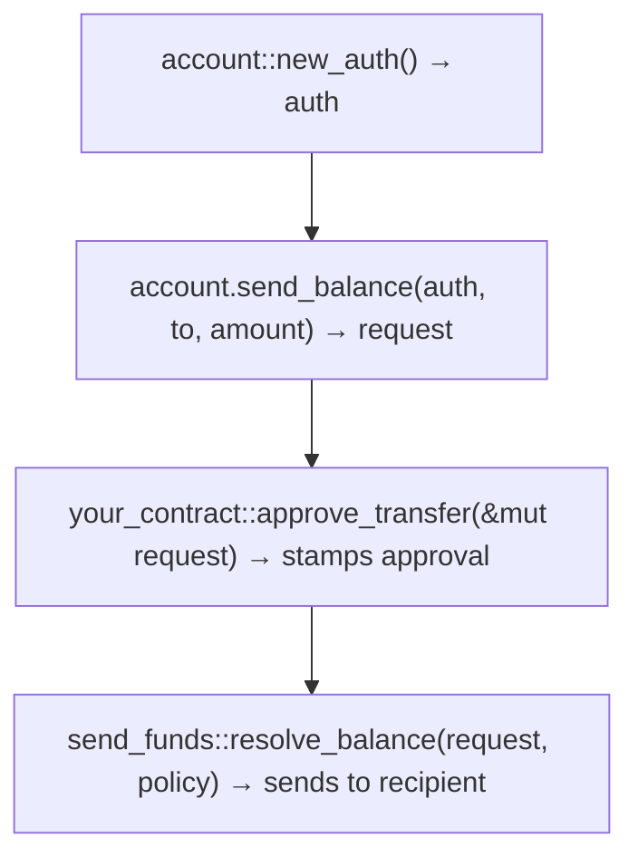

The Permissioned Asset Standard (PAS) is a permissioned asset framework on Sui. Assets of different types live under **Accounts** (one per address, independent of types) and can only move between Accounts through hot potato requests that must be approved and resolved in the same programmable transaction block (PTB).

Every action follows the same pattern:



## Create Accounts

Account creation is permissionless. There is one Account per address, and an Account can hold any asset type:

```move
account::create_and_share(&mut namespace, @0xAlice);
account::create_and_share(&mut namespace, @0xBob);
```

## Transfer a balance

You can transfer a balance of permissioned assets from one Account to another. This requires the owner `Auth` proof.

The request contains the following fields:

| **Field** | **Description** |
|---|---|
| `sender` | Wallet or object address (not Account address) |
| `recipient` | Wallet or object address (not Account address) |
| `sender_account_id` | ID of the source Account |
| `recipient_account_id` | Derived ID of the destination Account |
| `funds` | The `T` being transferred |

**Resolution** (for `Balance<C>`): `send_funds::resolve_balance(request, &policy)` verifies approvals and sends the balance directly to the recipient Account through `balance::send_funds`.

The `resolve_balance` function sends the balance directly. The caller does not get it back. It goes straight to the destination Account.

The following example shows a complete transfer flow:

```move
// 1. Create auth proof
let auth = account::new_auth(ctx);

// 2. Create the transfer request (withdraws Balance from sender account)
let mut request = from_account.send_balance<MY_COIN>(
    &auth,
    &to_account,
    amount,
    ctx,
);

// 3. Approve with your witness
request.approve(MyTransferApproval());

// 4. Resolve — sends Balance to recipient account
send_funds::resolve_balance(request, &policy);
```

See the [KYC example `kyc_registry`](https://github.com/MystenLabs/pas/blob/main/packages/examples/kyc/sources/kyc_registry.move) for a registry-gated transfer implementation.

## Clawback a balance

You can forcibly withdraw tokens from an Account. No `Auth` is required because this is an admin action. The policy must have `clawback_allowed: true`.

The request contains the following fields:

| **Field** | **Description** |
|---|---|
| `owner` | Wallet or object address of the source Account |
| `account_id` | ID of the source Account |
| `funds` | The `T` being clawed back |

**Resolution:** `clawback_funds::resolve(request, &policy)` verifies approvals and `policy.clawback_allowed`, then returns `T` to the caller.

Unlike `send_funds`, the caller receives the funds and decides what to do with them (burn, deposit elsewhere, and so on).

The following example shows a clawback flow:

```move
// 1. Create clawback request (no Auth needed)
let mut request = from_account.clawback_balance<MY_COIN>(amount, ctx);

// 2. Approve
request.approve(MyClawbackApproval());

// 3. Resolve — returns the Balance to the caller
let balance: Balance<MY_COIN> = clawback_funds::resolve(request, &policy);

// 4. Do something with the balance (deposit elsewhere, burn, and so on)
to_account.deposit_balance(balance);
```

See the [KYC example `treasury::burn`](https://github.com/MystenLabs/pas/blob/main/packages/examples/kyc/sources/treasury.move) for a clawback-to-burn implementation.

## Unlock a balance

You can remove tokens from the closed-loop system entirely.

:::caution

Enabling `unlock_funds` allows assets to leave the closed-loop system completely, bypassing all future transfer controls. Once unlocked, the asset becomes a regular onchain object with no PAS restrictions. Only allow this action if your use case explicitly requires users to withdraw assets from the managed system.

:::

There are 2 resolution paths:

| **Path** | **When to use** | **Resolution** |
|---|---|---|
| `unlock_funds::resolve(request, &policy)` | Managed asset (`Policy<T>` exists) | Requires matching approvals |
| `unlock_funds::resolve_unrestricted_balance(request, &namespace)` | Unmanaged balance (no Policy) | No approvals needed |

The unrestricted path is `Balance<C>`-specific. It exists for assets like SUI that might accidentally end up in an Account. It aborts if a `Policy<Balance<C>>` exists for the type because you cannot bypass managed asset controls.

### Managed assets (policy exists)

The following example shows an unlock flow for managed assets:

```move
let auth = account::new_auth(ctx);
let mut request = account.unlock_balance<MY_COIN>(&auth, amount, ctx);

request.approve(MyUnlockApproval());
let balance: Balance<MY_COIN> = unlock_funds::resolve(request, &policy);
// Balance is now outside the system
```

See the [Loyalty example `treasury::redeem`](https://github.com/MystenLabs/pas/blob/main/packages/examples/loyalty/sources/treasury.move) for a registry-gated unlock (redemption) implementation.

### Unmanaged assets (no policy)

For example, if SUI is accidentally sent to an Account:

```move
let auth = account::new_auth(ctx);
let request = account.unlock_balance<SUI>(&auth, amount, ctx);

// No approval needed — resolves with empty approval set
let balance: Balance<SUI> = unlock_funds::resolve_unrestricted_balance(request, &namespace);
```

## Deposit a balance

You can deposit tokens into an Account. No request is needed:

```move
account.deposit_balance(balance);
```

You can also send to an Account address directly. This is useful before the Account object is available in the transaction:

```move
balance.send_funds(namespace.account_address(owner));
```

## Resolve actions in Move (inside your contract)

Your contract calls approve and resolve within its own function. The balance never leaves your control:

```move
public fun burn(
    policy: &Policy<Balance<MY_COIN>>,
    cap: &mut TreasuryCap<MY_COIN>,
    mut request: Request<ClawbackFunds<Balance<MY_COIN>>>,
    ctx: &mut TxContext,
) {
    // Approve inside your contract
    request.approve(MyClawbackApproval());

    // Resolve — balance returned to this function
    let balance = clawback_funds::resolve(request, policy);

    // Burn the balance
    cap.burn(balance.into_coin(ctx));
}
```

**Use case:** Burn, seize, or any operation where your contract needs the balance. See [`treasury::burn`](https://github.com/MystenLabs/pas/blob/main/packages/examples/kyc/sources/treasury.move) (KYC) and [`treasury::redeem`](https://github.com/MystenLabs/pas/blob/main/packages/examples/loyalty/sources/treasury.move) (Loyalty).

## Resolve actions in a PTB (client-side)

You create and approve the request across multiple Move calls in a single PTB, then resolve it as a separate Move call:



**Use case:** Transfers, where the compliance contract approves and PAS handles delivery.

:::info

Steps 3 and 4 must be in the same PTB. The request is a hot potato. If the transaction ends without resolution, it aborts.

:::

## Example packages

| **Example** | **Actions** | **Approval pattern** |
|---|---|---|
| [Loyalty](https://github.com/MystenLabs/pas/tree/main/packages/examples/loyalty) | `send_funds` (permissionless), `unlock_funds` (per-address registry) | Transfers are open, and points stay in the system. Redemptions are gated by a `RedeemRegistry` and resolved in Move. Once unlocked, funds leave the managed system entirely. |
| [KYC](https://github.com/MystenLabs/pas/tree/main/packages/examples/kyc) | `send_funds` (KYC registry), `clawback_funds` (issuer) | Every transfer checks the recipient against a `KYCRegistry`. Clawbacks are approved unconditionally, allowing the issuer to burn tokens from any account. |