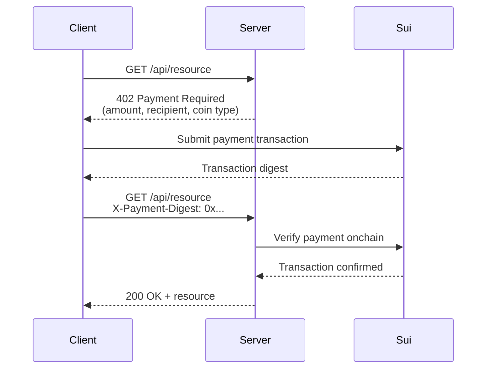

The x402 protocol uses HTTP `402 Payment Required` responses to gate API access behind onchain payments. A client requests a resource, receives payment instructions, submits a Sui transaction, and retries with proof of payment. This pattern is especially useful for agent-to-agent interactions where one service charges another per request.

## How x402 works



1. The client requests a resource from the server.
2. The server responds with HTTP 402 and a JSON body containing payment details: amount, recipient address, and coin type.
3. The client builds a PTB that transfers the requested amount to the server's address, signs, and submits it.
4. The client retries the original request with the transaction digest in an `X-Payment-Digest` header.
5. The server verifies the payment onchain and serves the resource.

## Server implementation

The server middleware checks for a valid payment digest on protected routes. If missing, it returns 402 with payment instructions.

```typescript
import express from 'express';
import { SuiGrpcClient } from '@mysten/sui/grpc';

const PAYMENT_RECIPIENT = '0xYOUR_SERVER_ADDRESS';
const PRICE_MIST = 1_000_000n; // 0.001 SUI
const COIN_TYPE = '0x2::sui::SUI';

const client = new SuiGrpcClient({
  baseUrl: 'https://fullnode.mainnet.sui.io:443',
  network: 'mainnet',
});

// Track used digests to prevent replay
const usedDigests = new Set<string>();

const paymentRequired = (req: express.Request, res: express.Response, next: express.NextFunction) => {
  const digest = req.headers['x-payment-digest'] as string;

  if (!digest) {
    return res.status(402).json({
      amount: PRICE_MIST.toString(),
      recipient: PAYMENT_RECIPIENT,
      coinType: COIN_TYPE,
      message: 'Payment required. Submit a Sui transaction and retry with X-Payment-Digest header.',
    });
  }

  next();
};

const verifyPayment = async (req: express.Request, res: express.Response, next: express.NextFunction) => {
  const digest = req.headers['x-payment-digest'] as string;

  // Replay prevention
  if (usedDigests.has(digest)) {
    return res.status(400).json({ error: 'Payment digest already used' });
  }

  try {
    const result = await client.getTransaction({ digest, include: { balanceChanges: true } });

    if (result.$kind === 'FailedTransaction') {
      return res.status(402).json({ error: 'Transaction failed' });
    }

    const tx = result.Transaction!;
    const balanceChanges = tx.balanceChanges ?? [];

    // Verify the server received the expected amount
    const received = balanceChanges.find(
      (change) =>
        change.owner === PAYMENT_RECIPIENT &&
        change.coinType === COIN_TYPE &&
        BigInt(change.amount) >= PRICE_MIST,
    );

    if (!received) {
      return res.status(402).json({ error: 'Payment not found or insufficient amount' });
    }

    usedDigests.add(digest);
    next();
  } catch {
    return res.status(402).json({ error: 'Could not verify payment' });
  }
};

const app = express();

app.get('/api/resource', paymentRequired, verifyPayment, (req, res) => {
  res.json({ data: 'Protected resource content' });
});

app.listen(3000);
```

:::tip Production replay prevention

The in-memory `Set` works for a single server instance. For production, store used digests in a database with a TTL (for example, 24 hours). After the TTL, the digest can be safely forgotten because old transactions cannot be replayed onchain.

:::

## Client implementation

The client handles 402 responses by constructing a payment transaction and retrying.

```typescript
import { SuiGrpcClient } from '@mysten/sui/grpc';
import { Ed25519Keypair } from '@mysten/sui/keypairs/ed25519';
import { Transaction } from '@mysten/sui/transactions';

const client = new SuiGrpcClient({
  baseUrl: 'https://fullnode.mainnet.sui.io:443',
  network: 'mainnet',
});
const keypair = Ed25519Keypair.fromSecretKey(process.env.AGENT_SECRET_KEY!);

async function fetchWithPayment(url: string): Promise<Response> {
  // First attempt
  let response = await fetch(url);

  if (response.status !== 402) {
    return response;
  }

  // Parse payment instructions
  const { amount, recipient, coinType } = await response.json();

  // Build and submit payment
  const tx = new Transaction();
  tx.setSender(keypair.toSuiAddress());

  if (coinType === '0x2::sui::SUI') {
    const [coin] = tx.splitCoins(tx.gas, [BigInt(amount)]);
    tx.transferObjects([coin], recipient);
  } else {
    // For non-SUI coins, select a coin object of the right type
    const coins = await client.listOwnedCoins({
      owner: keypair.toSuiAddress(),
      coinType,
    });
    const [coin] = tx.splitCoins(tx.object(coins.coins[0].coinObjectId), [BigInt(amount)]);
    tx.transferObjects([coin], recipient);
  }

  const result = await client.signAndExecuteTransaction({
    transaction: tx,
    signer: keypair,
  });

  if (result.$kind === 'FailedTransaction') {
    throw new Error('Payment transaction failed');
  }

  const digest = result.Transaction!.digest;

  // Retry with payment proof
  return fetch(url, {
    headers: { 'X-Payment-Digest': digest },
  });
}
```

## Agent integration

For autonomous agents, combine x402 with the [agent wallet setup](/onchain-finance/agentic-payments/agent-wallet-setup) and [spending policies](/onchain-finance/agentic-payments/spending-policies). The agent's spending mandate limits how much it can pay per request and in total, preventing runaway costs if the server raises prices or the agent enters a retry loop.

## Security considerations

- **Replay prevention.** The server must track used digests. Without this, an attacker can reuse a single payment to access the resource multiple times.
- **Amount validation.** Always verify the exact amount received onchain. Do not trust the client's claim about payment amount.
- **Timeout window.** Set a maximum age for accepted transactions (for example, reject transactions older than 5 minutes) to prevent stale payment reuse.
- **Recipient verification.** The client should verify the 402 response's recipient address matches the expected server address to prevent payment redirection attacks.
