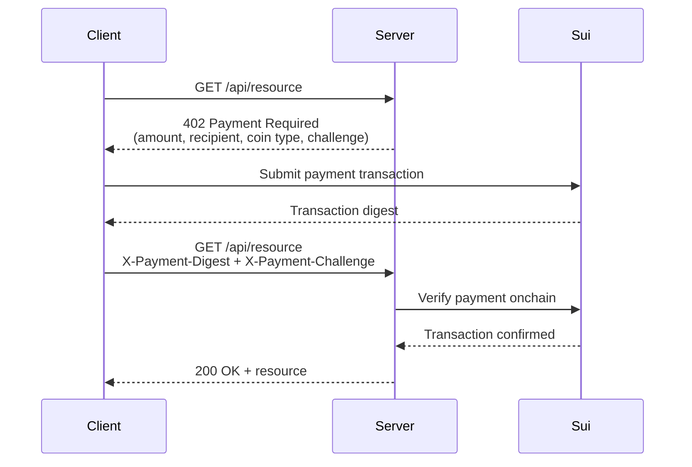

The x402 protocol uses HTTP `402 Payment Required` responses to gate API access behind onchain payments. A client requests a resource, receives payment instructions, submits a Sui transaction, and retries with proof of payment. This pattern is especially useful for agent-to-agent interactions where one service charges another per request.

## How x402 works

1. The client requests a resource from the server.
2. The server responds with HTTP 402 and a JSON body containing payment details: amount, recipient address, coin type, and a unique challenge token.
3. The client builds a PTB that transfers the requested amount to the server's address, signs, and submits it.
4. The client retries the original request with the transaction digest and challenge token in headers.
5. The server verifies the challenge was issued by itself, checks the payment onchain, and serves the resource.

## Server implementation

The server middleware checks for a valid payment digest on protected routes. If missing, it returns 402 with payment instructions. A per-request challenge prevents attackers from reusing observed payment digests.

### Configuration

<ImportContent source="examples/onchain-finance/x402-pay-per-request/src/server.ts" mode="code" tag="config" />

### Challenge store

<ImportContent source="examples/onchain-finance/x402-pay-per-request/src/server.ts" mode="code" tag="challenge-store" />

### Payment required middleware

<ImportContent source="examples/onchain-finance/x402-pay-per-request/src/server.ts" mode="code" tag="payment-required" />

### Payment verification

<ImportContent source="examples/onchain-finance/x402-pay-per-request/src/server.ts" mode="code" tag="verify-payment" />

### Wiring it up

<ImportContent source="examples/onchain-finance/x402-pay-per-request/src/server.ts" mode="code" tag="app" />

:::tip Production replay prevention

The in-memory `Map` and `Set` work for a single server instance. For production, store pending challenges and used digests in a database with a TTL (for example, 5 minutes for challenges, 24 hours for digests).

:::

## Client implementation

The client handles 402 responses by constructing a payment transaction and retrying with the server-issued challenge.

<ImportContent source="examples/onchain-finance/x402-pay-per-request/src/client.ts" mode="code" tag="fetch-with-payment" />

## Agent integration

For autonomous agents, combine x402 with the [agent wallet setup](/onchain-finance/agentic-payments/agent-wallet-setup) and [spending policies](/onchain-finance/agentic-payments/spending-policies). The agent's spending mandate limits how much it can pay per request and in total, preventing runaway costs if the server raises prices or the agent enters a retry loop.

## Security considerations

- **Challenge binding.** The server issues a unique challenge per request. Without this, an attacker who observes any payment to the server's address can replay the digest to access resources they didn't pay for. The challenge ties a specific payment to a specific access request.
- **Replay prevention.** The server must track used digests. Without this, an attacker can reuse a single payment to access the resource multiple times.
- **Amount validation.** Always verify the exact amount received onchain. Do not trust the client's claim about payment amount.
- **Timeout window.** Set a maximum age for accepted challenges (for example, 5 minutes) to prevent stale payment reuse. Expire pending challenges that are not fulfilled.
- **Recipient verification.** The client should verify the 402 response's recipient address matches the expected server address to prevent payment redirection attacks.
