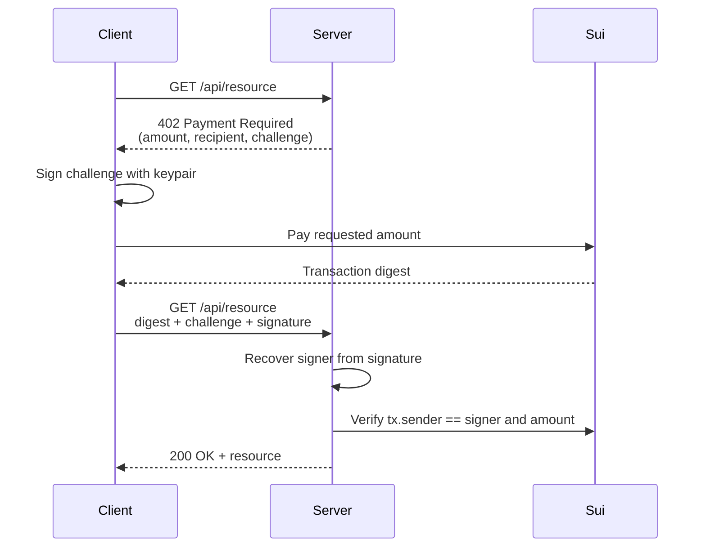

The x402 protocol uses HTTP `402 Payment Required` responses to gate API access behind onchain payments. A client requests a resource, receives payment instructions, submits a Sui transaction, and retries with proof of payment. This pattern is especially useful for agent-to-agent interactions where one service charges another per request.

## How x402 works

1. The client requests a resource from the server.
2. The server responds with HTTP 402 and a JSON body containing: a single-use challenge ID, the required amount, recipient address, and coin type.
3. The client **signs the challenge** with its keypair using `signPersonalMessage`, then builds a PTB that pays the required amount and submits it.
4. The client retries the original request with the transaction digest, challenge ID, and challenge signature in headers.
5. The server **recovers the signer's address** from the challenge signature using `verifyPersonalMessageSignature`, then verifies the onchain transaction's sender matches that address, verifies the payment amount, and serves the resource.

The challenge signature proves the requester controls the private key that signed the onchain payment. An attacker who observes a public digest cannot use it because they cannot sign the challenge with the real payer's key.

## Server implementation

The server middleware checks for a valid payment digest on protected routes. If missing, it returns 402 with payment instructions.

### Configuration

<ImportContent source="examples/onchain-finance/x402-pay-per-request/src/server.ts" mode="code" tag="config" />

### Challenge store

<ImportContent source="examples/onchain-finance/x402-pay-per-request/src/server.ts" mode="code" tag="challenge-store" />

### Payment required middleware

<ImportContent source="examples/onchain-finance/x402-pay-per-request/src/server.ts" mode="code" tag="payment-required" />

### Payment verification

<ImportContent source="examples/onchain-finance/x402-pay-per-request/src/server.ts" mode="code" tag="verify-payment" />

### Wiring it up

<ImportContent source="examples/onchain-finance/x402-pay-per-request/src/server.ts" mode="code" tag="app" />

:::tip Production replay prevention

The in-memory `Map` and `Set` work for a single server instance. For production, store pending challenges and used digests in a database with a TTL (5 minutes for challenges, 24 hours for digests).

:::

## Client implementation

The client signs the challenge with `signPersonalMessage`, pays, and retries with all three headers.

<ImportContent source="examples/onchain-finance/x402-pay-per-request/src/client.ts" mode="code" tag="fetch-with-payment" />

## Agent integration

For autonomous agents, combine x402 with the [agent wallet setup](/onchain-finance/agentic-payments/agent-wallet-setup) and [spending policies](/onchain-finance/agentic-payments/spending-policies). The agent's spending mandate limits how much it can pay per request and in total, preventing runaway costs if the server raises prices or the agent enters a retry loop.

## Security considerations

- **Challenge signature binding.** The client signs the challenge with `signPersonalMessage`. The server recovers the signer's address with `verifyPersonalMessageSignature` and checks it matches the onchain transaction sender. An attacker who observes a public digest cannot use it because they cannot produce a valid signature for the challenge with the real payer's key.
- **Digest uniqueness.** The server tracks every accepted digest globally. A digest used for one challenge cannot be reused for any future challenge.
- **Challenge consumption.** Each challenge ID is single-use — deleted after successful verification.
- **Amount validation.** Always verify the amount received onchain meets or exceeds the required price.
- **Timeout window.** Expire pending challenges after a short window (for example, 5 minutes).
- **Recipient verification.** The client should verify the 402 response's recipient address matches the expected server address to prevent payment redirection attacks.
