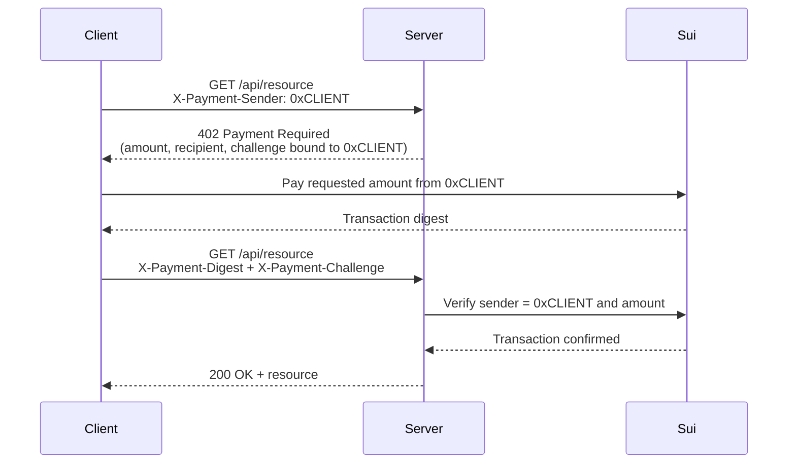

The x402 protocol uses HTTP `402 Payment Required` responses to gate API access behind onchain payments. A client requests a resource, receives payment instructions, submits a Sui transaction, and retries with proof of payment. This pattern is especially useful for agent-to-agent interactions where one service charges another per request.

## How x402 works

1. The client requests a resource, declaring its Sui address in the `X-Payment-Sender` header.
2. The server responds with HTTP 402 and a JSON body containing: a single-use challenge ID (bound to the declared sender), the required amount, recipient address, and coin type.
3. The client builds a PTB that transfers the requested amount to the server's address, signs with its keypair, and submits it.
4. The client retries the original request with the transaction digest and challenge ID in headers.
5. The server verifies the challenge is valid, checks that the onchain transaction's sender matches the bound address, verifies the payment amount, and serves the resource. Both the challenge and the digest are consumed.

## Server implementation

The server middleware checks for a valid payment digest on protected routes. If missing, it returns 402 with payment instructions.

### Configuration

<ImportContent source="examples/onchain-finance/x402-pay-per-request/src/server.ts" mode="code" tag="config" />

### Challenge store

<ImportContent source="examples/onchain-finance/x402-pay-per-request/src/server.ts" mode="code" tag="challenge-store" />

### Payment required middleware

<ImportContent source="examples/onchain-finance/x402-pay-per-request/src/server.ts" mode="code" tag="payment-required" />

### Payment verification

<ImportContent source="examples/onchain-finance/x402-pay-per-request/src/server.ts" mode="code" tag="verify-payment" />

### Wiring it up

<ImportContent source="examples/onchain-finance/x402-pay-per-request/src/server.ts" mode="code" tag="app" />

:::tip Production replay prevention

The in-memory `Map` and `Set` work for a single server instance. For production, store pending challenges and used digests in a database with a TTL (5 minutes for challenges, 24 hours for digests).

:::

## Client implementation

The client handles 402 responses by constructing a payment transaction and retrying with the challenge ID.

<ImportContent source="examples/onchain-finance/x402-pay-per-request/src/client.ts" mode="code" tag="fetch-with-payment" />

## Agent integration

For autonomous agents, combine x402 with the [agent wallet setup](/onchain-finance/agentic-payments/agent-wallet-setup) and [spending policies](/onchain-finance/agentic-payments/spending-policies). The agent's spending mandate limits how much it can pay per request and in total, preventing runaway costs if the server raises prices or the agent enters a retry loop.

## Security considerations

- **Sender binding.** Each challenge is bound to the client's declared Sui address. The server verifies the onchain transaction's sender matches. An attacker cannot redeem another payer's digest because the sender won't match.
- **Digest uniqueness.** The server tracks every accepted digest globally. A digest used for one challenge cannot be reused for any future challenge.
- **Challenge consumption.** Each challenge ID is single-use — deleted after successful verification.
- **Amount validation.** Always verify the amount received onchain meets or exceeds the required price.
- **Timeout window.** Expire pending challenges after a short window (for example, 5 minutes).
- **Recipient verification.** The client should verify the 402 response's recipient address matches the expected server address to prevent payment redirection attacks.
- **Sender address trust.** The `X-Payment-Sender` header is self-declared. This is acceptable because the server verifies the onchain sender matches — an attacker cannot forge a transaction's sender field. If you need identity verification beyond address ownership, add API key authentication.
