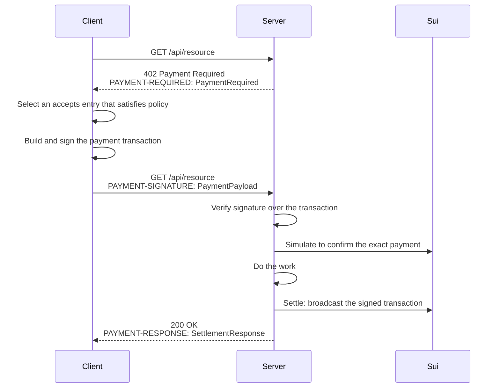

[x402](https://github.com/x402-foundation/x402) is an open payment protocol that uses the HTTP `402 Payment Required` status code to price a request and settle it onchain. This page implements protocol version 2 over the HTTP transport, using the `exact` payment scheme on Sui. Because the protocol is a published standard, a client written against any conformant x402 server works with the server on this page, and this client works against any conformant x402 resource server that accepts Sui.

Payment happens inside the request-response cycle, with no accounts, API keys, or invoices, which makes it a good fit for agent-to-agent access where one service charges another per call.

## How the exact scheme works on Sui

The `exact` scheme on Sui uses the `0x2::coin::Coin<T>` standard to transfer a specific amount of a coin type from the payer to the resource server. The payer forms and signs a complete transaction. Because any change to the transaction invalidates the signature, the resource server cannot redirect funds anywhere other than the address it advertised.


```mermaid
sequenceDiagram
    participant Client
    participant Server
    participant Sui

    Client->>Server: GET /api/resource
    Server-->>Client: 402 Payment Required<br/>PAYMENT-REQUIRED: PaymentRequired
    Client->>Client: Select an accepts entry that satisfies policy
    Client->>Client: Build and sign the payment transaction
    Client->>Server: GET /api/resource<br/>PAYMENT-SIGNATURE: PaymentPayload
    Server->>Server: Verify signature over the transaction
    Server->>Sui: Simulate to confirm the exact payment
    Server->>Server: Do the work
    Server->>Sui: Settle: broadcast the signed transaction
    Server-->>Client: 200 OK<br/>PAYMENT-RESPONSE: SettlementResponse
```

1. The client requests a resource.
1. The server responds with HTTP 402 and a base64-encoded `PaymentRequired` object in the `PAYMENT-REQUIRED` header. It lists one or more `accepts` entries, each naming a scheme, a CAIP-2 network such as `sui:mainnet`, an amount in atomic units, an asset (a Sui coin type), a recipient, and a timeout.
1. The client picks an entry that satisfies its local policy, builds a transaction paying exactly that amount to that recipient, and signs it. It does **not** broadcast the transaction.
1. The client retries with a base64-encoded `PaymentPayload` in the `PAYMENT-SIGNATURE` header. The scheme payload carries the signature and the base64 BCS transaction.
1. The server verifies the signature, simulates the transaction to confirm it would succeed and pays the exact amount, does the work, then settles by broadcasting the transaction.
1. The server returns the resource with a base64-encoded `SettlementResponse` in the `PAYMENT-RESPONSE` header, containing the transaction digest.

Settling after the work means the server never charges a client for a request it failed to fulfill, and verification before the work means the server never does unpaid work.

:::info Facilitators

The specification lets a resource server delegate verification and settlement to a facilitator that exposes `/verify` and `/settle` endpoints. This example hosts that logic itself, which is the most straightforward deployment and keeps the trust boundary in one place. Moving to a facilitator changes where `verifyPayment` and `settlePayment` run, not the wire format.

:::

## Protocol types

The core types do not depend on transport or scheme, so they are worth keeping in their own module.

<ImportContent
    source="examples/onchain-finance/x402-pay-per-request/src/x402.ts"
    mode="code"
    tag="protocol-types"
/>

### HTTP transport

The HTTP transport carries all three protocol objects as base64-encoded JSON in headers. Response bodies are a server implementation concern.

| Header | Direction | Contents |
| --- | --- | --- |
| `PAYMENT-REQUIRED` | Server to client | `PaymentRequired` |
| `PAYMENT-SIGNATURE` | Client to server | `PaymentPayload` |
| `PAYMENT-RESPONSE` | Server to client | `SettlementResponse` |

<ImportContent
    source="examples/onchain-finance/x402-pay-per-request/src/x402.ts"
    mode="code"
    tag="http-transport"
/>

## Server implementation

### Configuration

The recipient address comes from the environment and the server validates it at startup. `normalizeSuiAddress` pads any string to 32 bytes without checking that it is a real address, so an unedited placeholder would otherwise become a valid-looking address that nobody controls.

<ImportContent
    source="examples/onchain-finance/x402-pay-per-request/src/server.ts"
    mode="code"
    tag="config"
/>

### Advertising payment requirements

<ImportContent
    source="examples/onchain-finance/x402-pay-per-request/src/server.ts"
    mode="code"
    tag="payment-required"
/>

### Verification

Verification follows the steps the scheme defines: confirm the network, confirm the signature over the transaction, simulate to confirm the transaction would succeed and has not already executed, and confirm the recipient receives exactly the required amount of the required asset.

<ImportContent
    source="examples/onchain-finance/x402-pay-per-request/src/server.ts"
    mode="code"
    tag="verify-payment"
/>

### Settlement

<ImportContent
    source="examples/onchain-finance/x402-pay-per-request/src/server.ts"
    mode="code"
    tag="settle-payment"
/>

### Replay protection

Sui execution is idempotent by digest: resubmitting a settled transaction returns the original result without moving funds again. An attacker can therefore reuse a captured `PAYMENT-SIGNATURE` header unless the server remembers it, so the server appends settled digests to an fsynced log and never expires them.

<ImportContent
    source="examples/onchain-finance/x402-pay-per-request/src/replay-store.ts"
    mode="code"
    tag="replay-store"
/>

In production, replace the file with a shared database, reserve the digest under a unique constraint, and retain settled digests permanently.

### Wiring it up

<ImportContent
    source="examples/onchain-finance/x402-pay-per-request/src/server.ts"
    mode="code"
    tag="app"
/>

## Client implementation

### Payment policy

The client holds a local policy naming the trusted origin, the expected recipient, the allowed networks and assets, and a maximum amount. Nothing the server advertises is trusted until it passes these checks.

<ImportContent
    source="examples/onchain-finance/x402-pay-per-request/src/client.ts"
    mode="code"
    tag="payment-policy"
/>

### Building the payment

<ImportContent
    source="examples/onchain-finance/x402-pay-per-request/src/client.ts"
    mode="code"
    tag="build-payment"
/>

### Paying and retrying

<ImportContent
    source="examples/onchain-finance/x402-pay-per-request/src/client.ts"
    mode="code"
    tag="fetch-with-payment"
/>

## Run the example

```sh
cd examples/onchain-finance/x402-pay-per-request
npm install
npm test
```

To run the server, set `X402_PAY_TO` to the address that receives payments and `X402_SETTLED_PAYMENTS_PATH` to a durable location. To run the client, set `AGENT_SECRET_KEY` to a `suiprivkey`-encoded key for a funded account.

## Agent integration

For autonomous agents, combine x402 with a funded key kept under [self-custody](/onchain-finance/asset-custody/wallets/self-custody) and an enforceable spending policy. Always set explicit origin, recipient, asset, and amount limits: a policy the same compromised agent can rewrite does not prevent runaway costs.

Per-request micropayments pay storage gas for each new coin object sent to the server. [Address balances](/onchain-finance/asset-custody/address-balances/using-address-balances) reduce that cost, and the scheme specification calls out the same optimization as future work.

## Security considerations

- **The signature binds the payment.** The payer signs a complete transaction, so the server can neither change the recipient nor the amount. Verification recovers the signer with `verifyTransactionSignature` and simulates the transaction rather than trusting the `accepted` block, which the client supplies.
- **Exact amounts.** The scheme requires the recipient balance change to equal the advertised amount, not merely to meet it. Accepting more would let a client claim a large historical overpayment against a later request.
- **Permanent digest uniqueness.** Reserve the digest before the first `await` and hold it until settlement resolves, so concurrent replays of one payload cannot both reach settlement. Never expire settled digests.
- **The server broadcasts client-supplied bytes.** Simulation confirms the payment, but the transaction can contain other commands. The payer pays its own gas, and the server is not a general-purpose relay: log settled digests and alert on transactions whose effects extend beyond the expected transfer.
- **Settlement can fail after the work is done.** If broadcasting fails, the server has served the resource without confirmed payment. Keep the reservation, return `unexpected_settle_error`, and reconcile the digest out of band.
- **Header size.** A signed transaction is roughly 1 KB base64-encoded and grows with each coin input. Raise the server's `maxHeaderSize` and keep coin selection minimal.
- **Client policy.** Reject unexpected origins and redirects before signing. Because the client never broadcasts, a rejected payment costs nothing.
