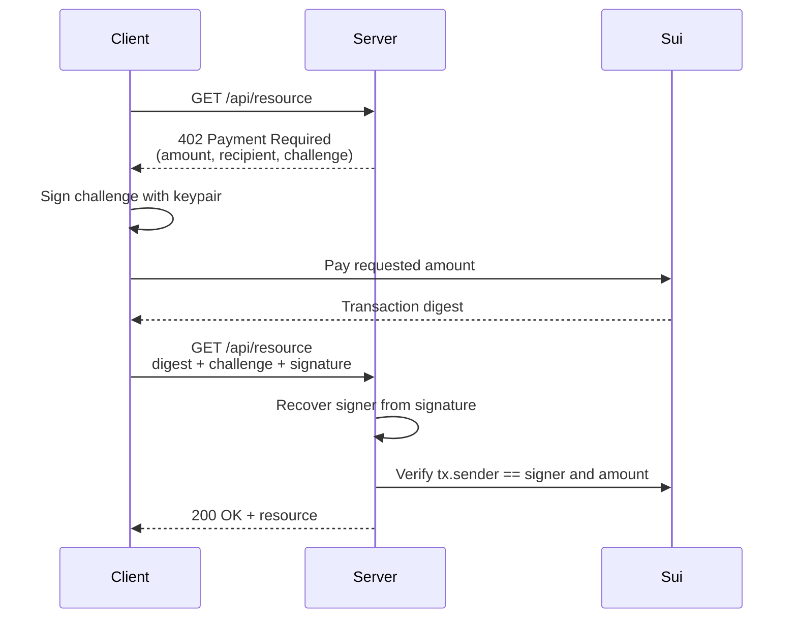

The x402 protocol uses HTTP `402 Payment Required` responses to gate API access behind onchain payments. A client requests a resource, validates the payment instructions against local policy, submits a Sui transaction, and retries with proof of payment. This pattern is especially useful for agent-to-agent interactions where one service charges another per request.

## How x402 works

```mermaid
sequenceDiagram
    participant Client
    participant Server
    participant Sui

    Client->>Server: GET /api/resource
    Server-->>Client: 402 Payment Required<br/>(amount, recipient, challenge)
    Client->>Client: Sign challenge with keypair
    Client->>Sui: Pay requested amount
    Sui-->>Client: Transaction digest
    Client->>Server: GET /api/resource<br/>digest + challenge + signature
    Server->>Server: Recover signer from signature
    Server->>Sui: Verify tx.sender == signer and amount
    Server-->>Client: 200 OK + resource
```

1. The client requests a resource from the server.
2. The server responds with HTTP 402 and a JSON body containing: a single-use challenge ID, the required amount, recipient address, and coin type.
3. The client verifies the response origin, recipient, coin type, maximum amount, and challenge shape. It then **signs the challenge** with its keypair using `signPersonalMessage`, builds a PTB that pays the required amount, and submits it.
4. The client retries the original request with the transaction digest, challenge ID, and challenge signature in headers.
5. The server **recovers the signer's address** from the challenge signature using `verifyPersonalMessageSignature`, then verifies the onchain transaction's sender matches that address, verifies the payment amount, and serves the resource.

The challenge signature proves the requester controls the private key that signed the onchain payment. An attacker who observes a public digest cannot use it because they cannot sign the challenge with the real payer's key.

## Server implementation

The server middleware checks for a valid payment digest on protected routes. If missing, it returns 402 with payment instructions.

### Configuration

<ImportContent
	source="examples/onchain-finance/x402-pay-per-request/src/server.ts"
	mode="code"
	tag="config"
/>

### Challenge store

<ImportContent
	source="examples/onchain-finance/x402-pay-per-request/src/server.ts"
	mode="code"
	tag="challenge-store"
/>

### Payment required middleware

<ImportContent
	source="examples/onchain-finance/x402-pay-per-request/src/server.ts"
	mode="code"
	tag="payment-required"
/>

### Payment verification

<ImportContent
	source="examples/onchain-finance/x402-pay-per-request/src/server.ts"
	mode="code"
	tag="verify-payment"
/>

### Wiring it up

<ImportContent
	source="examples/onchain-finance/x402-pay-per-request/src/server.ts"
	mode="code"
	tag="app"
/>

:::tip Production replay prevention

The example caps and rate-limits its in-memory pending challenges, and appends accepted digests to a durable, fsynced log. Pending challenges expire after a short TTL. Accepted digests must **never expire** because the payment does not contain the challenge; deleting a digest lets that historic transfer be reused with a fresh challenge. In production, atomically reserve the challenge and digest in a shared database, enforce a unique digest constraint, and retain accepted digests permanently. Alternatively, bind an onchain payment nonce to the challenge and verify it.

:::

## Client implementation

The client receives a local `PaymentPolicy` containing the trusted origin, expected recipient, allowed coin types, and maximum amount. It rejects redirects or instructions outside that policy before signing or paying, then retries with all three proof headers.

<ImportContent
	source="examples/onchain-finance/x402-pay-per-request/src/client.ts"
	mode="code"
	tag="fetch-with-payment"
/>

## Agent integration

For autonomous agents, combine x402 with the [agent wallet setup](/onchain-finance/agentic-payments/agent-wallet-setup) and an enforceable custody or signing policy. Always pass explicit origin, recipient, coin-type, and amount limits. A policy the same compromised agent can bypass does not prevent runaway costs.

## Security considerations

- **Challenge signature binding.** The client signs the challenge with `signPersonalMessage`. The server recovers the signer's address with `verifyPersonalMessageSignature` and checks it matches the onchain transaction sender. An attacker who observes a public digest cannot use it because they cannot produce a valid signature for the challenge with the real payer's key.
- **Atomic replay protection.** Reserve both the challenge and digest before asynchronous verification. Roll back both on failure, and commit them together on success.
- **Permanent digest uniqueness.** Store every accepted digest durably without a TTL. A digest used for one challenge cannot be reused with a future challenge.
- **Challenge lifecycle.** Challenges are single-use, expire after a short window, and must be rate-limited and capped to prevent memory exhaustion.
- **Finalized payment validation.** Verify transaction success, sender, normalized recipient, normalized coin type, and the amount received onchain.
- **Client payment policy.** Reject unexpected origins and redirects, recipients, coin types, malformed challenges, and amounts above an explicit cap before paying.
