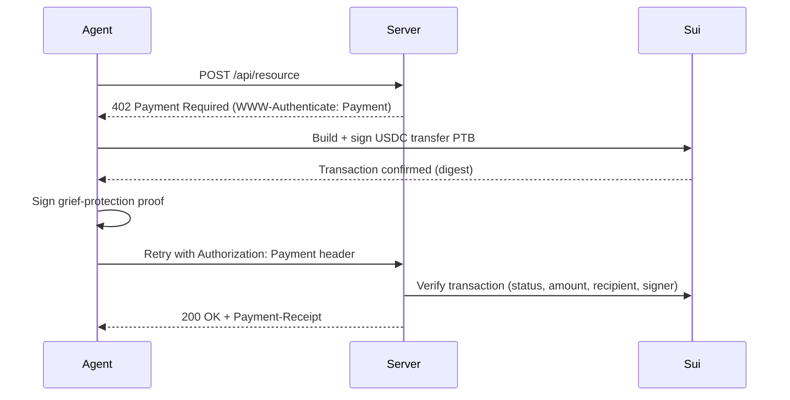

The [x402 protocol](https://www.x402.org/) uses the HTTP `402 Payment Required` status code to price API requests and settle them onchain. The [`suimpp`](https://github.com/nicholasgasior/suimpp) SDK implements the Machine Payments Protocol (MPP) on Sui, providing a minimal API that handles 402 challenges, USDC payment construction, transaction verification, and replay prevention out of the box.

Payment happens inside the request-response cycle with no accounts, API keys, or invoices, making it ideal for agent-to-agent access where one service charges another per call.

## Protocol flow

When a client requests a paid resource, the server and client negotiate payment through standard HTTP headers:


```mermaid
sequenceDiagram
    participant Agent
    participant Server
    participant Sui

    Agent->>Server: POST /api/resource
    Server-->>Agent: 402 Payment Required (WWW-Authenticate: Payment)
    Agent->>Sui: Build + sign USDC transfer PTB
    Sui-->>Agent: Transaction confirmed (digest)
    Agent->>Agent: Sign grief-protection proof
    Agent->>Server: Retry with Authorization: Payment header
    Server->>Sui: Verify transaction (status, amount, recipient, signer)
    Server-->>Agent: 200 OK + Payment-Receipt
```

1. The agent requests a resource.
1. The server responds with HTTP 402 and a `WWW-Authenticate: Payment` header describing the price, recipient, network, and currency.
1. The agent builds a USDC transfer transaction on Sui, signs it, and generates a grief-protection proof.
1. The agent retries the request with an `Authorization: Payment` header carrying the signed transaction and proof.
1. The server verifies the transaction on Sui (status, amount, recipient, signer) and checks for replay.
1. The server returns the resource with a `Payment-Receipt` header containing the transaction digest.

## Install

```sh
npm install @suimpp/mpp mppx @mysten/sui
```

## Server setup

The server uses `mppx.charge()` to wrap any request handler. The SDK handles issuing 402 challenges, verifying payment transactions on Sui, and preventing replay attacks.

<ImportContent
    source="examples/onchain-finance/x402-pay-per-request/src/server.ts"
    mode="code"
    tag="server-setup"
/>

Configure the server with:
- **`realm`**: Your API's domain, included in the 402 challenge.
- **`currency`**: The payment currency. `USDC` is the canonical stablecoin for MPP on Sui.
- **`recipient`**: The Sui address that receives payments. Set this through an environment variable.
- **`network`**: The Sui network to verify transactions against (`mainnet`, `testnet`).
- **`store`**: A digest store for replay prevention. Use `InMemoryDigestStore` for development; switch to Redis or Postgres in production.

### Charging for a request

Wrap any handler with `mppx.charge()` to gate it behind a payment:

<ImportContent
    source="examples/onchain-finance/x402-pay-per-request/src/server.ts"
    mode="code"
    tag="server-handler"
/>

The `amount` is denominated in the currency's standard unit (for example, `'0.01'` means 0.01 USDC). The SDK converts it to atomic units, issues 402 challenges to clients that have not paid, verifies the payment transaction on Sui, checks for replay, and passes through to your handler only after confirmed payment.

## Client setup

The client uses `mppx.fetch()` as a drop-in replacement for `fetch()`. When the server responds with 402, the SDK automatically builds a USDC transfer transaction, signs it, and retries the request.

<ImportContent
    source="examples/onchain-finance/x402-pay-per-request/src/client.ts"
    mode="code"
    tag="client-setup"
/>

### Fetching a paid resource

<ImportContent
    source="examples/onchain-finance/x402-pay-per-request/src/client.ts"
    mode="code"
    tag="client-fetch"
/>

`mppx.fetch()` returns a standard `Response` object. If the server does not respond with 402, it behaves exactly like `fetch()`. When it encounters a 402 challenge, it handles the entire payment flow transparently: parsing the challenge, building the USDC transfer, signing the transaction, generating the grief-protection proof, and retrying with the `Authorization: Payment` header.

## Agent integration

For autonomous agents, combine MPP with a funded key kept under [self-custody](/onchain-finance/asset-custody/wallets/self-custody) and an enforceable spending policy. The agent's keypair should have access only to the USDC balance needed for API payments, not the full treasury.

Key considerations for agent deployments:
- **Spending limits**: Configure per-request and per-period caps in the agent's policy layer. The SDK respects the amount advertised in the 402 challenge, but your agent should refuse amounts above its policy threshold.
- **Key rotation**: Rotate agent keypairs regularly. Because each payment is a standalone transaction, rotating keys does not interrupt in-flight requests.
- **Monitoring**: Log every payment digest for reconciliation. The `Payment-Receipt` header contains the Sui transaction digest.

## Gasless transactions

The SDK automatically requests the Sui Foundation's gasless tier for canonical USDC transfers. This means agents do not need a SUI balance to pay for gas when making USDC payments -- the gas is sponsored. This reduces the operational burden of keeping agent wallets funded with two tokens.

## Validation

Verify that your server is correctly advertising its payment requirements and responding to the MPP protocol:

```sh
npx @suimpp/discovery check api.your-service.dev
```

This command sends a probe request, inspects the 402 response headers, and reports whether your server's challenge is well-formed and discoverable.

## Production considerations

### Digest store

Replace `InMemoryDigestStore` with a persistent store backed by Redis or Postgres. The store must guarantee that each transaction digest is accepted at most once, even across server restarts and horizontal scaling. The SDK provides a store interface you can implement with any backend:

```ts
import { RedisDigestStore } from '@suimpp/mpp/server';

const mppx = Mppx.create({
  realm: 'api.example.com',
  methods: [sui({
    currency: USDC,
    recipient: process.env.PAY_TO_ADDRESS!,
    network: 'mainnet',
    store: new RedisDigestStore({ url: process.env.REDIS_URL! }),
  })],
});
```

### OpenAPI extension

Advertise payment requirements in your OpenAPI spec using the `x-payment-info` extension so that agent frameworks can discover pricing before making requests:

```yaml
paths:
  /api/resource:
    post:
      x-payment-info:
        currency: USDC
        network: sui:mainnet
        amount: '0.01'
```

### Payment reporting

Log settled transaction digests with timestamps, payer addresses, and amounts for financial reconciliation. The `Payment-Receipt` header on each response contains the Sui transaction digest you can use to query full transaction details from a Sui node.

## Security considerations

- **Replay prevention**: The digest store ensures each signed transaction is accepted at most once. Without it, an attacker could reuse a captured `Authorization: Payment` header indefinitely, because Sui execution is idempotent by digest.
- **Grief protection**: The client signs a grief-protection proof binding the payment to the specific request. This prevents a man-in-the-middle from redirecting a captured payment to a different endpoint.
- **Recipient verification**: The server verifies that the payment transaction sends funds to the expected recipient address. Because the payer signs a complete transaction, the server cannot redirect funds to any address other than what was advertised.
- **Network confusion**: The SDK verifies the transaction on the configured network. A payment signed for `testnet` is rejected by a server configured for `mainnet`, and vice versa.
- **Amount precision**: Amounts are specified in standard currency units (for example, `'0.01'` USDC) and converted to atomic units internally. The server verifies the exact amount, not merely a minimum, preventing overpayment replay attacks.
- **Client policy**: Agents should reject unexpected origins and amounts before signing. Because the client never broadcasts the transaction directly, a rejected payment costs nothing.
