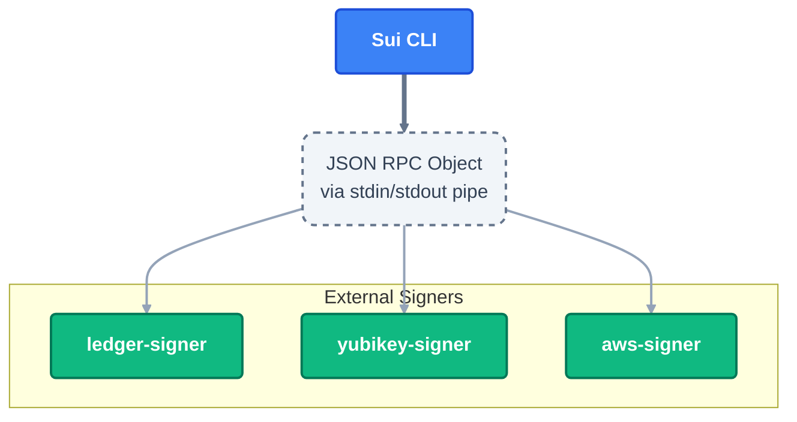

The Sui CLI supports external signers through implementations found in the [Rust Signers repository](https://github.com/MystenLabs/rust-signers). These integration tools allow you to sign transactions using hardware devices, enhancing security by keeping private keys off your local machine.

# Architecture


## Supported Devices

- **[Ledger Hardware Wallets](https://github.com/MystenLabs/rust-signers/tree/main/ledger)**
- **[Yubikey Devices](https://github.com/MystenLabs/rust-signers/tree/main/yubikey)**

## Installation

You can install the external signer binaries from the [Releases page](https://github.com/mystenlabs/rust-signers/releases) or build them from source.

### From Source

```bash
git clone git@github.com:MystenLabs/rust-signers.git
cd rust-signers
# Install Ledger signer
cargo install --path ledger
# Install Yubikey signer
cargo install --path yubikey
```

Ensure the installed binaries (`ledger-signer`, `yubikey-signer`) are in your system's `PATH`.

## Commands

External signers are managed through the `sui external-keys` command.

```bash
$ sui external-keys --help
```

## Common Usage

The following examples demonstrate how to manage keys and sign transactions using an external signer. Replace `<signer-binary>` with `ledger-signer` or `yubikey-signer` depending on your device.

### List available keys

View the keys available on your connected device.

```bash
$ sui external-keys list-keys <signer-binary>
```

### Add a key

Add a specific key to your Sui keystore. You can specify the key by its ID found in the `list-keys` output. The format of the ID depends on the signer implementation:

- **Ledger**: Derivation path (e.g., `m/44'/784'/0'/0'/0'`)
- **Yubikey**: Yubikey slot (e.g., `retired slot 1` or a specific slot ID)

```bash
$ sui external-keys add-existing "<key-id>" <signer-binary>
```

Signers generally support creating new keys directly:

```bash
$ sui external-keys generate <signer-binary>
```

### Sign a transaction

Once the key is added to your keystore, you can use it just like any other key. Switch to the address associated with the external key, and the Sui CLI will automatically delegate signing to the device.

```bash
# Switch to the new address
$ sui client switch --address [sui-address]

# Perform a transaction
$ sui client transfer --object-id [object-id] --to [to-address]
```

When you execute a command that requires signing, you may need to confirm the action on your hardware device.
