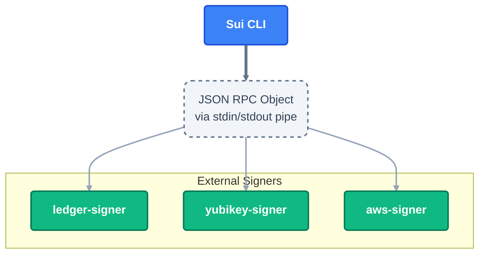

The Sui CLI supports external signers through implementations found in the [Rust Signers repository](https://github.com/MystenLabs/rust-signers). These integration tools allow you to sign transactions using hardware devices, enhancing security by keeping private keys off your local machine.

:::note

External signer support requires Sui CLI version 1.66.2 or newer.

:::

## Architecture

```mermaid
graph TD
    %% Node Styling
    classDef cli fill:#3b82f6,stroke:#1d4ed8,color:white,rx:4,ry:4,stroke-width:2px,font-weight:bold
    classDef signer fill:#10b981,stroke:#047857,color:white,rx:4,ry:4,stroke-width:2px,font-weight:bold
    classDef pipe fill:#f1f5f9,stroke:#64748b,color:#334155,rx:10,ry:10,stroke-width:2px,stroke-dasharray: 5 5

    %% Nodes
    CLI[Sui CLI]:::cli
    channel(JSON RPC Object<br/>via stdin/stdout pipe):::pipe

    %% Signers Group
    subgraph Signers [External Signers]
        direction LR
        L[ledger-signer]:::signer
        Y[yubikey-signer]:::signer
        A[aws-signer]:::signer
    end

    %% Connections
    CLI ==> channel
    channel --> L
    channel --> Y
    channel --> A

    %% Link Styling
    linkStyle 0 stroke:#64748b,stroke-width:4px
    linkStyle 1,2,3 stroke:#94a3b8,stroke-width:2px
```

## Supported devices

- **[Ledger hardware wallets](https://github.com/MystenLabs/rust-signers/tree/main/ledger)**
- **[Yubikey devices](https://github.com/MystenLabs/rust-signers/tree/main/yubikey)**

## Installation

You can install the external signer binaries with [`suiup`](https://github.com/MystenLabs/suiup), from the [Releases page](https://github.com/mystenlabs/rust-signers/releases), or build them from source.

### Install with `suiup`

If you already use `suiup`, install the signer binary you need:

```bash
suiup install ledger-signer
suiup install yubikey-signer
```

### From Source
Make sure you have Rust installed on your system, which you can do using [rustup](https://rustup.rs/).

```bash
cargo install --locked --git https://github.com/MystenLabs/rust-signers ledger-signer
cargo install --locked --git https://github.com/MystenLabs/rust-signers yubikey-signer
```

Ensure the installed binaries (`ledger-signer`, `yubikey-signer`) are in your system's `PATH`.

## Usage

External signers are managed through the `sui external-keys` command.

```bash
$ sui external-keys --help
```

The following examples demonstrate how to manage keys and sign transactions using an external signer. Replace `<SIGNER_BINARY>` with `ledger-signer` or `yubikey-signer` depending on your device.

### List available keys

View the keys available on your connected device.

```bash
$ sui external-keys list-keys <SIGNER_BINARY>
```

### Add a key

Add a specific key to your Sui keystore. You can specify the key by its ID found in the `list-keys` output. The format of the ID depends on the signer implementation:

- **Ledger**: Derivation path (e.g., `m/44'/784'/0'/0'/0'`)
- **Yubikey**: Yubikey slot (e.g., `retired slot 1` or a specific slot ID)

```bash
$ sui external-keys add-existing "<KEY_ID>" <SIGNER_BINARY>
```

Signers generally support creating new keys directly:

```bash
$ sui external-keys generate <SIGNER_BINARY>
```

### Sign a transaction

Once the key is added to your keystore, you can use it just like any other key. Switch to the address associated with the external key, and the Sui CLI will automatically delegate signing to the device.

```bash
# Switch to the new address
$ sui client switch --address [SUI_ADDRESS]

# Perform a transaction
$ sui client transfer --object-id [OBJECT_ID] --to [TO_ADDRESS]
```

When you execute a command that requires signing, you may need to confirm the action on your hardware device.
