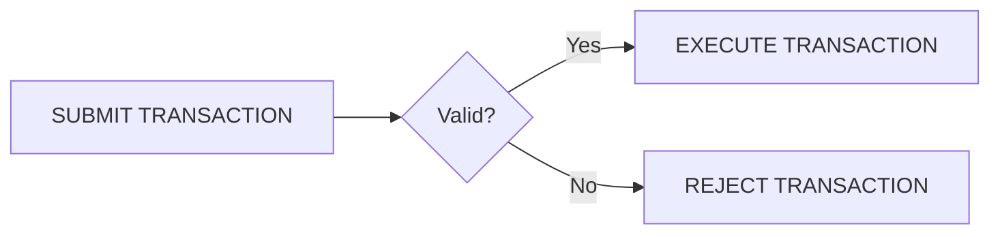
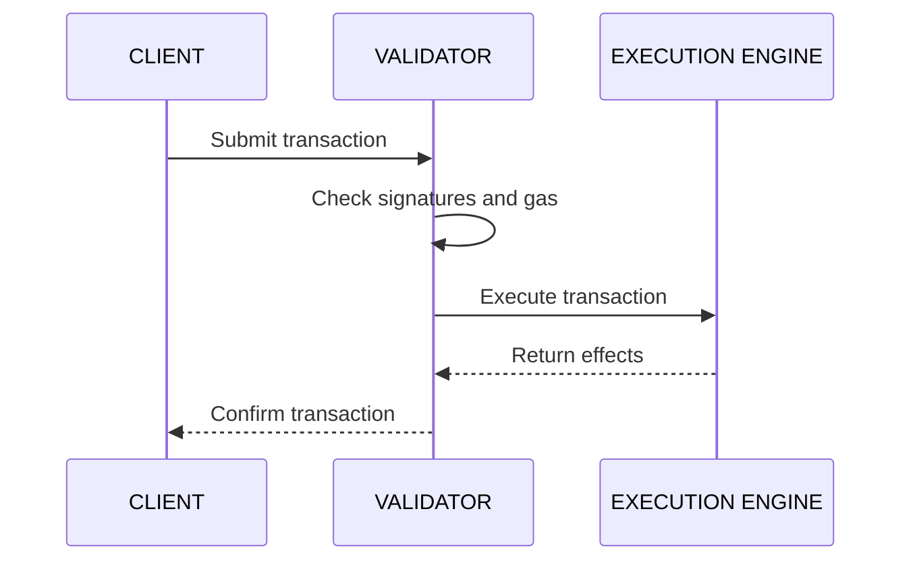
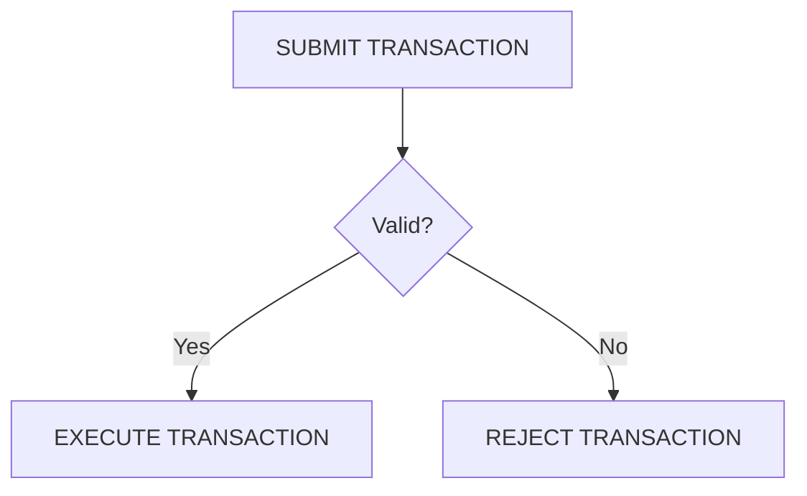

This document defines the technical diagramming standards for Sui documentation. These guidelines ensure consistency, clarity, and brand alignment across all technical documentation, diagrams, and visual aids.

:::info

As with any style guide, this is a living document.

:::


## The C4 model

Diagrams in Sui documentation follow the [C4 model for software architecture](https://c4model.com/). The C4 model organizes diagrams into 4 abstraction levels: system context, container, component, and code. Each level answers a different question and targets a different audience. Choosing the right level before you start drawing keeps diagrams focused and prevents mixing concerns.

| **C4 level** | **Diagram type** | **Sui example** | **Scope and audience** |
| --- | --- | --- | --- |
| Level 1: System context | Context diagram | Sui network and external wallets | Stakeholders and decision makers; shows what the system is and who uses it |
| Level 2: Container | Architecture diagram | Sui Full Node, Indexer, RPC Server, Archival Store | Developers; shows major deployable units and their data flows |
| Level 3: Component | Component diagram | Move VM, Consensus Engine, Object Store inside a Sui Full Node | Engineers and contributors; shows internal structure of a container |
| Level 4: Code | Sequence or flow diagram | Transaction lifecycle through Move bytecode execution | Implementers; shows call sequences, state changes, decision logic |

A single diagram must not mix C4 levels. For example, a container-level architecture diagram must not embed component-level detail inside a node. If that detail is necessary, create a companion diagram at the appropriate level and cross-reference it in the caption.

### Choosing the right level

- Start at Level 1 (system context) when introducing a Sui subsystem to a new reader.
- Use Level 2 (container) for most architecture diagrams in the Concepts section of the docs.
- Use Level 3 (component) when documenting the internal structure of a specific binary such as Sui Full Node.
- Use Level 4 (code) for sequence diagrams and flowcharts that show step-by-step execution such as the transaction lifecycle.


## Tooling

2 tools cover every diagram in the Sui docs: Mermaid for basic diagrams that live alongside prose in version control, and Claude Design for complex C4 diagrams that need precise visual control.

### When to use each tool

| **Tool** | **Best for** | **Source format** |
| --- | --- | --- |
| Mermaid | 5 or fewer nodes; straightforward flowcharts and sequence diagrams; diagrams that change frequently and benefit from being reviewed in pull requests as plain text | Fenced code block in the `.mdx` page |
| Claude Design | More than 5 nodes; C4 Level 1 context, Level 2 container/architecture, and Level 3 component diagrams; diagrams with operator boundaries, fan-outs, multi-tier layouts, or custom iconography | Exported `.svg` source plus a `.png` for the docs site |

Use Mermaid when any of the following apply:

- The diagram is a flowchart or sequence diagram with straightforward structure.
- The diagram is expected to change frequently and benefits from version control.
- The diagram has 5 or fewer nodes and does not require operator boundaries or multi-tier layouts.

Use Claude Design when any of the following apply:

- The diagram is a C4 Level 1 context, Level 2 architecture, or Level 3 component diagram.
- The diagram has more than 5 nodes, operator-boundary groupings, fan-outs, or multi-tier layouts.
- The diagram needs to match the canonical Sui architecture style at [Data Serving](/develop/accessing-data/data-serving) and the other Concepts pages.

### Mermaid

Because Sui documentation is maintained as docs-as-code in GitHub, Mermaid is a strong choice for diagrams that change frequently or need to stay in sync with code. As plain text, Mermaid diagrams are easy to version control, review in pull requests, and update without a separate design tool.

The Sui brand theme maps Mermaid's theme variables to the brand palette: Black for primary nodes, Gray 500 for secondary, Sui Blue 500 for tertiary nodes and lines, white text on dark fills, and Inter as the font. The full theme is the following.

```yaml
config:
  theme: base
  themeVariables:
    primaryColor: '#000000'
    primaryTextColor: '#FFFFFF'
    primaryBorderColor: '#6C7584'
    secondaryColor: '#6C7584'
    secondaryTextColor: '#FFFFFF'
    tertiaryColor: '#298DFF'
    tertiaryTextColor: '#FFFFFF'
    lineColor: '#298DFF'
    background: '#FFFFFF'
    mainBkg: '#000000'
    secondBkg: '#6C7584'
    noteBkgColor: '#E6F1FB'
    noteTextColor: '#000000'
    noteBorderColor: '#298DFF'
    activationBkgColor: '#298DFF'
    activationBorderColor: '#185FA5'
    fontSize: '14px'
    fontFamily: 'Inter, sans-serif'
    signalColor: '#298DFF'
    signalTextColor: '#298DFF'
    labelBoxBkgColor: '#000000'
    labelBoxBorderColor: '#6C7584'
    labelTextColor: '#FFFFFF'
    loopTextColor: '#FFFFFF'
```

You do not need to include this block. The theme is applied to every Mermaid diagram automatically through the Docusaurus site configuration, so write only the diagram body inside the fenced `mermaid` code block and the brand colors, line color, and font apply on render.



If a diagram must temporarily override a brand color (rare, and only with documentation reviewer approval), add a `themeVariables` block that overrides only the specific variable. Do not paste the full block back in.

### Claude Design

:::info

Visit the [Sui Docs Diagrams repo](https://github.com/jon-mysten/sui-docs-diagrams) on GitHub for the source files of this package. The latest release includes the design system content and the brand fonts bundle as separate downloads.

:::

Claude Design ([claude.ai/design](https://claude.ai/design)) is the recommended tool for diagrams that exceed Mermaid's practical limits. It produces SVG output that conforms to the Sui brand palette, the C4 model, and the layout rules in this document when configured with the Sui Docs Diagrams package.

#### One-time setup

The fastest way to set up the design system is to link the GitHub repository directly, so Claude Design pulls the files without a download step.

1. Open [claude.ai/design](https://claude.ai/design) and create a new design system.
2. In the **Link code on GitHub** slot, paste the repository URL `https://github.com/jon-mysten/sui-docs-diagrams`. Claude Design pulls the design system content directly from the repository.
3. When Claude Design displays the Missing brand fonts banner after onboarding, click the **Upload fonts** button and add the font files. The fonts live in `assets/fonts/` in the repository, or download `sui-docs-fonts.zip` from the [releases page](https://github.com/jon-mysten/sui-docs-diagrams/releases/latest) for a flat bundle. Claude Design's font analyzer is a separate ingestion path from the code link, so this step is needed regardless of setup method.
4. Attach the repository's top-level `DESIGN.md` file to the first chat project you create. This file codifies the C4 rules, casing, shapes, colors, and arrow taxonomy. Claude Design references it as the source of truth for compliance.

##### Alternative: upload from a download

If you prefer not to link the repository, or your environment cannot reach GitHub, download and upload the package manually.

1. Download the latest release from the [Sui Docs Diagrams releases page](https://github.com/jon-mysten/sui-docs-diagrams/releases/latest). 2 files are needed: `sui-docs-claude-design.zip` (the design system content) and `sui-docs-fonts.zip` (the brand fonts bundle).
2. Open [claude.ai/design](https://claude.ai/design) and create a new design system.
3. Drag the files from each subdirectory of `sui-docs-claude-design.zip` into the matching Claude Design upload slot. The package's `UPLOAD-GUIDE.md` documents the slot-by-slot mapping.
4. Complete the font and `DESIGN.md` steps (3 and 4) from the GitHub method above.

#### Creating a diagram

1. In Claude Design, describe the diagram you want in plain prose. Specify the C4 level, the major nodes, the relationships, and any operator boundaries. For example: "Level 2 architecture diagram for the data-serving stack, top-to-bottom: Sui Full Node feeds an Indexing Framework, which fans out to a General-purpose Indexer backed by Postgres DB and an optional Custom Indexer, both feeding an RPC Server."
2. Claude Design generates an SVG that follows the design system's color, shape, arrow, and layout rules.
3. Iterate on placement, labels, and emphasis through follow-up prompts. Common adjustments: widening a node to fit its sub-label, switching an arrow from solid to dashed for an optional path, moving a label off a corner.
4. Export the SVG and a PNG.
5. Commit the SVG and PNG to the same directory as the docs page that references them. Follow the file-naming convention in [Files and exporting](#files-and-exporting).

#### What the package enforces

The Sui Docs Diagrams package ships with 4 static audits the package author runs before any diagram ships:

- `audit-contrast.py`: every text-on-fill pairing meets its WCAG 2.1 threshold.
- `audit-node-sizing.py`: every node-internal text element fits with at least 16px of horizontal padding per side.
- `audit-arrow-routing.py`: every forward arrow has at most one 90-degree turn; backward arrows are tagged and capped at 3 turns.
- `audit-label-overlap.py`: no arrow stroke passes within 8px of any text label's bounding box.

When Claude Design produces output for you, run these audits against the exported SVG before committing.


## Brand style

Diagramming and visual style is adapted from the [Sui Brand Kit](https://live.standards.site/sui-media-kit).

### Colors

The Sui brand core palette colors are:

| **Color** | **Hex value** | **Recommended use** |
| --- | --- | --- |
| Black | `#000000` | Primary nodes, system boundaries (C4 system box) |
| White | `#FFFFFF` | Label text on dark fills |
| Gray 500 | `#6C7584` | Secondary nodes, supporting components |
| Sui Blue 500 | `#298DFF` | Arrows, tertiary nodes, callouts |

The recommended use column describes best-practice guidance, not hard requirements. Any color that exactly matches a hex value in the core palette, Extended Blue (Blue 50 to 900), or Extended Gray (Gray 50 to 900) palette is acceptable, provided it maintains WCAG AA graphic contrast (3:1). Colors outside these palettes are not permitted. If more than 3 fill colors are required to maintain clarity, expand into the Gray extended palette first, then the Blue extended palette. See the [extended color palette](https://live.standards.site/sui-media-kit/sui-color) in the Sui Brand Kit.

Sui Blue 500 on the white canvas measures 3.31 to 1, which passes the 3:1 graphic threshold but fails the 4.5:1 body-text threshold. For arrow labels, step labels, captions, and any Sui-blue text at 12px or smaller on white, use Sui Blue 600 (`#1759C4`), which measures 6.44 to 1. Arrow strokes themselves remain Sui Blue 500.

### Typography

The Sui Brand Kit specifies TWK Everett as the primary typeface. Inter is the approved typeface for diagrams.

Inter is the diagram font for both Mermaid (applied through the Docusaurus site configuration) and Claude Design (bundled with the design system package). Use the 400, 500, and 700 weights only.


## Core diagram standards

The following rules apply to all diagram types regardless of C4 level.

### Layout

- **Flow direction:** Use left-to-right for horizontal data flows (as in the data-serving architecture diagram) and top-to-bottom for vertical execution flows (as in the transaction lifecycle sequence diagram).
- **Alignment:** Snap all nodes to the grid. Related nodes at the same level must share a horizontal or vertical baseline.
- **Grouping:** Use labeled boundary rectangles to group nodes that belong to the same operator-controlled zone. Place the boundary label in sentence case at the top-left corner of the rectangle, outside any node.
- **White space:** Leave at least 40px of padding between nodes and boundary edges.
- **Complexity:** If a diagram has more than 15 nodes, split it into multiple focused diagrams at appropriate C4 levels. Add a parent context diagram that references the children.

### Node sizing

Primary, secondary, and tertiary node rectangles share a constant height of 56px so peer nodes baseline-align automatically. Width follows the formula:

```
width = max(primary_label_width + 32, sub_label_width + 32, 120)
```

rounded up to the nearest multiple of 20. Always leave at least 16px of horizontal padding between every text element and each vertical edge of the rectangle. The sub-label drives the width more often than the primary label: `MOVE` (4 characters) needs only a 120px node for its primary, but `MOVE` with a `Smart-contract language` sub-label underneath needs a 200px node to satisfy the padding rule.

Do not shrink the label font to fit a too-narrow rectangle. Resize the rectangle instead. Mixing font sizes across peer nodes in the same diagram breaks visual hierarchy and is a compliance failure.

### Shapes

Each shape encodes a specific C4 element. Do not repurpose shapes for elements they are not assigned to.

| **Shape** | **C4 element** | **Recommended use** |
| --- | --- | --- |
| Rectangle (filled) | System, container, component | Primary nodes: processes, services, Sui Full Nodes, indexers, and RPC servers. Fill with Black (primary), Gray 500 (secondary), or Sui Blue 500 (tertiary) based on emphasis level. |
| Rectangle (outline only) | Person or actor | External users or operator roles. Use Gray 500 outline with black label text. |
| Rectangle with dashed border | External system | Third-party services outside the Sui boundary. Use Gray 500 dashed stroke. |
| Diamond | Decision node | Conditional logic in flowcharts and sequence diagrams only. Not used in architecture or context diagrams. |
| 3 stacked rack units with status dots | Database or data store | Persistent storage: Postgres DB, object store, archival store. Use the provided `server-icon-minimal.svg` from the design system package. The icon's native viewBox is 120 by 120; it renders at any size. Sentence-case label sits centered below the icon. |
| Labeled group boundary rectangle | Boundary or zone | Operator-controlled boundaries such as Data indexer operator stack in the data-serving diagram. Use Gray 700 outline, sentence-case label at top-left, outside any node. |

### Color and emphasis

Use Black, Gray 500, and Sui Blue 500 as the recommended fill colors to encode emphasis level across all elements:

- **Primary elements:** Black fill, white label.
- **Secondary elements:** Gray 500 fill, white label text.
- **Tertiary elements and arrows:** Sui Blue 500.
- **Boundary outlines:** Extended Gray palette first, then extended Blue palette.

Any on-palette color (core, Extended Blue, or Extended Gray) is acceptable as long as it maintains WCAG AA graphic contrast (3:1). Color role assignments are guidance, not hard requirements.

### Text

- **Primary node labels:** ALL CAPS.
- **Secondary labels and sub-labels** inside a node (for example, the protocol name gRPC below a node): sentence case, Sui Blue 500 text or white text depending on contrast.
- **Boundary labels and diagram captions:** Sentence case.
- All text inside nodes must be horizontally and vertically centered.
- Avoid vertical text. If vertical text is unavoidable (for example, in swimlane headers), rotate counter-clockwise 90 degrees so the text reads bottom-to-top.
- Use consistent terminology across all diagrams. Refer to the [Style Guide](https://docs.sui.io/style-guide) for canonical names.

### Arrows

Sui Blue 500 (`#298DFF`) is the recommended stroke color for all arrows. Any on-palette color that maintains sufficient contrast is also acceptable; off-palette colors are not permitted. The table below defines the 3 arrow styles and their C4 relationship types.

| **Arrow style** | **C4 relationship type** | **When to use** |
| --- | --- | --- |
| Solid line, filled triangle head, Sui Blue 500 | Synchronous call or direct data flow | Primary data and control flow between containers or components. Used for gRPC calls, direct indexer feeds, and RPC responses. |
| Dashed line, open arrowhead, Sui Blue 500 | Asynchronous or optional relationship | Weak dependencies, optional query paths, or reads that bypass a primary path. Used for the custom RPC server path in the data-serving diagram. |
| Solid line, no arrowhead | Bidirectional or membership | Rarely used. Prefer explicit directional arrows. Use only when the relationship is genuinely symmetric. |

#### Routing

Architecture diagrams (C4 Level 2 and Level 3) use one of the following routing patterns. Forward arrows have at most one 90-degree turn.

- **Pattern 1, direct aligned:** Source and target share an x coordinate. Draw a straight vertical line (zero turns) from the source's bottom edge to the target's top edge.
- **Pattern 2, direct offset:** Source and target do not share an x coordinate. Drop vertically from the source's bottom-center to exactly the target's vertical center (`target_y + target_height / 2`). Turn 90 degrees and enter the target's left or right side, whichever is closer to the source.
- **Pattern 3, convergent:** 2 or more sources feed a single target. Each source gets its own independent one-turn arrow following Pattern 2. Do not merge the arrows into a shared trunk.
- **Pattern 4, divergent (fan-out):** 1 source feeds 2 or more targets. Each target gets its own independent one-turn arrow originating from a different x position on the source's bottom edge.
- **Pattern 5, backward (target above source):** This is the only multi-turn pattern. Route the arrow around the outside of the diagram bounds and tag the path with `data-flow="backward"`. If a diagram has more than 1 backward flow, the diagram is too complex and should be split or its layout restructured so the dependency runs top-to-bottom in the first place.

Diagonal connectors in an architecture diagram are a compliance failure. They are acceptable only in radial Level 1 context layouts where the system box sits at the center and actors arrange around it.

#### Arrow label placement

Labels sit on the longest straight segment of the arrow they describe, in the middle of that segment. Never place a label at a corner.

- **Pattern 1:** Label sits to the right of the segment's midpoint, 6px off the line.
- **Patterns 2, 3, and 4:** Label sits centered above the horizontal segment, 6px above the line.
- **Pattern 5:** Label sits centered above the bottom horizontal run.

Labels must not overlap any arrow stroke in the diagram (the label's own arrow or any other). The minimum clearance between a label's bounding box and the nearest arrow stroke is 8px. When 2 arrows would place their labels in overlapping positions (common in convergent and divergent patterns), offset each label vertically by 16px so the labels stack rather than collide.

### Accessibility

- Meet WCAG AA graphic minimum contrast (3:1) for all diagram text. Diagrams treat text as a graphic or UI component, so the 3:1 graphic threshold applies rather than the 4.5:1 normal-text threshold.
- For body text inside a diagram (captions, multi-word sub-labels, paragraph annotations), apply the 4.5:1 body threshold. The most common case is small Sui-blue text on white, which needs Sui Blue 600 (`#1759C4`) rather than Sui Blue 500 to clear 4.5:1.
- Do not rely on color alone to distinguish elements. Supplement color with shape, arrow style, or label.
- Prefer white text on Black (`#000000`) or Gray 500 (`#6C7584`) fills. White on Sui Blue 500 achieves approximately 3.31:1 contrast, which passes the 3:1 graphic threshold for ALL CAPS primary labels at 14px Inter Medium or larger. For smaller white-on-Sui-Blue labels, switch the node fill to Sui Blue 600 to clear 4.5:1.
- Label every node. Do not rely on position or color alone to convey meaning.
- Test readability at 400px wide (mobile) and 1200px wide (desktop) before committing.


## Diagram types

Sui documentation uses 4 diagram types, each mapped to a C4 level. The sections below describe the layout rules and design decisions for each type.

### Architecture diagrams

Architecture diagrams answer the question: what are the major components of this system and how do they communicate? They correspond to C4 Level 2 (container) or Level 3 (component).

The following is an example recreation of the Future State Data Serving Stack diagram from the [Data Serving](/develop/accessing-data/data-serving) concept page.


The example diagram shows Sui Full Nodes at the top tier, feeding into an Indexing Framework, which branches into a General-purpose Indexer (with Postgres DB) and a Custom Indexer (with a custom database), and terminates at consumer-facing RPC servers. Key decisions made in that diagram:

- Top-to-bottom reading order maps to data flow from source (Sui Full Nodes) to consumer (Data Consumer Application).
- Boundary rectangles group the indexer stacks under operator-controlled zones with sentence-case labels.
- Dashed arrows mark the optional Custom RPC Server path.

Architecture diagrams almost always exceed Mermaid's practical limits. Use Claude Design.

### Context diagrams

Context diagrams answer the question: what is this system and who uses it? They correspond to C4 Level 1.

Context diagrams typically place the Sui system as a single container in the center and arrange external actors (users, operators, third-party services) around it. Diagonal connectors are acceptable in this radial layout where strict horizontal or vertical routing would produce more visual noise than clarity. Use Claude Design.

### Sequence diagrams

Sequence diagrams answer the question: in what order do these actors and systems exchange messages? They correspond to C4 Level 4 (code).

The following is an example recreation of the Transaction Lifecycle diagram from the [Life of a Transaction](/develop/transactions/transaction-lifecycle) concept page.


The example diagram uses horizontal swimlanes for each actor (Client, Validator 1 through Validator n) and numbered step labels above the arrows. Key decisions made in that diagram:

- Fan-out arrows from Client to all Validators represent broadcast submission.
- Vertical black bars represent processing phases (CHECKS, CONSENSUS, EXECUTION) and span multiple swimlanes to show concurrent activity.
- The direct fast path is labeled inline on the arrow with a short sentence-case annotation.
- Step numbers are placed above the arrow in Sui Blue 600 using small sentence-case labels.

Large multi-phase sequence diagrams use Claude Design. For more basic actor-to-actor flows, Mermaid is often clearer. The following example shows a transaction being submitted by a client, validated by a validator, and confirmed back to the client:
 


### Flowcharts

Flowcharts answer the question: what decisions and steps does this process involve? They correspond to C4 Level 4 (code).

The following is an example recreation of the example flowchart from the [Transactions overview](/develop/transactions/txn-overview) guide.


The example diagram shows objects (OBJECT A, OBJECT B, OBJECT C) as Black or Sui Blue 500 filled rectangles, transaction labels (TX-1 through TX-4) on arrows, and owner names as sub-labels in sentence case inside each node. Key decisions made in that diagram:

- Each object state is its own node. State changes are shown as new nodes connected by labeled arrows, not by mutating existing nodes.
- The horizontal left-to-right progression represents time passing across transactions.
- Gray 500 fill distinguishes objects created as byproducts of a transaction from primary objects.

When a flowchart includes conditional logic, represent the decision point with a diamond node. The diamond must have exactly 2 labeled exits. Label each exit with the branch condition in sentence case (for example, Valid and Invalid, or Yes and No). Every arrow that exits a decision node must be labeled. The following is an example of a conditional node in the transaction validation flow:
 


For flowcharts with more than 5 nodes, operator boundaries, or multi-tier layouts, use Claude Design instead.


## Files and exporting

Follow these conventions for naming, storing, and exporting diagram files.

### File naming

Use the following naming pattern for all diagram files:

| **Pattern** | **Example** |
| --- | --- |
| `diagramtype_topic_v{n}.svg` | `architecture_data-serving_v1.svg` |
| `diagramtype_topic_v{n}.png` | `flowchart_object-transfer_v1.png` (export only) |

Allowed diagram type prefixes: `architecture`, `sequence`, `flowchart`, `context`, `component`.

Generic slugs such as `architecture_diagram_v1` or `sequence_flow_v1` are not allowed. The topic must clearly identify the subject.

### Source files

- Every pull request that adds or updates a diagram must include an editable source file alongside the exported PNG.
- For Mermaid diagrams, the source is the fenced `mermaid` code block in the `.mdx` page. No separate source file is needed.
- For Claude Design diagrams, the source is the exported `.svg` file. Commit both the `.svg` and the `.png`.
- Store source files in the same directory as the documentation page that references them.
- Do not commit auto-generated or minified SVG output as the source file.

### Export checklist

Before committing a diagram, verify the following export settings:

- **Background:** On (not transparent).
- **Dark mode:** Off. Sui diagrams are light mode only.
- **Scale:** 3x for production; 1x is acceptable for draft review.
- **Format:** PNG for the docs site; SVG as source.
- Verify that all text is readable at 400px wide before committing.
