This document defines the technical diagramming standards for Sui documentation. These guidelines ensure consistency, clarity, and brand alignment across all technical documentation, diagrams, and visual aids.

:::info

As with any style guide, this is a living document.

:::


## The C4 model

Diagrams in Sui documentation follow the [C4 model for software architecture](https://c4model.com/). The C4 model organizes diagrams into 4 abstraction levels: system context, container, component, and code. Each level answers a different question and targets a different audience. Choosing the right level before you start drawing keeps diagrams focused and prevents mixing concerns.

| **C4 level** | **Diagram type** | **Sui example** | **Scope and audience** |
| --- | --- | --- | --- |
| Level 1: System context | Context diagram | Sui network and external wallets | Stakeholders and decision makers; shows what the system is and who uses it |
| Level 2: Container | Architecture diagram | Full Node, Indexer, RPC Server, Archival Store | Developers; shows major deployable units and their data flows |
| Level 3: Component | Component diagram | Move VM, Consensus Engine, Object Store inside Full Node | Engineers and contributors; shows internal structure of a container |
| Level 4: Code | Sequence or flow diagram | Transaction lifecycle through Move bytecode execution | Implementers; shows call sequences, state changes, decision logic |

A single diagram must not mix C4 levels. For example, a container-level architecture diagram must not embed component-level detail inside a node. If that detail is necessary, create a companion diagram at the appropriate level and cross-reference it in the caption.

### Choosing the right level

- Start at Level 1 (system context) when introducing a Sui subsystem to a new reader.
- Use Level 2 (container) for most architecture diagrams in the Concepts section of the docs.
- Use Level 3 (component) when documenting the internal structure of a specific binary such as Sui Full Node.
- Use Level 4 (code) for sequence diagrams and flowcharts that show step-by-step execution such as the transaction lifecycle.


## Tooling

The required tool depends on diagram type and complexity. Excalidraw is best for large architecture diagrams that require precise visual control. Mermaid.js is best for flowcharts, sequence diagrams, and any diagram that benefits from being version controlled as plain text.

### Excalidraw

Excalidraw is the recommended tool for diagrams with more than 5 nodes. It runs in the browser at [excalidraw.com](https://excalidraw.com) and produces clean SVG and PNG exports that conform to brand standards. For smaller diagrams, Mermaid.js is often the better choice.

Configure the following options before creating a diagram.

#### Shapes

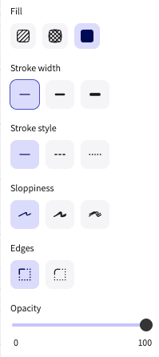

- **Fill:** Full-color fill (right-most option)
- **Stroke width:** Thinnest (left-most option)
- **Sloppiness:** None (left-most option)
- **Edges:** Sharp (left option)
- **Opacity:** 100

#### Arrows

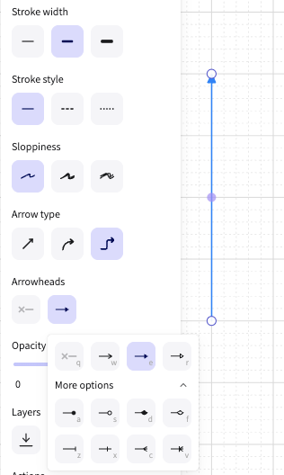

Use these settings for all arrow elements:

- **Sloppiness:** None (left-most option)
- **Arrowheads:** Solid triangle arrowhead
- **Opacity:** 100

#### Text

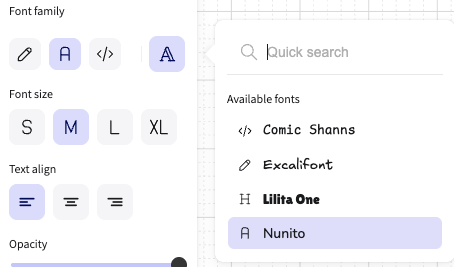

Set the font family to **Nunito**.

### Mermaid.js

Because Sui documentation is maintained as Docs as Code in GitHub, Mermaid.js is a strong choice for diagrams that change frequently or need to stay in sync with code. As plain text, Mermaid diagrams are easy to version control, review in pull requests, and update without a separate design tool.

Mermaid.js supports all C4 diagram types, but becomes difficult to manage as system complexity grows. For flowcharts and sequence diagrams in particular, Mermaid.js is often the better choice over Excalidraw, especially when the diagram is straightforward or expected to evolve over time. For large architecture diagrams with many nodes, custom fills, operator-boundary groupings, or multi-tier layouts, use Excalidraw instead.

Use Mermaid.js when any of the following apply:

- The diagram is a flowchart or sequence diagram with straightforward structure.
- The diagram is expected to change frequently and benefits from version control.
- The diagram has 5 or fewer nodes and does not require custom fills, dashed boundaries, or multi-tier layouts.

Apply the following frontmatter to every Mermaid diagram to align colors with the Sui brand palette:

```yaml
config:
  theme: base
  themeVariables:
    primaryColor: '#000000'
    primaryTextColor: '#FFFFFF'
    primaryBorderColor: '#6C7584'
    secondaryColor: '#6C7584'
    secondaryTextColor: '#FFFFFF'
    tertiaryColor: '#298DFF'
    tertiaryTextColor: '#FFFFFF'
    lineColor: '#298DFF'
    background: '#FFFFFF'
    mainBkg: '#000000'
    secondBkg: '#6C7584'
    noteBkgColor: '#E6F1FB'
    noteTextColor: '#000000'
    noteBorderColor: '#298DFF'
    activationBkgColor: '#298DFF'
    activationBorderColor: '#185FA5'
    fontSize: '14px'
    fontFamily: 'Inter, sans-serif'
    signalColor: '#298DFF'
    signalTextColor: '#298DFF'
    labelBoxBkgColor: '#000000'
    labelBoxBorderColor: '#6C7584'
    labelTextColor: '#FFFFFF'
    loopTextColor: '#FFFFFF'
```


## Brand style

Diagramming and visual style is adapted from the [Sui Brand Kit](https://live.standards.site/sui-media-kit).

### Colors

The Sui brand core palette colors are:

| **Color** | **Hex value** | **Recommended use** |
| --- | --- | --- |
| Black | `#000000` | Primary nodes, system boundaries (C4 system box) |
| White | `#FFFFFF` | Label text on dark fills |
| Gray 500 | `#6C7584` | Secondary nodes, supporting components |
| Sui Blue 500 | `#298DFF` | Arrows, tertiary nodes, callouts |

The recommended use column describes best-practice guidance, not hard requirements. Any color that exactly matches a hex value in the core palette, Extended Blue (Blue 50–900), or Extended Gray (Gray 50–900) palette is acceptable, provided it maintains WCAG AA graphic contrast (3:1). Colors outside these palettes are not permitted. If more than 3 fill colors are required to maintain clarity, expand into the Gray extended palette first, then the Blue extended palette. See the extended palette at [https://live.standards.site/sui-media-kit/sui-color](https://live.standards.site/sui-media-kit/sui-color).

### Typography

The Sui Brand Kit specifies TWK Everett as the primary typeface. Inter is the approved backup for use when TWK Everett is unavailable.

For Excalidraw diagrams, use the Nunito font family, which is the closest available match. For all other tooling, download and use Inter from the Sui Brand Kit site.


## Core diagram standards

The following rules apply to all diagram types regardless of C4 level.

### Layout

- **Flow direction:** Use left-to-right for horizontal data flows (as in the data-serving architecture diagram) and top-to-bottom for vertical execution flows (as in the transaction lifecycle sequence diagram).
- **Alignment:** Snap all nodes to the grid. Related nodes at the same level must share a horizontal or vertical baseline.
- **Grouping:** Use labeled boundary rectangles to group nodes that belong to the same operator-controlled zone. Place the boundary label in sentence case at the top-left corner of the rectangle, outside any node.
- **White space:** Leave at least 40px of padding between nodes and boundary edges in Excalidraw.
- **Complexity:** If a diagram has more than 15 nodes, split it into multiple focused diagrams at appropriate C4 levels. Add a parent context diagram that references the children.

### Shapes

Each shape encodes a specific C4 element. Do not repurpose shapes for elements they are not assigned to.

| **Shape** | **C4 element** | **Recommended use** |
| --- | --- | --- |
| Rectangle (filled) | System, container, component | Primary nodes: processes, services, Sui Full Nodes, indexers, and RPC servers. Fill with Black (primary), Gray 500 (secondary), or Sui Blue 500 (tertiary) based on emphasis level. |
| Rectangle (outline only) | Person / actor | External users or operator roles. Use Gray 500 outline with black label text. |
| Rectangle with dashed border | External system | Third-party services outside the Sui boundary. Use Gray 500 dashed stroke. |
| Diamond | Decision node | Conditional logic in flowcharts and sequence diagrams only. Not used in architecture or context diagrams. |
| Cylinder or server icon | Database / data store | Persistent storage: Postgres DB, object store, archival store. Use the provided `server-icon-minimal.svg`. |
| Ellipse or labeled group boundary | Boundary / zone | Operator-controlled boundaries such as "Data indexer operator stack" in the data-serving diagram. Use Gray 700 outline, sentence-case label at top. |

### Color and emphasis

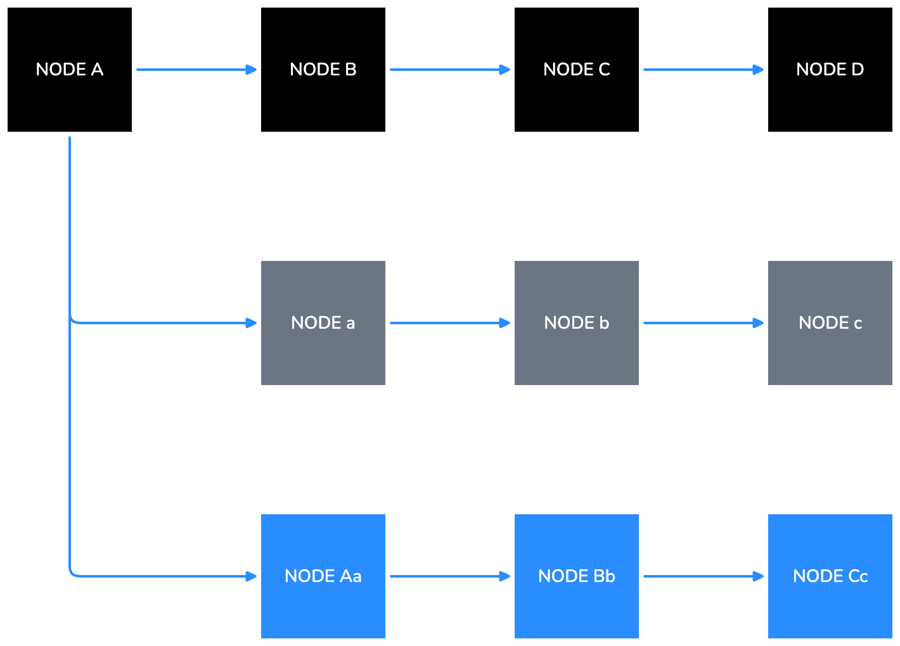

Use Black, Gray 500, and Sui Blue 500 as the recommended fill colors to encode emphasis level across all elements:

- **Primary elements:** Black fill, white label.
- **Secondary elements:** Gray 500 fill, white label text.
- **Tertiary elements and arrows:** Sui Blue 500.
- **Boundary outlines:** Extended Gray palette first, then extended Blue palette.

Any on-palette color (core, Extended Blue, or Extended Gray) is acceptable as long as it maintains WCAG AA graphic contrast (3:1). Color role assignments are guidance and are never a hard requirement.

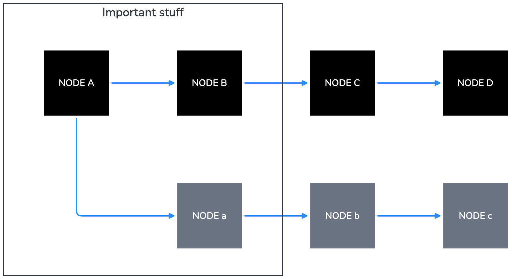

### Text

- **Primary node labels:** ALL CAPS.
- **Secondary labels and sub-labels** inside a node (for example, the protocol name gRPC below a node): sentence case, Sui Blue 500 text or white text depending on contrast.
- **Boundary labels and diagram captions:** Sentence case.
- All text inside nodes must be horizontally and vertically centered.

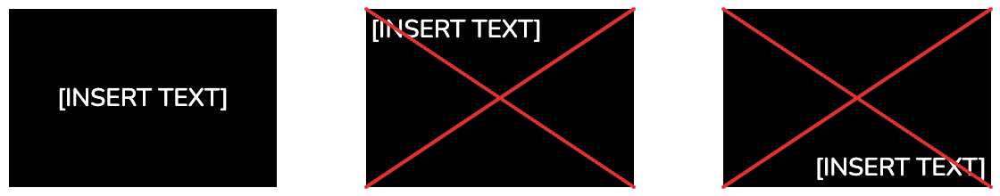

- Avoid vertical text. If vertical text is unavoidable (for example, in swimlane headers), rotate counter-clockwise 90 degrees so the text reads bottom-to-top.

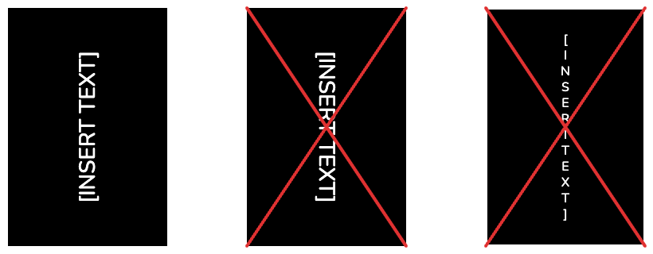

- Use consistent terminology across all diagrams. Refer to the [Style Guide](https://docs.sui.io/style-guide) for canonical names.

### Arrows

Sui Blue 500 (`#298DFF`) is the recommended stroke color for all arrows. Any on-palette color that maintains sufficient contrast is also acceptable; off-palette colors are not permitted. The table below defines the 3 arrow styles and their C4 relationship types.

| **Arrow style** | **C4 relationship type** | **When to use** |
| --- | --- | --- |
| Solid line, filled triangle head, Sui Blue 500 | Synchronous call or direct data flow | Primary data and control flow between containers or components. Used for gRPC calls, direct indexer feeds, and RPC responses. |
| Dashed line, open arrowhead, Sui Blue 500 | Asynchronous or optional relationship | Weak dependencies, optional query paths, or reads that bypass a primary path. Used for the custom RPC server path in the data-serving diagram. |
| Solid line, no arrowhead | Bidirectional or membership | Rarely used. Prefer explicit directional arrows. Use only when the relationship is genuinely symmetric. |

### Accessibility

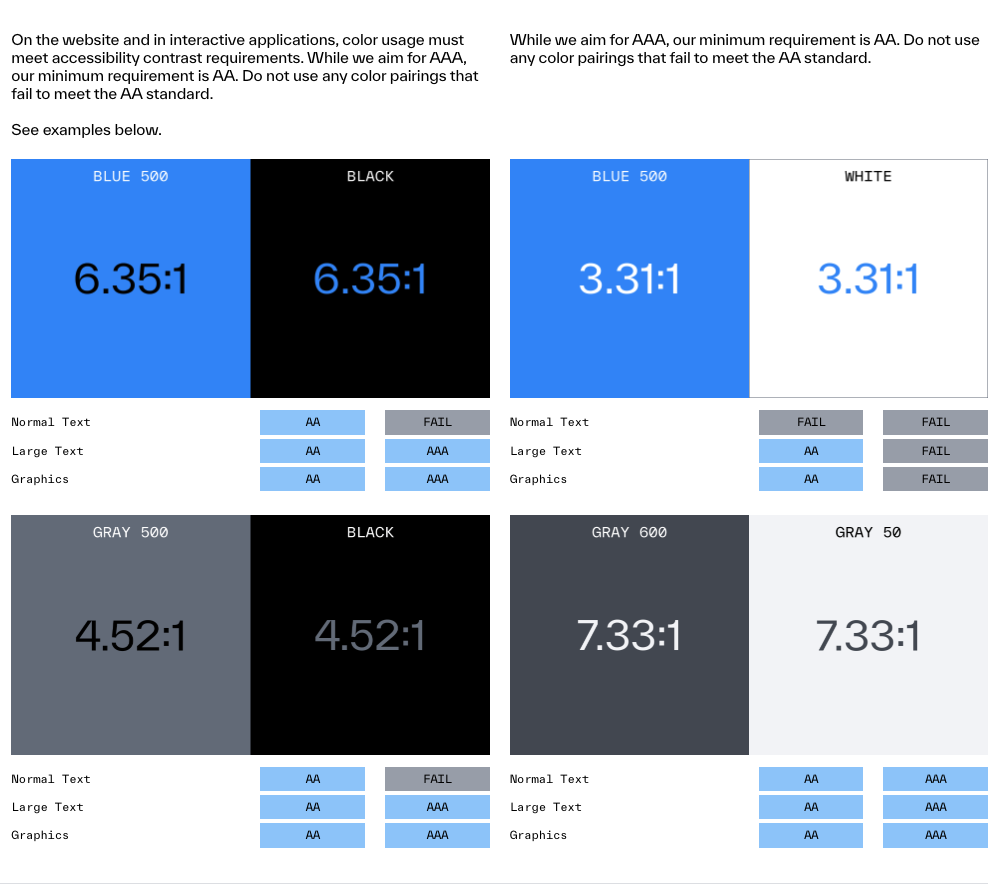

- Meet WCAG AA graphic minimum contrast (3:1) for all diagram text. Diagrams treat text as a graphic or UI component, so the 3:1 graphic threshold applies rather than the 4.5:1 normal-text threshold.
- Do not rely on color alone to distinguish elements. Supplement color with shape, arrow style, or label.
- Prefer white text on Black (`#000000`) or Gray 500 (`#6C7584`) fills. White (`#FFFFFF`) on Sui Blue 500 (`#298DFF`) achieves approximately 3.31:1 contrast, which passes the 3:1 graphic AA threshold and is permitted.
- Label every node. Do not rely on position or color alone to convey meaning.
- Test readability at 400px wide (mobile) and 1200px wide (desktop) before committing.


## Diagram types

Sui documentation uses 4 diagram types, each mapped to a C4 level. The sections below describe the layout rules and design decisions for each type.

### Architecture diagrams

Architecture diagrams answer the question: what are the major components of this system and how do they communicate? They correspond to C4 Level 2 (container) or Level 3 (component).

The following is an example recreation of the Future State Data Serving Stack diagram from the [Data Serving](/concepts/data-access/data-serving.mdx) concept page.

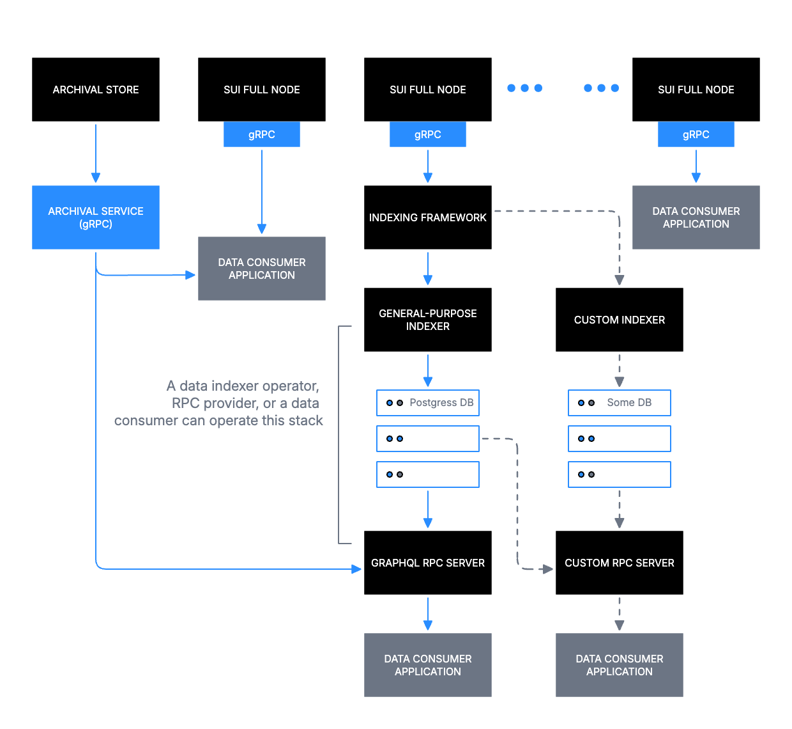

The example diagram shows Sui Full Nodes at the top tier, feeding into an Indexing Framework, which branches into a General-purpose Indexer (with Postgres DB) and a Custom Indexer (with a custom database), and terminates at consumer-facing RPC servers. Key decisions made in that diagram:

- Top-to-bottom reading order maps to data flow from source (Sui Full Nodes) to consumer (Data Consumer Application).
- Boundary rectangles group the indexer stacks under operator-controlled zones with sentence-case labels.
- Dashed arrows mark the optional Custom RPC Server path.
- Ellipsis nodes (the three-dot groups) represent peer nodes without enumerating every instance.

### Sequence diagrams

Sequence diagrams answer the question: in what order do these actors and systems exchange messages? They correspond to C4 Level 4 (code).

The following is an example recreation of the Transaction Lifecycle diagram from the [Life of a Transaction](/guides/developer/transactions/transaction-lifecycle.mdx) concept page.

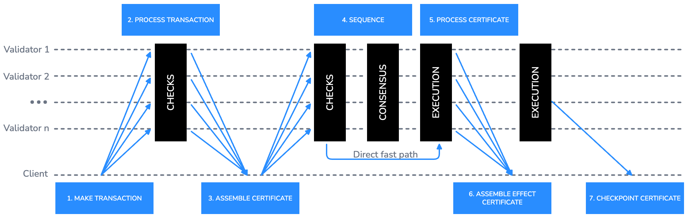

The example diagram uses horizontal swimlanes for each actor (Client, Validator 1 through Validator n) and numbered step labels above the arrows. Key decisions made in that diagram:

- Fan-out arrows from Client to all Validators represent broadcast submission.
- Vertical black bars represent processing phases (CHECKS, CONSENSUS, EXECUTION) and span multiple swimlanes to show concurrent activity.
- The direct fast path is labeled inline on the arrow with a short sentence-case annotation.
- Step numbers are placed above the arrow in Sui Blue 500 using small ALL CAPS labels.

For simpler actor-to-actor flows, a traditional sequence diagram is often clearer. The following example shows a transaction being submitted by a client, validated by a validator, and confirmed back to the client:
 
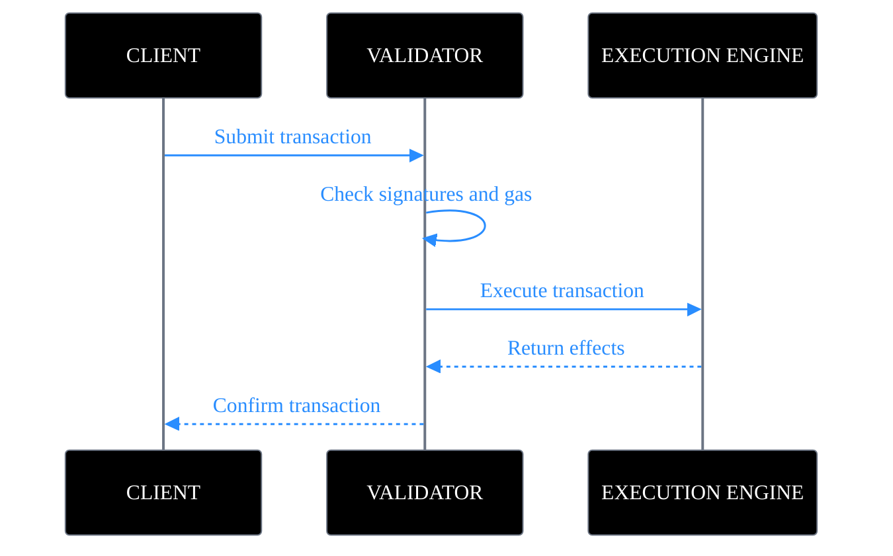

### Flowcharts

Flowcharts answer the question: what decisions and steps does this process involve? They correspond to C4 Level 4 (code).

The following is an example recreation of the example flowchart from the [Transactions overview](/guides/developer/transactions/txn-overview.mdx) guide.

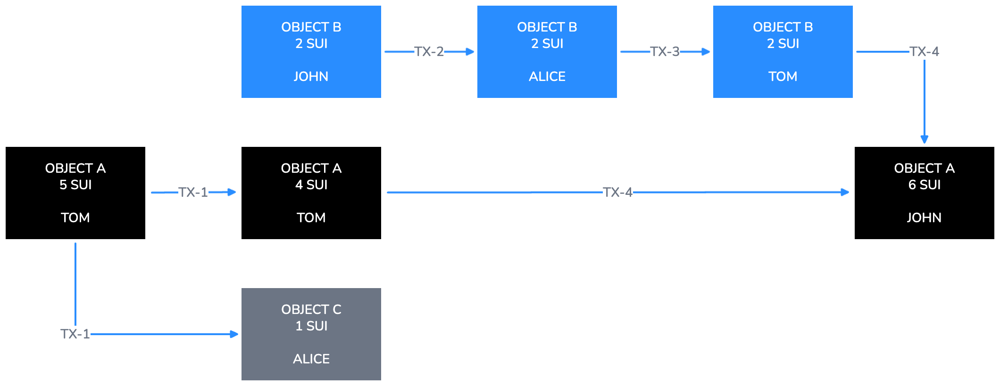

The example diagram shows objects (OBJECT A, OBJECT B, OBJECT C) as Black or Sui Blue 500 filled rectangles, transaction labels (TX-1 through TX-4) on arrows, and owner names as sub-labels in sentence case inside each node. Key decisions made in that diagram:

- Each object state is its own node. State changes are shown as new nodes connected by labeled arrows, not by mutating existing nodes.
- The horizontal left-to-right progression represents time passing across transactions.
- Gray 500 fill distinguishes objects created as byproducts of a transaction from primary objects.

When a flowchart includes conditional logic, represent the decision point with a diamond node. The diamond must have exactly 2 labeled exits. Label each exit with the branch condition in sentence case (for example, Valid and Invalid, or Yes and No). Every arrow that exits a decision node must be labeled. The following is an example of a conditional node in the transaction validation flow:
 
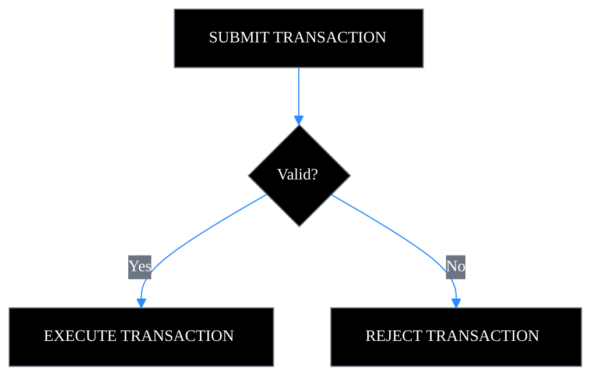

## Files and exporting

Follow these conventions for naming, storing, and exporting diagram files.

### File naming

Use the following naming pattern for all diagram files:

| **Pattern** | **Example** |
| --- | --- |
| `diagramtype_topic_v{n}.svg` | `architecture_data-serving_v1.svg` |
| `diagramtype_topic_v{n}.excalidraw` | `sequence_txn-lifecycle_v2.excalidraw` |
| `diagramtype_topic_v{n}.png` | `flowchart_object-transfer_v1.png` (export only) |

Allowed diagram type prefixes: `architecture`, `sequence`, `flowchart`, `context`, `component`.

### Source files

- Every pull request that adds or updates a diagram must include an editable source file (`.excalidraw` or `.svg`) in addition to the exported PNG.
- Store source files in the same directory as the documentation page that references them.
- Do not commit auto-generated or minified SVG output as the source file.

### Export checklist

Before committing a diagram, verify the following export settings:

- **Background:** On.
- **Dark mode:** Off.
- **Scale:** 3x for production; 1x for draft review.
- **Format:** PNG for the docs site; SVG as source.
- Verify that all text is readable at 400px wide before committing.

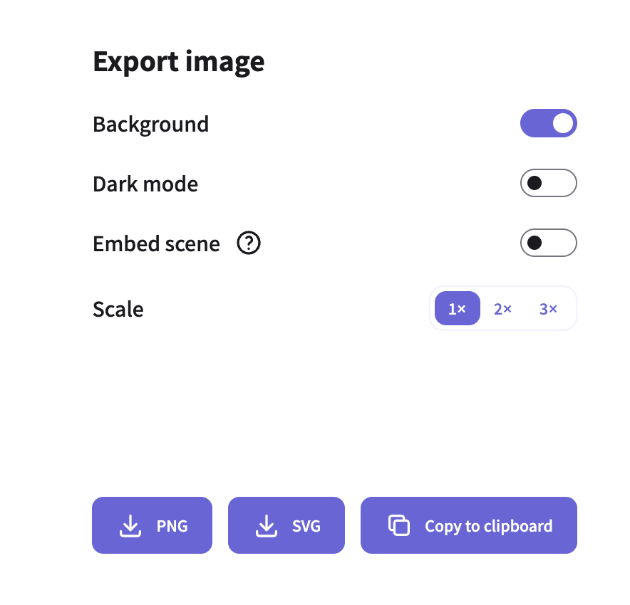
