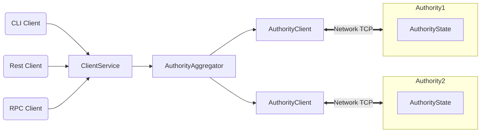

Sui Docs uses the MDX format for its network documentation, which allows [JSX in markdown content](https://mdxjs.com/). Sui uses features provided by Docusaurus, plugins from its community, and custom plugins in an effort to improve reader experience. None of these features are required in your markdown contributions to the Sui documentation, but the Sui community might include them if it improves experience.

## Custom frontmatter

The frontmatter at the top of MDX pages provides context for the current topic. The only frontmatter entry required at the time of riting is `title`. In addition to the standard frontmatter entries available, the following custom items are useful for certain topic types.

### beta

Including the `beta` entry applies a box to the top of the topic that informa the reader of the beta status of the feature or service described. Possible values include `true` for a standard box, or a list of environments the feature or service is available in (`devnet`, `testnet`, `mainnet`) to include that information in the note.

**Example:**

```
---
title: Page title
description: A page of info describing a beta feature.
beta: devnet, testnet
---
```

### effort

The `effort` option is used for end-to-end guides. Including this entry places a box at the top of the guide to let the reader know what kind of effort is required to complete the guide. Available values are `small`, `medium`, `large`.

**Example:**
```
---
title: A Guides
description: A guide on how to do this thing in Sui.
effort: medium
---
```

## Custom admonition boxes

Beyond the default admonition boxes that Docusaurus offers (info, note, warning, danger), the following are also available.

### Checkpoint

The `:::checkpoint` admonition box is used in end-to-end guides to provide the status of the project that the current guide is walking through. The idea is that if their own work fails the checkpoint, then they know where things went wrong rather than getting to the end of the guide with a broken example.

**Example:**

```
:::checkpoint

Run your app and make sure you can:

- Create an NFT.
- Initiate a trade.

:::
```

## Tabs

`Tabs` and child `TabItem` elements allow for the segmentation of content so that users see only the content that is relevant to them. Sui documentation uses the default Docusaurus tab components. Check the [official documentation](https://docusaurus.io/docs/next/markdown-features/tabs) for all available options.  

### When to use

Use tabs to divide repetitive content that doesn't typically apply to all audiences. Operating system or language specific content are the most ubiquitous examples. Most users are not going to be interested in Rust AND TypeScript instruction, or Windows AND Linux content. Tabs can produce a more focused page that includes only the information the reader cares about. If you use the `groupId` attribute, you can persist user selection across pages and sessions so the reader doesn't have to click the same tab on different pages or select again when revisiting pages.        

### How to use

To create a tabbed section:

1. At the top of your file (after the frontmatter), `import` the `Tabs` and `TabItem` components.
    ```tsx
    ---
    title: Page title
    description: Optional short description.
    ---

    import Tabs from '@theme/Tabs';
    import TabItem from '@theme/TabItem';

    ```
1. Add the `<Tabs>` element where you want the tabbed content to go. Include the optional `groupId` property if there are other `Tabs` with the same selections. For example, `<Tabs groupId="operating-systems">` persists users' selections across other `Tabs` with the same `groupId` value.
1. Add a `<TabItem>` element for each section of content as a child of the `Tabs` element. Each `TabItem` needs both `value` and `label` property values. If you're using `groupId` in the parent `Tabs`, make sure the `value` value remains consistent across `TabItem`s that are intended to show the same type of information.
1. Close each `</TabItem>` and the parent `</Tabs>`.
1. Check your page in the Vercel preview of your PR (`sui-core` preview link in Vercel comment) to make sure the content displays as expected.

**Example:**
```
<Tabs groupId="operating-systems">

<TabItem value="linux" label="Linux">

Whatever content is in here is only displayed when the user selects the **Linux** tab.

</TabItem>

<TabItem value="macos" label="MacOS">

Whatever content is in here is only displayed when the user selects the **MacOS** tab.

</TabItem>

<TabItem value="windows" label="Windows">

Whatever content is in here is only displayed when the user selects the **Windows** tab.

</TabItem>

</Tabs>
```

<Tabs groupId="operating-systems">

<TabItem value="linux" label="Linux">

Whatever content is in here is only displayed when the user selects the **Linux** tab.

</TabItem>

<TabItem value="macos" label="MacOS">

Whatever content is in here is only displayed when the user selects the **MacOS** tab.

</TabItem>

<TabItem value="windows" label="Windows">

Whatever content is in here is only displayed when the user selects the **Windows** tab.

</TabItem>

</Tabs>

:::info

The empty newlines between each opening and closing element in the example are important.

:::

## Snippets

Snippets are short pieces of reusable text. This feature uses the Docusaurus community provided [docusaurus-plugin-includes](https://github.com/simologos/docusaurus-plugin-includes) plugin. The `docs/content/snippets` folder contains all the reusable content. Pages in that directory do not appear in the ToC and are hidden from search engines. Upon build, the process deletes the folder so the content doesn't get rendered to the final site as it's own page.

### When to use

Use a snippet for content that appears in more than one place. Snippets are typically a paragraph or smaller. Tables of data, technology requirements, and other information relevant to more than one topic or audience are good candidates to create as snippets (especially if the information is likely to change). If you want to use a snippet for longer form content, consider just using a hyperlink instead.

The use of snippets reduces maintenance effort because one edit updates the content wherever it appears. It also doesn't require the reader to leave the current page to get necessary information, as a hyperlink does.

### How to use

To create and use snippets:

:::info

You do not need to `import` a component to use snippets.

:::

1. Create an .mdx file in the `docs/content/snippets` folder with the content you want to use in different locations. Do not include frontmatter in the file, just markdown content. Frontmatter is the content between `---` at the top of doc source pages.  
1. In the document where you want to include the content from the snippet, add the `{@include}` directive with a relative location of the file. 

    `{@include: ../../snippets/reusable.mdx}`

1. Repeat the previous step for all locations the content should appear. Be sure to update the relative location of the snippet based on where the file containing the directive exists in the repo.
1. Check each page in the Vercel preview of your PR (`sui-core` preview link in Vercel comment) to make sure the content displays. If the relative link you provide does not resolve correctly, the page displays error text instead of the expected content.

:::warning

Do not use links relative to the file structure in snippets (for example, `../concepts/file.mdx`). If your snippet requires a link internal to the Sui docs site, use the relative HTML path instead (`/concepts/file`). 

:::

## Code inject

Sui documentation uses a custom Docusaurus plugin to include code from the Sui repo in its pages. The plugin is based on the docusaurus-plugin-includes plugin used for [snippets](#snippets). 

### When to use

In an active repo, source code changes frequently. If you copy and paste that source code in a document, then the two sources can diverge quickly and drastically. In Sui Docs, you can use the `{@inject}` directive to make a copy of the source when the site builds (merge PR), ensuring the source used in the content always matches the source code in the repo. If the code you inject is tested, this directive ensures the code in your document is also tested.

#### Considerations

The effective use of `{@inject}` often requires code comments in the source file. You might need to balance the granularity of your documentation with the amount of comment chatter your documentation efforts might create.

When including sections of code, understand that the code might change from what you reference during document creation to what a reader eventually consumes. Assume other processes will update the accompanying content, but be mindful of the possibility of changing code when considering the level of detail in your instruction. You can take comfort in the knowledge that the code is always valid, though.

### How to use

To include the entire source file, use the `{@inject}` directive with a path to the file, based on the Sui repo root. For example, to include the source file at `sui/examples/move/hero/sources/example.move`, write `{@inject: examples/move/hero/sources/example.move`. The file location is automatically used as the title for the codeblock.

You can use source code from other GitHub repositories, but should do so sparingly and purposefully. There is almost no way to track those projects to ensure the code is valid, unlike the CI processes running on the sui repo. To use, format the directive as `{@inject: github:<GITHUB_ORG_NAME>/<GITHUB_REPO_NAME>/<PATH_TO_FILE>}`.

#### Include part of code

To include only sections of code, add an ID to identify the section, function, struct, or module. The ID is used in the directive syntax and in source code comments. The following sections provide examples of different uses and how to format them.

#### Include a Move section

:::info

This approach is a work in progress and there are certain formatting situations that prevents their use. In those cases, use the `docs://#id` approach instead.

:::

You can include specific sections of Move code using the following constructs appended to the end of the code directory. You can uses a comma delimited list for functions, structs, and variables to include each in the same codeblock:
- Module: #module=MODULE::NAME
- Function: #fun=FUNCTION_NAME,ANOTHER_FUNCTION
- Struct: #struct=STRUCT_NAME,ANOTHER_STRUCT
- Variables: #var=variableName, anotherVariable
- Move import: #use=LIBRARY::NAME
- React component: #component=ComponentName
- Type declaration: #type=TypeName
- Enum declaration: #enum=EnumName

For example, `{@inject: examples/move/example.source#fun=buy_sword}`

#### Include linear parts of code

If you want to include a complete section of code, use a descriptive ID in the document and source file. 

1. In your document, add the directive to the file with the ID appended. The build process replaces this line with the referenced code, so place where the code should appear.
    `{@inject: examples/foo/bar.move#IDstring}`
1. In the source file, add a comment where the section should begin in the form `// docs::#ID`.
    ```ts
    // docs::#IDstring

    import lib from "library";
    ...
    ```
1. In the source file, add a comment where the section should end in the form `// docs::/#ID`.
    ```ts
    // docs::#IDstring

    import lib from "library";
    ...
    return book;

    // docs::/#IDstring
    ...
    ```

#### Add closing syntax

When including linear sections of code, you sometimes want only the first part of a code source. Often, this requires placing the end directive (`// docs::/#ID`) before the closing syntax of the code source. To display closing syntax for well-formed code in the document, append the necessary syntax to the end directive.

For example,

```ts
// docs::#funcBasic
function func(){ 
    const basic = () => {
        const basic2 = () => {};
        // docs::/#funcBasic};}
        const inter = () => {};
    };
    const advanced = () => {};
}
```

displays as

```
function func(){
    const basic = () => {
        const basic2 = () => {};
    };
}
        
```

#### Include nonlinear parts of code

:::info

Consider restructuring your document before using this approach. This feature is useful in some situations, but it increases the comment chatter in the source file.

:::

If you don't want to include a section of code, but instead focus on the code around it in a single doc instance, you can pause the injection with a source code comment in the form `// docs::#ID-pause`. A second comment in the form `// docs::#ID-resume` continues the injection.

1. In your document, add the directive to the file with the ID appended. The build process replaces this line with the referenced code, so place where the code should appear.
    &#123;`@inject: examples/foo/bar.move#IDstring`
1. In the source file, add a comment where the section should begin in the form `// docs::#ID`.
    ```ts
    // docs::#IDstring

    import lib from "library";
    ...
    ```
1. In the source file, add a comment where the injection should pause and where it should resume. Optionally, append a colon and replacement text to the pause directive. The replacement text displays in the document instead of the code.   
    ```ts
    // docs::#IDstring

    import lib from "library";
    ...
    // docs::#IDstring-pause:TODO

    const Advanced = () => {};

    // docs::#IDstring-resume
    ```
1. In the source file, add a comment where the injection should end. 
    ```ts
    // docs::#IDstring

    import lib from "library";
    ...
    // docs::#IDstring-pause:// TODO

    const Advanced = () => {};
    ...

    // docs::#IDstring-resume

    return book;

    // docs::/#IDstring
    ...
    ```

The final result in the document from these steps is:

```ts
import lib from "library";
...

// TODO

return book;
```

#### Options

You can include a space-limited list of options after the @inject call. The following options are supported:
- `noComments`: Remove comments from Move code.
- `noTests`: Remove tests from captured section of code.
- `noTitle`: Don't place a hyperlinked title at the top of the code block.
- `singleSpace`: If the code source has spurious whitespace, use this option to display code without extra spaces between lines. Useful when the code uses extra blank lines for readability. 

For example, `{@inject: examples/move/example.source#module=example::example noComments noTests noTitle singleSpace}`


## Mermaid graphs

Mermaid graphs are text-based [Mermaid.js](https://mermaid.js.org) diagrams. Mermaid has native support in Docusaurus.

### When to use

Any graph you want to include should use Mermaid. Flowchart and sequence diagram types are particularly useful. Support for newer graph types are dependent on the Docusaurus implementation and might not render correctly. 

The reason for using Mermaid is to allow anyone, anywhere the ability to update or augment information for visual assets without needing separate imaging software or source files.

### How to use

To create a mermaid graph, place the code inside tick fencing with `mermaid` defined as the language. You do not need to import anything into your document. 

The following code

    ```mermaid
    flowchart LR
        CC(CLI Client) --> ClientService
        RC(Rest Client) --> ClientService
        RPCC(RPC Client) --> ClientService
        ClientService --> AuthorityAggregator
        AuthorityAggregator --> AC1[AuthorityClient] & AC2[AuthorityClient]
        subgraph Authority1
        AS[AuthorityState]
        end
        subgraph Authority2
        AS2[AuthorityState]
        end
        AC1 <==>|Network TCP| Authority1
        AC2 <==>|Network TCP| Authority2
    ```

produces



