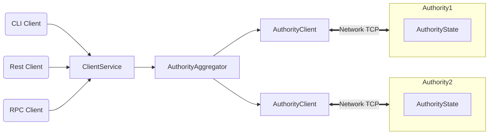

The Sui developer documentation uses the MarkdownX (`.mdx`) format for all pages. MDX allows [JSX within Markdown content](https://mdxjs.com/). The site uses Docusaurus, an open-source framework that provides built-in features like admonitions and Mermaid diagrams. It also utilizes community plugins and custom components the documentation team developed. While none of these features are required in a contribution, you may include them if they enhance the reader’s experience.

## Custom frontmatter

The frontmatter at the top of every documentation page provides additional context for the page, including a description that appears in the page's link preview, keywords for optimized search results, and other optional, format-related components.

Include the following components on every page:

```
---
title: Title of Page
description: 1-2 sentences summarizing the page's content.
keywords: [ words, for, search, results ]
---
```

### MDX format

Pages that use `{@include:}` and `{@inject:}` directives **must** use the following MDX format frontmatter for those directives to render properly on the page. Without this, the Docusaurus build throws an "acorns" error.

```yaml
mdx:
  format: md
```

### Optional frontmatter 

#### `beta`

Adds an admonition box to the top of the page to inform readers of the feature or topic's beta status.  

**Options:**  
- `true` → Standard beta box.  
- `devnet`, `testnet`, `mainnet` → Displays environments where the feature is available.  

**Example:**

```yaml
---
title: Page title
description: A page of information describing a beta feature.
beta: devnet, testnet
---
```

#### `effort`

Used for end-to-end tutorials. Adds an admonition box at the top indicating the effort required to complete the tutorial.

**Options:** 

- `small`
- `medium`
- `large`

**Example:**

```yaml
---
title: A Guide
description: A guide on how to do this thing in Sui.
effort: medium
---
```

## `UnsafeLink`

Use `UnsafeLink` to skip the Docusaurus link checker for a URL.

This is **necessary** for pages that the Docusaurus build auto-generates, as they are generated after the link checker runs and thus will result in a build error.

:::info
In local development, the setting `onBrokenMarkdownLinks: "warn"` remains at `"warn"`, but in production the build process still throws a build error.
:::

**Example:**

```jsx
<UnsafeLink href="link/to/path">Link title</UnsafeLink>
```

## Custom admonition boxes

Beyond the Docusaurus defaults (`info`, `note`, `warning`, `danger`), there is another custom admonition box for checkpoints.

Use checkpoints in end-to-end guides to validate user progress.

**Example:**

```
:::checkpoint

Run your app and make sure you can:
- Create an NFT.
- Initiate a trade.

:::
```

## Tabs

Use `<Tabs>` and `<TabItem>` to segment content that achieves the same goal but for different operating systems, programming languages, or developer environments. 

Docusaurus automatically imports the `<Tabs>` and `<TabItem>` components into every documentation page. You do not need to import them manually. 

The docs use a few custom scripts to properly render and style the `<Tabs>` component. These scripts let you use `<Tabs>` with [`{@include:}` snippets](#snippets-include) without breaking the page's formatting.

When using multiple instances of `<Tabs>` within a page, use `groupId` to persist selections across sections. The name of each `<TabItem>` across `<Tabs>` components using `groupId` must match for the tabs to function properly.

To create a tabbed section:

1. Add the `<Tabs>` element where you want the tabbed content to go. Include the optional `groupId` property if there are other `Tabs` with the same selections.

1. Add a `<TabItem>` element for each section of content as a child of the `Tabs` element. Each `TabItem` needs both `value` and `label` property values. If you're using `groupId` in the parent `Tabs`, make sure the `value` remains consistent across `TabItem`s in other `Tabs` with the same `groupId` value. Doing so makes the `TabItem`s that are intended to show the same type of information become active across all relevant `Tabs`. This behavior persists across pages and sessions.  


1. Close each `</TabItem>` and the parent `</Tabs>`.

**Example:**

```md
<Tabs groupId="operating-systems">

  <TabItem value="linux" label="Linux">

    Linux-only content.

  </TabItem>

  <TabItem value="macos" label="macOS">

    macOS-only content.

  </TabItem>

  <TabItem value="windows" label="Windows">

    Windows-only content.

  </TabItem>

</Tabs>
```

:::info
You must add empty newlines between content, opening, and closing tags. Without them, the component fails to render properly.
:::

## Snippets `{@include:}`

Reusable Markdown content stored in `docs/content/snippets`. Snippets can be reusable sentences, paragraphs, admonition boxes, `<Tabs>`, or pieces of code. 

Tables of data, technology requirements, and other information relevant to more than one topic or audience are good candidates to create as snippets (especially if the information is likely to change).

Snippets help reduce maintenance and avoid forcing readers off-page for important information.  

### How to use snippets

1. Create an `.mdx` file in the `/docs/content/snippets` directory. This file cannot have frontmatter.
    
    1. If the file contains code from another file, it must be inserted with the `<CodeFromFile>` component rather than the `{@inject:}` syntax.
 
1. Insert the snippet into another page with `{@include: ../../snippets/reusable.mdx}`.

    :::warning
    Do not use file-structure links inside snippets. Use site-relative paths (`/concepts/file`).
    :::

1. Ensure there are empty lines above and below the `{@include:}` line.

1. Add the required frontmatter to the top of the page that contains the `{@include:}` line.

```yaml
mdx:
  format: md
```

## Inject code `{@inject:}`

Inject code directly into a documentation file using a custom plugin that supports filtering and syntax highlighting.

In an active repo, source code changes frequently. If you copy and paste that source code in a document, then the two sources can diverge quickly and drastically. If the code you inject is tested, this directive ensures the code in your document is also tested.

Use `{@inject:}` to keep docs synchronized with live source code, as it prevents divergence between the docs and repo code. 

:::caution 

#### Considerations

The effective use of `{@inject}` often requires code comments in the source file. You might need to balance the granularity of your documentation with the amount of comment chatter your documentation efforts might create.

When including sections of code, understand that the code might change from what you reference during document creation to what a reader eventually consumes. Assume other processes will update the accompanying content, but be mindful of the possibility of changing code when considering the level of detail in your instruction. You can take comfort in the knowledge that the code is always valid, though.

:::caution
You **cannot** use `{@inject:}` within the snippet file for an `{@include:}` directive. You must use the `<CodeFromFile>` component instead.

```
<CodeFromFile
  filePath="crates/sui-indexer-alt-framework/src/pipeline/processor.rs#variable=values"
/>
```

:::

### Referencing files within the Sui monorepo 

Reference files via their relative path:

```
{@inject: examples/move/hero/sources/example.move}
```

### Referencing files from other repos 

If several code files located in another repo need to be referenced across multiple documentation pages, the Sui documentation team may have added it as a **submodule** of the Sui repo. Submodules are a GitHub feature that creates symlinks across repositories. 

Current submodules within the Sui docs include:

- [TS SDK](https://github.com/MystenLabs/ts-sdks): `/docs/submodules/ts-sdks`

- [DeepBook](https://github.com/MystenLabs/deepbookv3): `/docs/submodules/deepbookv3`

The Sui documentation team decides whether to add submodules. Community contributions should not attempt to add submodules.

### How to use 

First, add the required frontmatter:

```yaml
mdx:
format: md
```

To include an entire file of code: 

```
{@inject: examples/move/hero/sources/example.move}
```

To include specific components or sections, use IDs or directives:  

- Module: #module=MODULE::NAME 
- Function: #fun=FUNCTION_NAME,ANOTHER_FUNCTION 
- Struct: #struct=STRUCT_NAME,ANOTHER_STRUCT 
- Trait: #trait=TRAIT_NAME,ANOTHER_TRAIT 
- Variables: #var=variableName,anotherVariable 
- Move import: #use=LIBRARY::NAME 
- React component: #component=ComponentName 
- Type declaration: #type=TypeName 
- Enum declaration: #enum=EnumName

**Example:**  
```
{@inject: examples/move/example.source#fun=buy_sword}
```

#### Include nonlinear parts of code

:::info

Consider restructuring your document before using this approach. This feature is useful in some situations, but it increases the comment chatter in the source file.

:::

If you don't want to include a section of code, but instead focus on the code around it in a single doc instance, you can pause the injection with a source code comment in the form `// docs::#ID-pause`. A second comment in the form `// docs::#ID-resume` continues the injection.

1. In your document, add the directive to the file with the ID appended. The build process replaces this line with the referenced code, so place where the code should appear.

```
{@inject: examples/foo/bar.move#IDstring}
```

1. In the source file, add a comment where the section should begin in the form `// docs::#ID`.

    ```ts 
// docs::#IDstring 
import lib from "library"; 
...
```

1. In the source file, add a comment where the injection should pause and where it should resume. Optionally, append a colon and replacement text to the pause directive. The replacement text displays in the document instead of the code.

```ts 
// docs::#IDstring 
import lib from "library"; 
... 

// docs::#IDstring-pause:TODO 
const Advanced = () => {}; 
// docs::#IDstring-resume
```

1. In the source file, add a comment where the injection should end.

```ts 
// docs::#IDstring 
import lib from "library"; 
... 

// docs::#IDstring-pause:
// TODO 
const Advanced = () => {};
... 

// docs::#IDstring-resume 
return book; 

// docs::/#IDstring 
...
```

The final result in the document from these steps is:

```ts 
import lib from "library"; 
...

// TODO 
return book;
```

### Additional options 

You can also add additional strings to the end of the inject statement to highlight specific lines, remove titles, etc:

- `noComments` → Strip comments  
- `noTests` → Strip tests  
- `noTitle` → Remove code block title  
- `singleSpace` → Normalize spacing  
- `highlight` → Highlight a specific line using a unique word in the line you want highlighted (ex. `highlight=variable_name`)

**Example:**  

```
{@inject: examples/move/example.source#module=example::example noComments noTests}
```

## Collapsible components: Details and summary 

Use `<details>` and `<summary>` to create collapsible content. This is useful for reducing page length by placing long code files, command output, or other large text blocks inside `<details>`, making the page easier to scroll.

Add an empty newline above and below the content, opening, and closing tags.

**Example:**

```html
<details>

  <summary>Example</summary>

  Collapsible details go here.

</details>
``` 

## Using step headings

Prefer ordered lists for processes; keep each step to one instruction. However, if a step needs multiple sub-instructions or lots of context, use step headings (headings with step/substep) to group content. 

Avoid lists where Step 1 spans pages and switch to step headings instead. Step headings make long guides easier to resume and navigate via the ToC.

### How to use step headings

To create step headings, add a `step` or `substep` suffix to the usual heading levels. 

For instance, to create a level 2 heading, write `##step Buy peanuts`, which is the same as typing `## Step 1: Buy peanuts`.

The feature supports one level of `nesting` using the `substep` suffix in the same manner. Don't forget to use the proper number of hashes in relation to the parent step. Continuing the example, you might have `###substep Buy Cracker Jacks`, which would be the same as typing `### Step 1.1: Buy Cracker Jacks`.

##step Buy peanuts

Buy me some peanuts.

###substep Buy Cracker Jacks

And Cracker Jacks.

##step Come back

I don't care if I ever come back.

## Mermaid graphs

Mermaid graphs are text-based [Mermaid.js](https://mermaid.js.org) diagrams. Mermaid has native support in Docusaurus.

Any graph you want to include should use Mermaid. Flowchart and sequence diagram types are particularly useful. The Docusaurus implementation determines support for newer graph types, which might not render correctly. 

By using Mermaid, anyone can update or augment visual assets without relying on separate imaging software or source files.

### How to use

To create a mermaid graph, place the code inside tick fencing with `mermaid` defined as the language. You do not need to import anything into your document. 

The following code:

    ```mermaid
    flowchart LR
        CC(CLI Client) --> ClientService
        RC(Rest Client) --> ClientService
        RPCC(RPC Client) --> ClientService
        ClientService --> AuthorityAggregator
        AuthorityAggregator --> AC1[AuthorityClient] & AC2[AuthorityClient]
        subgraph Authority1
        AS[AuthorityState]
        end
        subgraph Authority2
        AS2[AuthorityState]
        end
        AC1 <==>|Network TCP| Authority1
        AC2 <==>|Network TCP| Authority2
    ```

creates the following diagram:



<!----- not currently used

## YouTube player with thumbnail carousel

Use `YTCarousel` to display multiple videos.  

**Example:**
```jsx
import YTCarousel from "@site/src/components/YTCarousel";

<YTCarousel ids={["dQw4w9WgXcQ","EwTZ2xpQwpA","1TewCPi92ro"]}/>
```

----->