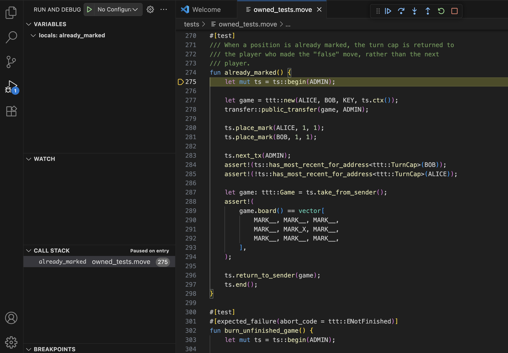
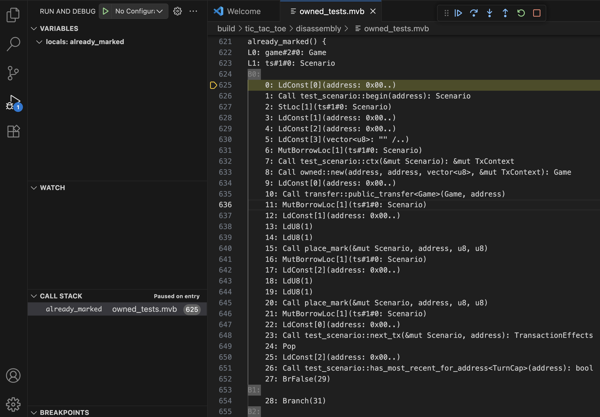
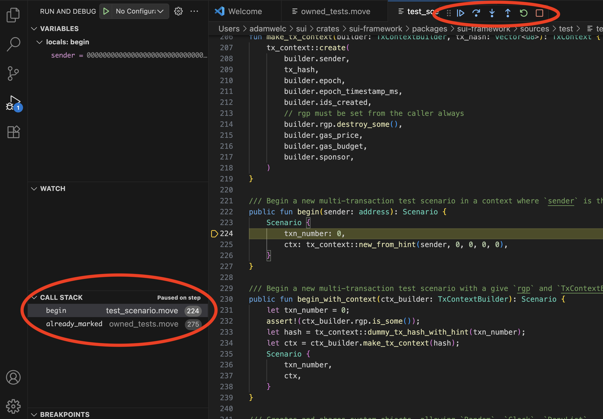
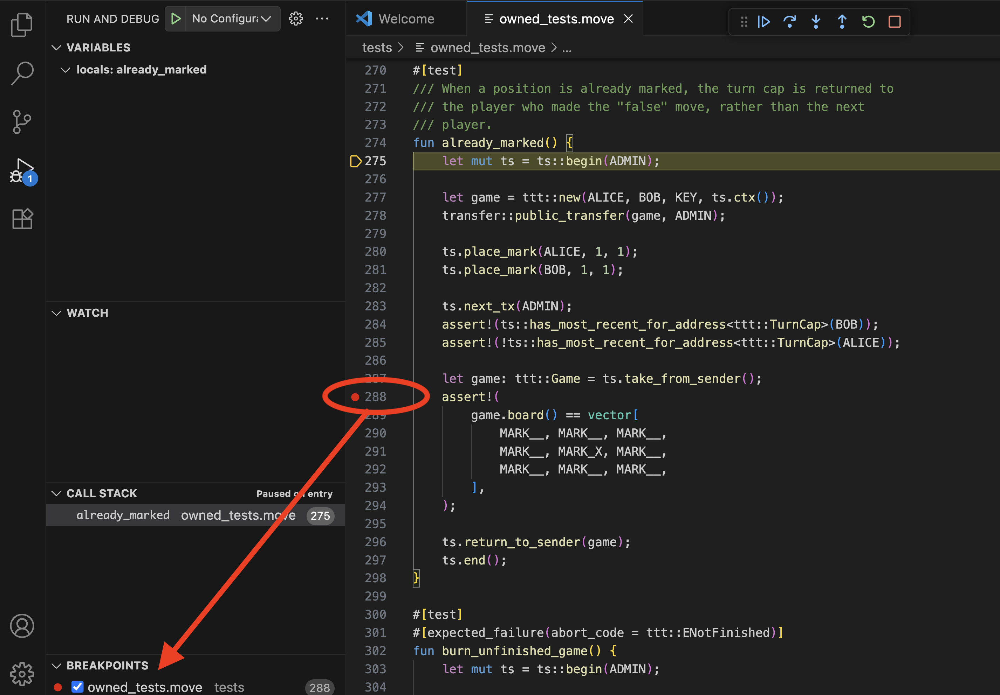
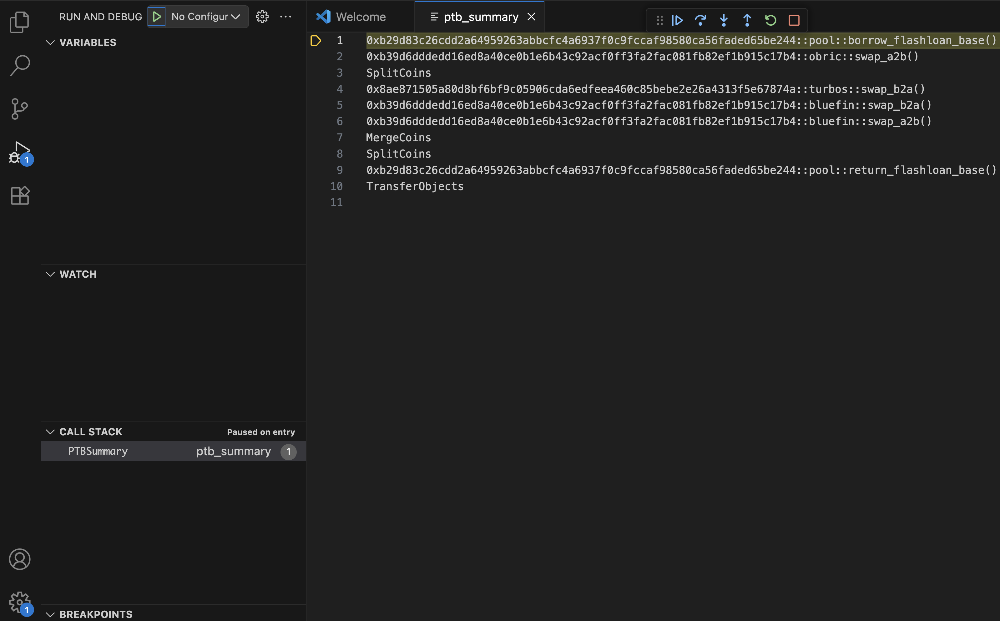
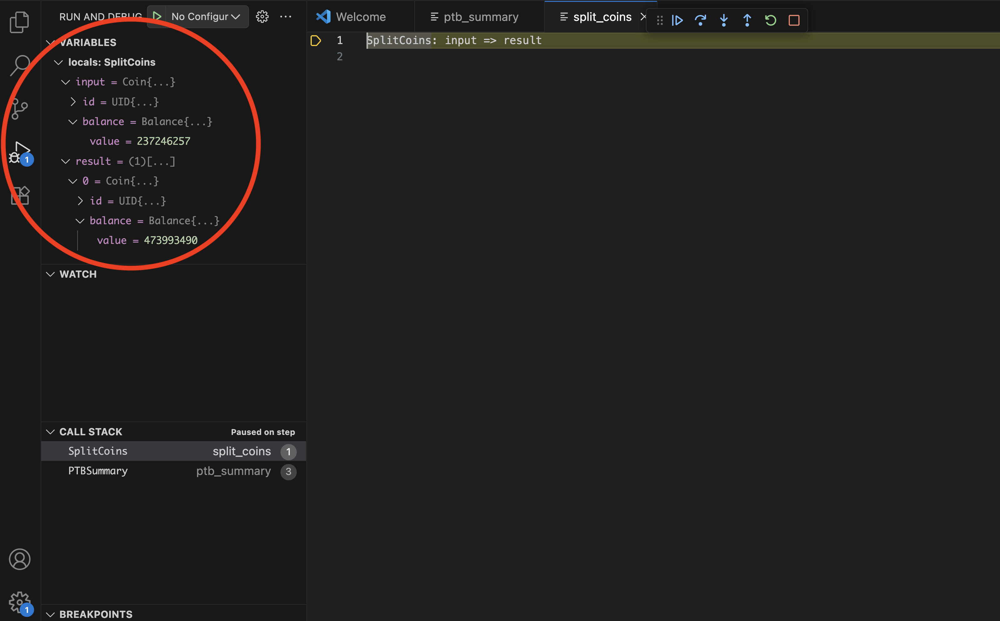
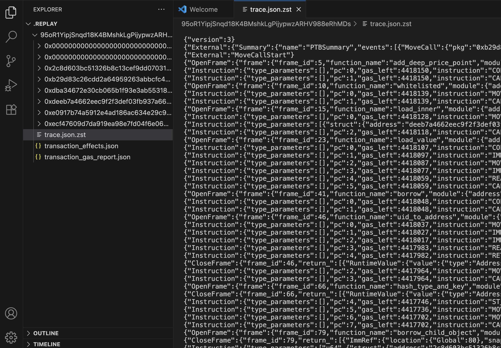
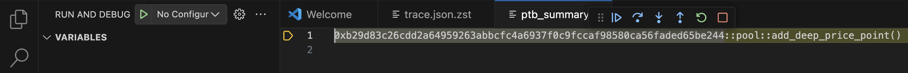
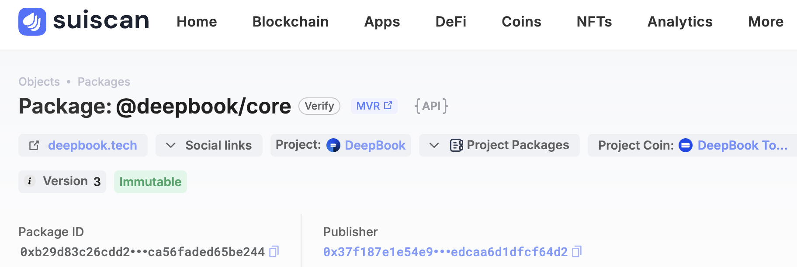
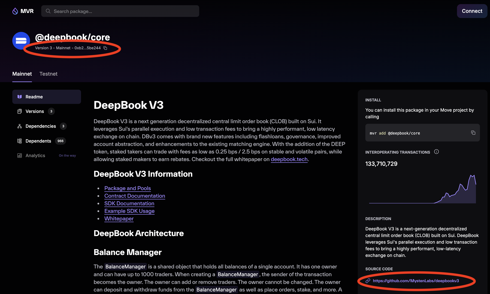

The [Move Trace Debugger](https://marketplace.visualstudio.com/items?itemName=mysten.move-trace-debug) extension for Visual Studio Code provides a familiar [debugging interface](https://code.visualstudio.com/docs/debugtest/debugging) for Move unit tests and on-chain transactions, including [PTB](/concepts/transactions/prog-txn-blocks) debugging support. You can inspect the state of PTB commands, step through code execution, track local variable values, and set line breakpoints for Move code, either in unit tests or in on-chain Move calls.

Debugging is enabled via trace generation: traces can be generated during [unit test execution](#debugging-unit-tests) or during on-chain [transaction replay](#debugging-on-chain-transactions).

## Install

:::info
Use the debugger by installing the [Move extension](./move.mdx), which includes the Move Trace Debugger extension; you do not need to install it separately. The install instructions are included for certain cases where a separate install might be necessary.
:::

The Move Trace Debugger extension is available in the Visual Studio Code Marketplace. Search for `Move Trace Debugger` in the **Extensions** view, or press <kbd>Ctrl</kbd> + <kbd>P</kbd> or <kbd>⌘</kbd> + <kbd>P</kbd> and type `ext install mysten.move-trace-debug`.

Alternatively, run `code --install-extension mysten.move-trace-debug` to install the extension from the command line.

To generate unit execution traces that enable unit test and on-chain transaction debugging, you need the `sui` binary installed with the `tracing` feature flag enabled. The `sui` binaries included in release tarballs, Homebrew, and Chocolatey installations have this feature enabled. See [Install Sui](/guides/developer/getting-started/sui-install) for more information.

## Features

The debugger provides a common set of features for all Move code debugging, whether you're debugging Move unit tests or on-chain Move calls. When debugging on-chain transactions, a Move call is just one of many PTB commands. The debugger supports inspecting not only the Move call itself, but also the state and execution of all remaining native PTB commands.

### Move code debugging features

Currently, the Move Trace Debugger supports forward debugging through execution traces. Reverse debugging is not currently available.

#### Disassembly and source-level debugging

Source code for debugging unit tests is available by definition, and when starting a debug session for unit tests, you will find yourself in the source view.



When debugging an on-chain transaction, the source code for Move calls executed within the transaction is not available by default, as it is not stored on-chain. A debug session will start in the disassembly view where Move code is represented by disassembled bytecode.



This is a lower level representation of the Move code that is still quite useful to improve one's understanding of the Move code behavior and execution flow. It also has one advantage over the source view: it is a much better match to what is recorded in the execution trace. In presence of Move compiler optimizations, disassembly view is the ultimate source of truth. For example, some variables present in the source may no longer be present in the trace, which you can verify in the disassembly view.

You can still provide [source code for on-chain transactions by hand](#source-level-debugging-for-on-chain-transactions) to enable source view. Support for automating source-level debugging for on-chain transactions will be available in the future.

If both source code and disassembled bytecode are available, you can toggle between source view and disassembly view via `Move: Toggle source view` and `Move: Toggle disassembly view` commands from the command palette. You can open these with <kbd>Shift</kbd> + <kbd>⌘</kbd> + <kbd>P</kbd> on macOS, <kbd>Ctrl</kbd> + <kbd>Shift</kbd> + <kbd>P</kbd> on Windows/Linux).


#### Stepping through code execution

Move Trace Debugger supports the following standard [debug actions](https://code.visualstudio.com/docs/debugtest/debugging#_debug-actions):

- Step Over
- Step Into
- Step Out
- Continue
- Restart
- Stop

As you step through the code into other function calls, the resulting call stack view in the left-hand side bar will update.



#### Tracking variable values

Move Trace Debugger supports displaying values of primitive types, Move structs, and references. Note that some of the variables present in the source code can be optimized away by the Move compiler and are not available in the underlying trace. Consequently, their values cannot be tracked by the debugger.


The debugger currently does not support setting watch points on variables.

#### Line breakpoints

Set line breakpoints in your code by placing a cursor on any given line and choosing **Run** -> **Toggle Breakpoint** from the main menu. You can use the **Continue** debug command to advance execution to the next breakpoint.



### PTB debugging features

When debugging PTBs, the debugger first displays a summary of the PTB structure. In the following example, you can see that the PTB being debugged consists of multiple Move calls and several native PTB commands (**Split Coins**, **Merge Coins**, and **Transfer Objects**).



In the PTB summary, you can step into specific commands or step over them, much like stepping into functions and and stepping over them when debugging Move code. Setting breakpoints in the PTB summary view is not currently supported.

Stepping into a Move function starts Move code debugging with all the relevant [features](#move-code-debugging-features) available (value tracking, breakpoints, etc.).

Stepping into a native command allows you to inspect its input and result values.



There is no stepping "through" native commands. Once the state is inspected, you can only step out of it or keep stepping to move to the next command.

## Usage

Use the debugger to debug unit tests and existing on-chain transactions (including [PTB](/concepts/transactions/prog-txn-blocks) debugging support) with the help of the [replay tool](/references/cli/replay).

### Debugging unit tests

Debugging a Move unit test is a two-step process:

**1. Generate execution traces**
   - Open the command palette (<kbd>Shift</kbd> + <kbd>⌘</kbd> + <kbd>P</kbd> on macOS, <kbd>Ctrl</kbd> + <kbd>Shift</kbd> + <kbd>P</kbd> on Windows/Linux).

   - Run the `Move: Trace Move test execution` command.

      <div class="image-scale-50">
      
      </div>

      :::info
        This command uses the `sui` binary under the hood which needs to be [pre-installed](#install). The location of the binary needs to be [discoverable by the Move extension](/references/ide/move#build-test-and-trace).
      :::


   - The extension displays a filter prompt. Either type a filter string to target specific tests or leave the field blank to run all tests and press <kbd>Enter</kbd>.

      <div class="image-scale-50">
      
      </div>

   - Find the generated traces in the `traces` directory.

      :::info
        If trace generation in the Visual Studio Code extension does not work for some reason, you can generate traces by executing tests for your package using additional flags:
        ```bash
        sui move test  --trace-execution --disassemble
        ```
      :::


**2. Start debugging**
   - Open the Move file containing your test.

   - Select **Run** -> **Start Debugging** from the main menu.

      <div class="image-scale-30">
      
      </div>

   - If the file has multiple tests, select the specific test from the dropdown menu.

      <div class="image-scale-50">
      
      </div>


### Debugging on-chain transactions

Debugging an on-chain transaction is a two-step process:

**1. Generate execution trace**

  You need to know a transaction's digest to generate a trace for it. For example, `0x42`.

  ```bash
  sui replay --trace --digest 0x42
  ```

  This command re-executes the transaction locally, generates a trace of its execution, and downloads all data required for debugging this transaction. Data is deposited in a subdirectory of replay tool's output directory (`.replay` by default, but its location is [configurable](../../references/cli/replay.mdx#usage)). This subdirectory is named after the transaction digest.

**2. Start debugging**
   - Open the subdirectory containing the transaction data downloaded for a transaction with the given digest. Open the trace file `trace.json.zst`.

      

   - Select **Run** -> **Start Debugging** from the main menu.

      <div class="image-scale-30">
      
      </div>

      :::info
        The first time you run this command you may be asked to select a debugger type. Select **Move Debugger**.
      :::

## Source-level debugging for on-chain transactions

Data downloaded from the network for debugging a transaction does not contain the source code for Move calls executed throughout the transaction. You can, however, provide the sources along with additional debugging metadata yourself to enable source-level debugging. If you have access to the source code of packages used throughout the transaction, you can build the packages to generate the debugging metadata and make the location of this data visible to the replay tool.

The source code version of each package should be the same version that was used to build the package used in the transaction. Otherwise, a discrepancy between execution trace (generated from on-chain data) and package debugging metadata (generated locally), might result in debugging failures.

For example, consider a situation when an on-chain transaction executes a call to some public function `foo` which then calls some private function `bar`. The package's source code used to generate the debugging metadata still has public function `foo` but `foo` not longer calls `bar`. When attempting to do source-level debugging in such case, if a call to `bar` was part of the execution trace, the debugger would have no source for function `bar` to display when the call is reached during the debugging session.

Using the newest version of a package might still work, particularly for packages whose existing functionality is largely stabilized and its source code rarely changes, such as Sui framework package. Below are the instructions on how to handle this simplified case, followed by instructions on how to locate precise versions of packages.

Consider the following: a mainnet transaction and with the digest `95oR1YipjSnqd18K4BMshkLgPijypwzARHV988eRhMDs`. Assume that all commands (unless stated otherwise) are executed in some `$ROOT_DIR` (such as your home directory).

Start by tracing execution of this transaction.

```bash
sui replay --digest 95oR1YipjSnqd18K4BMshkLgPijypwzARHV988eRhMDs  --trace
```

When you replay the transaction, the replay tool downloads data for all Move packages used by this transaction. In the case of this example, they reside in the `$ROOT_DIR/.replay/95oR1YipjSnqd18K4BMshkLgPijypwzARHV988eRhMDs` parent directory, with subdirectories named after package IDs:

    ```
    0x0000000000000000000000000000000000000000000000000000000000000001
    0x0000000000000000000000000000000000000000000000000000000000000002
    0x2c8d603bc51326b8c13cef9dd07031a408a48dddb541963357661df5d3204809
    0xb29d83c26cdd2a64959263abbcfc4a6937f0c9fccaf98580ca56faded65be244
    0xdba34672e30cb065b1f93e3ab55318768fd6fef66c15942c9f7cb846e2f900e7
    0xdeeb7a4662eec9f2f3def03fb937a663dddaa2e215b8078a284d026b7946c270
    0xe0917b74a5912e4ad186ac634e29c922ab83903f71af7500969f9411706f9b9a
    0xecf47609d7da919ea98e7fd04f6e0648a0a79b337aaad373fa37aac8febf19c8
    ```

The second directory on the list corresponds to the ID of the Sui framework package. To enable source-level debugging for this package, provide the replay tool with access to its debugging metadata: obtain the package source, build it, and copy the metadata to a specific location (`source` directory) in the Sui framework package subdirectory.

<span id="metadata-generation">**Metadata generation**</span>


   - Clone the repository, unless you already have the Sui source code repository available.

        ```bash
        git clone https://github.com/MystenLabs/sui.git
        ```

   - Build Sui framework package source code.

        ```bash
        cd sui/crates/sui-framework/packages/sui-framework; sui move build
        ```

   - Copy the debugging metadata to the right location.

        ```bash
        cp -r $ROOT_DIR/sui/crates/sui-framework/packages/sui-framework/build/Sui $ROOT_DIR.replay/95oR1YipjSnqd18K4BMshkLgPijypwzARHV988eRhMDs/0x0000000000000000000000000000000000000000000000000000000000000002/source
        ```

When you start a debug session and reach the Sui framework code during debugging, you will be in the source view rather than disassembly view.

### Locating precise package versions

You should try to enable source-level debugging uniformly for all packages used throughout the transaction (both user-level and system packages), and use precise package versions to ensure a smooth [debugging experience](#precise-versions-for-all-packages). This may not always be possible, but in such case, you can still locate [precise versions of system packages](#precise-versions-for-system-packages) to enable limited source-level debugging.

Start debugging the transaction to collect some more information about Move code executed in the transaction.



The PTB summary reveals that this transaction consists of only one Move call to the function `add_deep_price_point`, in module `pool`, in user package `0xb29d83c26cdd2a64959263abbcfc4a6937f0c9fccaf98580ca56faded65be244`. Ideally, you want to be able to locate the buildable source code for this package and the correct version of the source code. Then, build debugging metadata for this package, which will automatically include information for all dependent packages, enabling uniform source-level debugging. Barring that, you might want to find the correct version of the source code for system packages to at least enable source-level debugging for Sui framework code.

#### Precise versions for all packages

To locate the correct version of the source code for a user package, utilize a Sui explorer (such as [suiscan](https://suiscan.xyz)) and Sui's Move Package Registry ([MVR](https://www.moveregistry.com/)).

Search for the package in a Sui explorer.

<div class="image-scale-50">

</div>

You can see that the the package in question is `deepbook/core`. Look at the detailed information about this package available in the explorer.

<div class="image-scale-70">

</div>

You can see that the package description in the explorer includes an MVR link. When you follow that link, you get to the MVR page containing a different kind of description for this package. The MVR description includes a link to the package's source code repository and information that the ID represents the 3rd version of this package.



While the source code repository for `deepbook/core` contains three different packages, the `pool` module in the PTB is only defined in the `deepbook` package.

Proceed to building a correct version of this package to generate debugging metadata that must accompany the package source code. Assume that all commands are executed in `$ROOT_DIR` unless stated otherwise.

- Clone the repository.

    ```bash
    git clone https://github.com/MystenLabs/deepbookv3.git
    ```

- Go to the `deepbook` package directory.

    ```bash
    cd deepbookv3/packages/deepbook
    ```

- Check the version tags.

    ```bash
    git tag -l
    ```

    In this repository, the tags indeed represent different package versions.

    ```
    v1.0.0
    v2.0.0
    v3.0.0
    ```

    Choose the exact version of the package to build.

    ```bash
    git checkout v3.0.0
    ```

    If tags are not found, you can proceed directly to the next step, but there is no guarantee that the most recent version of source code in the repository corresponds to the version of the package on-chain, which may affect debugging capabilities.

- Build the package and copying the debugging metadata.

    ```bash
    sui move build
    ```

    This creates a `build` directory with a `deepbook` subdirectory in it containing all the relevant metadata, which you now copy to the right directory.


    ```bash
    cp -r ~/deepbookv3/packages/deepbook/build/deepbook ~/.replay/0xb29d83c26cdd2a64959263abbcfc4a6937f0c9fccaf98580ca56faded65be244/source
    ```


#### Precise versions for system packages

If you cannot locate sources for a user package, you can still locate source code and its correct version for system packages that the user package depends on. This allows you to at least view the source of system packages during the debugging session.

System packages in Sui (the Sui framework package in particular), might only change when the protocol version for Sui changes. These changes [are tracked](https://github.com/MystenLabs/sui/blob/main/crates/sui-framework-snapshot/manifest.json) and include information about protocol version numbers (starting with 3) and corresponding git revisions that represent the exact version of the Sui framework package's source code at a given protocol version. This allows you to locate which protocol version was in effect when the user package was published on-chain.

Run the following query against Mainnet's GraphQL [endpoint](https://graphql.mainnet.sui.io/graphql) where the `address` parameter is the ID of the user package (`0xb29d83c26cdd2a64959263abbcfc4a6937f0c9fccaf98580ca56faded65be244` in this example).

```
{
    object(address: "0xb29d83c26cdd2a64959263abbcfc4a6937f0c9fccaf98580ca56faded65be244") {
        previousTransaction {
            effects {
                epoch {
                    protocolConfigs {
                        protocolVersion
                    }
                }
            }
        }
    }
}
```

The result of this query looks as follows.

```
{
    "data": {
        "object": {
            "previousTransaction": {
                "effects": {
                    "epoch": {
                        "protocolConfigs": {
                            "protocolVersion": 84
                        }
                    }
                }
            }
        }
    }
}
```

In this example, the user package was published at protocol version 84. The corresponding git revision from the protocol version tracking file is `25804c243d07dd73c0d199e7794383bd855cd436`. Now, you can follow the debugging metadata generation [instructions](#metadata-generation) for Sui framework code. The only difference is that before building the framework package, you need choose the right git revision.

```bash
git checkout 25804c243d07dd73c0d199e7794383bd855cd436
```
