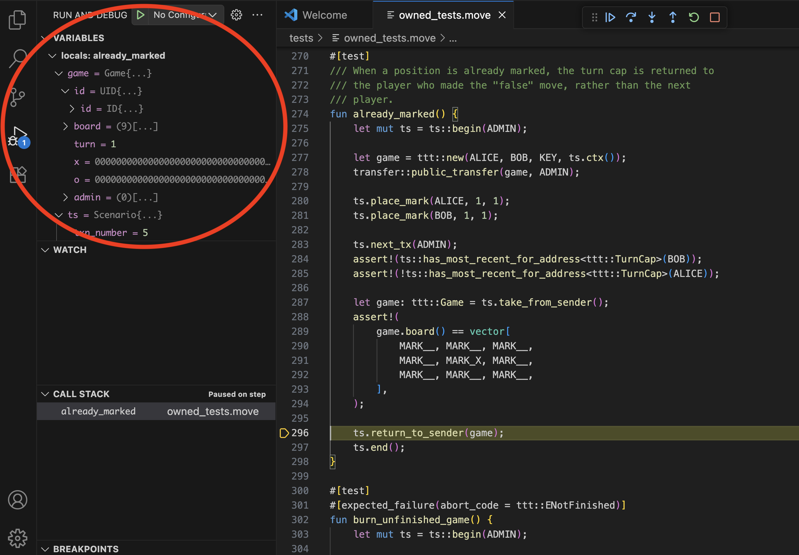

The [Move Trace Debugger](https://marketplace.visualstudio.com/items?itemName=mysten.move-trace-debug) extension for Visual Studio Code provides a familiar debugging interface for Move unit tests. You can step through code execution, track local variable values, and set line breakpoints to understand how your Move code executes.

## Install

:::info 
You must have the [Move extension](./move.mdx) installed to use the debugger. The Move extension includes the Move Trace Debugger so you should not need to install it separately. The install instructions are included for rare cases where an individual install might be necessary.
:::

The Move Trace Debugger extension is available in the Visual Studio Code Marketplace. Search for `Move Trace Debugger` in the **Extensions** view, or press <kbd>Ctrl</kbd> + <kbd>P</kbd> or <kbd>⌘</kbd> + <kbd>P</kbd> and type `ext install mysten.move-trace-debug`.

Alternatively, run `code --install-extension mysten.move-trace-debug` to install the extension from the command line.

## Usage

:::tip[Tracing]

To use the debugger, you must also have the `sui` binary installed with the `tracing` feature flag enabled. The `sui` binaries in release tarballs, Homebrew, and Chocolatey have this feature enabled. See [Install Sui](../../guides/developer/getting-started/sui-install.mdx) for more information, including how to build from source.

:::

Debugging a Move unit test is a two-step process:

**I. Generate execution traces**
   1. Open the command palette (<kbd>Shift</kbd> + <kbd>⌘</kbd> + <kbd>P</kbd> on macOS, <kbd>Ctrl</kbd> + <kbd>Shift</kbd> + <kbd>P</kbd> on Windows/Linux).
   1. Run the `Move: Trace Move test execution` command.

      
   1. The extension displays a filter prompt. Either type a filter string to target specific tests or leave the field blank to run all tests and press <kbd>Enter</kbd>.

      
   1. Find the generated traces in the `traces` directory.

**II. Start debugging**
   1. Open the Move file containing your test.
   1. Select **Run** -> **Start Debugging** from the menu.

      
   1. If the file has multiple tests, select the specific test from the dropdown menu.

      

## Features

Currently, the Move Trace Debugger supports basic forward debugging through test execution traces.

Support for reverse debugging and watch expressions is not currently available.

### Stepping through code execution

Move Trace Debugger supports standard debugging features like step over, step into, step out, continue, and stop. You can step through normal code and Move macros. 

### Tracking variable values  

Move Trace Debugger supports displaying the values of primitive types, Move structs, and references.

At present, the debugger doesn't support setting watch points on variables.

