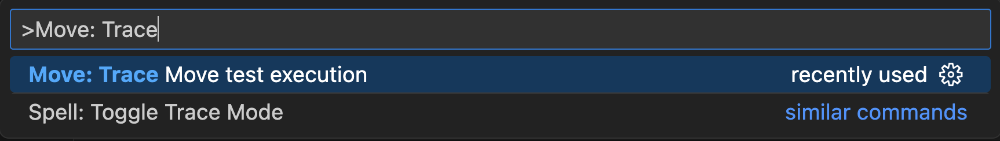
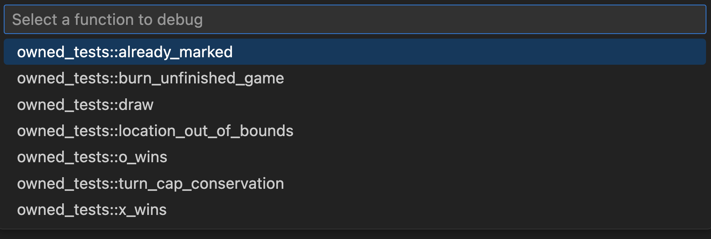
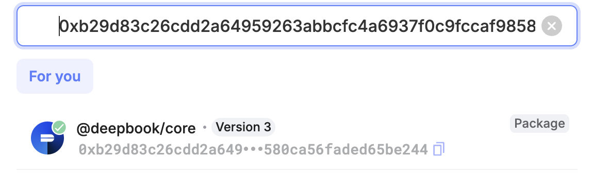

The [Move Trace Debugger](https://marketplace.visualstudio.com/items?itemName=mysten.move-trace-debug) extension for Visual Studio Code provides a familiar [debugging interface](https://code.visualstudio.com/docs/debugtest/debugging) for Move unit tests and on-chain transactions with [PTB](../../concepts/transactions/prog-txn-blocks.mdx) debugging support. You can inspect the state of PTB commands, and for Move code (either in unit tests or in on-chain Move calls), you can step through code execution, track local variable values, and set line breakpoints. For a more detailed list of features look [here](#features). Debugging is enabled via trace generation: traces can be generated during unit test execution (look [here](#debugging-unit-tests) for details) or during on-chain transaction replay (look [here](#debugging-on-chain-transactions) for details).

## Install

:::info
The most convenient path to using the debugger is by installing the [Move extension](./move.mdx), which already includes the Move Trace Debugger extension so you should not need to install it separately. The install instructions are included for rare cases where an individual install might be necessary.
:::

The Move Trace Debugger extension is available in the Visual Studio Code Marketplace. Search for `Move Trace Debugger` in the **Extensions** view, or press <kbd>Ctrl</kbd> + <kbd>P</kbd> or <kbd>⌘</kbd> + <kbd>P</kbd> and type `ext install mysten.move-trace-debug`.

Alternatively, run `code --install-extension mysten.move-trace-debug` to install the extension from the command line.

To generate unit execution traces that enable unit test and on-chain transactions debugging, you must also have the `sui` binary installed with the `tracing` feature flag enabled. The `sui` binaries in release tarballs, Homebrew, and Chocolatey have this feature enabled. See [Install Sui](../../guides/developer/getting-started/sui-install.mdx) for more information, including how to build from source.

## Features

The debugger supports a common set of features when debugging Move code, regardless of whether it is used to debug Move unit tests of on-chain Move calls. In the on-chain debugging scenario, however, a Move call is only one of the many PTB commands, and the debugger also supports inspection of the state of the remaining native PTB commands.

### Move code debugging features

Currently, the Move Trace Debugger supports forward debugging through execution traces (reverse debugging is not currently available).

#### Disassembly and source-level debugging

When attempting to debug unit tests, source code for these tests is available by definition, and when starting a debug session for unit tests, you will find yourself in the source view.


When attempting to debug an on-chain transaction, the source code for Move calls executed throughout this transaction is not available by default (as it is not stored on chain), and a debug session will start in the disassembly view where Move code is represented by disassembled bytecode.


Clearly, this is a much lower level representation of the Move code. While perhaps not as convenient and pleasant to look at as Move source code, it is still quite useful to improve one's understanding of the Move code behavior and execution flow. It also has one advantage over the source view in that it is a much better match to what is recorded in the execution trace, and in presence of Move compiler optimizations, disassembly view is the ultimate source of truth. For example, some variables present in the source may no longer be present in the trace, which you can verify in the disassembly view.

You can still provide source code for on-chain transactions by hand (as described [here](#source-level-debugging-for-on-chain-transactions)) to enable source view. Support for automating source-level debugging for on-chain transactions will be available in the future.

If both source code and disassembled bytecode are available, you can toggle between source view and disassembly view via `Move: Toggle source view` and `Move: Toggle disassembly view` commands from the command palette (which you can open with <kbd>Shift</kbd> + <kbd>⌘</kbd> + <kbd>P</kbd> on macOS, <kbd>Ctrl</kbd> + <kbd>Shift</kbd> + <kbd>P</kbd> on Windows/Linux).

All debugger features described below work in both views, but we will only show examples in source view for brevity and clarity.

#### Stepping through code execution

Move Trace Debugger supports the following standard [debug actions](https://code.visualstudio.com/docs/debugtest/debugging#_debug-actions): Step Over, Step Into, Step Out, Continue, Restart, Stop. As you step through the code into other function calls, the resulting call stack view in left-hand side bar will keep getting updated.


#### Tracking variable values

Move Trace Debugger supports displaying values of primitive types, Move structs, and references. Note that some of the variables present in the source code can be optimized away by the Move compiler and are not available in the underlying trace. Consequently, their values cannot be tracked by the debugger.


 Note that at present, the debugger doesn't support setting watch points on variables.

#### Line breakpoints

You can set line breakpoints in your code placing a cursor on a given line and choosing **Run** -> **Toggle Breakpoint** from the main menu. You can use the Continue debug command to advance execution to the next breakpoint.


### PTB debugging features

When debugging PTBs, the first thing that the debugger displays is a summary of the PTB structure. In the following example, you see that the PTB being debugged consists of multiple Move calls and several native PTB commands (**Split Coins**, **Merge Coins**, and **Transfer Objects**).


In the PTB summary you can step into specific commands or step over them, much like stepping into functions and and stepping over them when debugging Move code.

When you step into a Move function, you are effectively debugging Move code, with all the relevant [features](#move-code-debugging-features) available (value tracking, breakpoints, etc.). Note that setting breakpoints in the PTB summary view is not currently supported.

When you step into a native command, you can inspect its input and result values (if any).


There is no stepping "through" native commands. Once the state is inspected, you can only step out of (or simply keep stepping - the effect will be the same).


## Usage

The debugger can be used to debug unit tests as well as existing on-chain transactions (including [PTB](../../concepts/transactions/prog-txn-blocks.mdx) debugging support) with the help of of the [replay tool](../cli/replay.mdx).

### Debugging unit tests

Debugging a Move unit test is a two-step process:

**I. Generate execution traces**
   1. Open the command palette (<kbd>Shift</kbd> + <kbd>⌘</kbd> + <kbd>P</kbd> on macOS, <kbd>Ctrl</kbd> + <kbd>Shift</kbd> + <kbd>P</kbd> on Windows/Linux).

   1. Run the `Move: Trace Move test execution` command.

      

      :::info
        This command uses the `sui` binary under the hood which needs to be [pre-installed](#install). The location of the binary needs to be discoverable by the Move extension as described [here](./move.mdx#build-test-and-trace).
      :::


   1. The extension displays a filter prompt. Either type a filter string to target specific tests or leave the field blank to run all tests and press <kbd>Enter</kbd>.

      

   1. Find the generated traces in the `traces` directory.

      :::info
        If trace generation in the VSCode extension does not work for some reason, you can also generated traces by executing tests for your package with additional flags:
        ```bash
        sui move test  --trace-execution --disassemble
        ```
      :::


**II. Start debugging**
   1. Open the Move file containing your test.

   1. Select **Run** -> **Start Debugging** from the main menu.

      

   1. If the file has multiple tests, select the specific test from the dropdown menu.

      


### Debugging on-chain transactions

Debugging an on-chain transaction is a two-step process:

**I. Generate execution trace**

  To generate a trace for a given transaction we need to know this transaction's digest (in the example below it's `0x42`).

  ```bash
  sui replay --trace --digest 0x42
  ```

  This command will re-execute the transaction locally, generate a trace of its execution, and download all data required for debugging this transaction from the chain. All this data will be deposited in a subdirectory of replay tool's output directory (`.replay` by default). This subdirectory is named after the transaction digest. You can also change the location of replay tool's output directory (see [here](../../references/cli/replay.mdx#usage) for instructions).

**II. Start debugging**
   1. Open subdirectory containing transaction data downloaded for a transaction with a given digest and open the trace file (`trace.json.zst`)

      

   2. Select **Run** -> **Start Debugging** from the main menu.

      

      :::info
        The first time you run this command you may be asked to select a debugger type, in which case chose `Move Debugger`.
      :::

## Source-level debugging for on-chain transactions

Data downloaded from the chain to facilitate debugging a given transaction does not contain the source code for Move calls executed throughout this transaction. You can, however, provide the sources (along with additional debugging metadata) by yourself to enable source-level debugging. Conceptually, it's quite simple. If you have access to the source code of a package (or packages) used throughout the transaction, you can simply build this package to generate the debugging metadata and make location of this data "visible" to the replay tool.

The challenge here is that the source code version of each such package must be the same exact version that was used to build the package used in a transaction. Otherwise, if hitting a discrepancy between execution trace (generated from on-chain data) and package debugging metadata (generated locally), debugging may not work correctly. For example, consider a situation when on-chain transaction executes a call to some public function `foo` which then call some private function `bar`. Further consider that package's source code used to generate debugging metadata still has public function `foo` but `foo` not longer calls `bar`. When attempting to do source-level debugging in such case, if a call to `bar` was part of the execution trace, debugger would have no source for function `bar` to display when the call is reached during the debugging session.

You can still try to use the newest version of a given package, particularly for packages whose existing functionality is largely stabilized (and its source code rarely changes), such as Sui framework code, and have a high chance of debugging working correctly. Here are the instructions on how to handle this simplified case, followed by instructions on how to locate precise versions of packages (these, however, are mostly recommended for advanced users).

Let's use a concrete transaction to debug as our running example. It's a mainnet transaction and its digest is `95oR1YipjSnqd18K4BMshkLgPijypwzARHV988eRhMDs`. Assume that all commands (unless stated otherwise) are executed in some `$ROOT_DIR` (which you can set, for example, to you your home directory).

Start by tracing execution of this transaction.

```bash
sui replay --digest 95oR1YipjSnqd18K4BMshkLgPijypwzARHV988eRhMDs  --trace
```

When you replay the transaction, the replay tool downloads data for all Move packages used by this transaction. In the case of our running example, they reside in the `$ROOT_DIR/.replay/95oR1YipjSnqd18K4BMshkLgPijypwzARHV988eRhMDs` directory, in subdirectories named after package IDs:

    ```
    0x0000000000000000000000000000000000000000000000000000000000000001
    0x0000000000000000000000000000000000000000000000000000000000000002
    0x2c8d603bc51326b8c13cef9dd07031a408a48dddb541963357661df5d3204809
    0xb29d83c26cdd2a64959263abbcfc4a6937f0c9fccaf98580ca56faded65be244
    0xdba34672e30cb065b1f93e3ab55318768fd6fef66c15942c9f7cb846e2f900e7
    0xdeeb7a4662eec9f2f3def03fb937a663dddaa2e215b8078a284d026b7946c270
    0xe0917b74a5912e4ad186ac634e29c922ab83903f71af7500969f9411706f9b9a
    0xecf47609d7da919ea98e7fd04f6e0648a0a79b337aaad373fa37aac8febf19c8
    ```

Note, that the second directory on the list corresponds to the ID of the Sui framework package. If we want to enable source-level debugging for this package, we need to provide the replay tool with access to its debugging metadata: obtain package source, build it, and copy the metadata to a specific location (`source` directory) in the Sui framework package subdirectory.

<span id="metadata-generation">**Metadata generation**</span>


   1. You may already have Sui source code repository available, in which case free to use it, otherwise clone the repository.

        ```bash
        git clone https://github.com/MystenLabs/sui.git
        ```

   2. Build Sui framework package source code.

        ```bash
        cd sui/crates/sui-framework/packages/sui-framework; sui move build
        ```

   3. Copy debugging metadata to the right location.

        ```bash
        cp -r $ROOT_DIR/sui/crates/sui-framework/packages/sui-framework/build/Sui $ROOT_DIR.replay/95oR1YipjSnqd18K4BMshkLgPijypwzARHV988eRhMDs/0x0000000000000000000000000000000000000000000000000000000000000002/source
        ```

After all this is accomplished, when you start debug session and reach Sui framework code during debugging you will be in the source view rather than disassembly view.

### Locating precise package versions

Ideally, you want to enable source-level debugging uniformly for all packages used throughout the transaction (both user-level and system packages), and use precise package versions to ensure smooth debugging experience (see [here](#precise-versions-for-all-packages) for details). This may not always be possible, but in such case you can still locate precise versions of system packages, such as Sui framework package (see [here](#precise-versions-for-system-packages) for details), to enable limited source-level debugging.

First, let's start debugging the transaction in our running example that was just replayed, to collect some more information about Move code executed in this transaction.


The PTB summary reveals that this transaction consists of only one Move call to function `add_deep_price_point`, in module `pool`, in user package `0xb29d83c26cdd2a64959263abbcfc4a6937f0c9fccaf98580ca56faded65be244`. Ideally, you want to be able to locate (buildable) source code for this package and find out what the correct version of the source code is. If you manage to accomplish this and build debugging metadata for this package, this metadata will automatically include information for all dependent packages enabling uniform source-level debugging. Barring that, you may want to find out what the correct version of the source code for system packages is to enable trouble-free source-level debugging for at least Sui framework code.

#### Precise versions for all packages

To locate the right version of the source code for our user package, utilize a Sui explorer (e.g. [suiscan](https://suiscan.xyz)) and Sui's Move Package Registry ([MVR](https://www.moveregistry.com/)). This method will become more reliable with growing adoption of MVR in the Sui ecosystem.

Search for this package in a Sui explorer.



You can see that the the package in question is `deepbook/core`. Look at the detailed information about this package available in the explorer.


You can see that the package description in the explorer includes an MVR link. When you follow that link, you get to the MVR page containing a different kind of description for this package. The MVR description includes a link to the package's source code repository and information that this ID represent the 3rd version of this package.


While the source code repository for `deepbook/core` contains three different packages, the `pool` module in our PTB is only defined in the `deepbook` package.

You can now proceed to building a correct version of this package to generated debugging metadata that must accompany package source code. It's a modified version of the process described [earlier](#metadata-generation). Assume that all commands are executed in `$ROOT_DIR` unless stated otherwise.

1. Clone the repository

    ```bash
    git clone https://github.com/MystenLabs/deepbookv3.git
    ```

2. Go to the `deepbook` package directory

    ```bash
    cd deepbookv3/packages/deepbook
    ```

3. Developers often tag code released at a given version so check if any tags are available

    ```bash
    git tag -l
    ```

    As it happens, in this repository the tags indeed represent different package versions.

    ```
    v1.0.0
    v2.0.0
    v3.0.0
    ```

    You can then choose the exact version of the package to build.

    ```bash
    git checkout v3.0.0
    ```

    If tags are not found you can proceed directly to the next step but with no guarantee that the most recent version of source code in the repository corresponds to the version of the package on chain (which may affect debugging capabilities).

4. Build the package and copying debugging metadata

    ```bash
    sui move build
    ```

    This will result in creating a `build` directory with a `deepbook` subdirectory in it containing all the relevant metadata, which you now copy to the right directory


    ```bash
    cp -r ~/deepbookv3/packages/deepbook/build/deepbook ~/.replay/0xb29d83c26cdd2a64959263abbcfc4a6937f0c9fccaf98580ca56faded65be244/source
    ```


#### Precise versions for system packages

If you cannot locate sources for the user package (`0xb29d83c26cdd2a64959263abbcfc4a6937f0c9fccaf98580ca56faded65be244` in our running example), you can still locate source code and its correct version for system packages that this user package depends on. This will allow you to at least view the source of system packages, such as Sui framework package, during the debugging session.

System packages in Sui (Sui framework package in particular), may only change at a very specific time, that is at a time when protocol version for Sui changes. These changes are tracked [here](https://github.com/MystenLabs/sui/blob/main/crates/sui-framework-snapshot/manifest.json) - in this file you will find protocol version numbers (starting with 3) and corresponding git revisions that represent the exact version of Sui framework package's source code at a given protocol version. The remaining piece of information to locate is what protocol version was in effect when our user package was published on chain. You can accomplish this by running the following query against the mainnet's GraphQL [endpoint](https://graphql.mainnet.sui.io/graphql) where `address` parameter is the ID of our user package.

```
{
    object(address: "0xb29d83c26cdd2a64959263abbcfc4a6937f0c9fccaf98580ca56faded65be244") {
        previousTransaction {
            effects {
                epoch {
                    protocolConfigs {
                        protocolVersion
                    }
                }
            }
        }
    }
}
```

In the case of our running example, the result of this query looks as follows.

```
{
    "data": {
        "object": {
            "previousTransaction": {
                "effects": {
                    "epoch": {
                        "protocolConfigs": {
                            "protocolVersion": 84
                        }
                    }
                }
            }
        }
    }
}
```

This means, that our user package was published at protocol version 84. The corresponding git revision from the protocol version tracking file is `25804c243d07dd73c0d199e7794383bd855cd436`. You can now follow the debugging metadata generation instructions for Sui framework code described [earlier](#metadata-generation). The only difference is that before building the framework package, you need choose the right git revision.

```bash
git checkout 25804c243d07dd73c0d199e7794383bd855cd436
```
