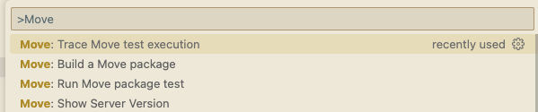
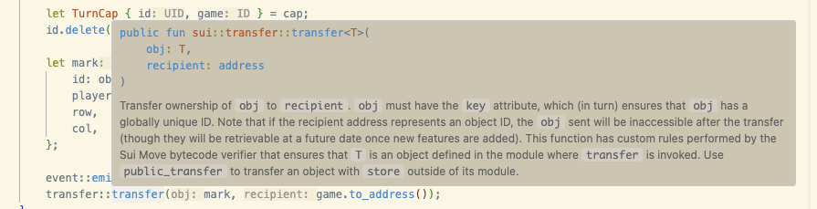
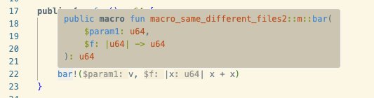
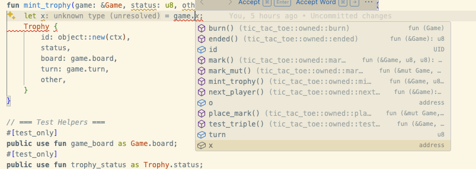
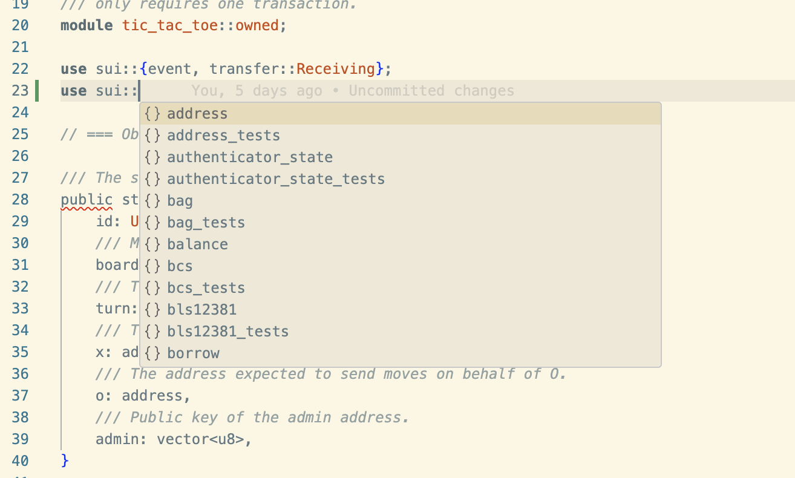
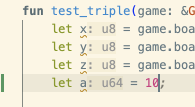

The Move Analyzer extension for Visual Studio Code provides language support features for the Move programming language. It enables syntax highlighting, code completion, and advanced features like definition linking and type checking.

## Install

You can install the Move extension from the Visual Studio Code Marketplace:

1. Open VS Code.
1. Open the **Extensions** view (<kbd>⇧</kbd> + <kbd>⌘</kbd> + <kbd>X</kbd> on macOS, <kbd>Ctrl</kbd> + <kbd>Shift</kbd> + <kbd>X</kbd> on Windows/Linux).
1. Search for `mysten.move`.
1. Click **Install** on the Move extension by Mysten Labs.

Alternative install methods include:

  - Use <kbd>Ctrl</kbd> + <kbd>P</kbd> or <kbd>⌘</kbd> + <kbd>P</kbd> and type `ext install mysten.move`.
  - Use the command line: 

      ```sh
      $ code --install-extension mysten.move
      ```

The following extensions are included in the Move extension install:

- [Move Syntax](https://marketplace.visualstudio.com/items?itemName=damirka.move-syntax)
- [Move Trace Debugger](https://marketplace.visualstudio.com/items?itemName=mysten.move-trace-debug)

### Install move-analyzer

The Move extension attempts to install the appropriate `move-analyzer` binary for your platform. If this doesn't work, or you prefer to install it manually, build it with Cargo:

```sh
$ cargo install --git https://github.com/MystenLabs/sui.git sui-move-lsp
```

By default, the Move extension expects to find the `move-analyzer` binary in `~/.sui/bin`. You can either copy the binary to this location, or configure the extension to use a different path. 

## Features

The Move extension supports most Language Server Protocol features, as well as basic commands for building, testing, and tracing Move code.

### Build, test, and trace

The Move extension installs command palette commands for building, testing, and tracing Move code. 



These commands find the `Move.toml` file for the open Move source file and open a terminal to run the appropriate `sui move` command.

To generate a trace, you must have a trace-capable `sui` binary. See [Debugger](./debugger.mdx) for more information.

### Syntax highlighting

The [Move Syntax](https://marketplace.visualstudio.com/items?itemName=damirka.move-syntax) extension provides syntax highlighting.

### Hover information

Hovering over identifiers shows type information, struct fields and attributes, and docstrings (if any) for the identifier. This works for all Move symbols including macros. 

- Hover over structs to see structure and definition.

  

- Hover over functions for details and definition.

  

- Hover over macros for their functionality.

  

### Code completion

The Move extension autocompletes upon a dot operator, displaying the available methods and fields for the type.



The Move extension also autocompletes after a `::` operator.



Finally, the Move extension provides "inlay hints," where the plugin automatically inserts the correct type after a variable declaration, unpack, function parameters, and other places.



### Navigation

The Move extension supports `go-to-definition` navigation for all Move symbols including types, functions, and macros, as long as the type was present when `move-analyzer` last built the file. 

The extension also supports `find-references` for functions, macros, constants, and types.