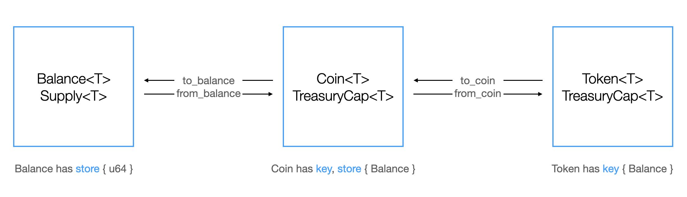

Using the Closed-Loop Token standard, you can limit the applications that can use the token and set up custom policies for transfers, spends, and conversions. The [`sui::token` module](https://github.com/MystenLabs/sui/blob/main/crates/sui-framework/docs/sui-framework/token.md) in the Sui framework defines the standard.

## Background and use cases

The [Coin standard](./coin.mdx) on Sui is an example of an open-loop system - coins are free-flowing, [wrappable](/concepts/object-ownership/wrapped), [freely transferable](/concepts/dynamic-fields/transfers/custom-rules#the-store-ability-and-transfer-rules) and you can store them in any application. The best real world analogy would be cash - hardly regulated and can be freely used and passed.

Some applications, however, require constraining the scope of the token to a specific purpose. For example, some applications might need a token that you can only use for a specific service, or that an authorized account can only use, or a token that you can block certain accounts from using. A real-world analogy would be a bank account - regulated, bank-controlled, and compliant with certain rules and policies.

Specific domains that can benefit from a closed-loop token include:

### Loyalty points

Tokens that you can only use for a specific service, like an airline that wants to grant tokens to frequent flyers to purchase tickets or upgrades. 

The following example demonstrates the creation of a loyalty token that bearers can use to make purchases in a digital gift shop.

```mdx-code-block
<details>
  <summary>
  Toggle example code
  </summary>
```

{@inject: examples/move/token/sources/loyalty.move}

```mdx-code-block
</details>
```

### Regulatory-compliant tokens

Tokens that only a verified user can access, or ones that put a limit on a single operation. Some jurisdictions require certain checks or restrictions on tokens, so you can attach rules to your tokens that satisfy those requirements.

The following example creates a regulated token with rules that regulate access to the token and limits transactions by value.

```mdx-code-block
<details>
  <summary>
  Toggle example code
  </summary>
```

{@inject: examples/move/token/sources/regulated_token.move}

```mdx-code-block
</details>
```


### In-game currency

Tokens in mobile games, like gems or diamonds, that you can grant to players for their actions or to purchase, which they can use in-game only. Tokens of this kind are often not transferrable and minted in predefined amounts to maintain scarcity and game balance.

The following example creates an in-game currency called a GEM, which represents a certain number of SUI. In the example, the user can buy fungible GEMs using SUI, which can then be used as currency within the game.  

```mdx-code-block
<details>
<summary>
Toggle example code
</summary>
```
{@inject: examples/move/token/sources/gems.move}

```mdx-code-block
</details>
```

## Difference with coins



Unlike coins, which have `key + store` abilities and thus support wrapping and public transfers, tokens have only the `key` ability and you cannot wrap them, store them as a dynamic field, or freely transfer them (unless you include a custom policy for that). Consequently, only accounts can own tokens. You can't store them in an application (however, you can spend them, as detailed in the [Spending section](./closed-loop-token/spending.mdx)).

```move
// defined in `sui::coin`
struct Coin<phantom T> has key, store { id: UID, balance: Balance<T> }

// defined in `sui::token`
struct Token<phantom T> has key { id: UID, balance: Balance<T> }
```

## Compliance and rules

You can set up any rules for transfers, spends, and conversions for the tokens you create. You specify these rules per action in the [TokenPolicy](./closed-loop-token/token-policy.mdx). [Rules](./closed-loop-token/rules.mdx) are custom programmable restrictions that you can use to implement any request authorization or validation logic.

For example, a policy can set a limit on a transfer - `X` tokens per operation; or require user verification before spending tokens; or allow spending tokens only on a specific service.

You can reuse rules across different policies and applications; and you can freely combine rules to create complex policies.

## Basics

The Closed-Loop Token standard reuses the `TreasuryCap` defined in the `sui::coin` module and therefore has the same initialization process. The `coin::create_currency` method guarantees the uniqueness of the `TreasuryCap` and forces the creation of a `CoinMetadata` object.

Coin-like methods perform the minting and burning of tokens. Both require the `TreasuryCap`:

- `token::mint` - mint a token
- `token::burn` - burn a token

See [Create a Coin](/guides/developer/sui-101/create-coin.mdx) for more details on how to create a coin.

## Public actions

Tokens have a set of public and protected actions that you can use to manage the token. Public actions are available to everyone and don't require any authorization. They have similar APIs to coins, but operate on the `Token` type:

- `token::keep` - send a token to the transaction sender
- `token::join` - join two tokens
- `token::split` - split a token into two, specify the amount to split
- `token::zero` - create an empty (zero balance) token
- `token::destroy_zero` - destroy a token with zero balance

See [Coin Token Comparison](./closed-loop-token/coin-token-comparison.mdx) for coin and token methods comparison.

## Protected actions

Protected actions are ones that issue an [`ActionRequest`](./closed-loop-token/action-request.mdx) - a hot-potato struct that must be resolved for the transaction to succeed. There are three main ways to resolve an `ActionRequest`, most common of which is via the [`TokenPolicy`](./closed-loop-token/token-policy.mdx).

- `token::transfer` - transfer a token to a specified address
- `token::to_coin` - convert a token to a coin
- `token::from_coin` - convert a coin to a token
- `token::spend` - spend a token on a specified address

The previous methods are included in the base implementation, however it is possible to create `ActionRequest`s for custom actions.

## Token policy and rules

Protected actions are disabled by default but you can enable them in a [`TokenPolicy`](./closed-loop-token/token-policy.mdx). Additionally, you can set custom restrictions called [rules](./closed-loop-token/rules.mdx) that a specific action must satisfy for it to succeed.
