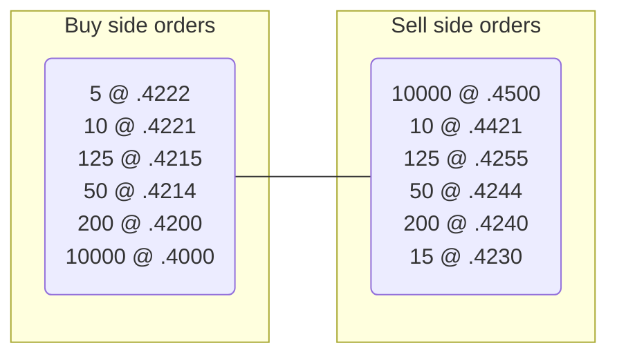

{@include: ../../snippets/deepbook.mdx}

## Pools {#pools}

At the center of DeepBook is a hyper-efficient per-current pair shared-object pool structure. This architecture maximally utilizes Sui's Mysticeti consensus engine to minimize contention and achieve high throughput.

For each base and quote asset trading pair, a globally shared pool is created to bookkeep open orders on the order book and handle placement, cancellation, and settlement of orders. Under this architecture, you can parallelize transactions involving different trading pairs to maximize throughput.

```move
struct Pool<phantom BaseAsset, phantom QuoteAsset> has key {
    // The key to the following crit-bit tree are order prices.
    id: UID,
    // All open bid orders.
    bids: CritbitTree<TickLevel>,
    // All open ask orders.
    asks: CritbitTree<TickLevel>,
    // Order id of the next bid order, starting from 0.
    next_bid_order_id: u64,
    // Order id of the next ask order, starting from 1<<63.
    next_ask_order_id: u64,
    // Map from order id to price level for fast retrieval of orders upon canceling of orders.
    usr_open_orders: Table<ID, Table<u64, Order>>,
    // taker_fee_rate should be strictly greater than maker_rebate_rate.
    // The difference between taker_fee_rate and maker_rabate_rate goes to the protocol.
    // 10^9 scaling
    taker_fee_rate: u64,
    // 10^9 scaling
    maker_rebate_rate: u64,
    tick_size: u64,
    lot_size: u64,
    // other pool info
    base_custodian: Custodian<BaseAsset>,
    quote_custodian: Custodian<QuoteAsset>,
}
```

### Order book structure {#order-book-structure}

DeepBook adopts a hyper-efficient approach to store orders. Each pool stores the unfilled maker orders. Taker orders are filled instantaneously within the same transaction the order is submitted. Bid and ask orders are stored separately, each with a two-level nested crit-bit tree. The first level crit-bit tree is ordered using the price of the maker order, and the second level crit-bit tree is ordered using the order ID of the maker order.


<small>Orders are prioritized by value</small>

### Placing orders {#placing-orders}

DeepBook supports the placement of market orders and limit orders. DeepBook also supports a few configurations of limit orders, which are covered in the API section. When users submit a market order, it is matched against the existing maker orders on the order book instantaneously in the same transaction upon submission of the market order. When users submit a limit order, the limit order is first matched against the existing maker orders as a taker order. If the order cannot be fully filled, the remaining quantity can either be injected as a maker order or be dropped, depending on the configuration of the limit order. See the API section for further details.

```move
struct Order has store, drop {
    // For each pool, order id is incremental and unique for each opening order.
    // Orders that are submitted earlier have lower order ids.
    // 64 bits are sufficient for order ids, whereas 32 bits are not.
    // Assuming a maximum TPS of 100K/s of Sui chain, it would take (1<<63) / 100000 / 3600 / 24 / 365 = 2924712 years to reach the full capacity.
    // The highest bit of the order id denotes the order type, 0 for bid, 1 for ask.
    order_id: u64,
    // Only used for limit orders.
    price: u64,
    quantity: u64,
    is_bid: bool,
    // Order can only be canceled by the owner.
    owner: ID,
    // Expiration timestamp in ms.
    expire_timestamp: u64,
}
```

## Orders {#orders}

### Order matching {#order-matching}

Order matching occurs when a taker order is submitted to the Central Limit Order Book (CLOB) without a centralized entity or crank involvement. Taker orders are matched against the existing maker orders in the CLOB in the same transaction the taker order is submitted.

### Order tracking {#order-tracking}

DeepBook supports efficient tracking of maker orders. Each unfilled maker order is associated with a unique u64 order id, and users can query the order status using the order id together with the Sui RPC call. Users can also subscribe to the event stream emitted by DeepBook related to changes in order status. DeepBook currently supports the following events, `OrderPlaced`, `OrderFilled`, and `OrderCanceled`.

```move
/// Emitted when a maker order is injected into the order book.
struct OrderPlaced<phantom BaseAsset, phantom QuoteAsset> has copy, store, drop {
    order_id: u64,
    is_bid: bool,
    owner: ID,
    base_asset_quantity_placed: u64,
    price: u64
}

/// Emitted when a maker order is canceled.
struct OrderCanceled<phantom BaseAsset, phantom QuoteAsset> has copy, store, drop {
    order_id: u64,
    is_bid: bool,
    owner: ID,
    base_asset_quantity_canceled: u64,
    price: u64
}

/// Emitted only when a maker order is filled.
struct OrderFilled<phantom BaseAsset, phantom QuoteAsset> has copy, store, drop {
    order_id: u64,
    is_bid: bool,
    owner: ID,
    total_quantity: u64,
    base_asset_quantity_filled: u64,
    base_asset_quantity_remaining: u64,
    price: u64
}
```
