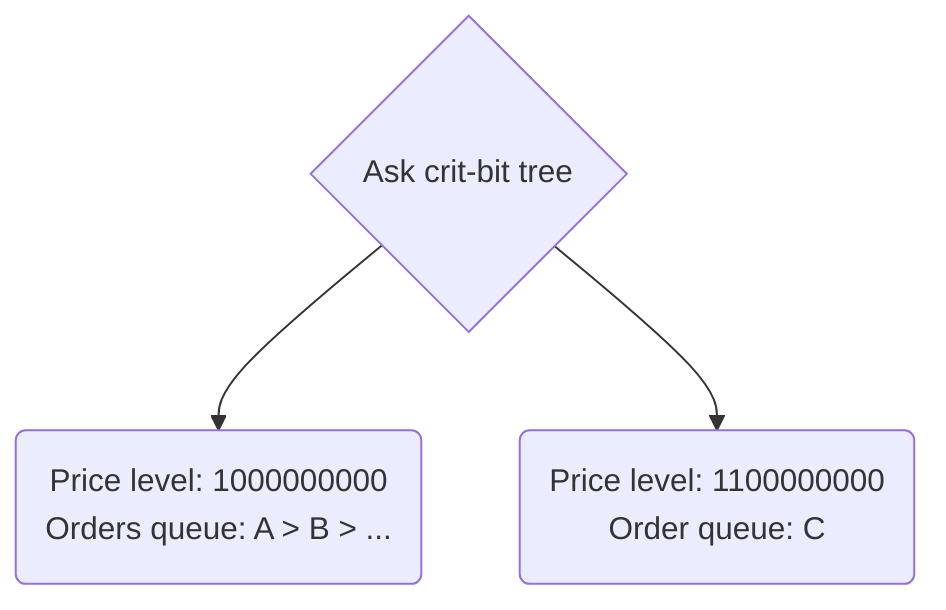

{@include: ../../snippets/deepbook.mdx}

At the center of DeepBook is a hyper-efficient per-current pair shared-object `Pool` structure. This architecture maximally utilizes Sui's Mysticeti consensus engine to minimize contention and achieve high throughput.

For each base and quote asset trading pair, a globally shared `Pool` is created to bookkeep open orders on the order book and handle placement, cancellation, and settlement of orders. Under this architecture, transactions involving different trading pairs can be easily parallelized to maximize throughput.

DeepBook uses a critical bit (crit-bit) tree structure to process orders. Each left and right node is based on the critical bit of the price. Inside each of the nodes is a list of orders placed with a hierarchy based on the time each occurred.



```move
struct Pool<phantom BaseAsset, phantom QuoteAsset> has key {
    // The key to the following crit-bit tree are order prices.
    id: UID,
    // All open bid orders.
    bids: CritbitTree<TickLevel>,
    // All open ask orders.
    asks: CritbitTree<TickLevel>,
    // Order id of the next bid order, starting from 0.
    next_bid_order_id: u64,
    // Order id of the next ask order, starting from 1<<63.
    next_ask_order_id: u64,
    // Map from order id to price level for fast retrieval of orders upon canceling of orders.
    usr_open_orders: Table<ID, Table<u64, Order>>,
    // taker_fee_rate should be strictly greater than maker_rebate_rate.
    // The difference between taker_fee_rate and maker_rabate_rate goes to the protocol.
    // 10^9 scaling
    taker_fee_rate: u64,
    // 10^9 scaling
    maker_rebate_rate: u64,
    tick_size: u64,
    lot_size: u64,
    // other pool info
    base_custodian: Custodian<BaseAsset>,
    quote_custodian: Custodian<QuoteAsset>,
}
```
