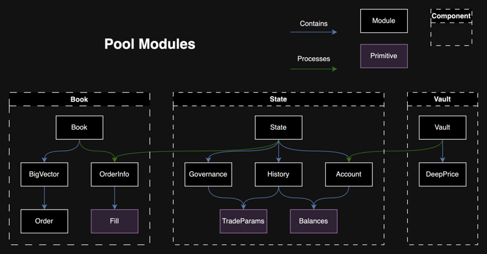

{@include: ../../snippets/deepbook.mdx}

At a high level, the DeepBook design follows the following flow, which revolves around three shared objects:
  - `Pool`: A shared object that represents one market and is responsible for managing its order book, users, stakes, and so on. See the [Pool shared object](#pool) section to learn more.
  - `PoolRegistry`: Used only during pool creation, it makes sure that duplicate pools are not created and maintains package versioning.
  - `BalanceManager`: Used to source a user's funds when placing orders. A single `BalanceManager` can be used between all pools. See [BalanceManager](./balance-manager.mdx) to learn more.

## Pool shared object {#pool}

All public facing functions take in the `Pool` shared object as a mutable or immutable reference. `Pool` is made up of three distinct components: 
  - [`Book`](#book)
  - [`State`](#state)
  - [`Vault`](#vault)

Logic is isolated between components and each component builds on top of the previous one. By maintaining a book, then state, then vault relationship, DeepBook can provide data availability guarantees, improve code readability, and help make maintaining and upgrading the protocol easier. 

### Book

This component is made up of the main `Book` module along with `Fill`, `OrderInfo`, and `Order` modules. The `Book` struct maintains two `BigVector<Order>` objects for bids and asks, as well as some metadata. It is responsible for storing, matching, modifying, and removing `Orders`.

When placing an order, an `OrderInfo` is first created. If applicable, it is first matched against existing maker orders, accumulating `Fill`s in the process. Any remaining quantity will be used to create an `Order` object and injected into the book. By the end of book processing, the `OrderInfo` object has enough information to update all relevant users and the overall state.

### State

`State` stores `Governance`, `History`, and `Account`. It processes all requests, updating at least one of these stored structs.

#### Governance

The `Governance` module stores data related to the pool's trading params. These parameters are the taker fee, maker fee, and the stake required. Stake required represents the amount of DEEP tokens that a user must have staked in this specific pool to be eligible for taker and maker incentives.

Every epoch, users with non zero stake can submit a proposal to change these parameters. The proposed fees are bounded.

| min_value (bps) | max_value (bps) | Pool type | Taker or maker |
| --- | --- | --- | --- |
| 5 | 10 | Volatile | Taker |
| 2 | 5 | Volatile | Maker |
| 0.5 | 1 | Stable | Taker |
| 0.2 | 0.5 | Stable | Maker |
| 0 | 0 | Whitelisted | Taker and maker |

Users can also vote on live proposals. When a proposal exceeds the quorum, the new trade parameters are queued to go live from the following epoch and onwards.  Proposals and votes are reset every epoch. Users can start submitting and voting on proposals the epoch following their stake. Quorum is equivalent to half of the total voting power. A user's voting power is calculated with the following formula where ${V}$ is the voting power, ${S}$ is the amount staked, and ${V_c}$ is the voting power cutoff. ${V_c}$ is currently set to 100,000 DEEP.

$\LARGE V=\min\lparen S,V_c \rparen + \max\lparen \sqrt{S} - \sqrt{V_c} ,0 \rparen$

The following diagram helps visualize the governance lifecycle.

#### History

The `History` module stores aggregated volumes, trading params, fees collected and fees to burn for the current epoch and previous epochs. During order processing, fills are used to calculate and update the total volume. Additionally, if the maker of the trade has enough stake, the total staked volume is also updated.

The first operation of every epoch will trigger an update, moving the current epoch data into historic data, and resetting the current epoch data.

User rebate calculations are done in this module. During every epoch, a maker is eligible for rebates as long as their DEEP staked is over the stake required and have contributed in maker volume. The following formula is used to calculate maker fees, quoted from the [Whitepaper: DeepBook Token](/doc/deepbook.pdf) document. Details on maker incentives can be found in section 2.2 of the whitepaper.

<blockquote cite="/doc/deepbook.pdf">

The computation of incentives – which happens after an epoch ends and is only given to makers
who have staked the required number of DEEP tokens in advance – is calculated in Equation (3) for
a given maker ${i}$. Equation (3) introduces several new variables. First, ${M}$ refers to the set of makers
who stake a sufficient number of DEEP tokens, and $\bar{M}$ refers to the set of makers who do not fulfill
this condition. Second, ${F}$ refers to total fees (collected both from takers and the maker) that a
maker’s volume has generated in a given epoch. Third, ${L}$ refers to the total liquidity provided by
a maker – and specifically the liquidity traded, not just the liquidity quoted. Finally, the critical
point ${p}$ is the “phaseout” point, at which – if total liquidity provided by other makers’ crosses this
point – incentives are zero for the maker in that epoch. This point ${p}$ is constant for all makers in
a pool and epoch.

$\LARGE \textsf {Incentives }  \textsf {for } \textsf {Maker } i = \max\Bigg\lbrack F_i\Bigg\lparen 1 + \large\cfrac{\sum_{j \in \bar{M}} F_j} {\sum_{j \in M} F_j} \Bigg\rparen\Bigg\lparen \LARGE 1 - \large\cfrac{\sum_{j \in M \cup \bar{M}} L_j - L_i}{p}\Bigg\rparen \LARGE ,0 \Bigg\rbrack$ (3)

</blockquote>

In essence, if the total volume during an epoch is greater than the median volume from the last 28 days, then there are no rebates. The lower the volume compared to the median, the more rebates are available. The maximum amount of rebates for an epoch is equivalent to the total amount of DEEP collected during that epoch. Remaining DEEP is burned.

#### Account

`Account` represents a single user and their relevant data. Everything related to volumes, stake, voted proposal, unclaimed rebates, and balances to be transferred. There is a one to one relationship between a `BalanceManager` and an `Account`.

Every epoch, the first action that a user performs will update their account, triggering a calculation of any potential rebates from the previous epoch, as well as resetting their volumes for the current epoch. Any new stakes from the previous epoch become active.

Each account has settled and owed balances. Settled balances are what the pool owes to the user, and owed balances are what the user owes to the pool. For example, when placing an order, the user's owed balances increase, representing the funds that the user has to pay to place that order. Then, if a maker order is taken by another user, the maker's settled balances increase, representing the funds that the maker is owed.

### Vault

Every transaction that a user performs on DeepBook resets their settled and owed balances. The vault then processes these balances for the user, deducting or adding to funds to their `BalanceManager`.

The vault also stores the `DeepPrice` struct. This object holds up to 100 data points representing the conversion rate between the pool's base or quote asset and DEEP. These data points are sourced from a whitelisted pool, DEEP/USDC or DEEP/SUI. This conversion rate is used to determine the quantity of DEEP tokens required to pay for trading fees.

### BigVector

`BigVector` is an arbitrary sized vector-like data structure, implemented using an on-chain B+ Tree to support almost constant time (log base max_fan_out) random access, insertion and removal.

Iteration is supported by exposing access to leaf nodes (slices). Finding the initial slice can be done in almost constant time, and subsequently finding the previous or next slice can also be done in constant time.

Nodes in the B+ Tree are stored as individual dynamic fields hanging off the `BigVector`.

## Place limit order flow

The following diagram of the lifecycle of an order placement action helps visualize the book, then state, then vault flow.

### Pool

In the `Pool` module, `place_order_int` is called with the user's input parameters. In this function, four things happen in order: 
  1. An `OrderInfo` is created.
  1. The `Book` function `create_order` is called.
  1. The `State` function `process_create` is called.
  1. The `Vault` function `settle_balance_manager` is called. 

### Book

The order creation within the book involves three primary tasks:
  - Validate inputs.
  - Match against existing orders.
  - Inject any remaining quantity into the order book as a limit order.

Validation of inputs ensures that quantity, price, timestamp, and order type are within expected ranges.

To match an `OrderInfo` against the book, the list of `Order`s is iterated in the opposite side of the book. If there is an overlap in price and the existing maker order has not expired, then DeepBook matches their quantities and generates a `Fill`. DeepBook appends that fill to the `OrderInfo` fills, to use later in state. DeepBook updates the existing maker order quantities and status during each match, and removes them from the book if they are completely filled or expired.

Finally, if the `OrderInfo` object has any remaining quantity, DeepBook converts it into a compact `Order` object and injects it into the order book. `Order` has the minimum amount of data necessary for matching, while `OrderInfo` has the maximum amount of data for general processing.

Regardless of direction or order type, all DeepBook matching is processed in a single function.

### State

The `process_create` function in `State` handles the processing of an order creation event within the pool's state: calculating the transaction amounts and fees for the order, and updating the account volumes accordingly. 

First, the function processes the list of fills from the `OrderInfo` object, updating volumes tracked and settling funds for the makers involved. Next, the function retrieves the account's total trading volume and active stake. It calculates the taker's fee based on the user's account stake and volume in DEEP tokens, while the maker fee is retrieved from the governance trade parameters. To receive discounted taker fees, the account must have more than the minimum stake for the pool, and the trading volume in DEEP tokens must exceed the same threshold. If any quantity remains in the `OrderInfo` object, it is added to the account's list of orders as an `Order` and is already created in `Book`. 

Finally, the function calculates the partial taker fills and maker order quantities, if there are any, with consideration for the taker and maker fees. It adds these to the previously settled and owed balances from the account. Trade history is updated with the total fees collected from the order and two tuples are returned to `Pool`, settled and owed balances, in (base, quote, DEEP) format, ensuring the correct assets are transferred in `Vault`.

### Vault

The `settle_balance_manager` function in `Vault` is responsible for managing the transfer of any settled and owed amounts for the `BalanceManager`. 

First, the function validates that a trader is authorized to use the `BalanceManager`. 

Then, for each asset type the process compares `balances_out` against `balances_in`. If the `balances_out` total exceeds `balances_in`, the function splits the difference from the vault's balance and deposits it into the `BalanceManager`. Conversely, if the `balances_in` total exceeds `balances_out`, the function withdraws the difference from the `BalanceManager` and joins it to the vault's balance. 

This process is repeated for base, quote, and DEEP asset balances, ensuring all asset balances are accurately reflected and settled between the vault and the `BalanceManager`.