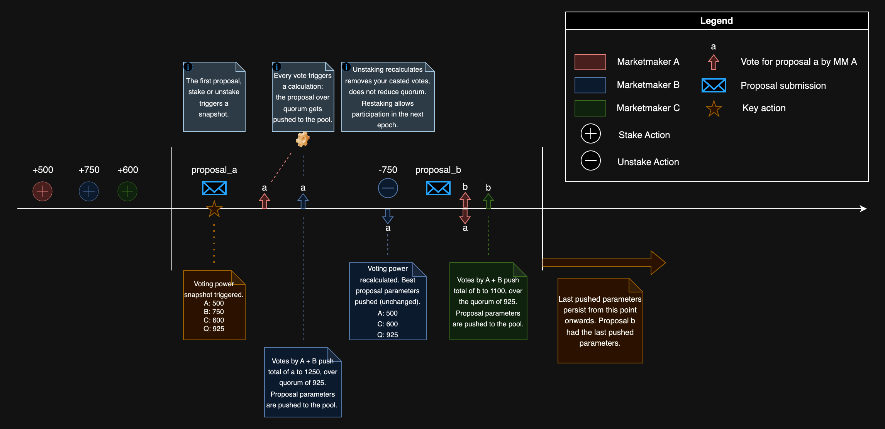

{@include: ../../snippets/deepbook.mdx}

DeepBook's novel approach to governance allows users to update a single pool's three parameters: 
  - taker fee rate
  - maker fee rate
  - stake required

Stake required is the amount of DEEP tokens a user must have staked in the pool to take advantage of taker and maker incentives. Each individual DeepBook pool has independent governance, and governance can be conducted every epoch. See [Design](./design.mdx#governance) to learn more about governance.

## API

`Pool` exposes the following endpoints for staking and governance.

### Stake

DEEP tokens must be available in the `balance_manager` for staking. A user's stake becomes active in the following epoch. If the user's active stake is greater than the stake required, the user can get reduced taker fees and can accumulate trading fee rebates during that epoch.

{@inject: github:MystenLabs/deepbookv3/packages/deepbook/sources/pool.move#fun=stake noComments}

### Unstake

All of the user's active and inactive stake are removed and added back into the `BalanceManager`. Any casted votes are removed. Maker rebates for the epoch are forfeited, and any reduced taker fees for the remaining epoch are disabled.

The `balance_manager` must have enough staked DEEP tokens. The `balance_manager` data is updated with the unstaked amount. Balance is transferred to the `balance_manager` immediately.

{@inject: github:MystenLabs/deepbookv3/packages/deepbook/sources/pool.move#fun=unstake noComments}

### Submit proposal

Users with a non zero active stake can submit proposals. One proposal per user. The user automatically votes for the proposal they submit.

Submit a proposal to change the taker fee, maker fee, and stake required. The `balance_manager` must have enough staked DEEP tokens to participate. Each `balance_manager` can only submit one proposal per epoch. If the maximum proposal is reached, the proposal with the lowest vote is removed. If the `balance_manager` has less voting power than the lowest voted proposal, the proposal is not added.

{@inject: github:MystenLabs/deepbookv3/packages/deepbook/sources/pool.move#fun=submit_proposal noComments}

### Vote

Users with non-zero voting power can vote on a proposal. All voting power is used on a single proposal. If the user has voted on a different proposal during this epoch, then that vote is removed and recasted into the new proposal. The `balance_manager` must have enough staked DEEP tokens to participate.

{@inject: github:MystenLabs/deepbookv3/packages/deepbook/sources/pool.move#fun=vote noComments}

### Claim rebates

Use `claim_rebates` to claim the rewards for the `balance_manager`. The `balance_manager` must have rewards to claim. The `balance_manager` data is updated with the claimed rewards.

{@inject: github:MystenLabs/deepbookv3/packages/deepbook/sources/pool.move#fun=claim_rebates noComments}
