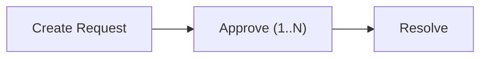

On Sui, any object with the `store` ability can be freely transferred by its owner. `Balance` and `Coin` both have `store`, meaning if you hold them, you can send them anywhere on the network with no restrictions.

This is great for general-purpose assets, but a problem for regulated assets that need transfer controls, compliance checks, or issuer oversight.

The Permissioned Asset Standard (PAS) solves this by proxying asset ownership through **Chests**, objects that hold assets and enforce a closed-loop system where every movement is gated by programmable approval logic.

## How it works

For each wallet address (or object ID), PAS creates a 1:1 derived Chest. A Chest is a shared object that holds assets on behalf of that address. The owner can prove ownership through an `Auth` proof, but cannot freely transfer the assets. In this way, you create a proxy of ownership where the assets follow the constraints of PAS modules, and sequentially, the rules that an issuer has defined across one or more packages through approval witnesses.

Every time funds move, they go through hot potato requests that must collect a predefined set of approval stamps (witness structs) before they can resolve within the transaction. Hot potato requests have no `drop` or `store` ability, so the transaction aborts if it is not resolved.

```
Without PAS:  Wallet → owns T → can transfer freely
With PAS:     Wallet → proves ownership via Auth → Chest holds T → Request needed to move
```

Each asset type can have its own policy that defines which witnesses are required to approve each action. This means different assets can adhere to completely different rules. One might require a single compliance stamp, another might need approvals from multiple independent contracts.

The result is that assets are held in a closed system where every movement is gated by programmable, composable approval logic that the issuer defines at the policy level.

There is no way to transfer a managed `Balance<C>` out of the system without going through a request that collects the required approvals.

For Currency, this is enforced at the Move type level:

- `Balance<C>` is stored inside Chests using Sui's `balance::send_funds` and `balance::redeem_funds` (derived object storage).

- The only way to move funds is through request hot potatoes that must be resolved in the same transaction.

- Resolution requires matching the approval set defined in the `Policy<Balance<C>>`.

## Object model

```
Namespace (shared, singleton)
├── Chest (@0xAlice)      ← derived from (namespace_id, ChestKey(alice_addr))
├── Chest (@0xBob)        ← derived from (namespace_id, ChestKey(bob_addr))
├── Policy<Balance<C>>    ← derived from (namespace_id, PolicyKey<Balance<C>>)
│   └── PolicyCap<Balance<C>>  ← derived from (policy_id, PolicyCapKey)
└── Templates             ← derived from (namespace_id, TemplateKey)
```

All objects use derived addresses (`sui::derived_object`), making them deterministic and queryable without on-chain lookups.

### Namespace

The Namespace is the root of the system. Its responsibilities include:

- Deriving addresses for Chests, policies, and templates

- Holding the `Versioning` state for emergency version blocking

- Keeping the `UpgradeCap` UID to gate admin operations (version blocking, setup)

### Chest

Chests are shared objects derived from the Namespace's UID and the owner's address.

| **Property** | **Detail** |
|---|---|
| **Creation** | Permissionless. Anyone can create a Chest for any address. |
| **Ownership** | Wallet address (`ctx.sender()`) or Object (`UID`). |
| **Storage** | Holds `Balance<C>` as object balance, or `T` directly as objects on the Chest's UID. |
| **Derivation** | `derived_object::claim(namespace_uid, ChestKey(owner))`. |

### Policy

A `Policy<T>` defines resolvable actions for a managed asset type `T`:

- **Required approvals:** Per action type (`send_funds`, `unlock_funds`, `clawback_funds`).

- **Clawback flag:** Whether admin clawback is allowed.

- **Versioning:** Synced from Namespace, can block package versions.

For currencies, you create a `Policy<Balance<C>>` specifically through `policy::new_for_currency(&mut namespace, &mut treasury_cap, clawback_allowed)`. This requires `TreasuryCap<C>` as proof of currency ownership.

### PolicyCap

The capability to manage a policy. Derived 1:1 from the policy UID and `PolicyCapKey`. You use it to:

- Set or update required approvals per action.

- Remove action approvals (makes requests for that action unresolvable).

## The request pattern

Every state-changing operation in PAS follows the request hot potato pattern:



1. **Create:** A Chest method wraps data `T` into a `Request<Action<T>>`. The request starts with an empty approval set.

2. **Approve:** Your package calls `request.approve(MyWitness())` to stamp the request with a type-level proof. You can collect multiple approvals from different packages.

3. **Resolve:** A resolution function verifies that the collected approvals exactly match the required approvals in the policy, destroys the request object, and either executes an action or unwraps data.

### Request types

```move
Request<SendFunds<T>>      // Transfer between chests
Request<ClawbackFunds<T>>  // Issuer funds withdrawal
Request<UnlockFunds<T>>    // Withdraw from system as the owner of funds
```

### Approval matching

Approvals are matched by type identity using `TypeName`. The approval set must be exactly equal (same types, same count, same order through `VecSet` insertion) to the policy's required approvals.

:::info

In the current version, each action supports only a single approval witness. Multi-approval support (requiring stamps from multiple independent contracts) is planned for a future release.

:::

For example, a `TransferApproval` witness struct defined in contracts:

```move
// Policy requires: { TransferApproval }
// Request has:     { TransferApproval }  ← resolves
// Request has:     { TransferApproval, ExtraApproval }  ← aborts (count mismatch)
// Request has:     { WrongApproval }  ← aborts (type mismatch)
```

## Balance tracking

PAS uses Sui's [address balances](https://docs.sui.io/guides/developer/address-balances-migration):

### How balances are stored

```
Chest (shared object)
  └── UID
       └── Balance<MyCoin> stored via balance::send_funds(balance, chest_object_address)
```

Balances are **not** stored as fields on the Chest struct. They are stored as object balance on the Chest's `UID`, using `balance::send_funds` to send funds to the Chest's object address and `balance::withdraw_funds_from_object` (through `UID.withdraw_funds_from_object`) to pull them out.

### Balance flow

```
Deposit:  Balance<C> → balance::send_funds(balance, chest_addr) → stored on Chest UID
Withdraw: Chest UID → balance::withdraw_funds_from_object(amount) → Balance<C>
```

Deposits are permissionless (anyone can deposit into any Chest).
Withdrawals are internal (`public(package)`). Only PAS modules can withdraw, and only through Requests.

## Wallet ownership compared to object ownership

Chests can be owned by wallet addresses or objects.

```move
// Wallet-owned: proves ownership via transaction sender
let auth = chest::new_auth(ctx);

// Object-owned: proves ownership via UID reference
let auth = chest::new_auth_as_object(&mut my_object_uid);
```

## Derived object addresses

All PAS objects (Chests, policies) use deterministic derived addresses. You can compute them off-chain:

```move
// Get the chest address for an owner
let chest_addr: address = namespace.chest_address(@0xAlice);

// Get the policy address for a type
let policy_addr: address = namespace.policy_address<Balance<MyCoin>>();
```

## Security model

PAS guarantees the following:

1. **Closed loop:** Managed assets cannot leave the system without going through a request with matching approvals.

2. **Type-safe approvals:** Approval witnesses are checked by `TypeName`. You cannot forge an approval from a different package.

3. **Atomic resolution:** Requests are hot potatoes. They must be resolved in the same transaction or the transaction aborts.

4. **Deterministic addressing:** All objects use derived addresses. No hidden state, no non-deterministic object creation.

PAS does not support or guarantee:

- **Access control:** PAS does not decide who can transfer. That is your contract's job through approval witnesses.

- **Compliance rules:** PAS does not enforce rules. Your contract implements those before calling `request.approve()`.

### Trust boundaries

| **Component** | **Trust level** |
|---|---|
| `PolicyCap<T>` holder | Can change approval requirements for `T`. |
| `TreasuryCap<C>` holder | Can create a policy (one-time) for `Balance<C>`. |
| Chest owner (`Auth`) | Can initiate send or unlock from their Chest. |
| Anyone | Can create Chests, deposit, sync versioning. |
| Approval witness package | Controls who can approve requests. |
| PAS package `UpgradeCap` holder | Can manage the `Versioning` system to coordinate safe package upgrades and migrations. |