[Sagat](https://github.com/MystenLabs/sagat/tree/main) is a full-stack multisig management platform for Sui multisig wallets. It is built using Bun and a TypeScript API for the backend and React for the frontend.

Use the [Sagat web interface](https://sagat.mystenlabs.com/) for [signing transactions](#transaction-signer), [analyzing signatures](#signature-analyzer), creating and managing multisigs, accepting or rejecting multisig invitations, and creating, voting on, and executing proposals. Alternatively, use the [Sagat SDK](https://github.com/MystenLabs/sagat/tree/main/sdk) to execute these tasks programmatically. 

## What is multisig?

[Multisig](/guides/developer/cryptography/multisig) is a type of authentication that requires multiple signatures from different parties before a transaction can be executed. Several addresses can be invited to a multisig group. On Sagat, all invited parties must accept for the multisig to be created.

Each multisig can have a different voting threshold. For example, in a multisig that contains 3 users, only 2 of the users might need to sign the proposed transaction for it to be approved. In other scenarios, all users might be required to sign the transaction, and if one rejects it, the proposed transaction is canceled. Each threshold can configure different weights per user, enabling endless combinations, such as 5 out of 6 with just 2 addresses.

Learn how to use the [TypeScript SDK for multisig](https://sdk.mystenlabs.com/typescript/cryptography/multisig).

## Risks 

Sagat uses Mysten Labs infrastructure for its API layer and frontend layer to store proposal data in order to facilitate multisig management.

The application's frontend is also hosted through Mysten Labs services, which you must rely on to be secure. Always validate a transaction's preview in a secondary location, such as through your wallet, not just from the web interface.

### Mitigate risks by self-hosting Sagat

To take control and use Sagat in a trustless manner, you can self-host it. To do so, first download the GitHub repository:

```
$ git clone https://github.com/MystenLabs/sagat/tree/main
```

Then, build the SDK and spin up the frontend and the API using the command:

```
$ bun run dev
```

:::tip

Building the SDK is optional, as it can accept a custom URL. 

:::

This runs the bun server in dev mode, so all changes made are reflected as you are developing.

## Using the Sagat web interface 

Use Sagat [web interface](https://sagat.mystenlabs.com/) to:

- Create multisigs within the browser. The browser validates each multisig and displays a real-time preview. 

- Accept or reject invitations to participate in multisig compositions.

- Propose new transactions.

- Preview and sign transactions.

- Share transactions through links. 

- Add external proposers outside of the existing multisig group.

- Execute transactions once the voting threshold has been reached.

Each of these tasks can be executed [programmatically](#using-sagat-programmatically) as well.

### Connecting a wallet 

First, connect a wallet, such as [Slush](https://slush.app/) or [Suilet](https://suiet.app/),  to the Sagat web interface:

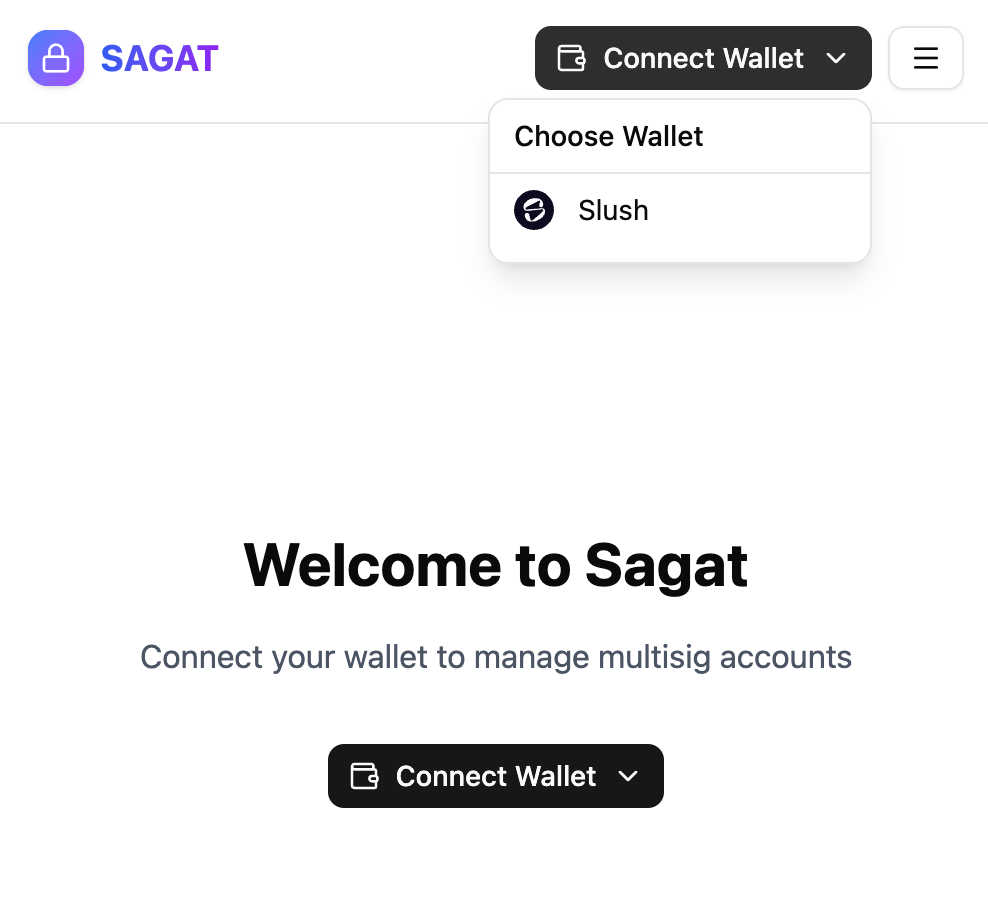

:::info 

Any address that supports ed25519, secp256r1 and secp256k1 are supported. ZkLogin is not supported.

:::

Connecting a wallet to the Sagat web interface registers the wallet's keys with the service. Multisigs can only contain keys that have been registered with Sagat. Keys can also be registered [programmatically](#register-public-keys).

:::tip 

The message "No wallets found. Install a wallet (ex. Slush Wallet) to continue." indicates that you must [install the Slush extension](https://chromewebstore.google.com/detail/slush-%E2%80%94-a-sui-wallet/opcgpfmipidbgpenhmajoajpbobppdil) before continuing. 

:::

Unlock your wallet and approve the initial transaction. The Sagat web interface prompts you to generate a second transaction used to authenticate your wallet, as this helps with confidentiality. 

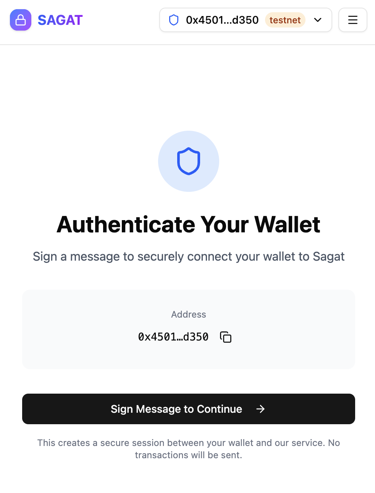

Follow the steps in your wallet to sign and approve the transaction, then verify account ownership.

#### Testnet versus Mainnet

In the account drop-down menu, there is a toggle option for **Test Mode**. Test mode toggles connection to Testnet when turned on and connection to Mainnet when turned off. 

Using Testnet is recommended for testing and debugging, as signing and submitting transactions use Testnet SUI tokens that have no fiat equivalent value. Signing and submitting transactions to Mainnet costs real SUI tokens that have a fiat equivalent value.

### Creating and managing multisig 

A multisig is a group of users who must vote on and approve transactions before execution. To create and execute multisig transactions, you must first create a multisig. 

Click **Create Your First Multisig**

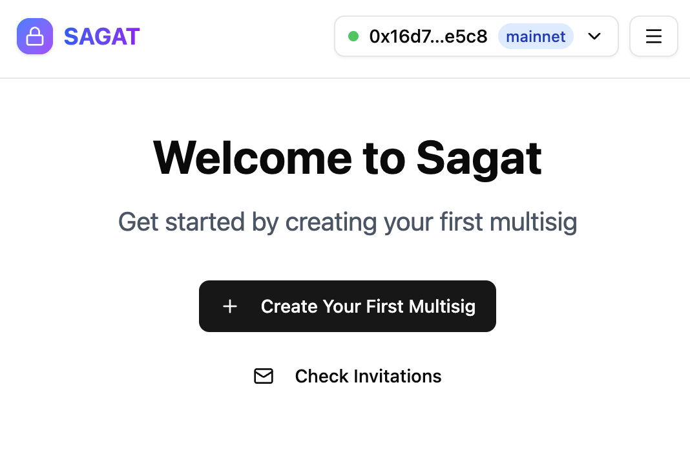

You must add at least 2 addresses to create a multisig and set the approval threshold before the multisig can be created.

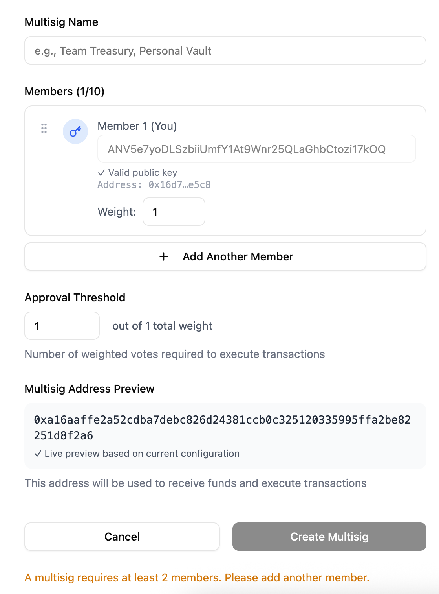

To add another member, click **Add Another Member**, then add their public key and configure their approval weight.

If you do not know a user's public key, you can click the magnifying glass:

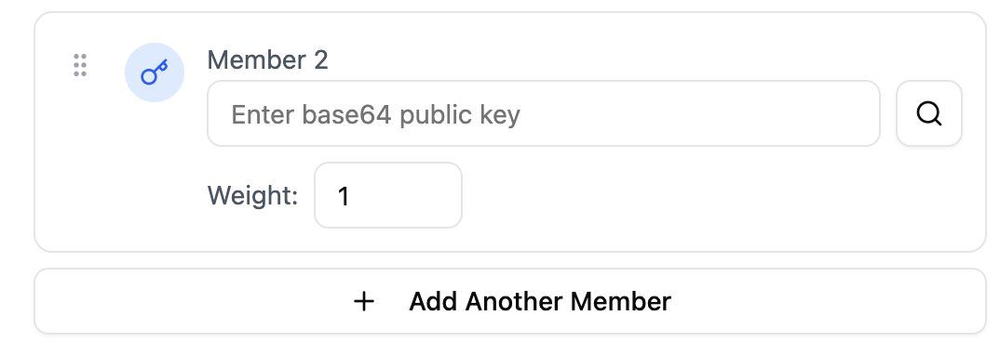

Then enter their Sui address. The address's public key is returned.

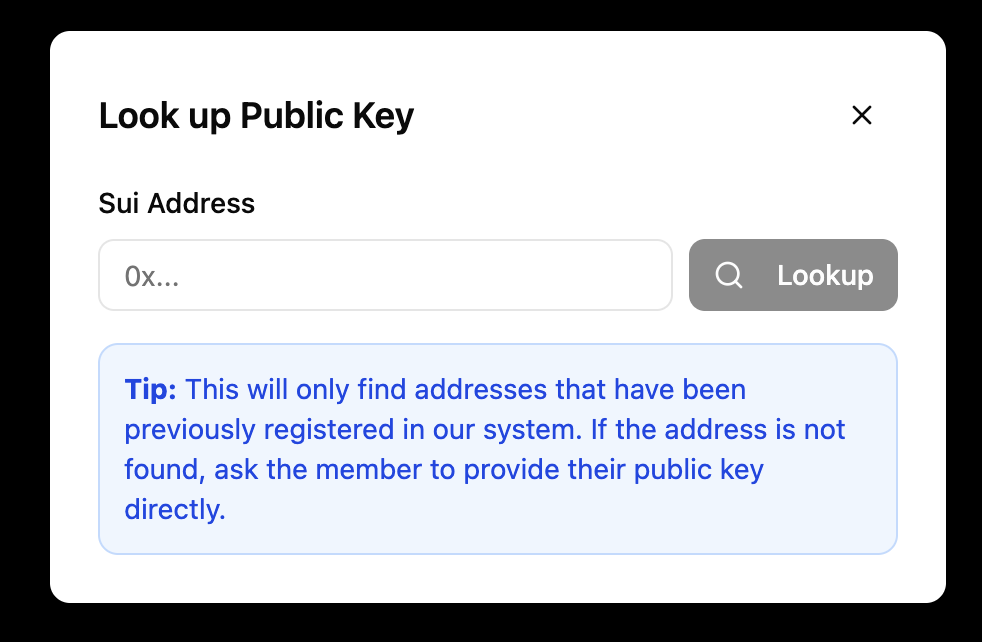

:::caution 

Addresses must be registered with Sagat before they can be invited to a multisig.

:::

The multisig preview is displayed before you create it. 

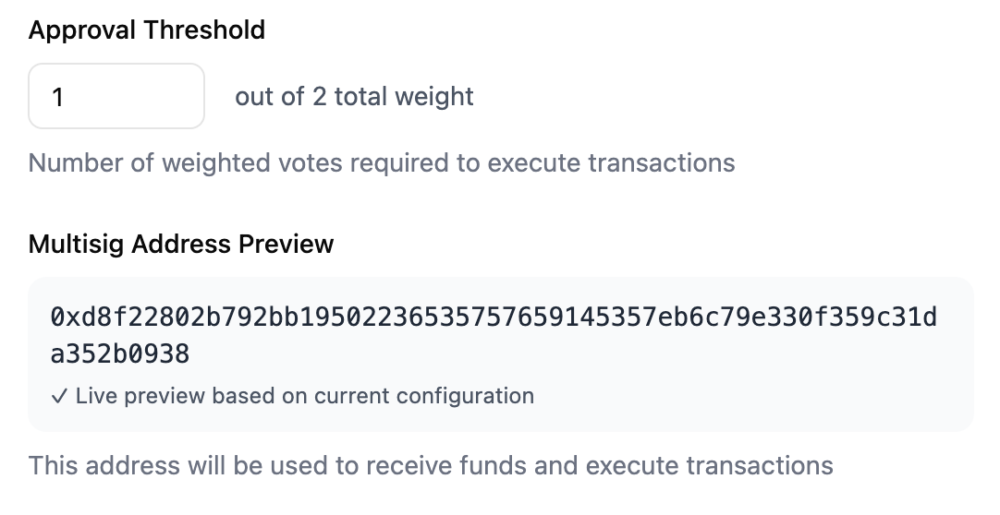

### Multisig invitations 

Once a multisig has been created, the added addresses receive an invitation to join the multisig. Pending invitations can be seen in the **Invitations** tab.

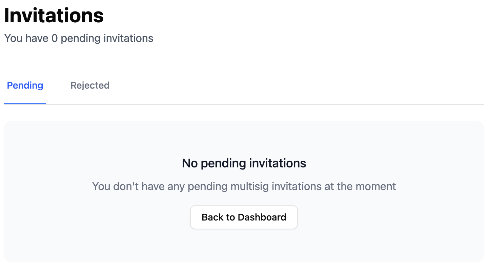

### Create and submit proposals 

From the Sagat dashboard, you can see several details and options regarding proposals, including:

- A button to create a new proposal.

- All proposals that have been submitted, are pending, or have been executed. Proposals are sorted by status. 

- An overview of the multisig, its members, and any external proposers that have been added.

- An overview of the assets owned by the multisig. 

Only members of the committee can query proposals from the API.

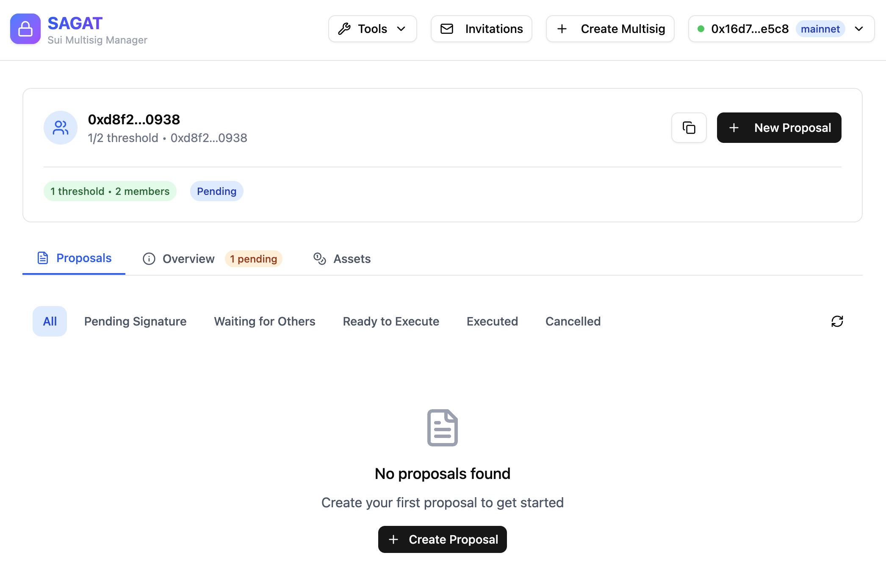

### Add external proposers 

External proposers can create proposals for a multisig without being added as part of the multisig. External proposers cannot approve or execute transactions on behalf of the multisig. 

To add external proposers, click on the **Overview** tab and scroll down to **Proposers** and click **Add Proposer**.

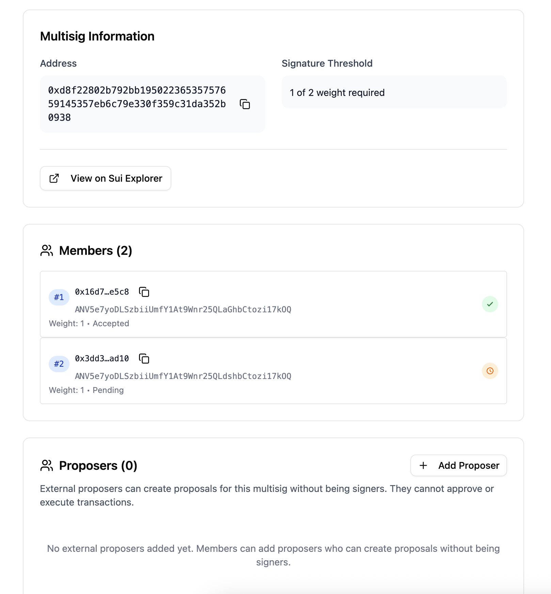

### Analyze signatures

The [signature analyzer tool](https://sagat.mystenlabs.com/tools/signature-analyzer) is used to analyze and decode base64-encoded signatures. It supports both multisig and single signature schemes.

Insert the signature into the input box. The decoded signature and its details are returned:

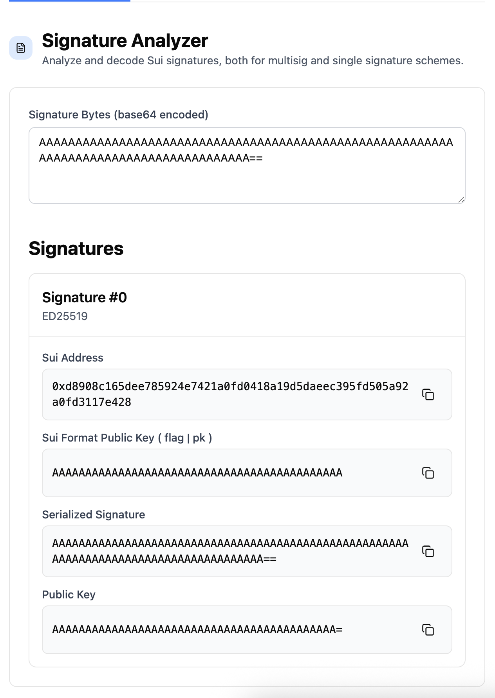

You can get a transaction's signature through network explorers like [SuiScan](https://suiscan.xyz/testnet/) by viewing a [transaction's details](https://suiscan.xyz/testnet/tx/GPtGkR2F7wN1TAqDJmUE3wKTBeL7e9sVuv7UTGvp9E99) and looking at the **User signature** metadata field.

:::caution 

If the Sagat web interface is set to **Test Mode**, you can only use signatures for transactions deployed on Testnet. For Mainnet transactions, disable **Test mode** in the account drop-down menu on Sagat. 

:::

### Sign transactions 

The [transaction signer tool](https://sagat.mystenlabs.com/tools/sign) can be used to preview and sign transactions using the Slush wallet you connected to the web interface.

Insert the transaction data as raw JSON or base64. The tool returns a preview of the transaction before providing an option to sign it.

:::caution 

If the Sagat web interface is set to **Test Mode**, you can preview or sign transactions for Testnet. For Mainnet transactions, disable **Test mode** in the account drop-down menu on Sagat. 

:::


## Using Sagat programmatically

Sagat can be used through a [TypeScript SDK](https://github.com/MystenLabs/sagat/tree/main/sdk) or the [Sagat API](https://github.com/MystenLabs/sagat/tree/main/api) to execute the same tasks supported through the web browser. The examples below demonstrate test scenarios for using the Sagat API. 

### Register public keys

Register your address with Sagat before creating multisigs:

<ImportContent
	source="/api/test/addresses.test.ts"
	mode="code"
	org="MystenLabs"
	repo="sagat"
	test="registers single user addresses"
	noComments
/>

Register multiple addresses with Sagat in the same session before creating multisigs:

<ImportContent
	source="/api/test/addresses.test.ts"
	mode="code"
	org="MystenLabs"
	repo="sagat"
	test="registers multiple user addresses in same session"
	noComments
/>

Learn how to execute this task using the [Sagat TypeScript SDK](https://github.com/MystenLabs/sagat/blob/313624a9d3b4b971b81b80be851b49e055067250/sdk/src/client.ts#L214-L222).

### Creating and managing multisig 

A multisig is a group of users who must vote on and approve transactions before execution. To create and execute multisig transactions, you must first create a multisig. If a proposed transaction does not receive majority approval from multisig members, the transaction is canceled. 

For example, create and verify a 2-of-2 multisig: 

<ImportContent
	source="/api/test/multisig-api.test.ts"
	mode="code"
	org="MystenLabs"
	repo="sagat"
	test="create and verify 2-of-2 multisig"
	noComments
/>

A 2-of-2 multisig means there are 2 users who are part of the multisig and both users must approve of a proposed transaction. Learn how to execute this task using the [Sagat TypeScript SDK](https://github.com/MystenLabs/sagat/blob/313624a9d3b4b971b81b80be851b49e055067250/sdk/src/client.ts#L72-L94).

You can also create a multisig with a custom name:

<ImportContent
	source="/api/test/multisig.test.ts"
	mode="code"
	org="MystenLabs"
	repo="sagat"
	test="creates multisig with custom name"
	noComments
/>

You can view multisig details about a specific address:

<ImportContent
	source="/api/test/addresses.test.ts"
	mode="code"
	org="MystenLabs"
	repo="sagat"
	test="can look up registered address"
	noComments
/>

Learn how to execute this task using the [Sagat TypeScript SDK](https://github.com/MystenLabs/sagat/blob/313624a9d3b4b971b81b80be851b49e055067250/sdk/src/client.ts#L96-L100). You can also look up [public key information for a registered address](https://github.com/MystenLabs/sagat/blob/313624a9d3b4b971b81b80be851b49e055067250/sdk/src/client.ts#L279-L281).

Manage the addresses that can create proposals for the multisig:

<ImportContent
	source="/api/test/proposal-business-logic.test.ts"
	mode="code"
	org="MystenLabs"
	repo="sagat"
	test="Add proposer"
	noComments
/>

Learn how to execute this task using the [Sagat TypeScript SDK](https://github.com/MystenLabs/sagat/blob/313624a9d3b4b971b81b80be851b49e055067250/sdk/src/client.ts#L297-L346).

### Multisig invitations 

Multisigs are not valid until all members invited to the multisig accept or reject the invitation to join. When a multisig is created, all member public keys are [auto-registered](https://github.com/MystenLabs/sagat/blob/313624a9d3b4b971b81b80be851b49e055067250/sdk/src/client.ts#L283-L294).

View and accept pending multisig invitations for a public key:

<ImportContent
	source="/api/test/multisig.test.ts"
	mode="code"
	org="MystenLabs"
	repo="sagat"
	test="member can accept multisig invitation"
	noComments
/>

Learn how to view invitations using the [Sagat TypeScript SDK](https://github.com/MystenLabs/sagat/blob/313624a9d3b4b971b81b80be851b49e055067250/sdk/src/client.ts#L234-L251), or learn how to [accept invitations with the SDK](https://github.com/MystenLabs/sagat/blob/313624a9d3b4b971b81b80be851b49e055067250/sdk/src/client.ts#L102-L113). You can also [reject an invitation](https://github.com/MystenLabs/sagat/blob/313624a9d3b4b971b81b80be851b49e055067250/sdk/src/client.ts#L115-L126).

### Proposal creation

For a multisig transaction to be executed, it must first be proposed. The members of that multisig must vote on the proposed transaction and the configured majority must agree to execute the transaction. 

Only verified multisig members can create and vote on proposals. Each multisig member can vote once. A proposal must reach a certain voting threshold to be executed. Before a proposal has been executed, it can be [canceled by the user](https://github.com/MystenLabs/sagat/blob/313624a9d3b4b971b81b80be851b49e055067250/sdk/src/client.ts#L197-L208) that created the proposal. 

<ImportContent
	source="/api/test/proposal-business-logic.test.ts"
	mode="code"
	org="MystenLabs"
	repo="sagat"
	test="creates proposal with correct initial state"
	noComments
/>

A transaction's signature must be [verified](https://github.com/MystenLabs/sagat/blob/main/api/test/proposal-business-logic.test.ts#L41) before a proposal can be created. Learn how to execute this task using the [Sagat TypeScript SDK](https://github.com/MystenLabs/sagat/blob/313624a9d3b4b971b81b80be851b49e055067250/sdk/src/client.ts#L128-L134).

### Viewing proposals 

You can browse proposals for a multisig with filtering by status and pagination:

<ImportContent
	source="/api/test/proposal-business-logic.test.ts"
	mode="code"
	org="MystenLabs"
	repo="sagat"
	test="Get paginated proposals"
	noComments
/>

Learn how to execute this task using the [Sagat TypeScript SDK](https://github.com/MystenLabs/sagat/blob/313624a9d3b4b971b81b80be851b49e055067250/sdk/src/client.ts#L136-L171).

You can view a proposal by its transaction digest:

<ImportContent
	source="/api/test/proposal-business-logic.test.ts"
	mode="code"
	org="MystenLabs"
	repo="sagat"
	test="Get proposal by digest"
	noComments
/>

Learn how to execute this task using the [Sagat TypeScript SDK](https://github.com/MystenLabs/sagat/blob/313624a9d3b4b971b81b80be851b49e055067250/sdk/src/client.ts#L173-L177).

### Voting on proposals

Users approve or reject a transaction by voting on the proposal to either accept or reject:

<ImportContent
	source="/api/test/multisig-api.test.ts"
	mode="code"
	org="MystenLabs"
	repo="sagat"
	test="full multisig workflow: creation -> verification -> proposal -> voting -> execution"
	noComments
/>

Learn how to execute this task using the [Sagat TypeScript SDK](https://github.com/MystenLabs/sagat/blob/313624a9d3b4b971b81b80be851b49e055067250/sdk/src/client.ts#L179-L190). Verify a proposal using its [ID number](https://github.com/MystenLabs/sagat/blob/313624a9d3b4b971b81b80be851b49e055067250/sdk/src/client.ts#L258-L265) or the [transaction's digest](https://github.com/MystenLabs/sagat/blob/313624a9d3b4b971b81b80be851b49e055067250/sdk/src/client.ts#L267-L274).
