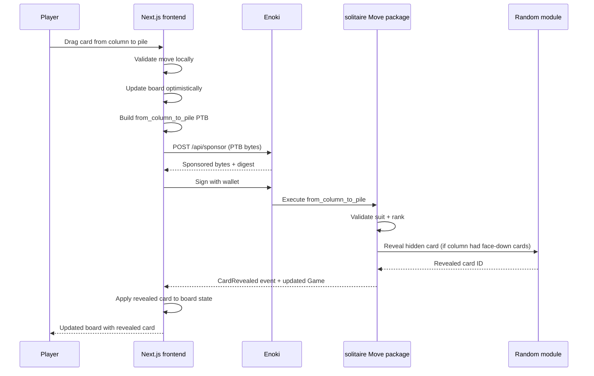

This example deploys a solitaire game fully onchain. Every card shuffle uses Sui's `Random` module for verifiable randomness, every move is an onchain transaction sponsored through Enoki so players pay no gas, and the full game state (deck, columns, piles) lives in a single `Game` object on the blockchain. 

## When to use this pattern

Use this pattern when you need to:

- Build a turn-based game where every player action is a verifiable onchain transaction.

- Store complex game state (multiple nested structs with vectors) in a single owned Sui object.

- Use onchain randomness for card shuffling that neither the player nor the operator can manipulate.

- Sponsor every transaction so players interact with zero gas cost, using Enoki zkLogin for frictionless onboarding.

- Implement drag-and-drop UI that maps user gestures to specific Move function calls.

## What you learn

This example teaches:

- **Complex onchain state:** The `Game` struct contains a `Deck`, 4 `Pile` foundation stacks, and 7 `Column` tableau stacks, each with their own card vectors and hidden card counts. All state lives in 1 owned object.

- **Onchain randomness for shuffling:** The `init_normal_game` and `init_easy_game` functions consume `&Random` to shuffle the deck. The `reveal_card` helper draws random cards during column setup and deck operations.

- **Move-per-transaction:** Each player action (deck flip, card move, pile placement) is a separate entry function. The frontend maps drag-and-drop events to the correct function based on the source and destination of the card.

- **Sponsored game loop:** Every transaction goes through `/api/sponsor` (Enoki sponsorship) → wallet sign → `/api/execute`. The player never pays gas. The sponsor endpoint restricts allowed Move calls to the 11 solitaire functions.

- **Optimistic UI with rollback:** The frontend updates the board immediately on drag-end, then sends the transaction. If the transaction fails (invalid move), it refetches the onchain game state and resets the board.

## Architecture

The example has 4 actors. The Next.js frontend renders the card board with drag-and-drop, manages wallet connection through Enoki zkLogin (Google OAuth), and builds transactions for each move. Enoki handles both wallet authentication and transaction sponsorship. The solitaire Move package stores the full game state, validates every move, and consumes the Random module for shuffling and card reveals.

The diagram below traces 1 game turn: the player drags a card from a column to a foundation pile.



The following steps walk through the flow:

1. The player drags a card from a tableau column to a foundation pile. The frontend validates the move locally (color, rank, suit) using `useSolitaireGameMoves`.

2. The frontend updates the board optimistically (moves the card visually) and builds a `from_column_to_pile` PTB.

3. The PTB goes through the sponsored transaction flow: `/api/sponsor` → wallet sign → `/api/execute`.

4. The Move function validates the placement rules onchain. If the source column had hidden (face-down) cards, it consumes `&Random` to reveal the next card and emits a `CardRevealed` event.

5. The frontend reads the `CardRevealed` event from the transaction result and updates the board state with the newly revealed card.

6. If the transaction fails (the move is invalid), the frontend calls `handleFailedTransaction` to refetch the full onchain game state and reset the board.

### How the game state works

The entire game lives in a single `Game` object owned by the player. The `Game` struct contains:

- `deck: Deck`: The draw pile with `hidden_cards` (count of unrevealed cards), `cards` (revealed deck cards), and a flag tracking whether all cards have been cycled.

- `piles: vector<Pile>`: 4 foundation piles (Clubs, Spades, Hearts, Diamonds), each building from Ace to King.

- `columns: vector<Column>`: 7 tableau columns, each with a count of face-down `hidden_cards` and a vector of face-up `cards`.

- `available_cards: vector<u64>`: The pool of undealt cards used during random reveals.

Cards are represented as integers 0 through 51. The suit and rank derive from the card ID: `rank = id % 13` (0=Ace through 12=King), `suit = id / 13` (0=Clubs, 1=Spades, 2=Hearts, 3=Diamonds). Cards 0 through 25 are black (Clubs, Spades), 26 through 51 are red (Hearts, Diamonds).

## Prerequisites

<Tabs className="tabsHeadingCentered--small">
<TabItem value="prereq" label="Prerequisites">
- [x] [Install the latest version of Sui](/getting-started/onboarding/sui-install).

- [x] [Configure the Sui client](/getting-started/onboarding/configure-sui-client).

- [x] [Create a Sui address](/getting-started/onboarding/get-address).

- [x] [Get SUI Testnet tokens](/getting-started/onboarding/get-coins).

- [x] Download and install an IDE. The following are recommended, as they offer Move extensions:

    - [VSCode](https://code.visualstudio.com/), corresponding [Move extension](https://marketplace.visualstudio.com/items?itemName=mysten.move)

    - [Emacs](https://www.gnu.org/software/emacs/), corresponding [Move extension](https://github.com/amnn/move-mode)

    - [Vim](https://www.vim.org/download.php), corresponding [Move extension](https://github.com/yanganto/move.vim)

    - [Zed](https://zed.dev/), corresponding [Move extension](https://github.com/Tzal3x/move-zed-extension)
    
        Alternatively, you can use the [Move web IDE](https://www.playmove.dev/), which does not require a download. It does not support all functions necessary for this guide, however.

- [x] [Download and install Git](https://git-scm.com/downloads).

- [x] [Node.js](https://nodejs.org/) 18 or later

- [x] A [Google OAuth client](https://console.cloud.google.com/) and its client ID. Your Google OAuth client must have `http://localhost:3000/` set as an authorized JavaScript origin and authorized redirect URI.

- [x] An [Enoki](https://portal.enoki.mystenlabs.com/) app with:

    - API keys (public and private) with zkLogin and sponsored transactions enabled.

    - Google configured as an auth provider using your Google OAuth client ID.

    

</TabItem>
</Tabs>

## Setup

Follow these steps to set up the example locally.

##### Step 1: Clone the repo

```bash
$ git clone https://github.com/MystenLabs/solitaire.git
$ cd solitaire/move/solitaire
```

##### Step 2: Publish the Move package

```bash
$ sui client switch --env testnet
$ sui move build
$ sui client publish --gas-budget 200000000
```

Record the package ID from the publish output.

```
│ Published Objects:                                                                               │
│  ┌──                                                                                             │
│  │ PackageID: 0x737e9eb4d0eaba283f28203cc1ee836a20f5f08e310161f1230d0735d02d3b63     <---- Package ID            │
│  │ Version: 1                                                                                    │
│  │ Digest: BMRU2zE5pNtueX89hkB1TEAA9dz2MZgVZHzWDWHt5vMt                                          │
│  │ Modules: solitaire                                                                            │
│  └──              
```

##### Step 3: Configure the frontend

```bash
$ cd ../../app
$ pnpm install
$ cp .env.example .env
```

Edit `.env` with your values:

```bash title='.env'
NEXT_PUBLIC_SUI_NETWORK=https://rpc.testnet.sui.io:443
NEXT_PUBLIC_SUI_NETWORK_NAME=testnet
NEXT_PUBLIC_PACKAGE_ADDRESS=PACKAGE_ID
NEXT_PUBLIC_ENOKI_API_KEY=ENOKI_PUBLIC_API_KEY
ENOKI_SECRET_KEY=ENOKI_PRIVATE_API_KEY
NEXT_PUBLIC_GOOGLE_CLIENT_ID=YOUR_GOOGLE_CLIENT_ID
ADMIN_SECRET_KEY=AN_ADMIN_SECRET
```

Set `ADMIN_SECRET_KEY` as a secret value only the admin should have access to. Use a random string generator to create this value.

## Run the example

Start the frontend:

```bash
$ pnpm dev
```

Open `http://localhost:3000` in a browser and sign in with Google. Choose **Normal** (standard Klondike) or **Easy** (Aces pre-placed). Drag cards between columns, to foundation piles, or from the deck. Each move sends a sponsored transaction. When you complete all 4 piles (Ace through King per suit), a victory modal shows your move count with a link to verify on Sui Explorer.

## Key code highlights

The following snippets are the parts of the code worth reading carefully.

### Game initialization with randomness

The `init_normal_game` function creates a new game with a shuffled deck using Sui's `Random` module.

<ImportContent source="move/solitaire/sources/solitaire.move" mode="code" org="MystenLabs" repo="solitaire" fun="init_normal_game" />

The function creates the `Game` struct, sets up 7 columns using `set_up_columns` (which consumes `&Random` to deal random cards), initializes 4 empty piles, and transfers the game to the player. The 24 remaining cards become the hidden deck.

### Column-to-column move with card reveal

The `from_column_to_column` function moves a card (or stack of cards) between tableau columns and reveals a hidden card if the source column has face-down cards.

<ImportContent source="move/solitaire/sources/solitaire.move" mode="code" org="MystenLabs" repo="solitaire" fun="from_column_to_column" />

The function validates that the target placement follows Klondike rules (alternating color, descending rank, Kings on empty columns). When the function reveals a face-down card, it calls `reveal_card` with `&Random` and emits a `CardRevealed` event that the frontend reads.

### Card placement validation

The `can_place_on_column` helper validates the alternating-color, descending-rank rule for tableau moves.

<ImportContent source="move/solitaire/sources/solitaire.move" mode="code" org="MystenLabs" repo="solitaire" fun="can_place_on_column" />

The function checks 2 conditions: the moving card and target card must be different colors (`is_red_card` returns true for Hearts and Diamonds), and the moving card's rank must be exactly 1 less than the target's rank.

### Drag-and-drop to transaction mapping

The `GameBoard` component maps drag-end events to specific Move function calls based on the card's origin and destination.

<ImportContent source="app/src/components/gameBoard/GameBoard.tsx" mode="code" org="MystenLabs" repo="solitaire" fun="handleDragEnd" />

The `handleDragEnd` function uses `findCardOriginType` to determine whether the dragged card came from the deck, a column, or a pile. Based on the source and destination types, it calls the corresponding `useSolitaireActions` function (for example, `handleFromColumnToPile`). If the transaction fails, it calls `handleFailedTransaction` to resync with the onchain state.

### Sponsored transaction flow

The `useSolitaireActions` hook builds and executes sponsored transactions for every game move.

<ImportContent source="app/src/hooks/useSolitaireActions.ts" mode="code" org="MystenLabs" repo="solitaire" fun="handleFromColumnToPile" />

Each move function follows the same pattern: build a `Transaction` with the appropriate `moveCall`, send the PTB bytes to `/api/sponsor` for Enoki sponsorship, sign with the user's wallet, execute through `/api/execute`, and extract any `CardRevealed` events from the result to update the board state.

## Common modifications

- **Add a timer:** Store `start_time` (already in the `Game` struct) and display elapsed time in the UI. Include the time in the victory modal alongside the move count.

- **Add undo support:** Before each move, snapshot the board state in a local stack. On undo, pop the stack and call `handleFailedTransaction` to resync. Note that undo does not revert the onchain transaction, it only resets the UI.

- **Add a leaderboard:** After `finish_game`, emit a `GameWon` event with the move count and elapsed time. Build a leaderboard page that queries these events through GraphQL.

- **Change card visuals:** Replace the SVG card images in `cardMappings.ts` with custom artwork. The card IDs (0-51) deterministically map to suits and ranks.

## Troubleshooting

The following sections address common issues with this example.
### Google sign-in doesn't trigger login    

**Symptom:**  After authenticating with Google, nothing happens and you are prompted to sign in  again. In the browser's developer tools, you see the error `{"errors":[{"code":"invalid_client_id","message":"Invalid client ID"}]}`

**Cause:** Enoki doesn't recognize your Google Client ID.                           
                                                                                
**Fix:** You need to register your Google Client ID in the Enoki dashboard:            
  1. Go to https://enoki.mystenlabs.com                                         
  2. Open your project                                                          
  3. Under the auth/OAuth providers section, add Google as a provider           
  4. Enter your Google Client ID

### Google sign-in fails

**Symptom:** The Google OAuth popup closes immediately or never appears.

**Cause:** The `NEXT_PUBLIC_GOOGLE_CLIENT_ID` is misconfigured, the redirect URI does not match `http://localhost:3000/`, or third-party cookies are blocked.

**Fix:** Verify the Google Client ID and authorized redirect URIs in Google Cloud Console. Try a different browser or disable cookie-blocking extensions.

### Move validation rejects a valid-looking move

**Symptom:** A card move that looks correct on the board fails with an `EInvalidPlacement` or similar error.

**Cause:** The frontend's local validation (`useSolitaireGameMoves`) and the Move contract disagree on the board state. This happens when the frontend missed a previous transaction's `CardRevealed` event.

**Fix:** The `handleFailedTransaction` function resyncs by fetching the full onchain `Game` object. If this happens repeatedly, check that event parsing in `useSolitaireActions` correctly handles `CardRevealed` events.

### Enoki sponsorship fails

**Symptom:** A move fails with a sponsorship error from `/api/sponsor`.

**Cause:** The `ENOKI_SECRET_KEY` is invalid, the Enoki account is rate-limited, or the Move call target is not in the allowed list.

**Fix:** Verify `ENOKI_SECRET_KEY` in `.env`. Check the Enoki dashboard for rate limits. Confirm `getSolitaireMoveCallTargets` in `solitaireMoveCalls.ts` includes all 11 game functions.

### Game state is out of sync after page reload

**Symptom:** After reloading the page, the board shows an old state or no game.

**Cause:** The game state is fetched from the chain on load. If the previous session deleted or finished the game, no game object exists.

**Fix:** Start a new game. The app detects when no active game exists and shows the difficulty selection screen. If you had an active game, `getGameObjectDetails` fetches the latest state from the chain.
