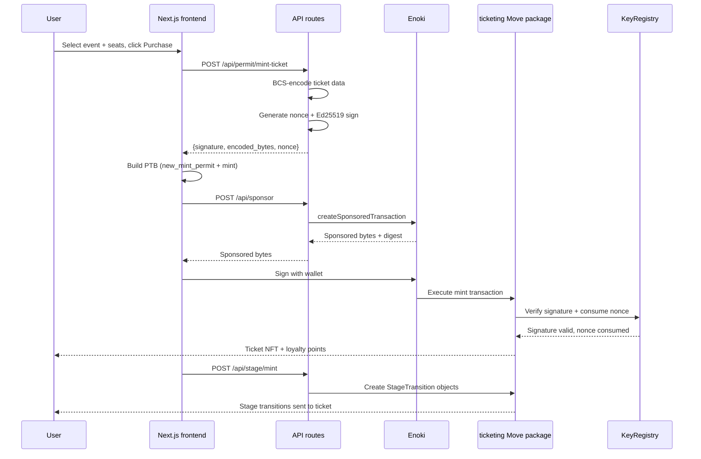
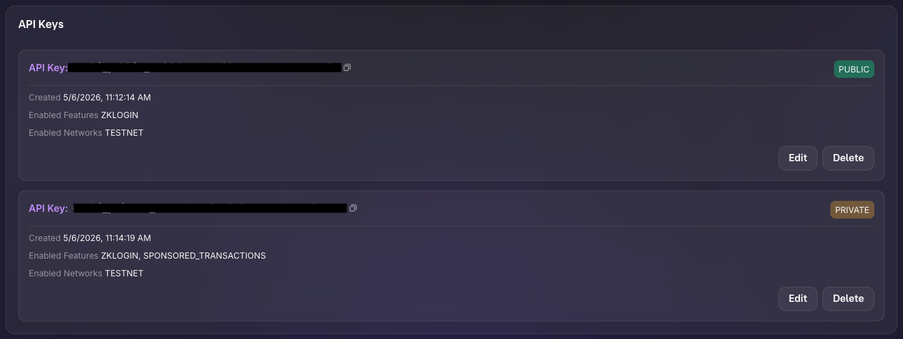

This example demonstrates a decentralized event ticketing and loyalty rewards app. Tickets are NFTs with a multi-stage lifecycle (Purchased → Attended → Collectible), minting requires a server-signed Ed25519 permit to prevent unauthorized issuance, and a loyalty points system rewards repeat attendees. All transactions are sponsored through Enoki so users pay no gas. The frontend uses Google OAuth through zkLogin for frictionless onboarding.

## When to use this pattern

Use this pattern when you need to:

- Issue NFTs that require server-side authorization before minting (prevent users from minting directly without paying or meeting conditions).

- Implement a multi-stage lifecycle for owned objects where an admin controls the transitions.

- Build a loyalty or rewards system that accumulates points through cryptographically signed permits.

- Use [Ed25519 signatures](/develop/cryptography/signing) with nonce-based replay protection for server-to-chain authorization.

- Combine a traditional web backend (API routes, database) with onchain NFT ownership for a hybrid app.

## What you learn

This example teaches:

- **Permit-based minting:** The backend signs a `TicketMintPermit` containing ticket data and a nonce. The Move contract verifies the Ed25519 signature against the stored public key in the `KeyRegistry` before minting. Users cannot mint tickets without a valid server signature.

- **Typed stage transitions:** Each lifecycle stage has a corresponding marker type (`Purchased`, `Attended`, `Collectible`) and a `StageTransition<T>` object. Admins mint transition objects and send them to the ticket. The ticket module consumes the transition and updates its stage.

- **Key registry with replay protection:** The `KeyRegistry` is a shared object that holds the Ed25519 public key and a `Table<u64, u64>` of used nonces. Each permit includes a nonce that the registry consumes on first use, preventing the same permit from being replayed.

- **Loyalty integration:** Every ticket mint awards loyalty points to the buyer's `Loyalty` card. The loyalty system uses its own permit type (`LoyaltyPointPermit`) with the same signature verification pattern.

- **Onchain display metadata:** The `display.move` module configures how tickets and loyalty cards appear in wallets and explorers using Sui's `Display` standard with dynamic field templates.

## Architecture

The example has 5 actors. The Next.js frontend renders event listings, ticket purchase flows, and the user's ticket wallet. The API routes handle permit signing (Ed25519), transaction sponsorship (Enoki), and user data storage (Vercel KV). Enoki provides zkLogin authentication (Google OAuth) and transaction sponsorship. The ticketing Move package manages ticket minting, stage transitions, loyalty points, and cryptographic verification. Vercel KV stores user accounts and zkLogin salt values.

The diagram below traces 1 full ticket purchase from event selection to NFT ownership.



The following steps walk through the flow:

1. The user browses events, selects seats, and clicks **Purchase**. The frontend sends the ticket data to `/api/permit/mint-ticket`.

2. The backend BCS-encodes the ticket data, generates a random nonce, signs the payload with the admin Ed25519 key, and returns the signature, encoded bytes, and nonce.

3. The frontend builds a PTB with 2 `moveCall` commands: `key_registry::new_mint_permit` (which verifies the signature and consumes the nonce) and `ticket::mint` (which creates the NFT and awards loyalty points).

4. The PTB goes through the sponsored transaction flow: `/api/sponsor` → Enoki sponsorship → wallet sign → `/api/execute`.

5. The Move contract verifies the Ed25519 signature against the `KeyRegistry`'s stored public key, checks the nonce has not been used, consumes the nonce, mints the `Ticket` NFT, and adds loyalty points to the user's `Loyalty` card.

6. The backend sends a second transaction to create `StageTransition` objects (Purchased, Attended, Collectible) and transfer them to the ticket, enabling future lifecycle transitions.

## Prerequisites

<Tabs className="tabsHeadingCentered--small">
<TabItem value="prereq" label="Prerequisites">
- [x] [Install the latest version of Sui](/getting-started/onboarding/sui-install).

- [x] [Configure the Sui client](/getting-started/onboarding/configure-sui-client).

- [x] [Create a Sui address](/getting-started/onboarding/get-address).

- [x] [Get SUI Testnet tokens](/getting-started/onboarding/get-coins).

- [x] Download and install an IDE. The following are recommended, as they offer Move extensions:

    - [VSCode](https://code.visualstudio.com/), corresponding [Move extension](https://marketplace.visualstudio.com/items?itemName=mysten.move)

    - [Emacs](https://www.gnu.org/software/emacs/), corresponding [Move extension](https://github.com/amnn/move-mode)

    - [Vim](https://www.vim.org/download.php), corresponding [Move extension](https://github.com/yanganto/move.vim)

    - [Zed](https://zed.dev/), corresponding [Move extension](https://github.com/Tzal3x/move-zed-extension)
    
        Alternatively, you can use the [Move web IDE](https://www.playmove.dev/), which does not require a download. It does not support all functions necessary for this guide, however.

- [x] [Download and install Git](https://git-scm.com/downloads).

- [x] [Node.js](https://nodejs.org/) 18 or later

- [x] [Rust toolchain](https://rustup.rs/) (for the relayer service)

- [x] A Sui wallet ([Slush Wallet](https://slush.app/) or another compatible wallet)

- [x] A [Google OAuth client](https://console.cloud.google.com/) and its client ID. Your Google OAuth client must have `http://localhost:3000/` set as an authorized JavaScript origin and authorized redirect URI.

- [x] An [Enoki](https://portal.enoki.mystenlabs.com/) app with:

    - API keys (public and private) with zkLogin and sponsored transactions enabled.

    - Google configured as an auth provider using your Google OAuth client ID.

    

</TabItem>
</Tabs>

## Setup

Follow these steps to set up the example locally.

##### Step 1: Clone the repo

```bash
$ git clone https://github.com/MystenLabs/ticketing-poc.git
$ cd ticketing-poc/app 
$ pnpm install
```

##### Step 2: Obtain your address's private key:

```bash 
$ sui client active-address
$ sui keytool convert <ADDRESS>
```

Copy the value that starts with `suiprivkey1...`.

##### Step 3: Run setup script 

The bootstrap script generates a key pair, injects the public key into the Move contract, publishes, and populates environment variables. 

```bash
$ cd ..
$ ./bootstrap.sh
```

When prompted, enter your address's private key. Record the package ID and key registry ID from the output.

##### Step 4: Configure the frontend

```bash
$ cd app
$ pnpm install
```

Edit `.env.local` with the remaining secrets the bootstrap script prompts for:

```bash
NEXT_PUBLIC_ENOKI_API_KEY=ENOKI_PUBLIC_API_KEY
ENOKI_SECRET_KEY=ENOKI_PRIVATE_API_KEY
NEXT_PUBLIC_GOOGLE_CLIENT_ID=YOUR_GOOGLE_CLIENT_ID
```

## Run the example

Start the frontend:

```bash
$ pnpm dev
```

Open `http://localhost:3000` in a browser and sign in with Google. Browse events, select seats and a section tier, and click **Purchase**. The app mints a ticket NFT, awards loyalty points, and redirects to your tickets page. Each ticket shows its stage (Purchased). An admin can transition tickets through Attended and Collectible stages.

## Key code highlights

The following snippets are the parts of the code worth reading carefully.

### Signature-verified mint permit

The `new_mint_permit` function verifies an Ed25519 signature against the `KeyRegistry` and consumes the nonce to prevent replay.

<ImportContent source="move/sources/ticket.move" mode="code" org="MystenLabs" repo="ticketing-poc" fun="new_mint_permit" />

The function takes the `KeyRegistry` (which holds the public key), the raw signature bytes, and the BCS-encoded ticket data. It calls `assert_signature` to verify the Ed25519 signature, then `consume_nonce` to record the nonce and prevent reuse. The returned `TicketMintPermit` is consumed by the `mint` function.

### Ticket minting with loyalty integration

The `mint` function creates a `Ticket` NFT from a verified permit and awards loyalty points.

<ImportContent source="move/sources/ticket.move" mode="code" org="MystenLabs" repo="ticketing-poc" fun="mint" />

The function consumes the `TicketMintPermit` (destroying it), parses the BCS-encoded data to extract ticket fields, creates the `Ticket` object, updates the user's `Loyalty` card with the awarded points, and emits a `TicketMinted` event.

### Typed stage transitions

The `StageTransition<T>` struct uses phantom types to represent lifecycle stages. Admins create transition objects that the ticket module consumes.

<ImportContent source="move/sources/ticket_stage.move" mode="code" org="MystenLabs" repo="ticketing-poc" struct="StageTransition" />

Each marker type (`Purchased`, `Attended`, `Collectible`) has `drop` ability. The `StageTransition<T>` has `key` and `store`, making it a transferable Sui object. When an admin creates a `StageTransition<Attended>` and sends it to a ticket, the ticket module can consume it to advance the ticket's stage.

### Key registry with replay protection

The `KeyRegistry` stores the Ed25519 public key and tracks consumed nonces.

<ImportContent source="move/sources/key_registry.move" mode="code" org="MystenLabs" repo="ticketing-poc" struct="KeyRegistryInner" />

The `used_nonces` table maps nonce values to the epoch they were consumed in. The `cleanup_nonces` function lets the key owner remove old entries by epoch threshold, preventing the table from growing indefinitely.

### Full ticket purchase orchestration

The `useMintTicket` hook coordinates the entire purchase flow across 3 API calls and 2 transactions.

<ImportContent source="app/src/app/hooks/useMintTicket.tsx" mode="code" org="MystenLabs" repo="ticketing-poc" fun="useMintTicket" />

The hook validates that the user has a loyalty card and is signed in, generates random seat assignments, requests a signed permit from the backend, builds and executes the mint transaction, then triggers stage transition minting. Toast notifications provide feedback at each step.

### Ed25519 permit signing

The `/api/permit/mint-ticket` route BCS-encodes the ticket data, generates a nonce, and signs the payload.

<ImportContent source="app/src/app/api/permit/mint-ticket/route.ts" mode="code" org="MystenLabs" repo="ticketing-poc" />

The route reads the admin Ed25519 private key from the environment, generates a random 8-byte nonce, BCS-encodes the ticket data (matching the Move struct layout), signs the encoded bytes with the private key, and returns the signature, bytes, and nonce for the frontend to submit onchain.

## Common modifications

- **Add a secondary marketplace:** Let ticket holders list their tickets for resale. Create a shared `Marketplace` object with dynamic fields for listings. The buyer pays the seller and receives the ticket through an atomic PTB.

- **Add QR code check-in:** At the event venue, generate a QR code from the ticket ID. A scanner app calls `update_stage` to transition the ticket from Purchased to Attended, proving attendance onchain.

- **Add tiered loyalty rewards:** Extend the `Loyalty` struct with a `tier` field (Bronze, Silver, Gold). Calculate the tier from accumulated points and unlock discounts or early access for higher tiers.

- **Replace Ed25519 with multisig:** Require 2-of-3 admin signatures to mint tickets. Store multiple public keys in the `KeyRegistry` and validate a threshold of signatures in `assert_signature`.

- **Add event capacity limits:** Store a `remaining_capacity` counter on a shared `Event` object. Decrement on each ticket mint and abort when capacity reaches 0.

## Troubleshooting

The following sections address common issues with this example.
### Google sign-in doesn't trigger login    

**Symptom:**  After authenticating with Google, nothing happens and you are prompted to sign in  again. In the browser's developer tools, you see the error `{"errors":[{"code":"invalid_client_id","message":"Invalid client ID"}]}`

**Cause:** Enoki doesn't recognize your Google Client ID.                           
                                                                                
**Fix:** You need to register your Google Client ID in the Enoki dashboard:            
  1. Go to https://enoki.mystenlabs.com                                         
  2. Open your project                                                          
  3. Under the auth/OAuth providers section, add Google as a provider           
  4. Enter your Google Client ID

### Google sign-in fails

**Symptom:** The Google OAuth popup closes immediately or never appears.

**Cause:** The `NEXT_PUBLIC_GOOGLE_CLIENT_ID` is misconfigured, the redirect URI does not match `http://localhost:3000/`, or third-party cookies are blocked.

**Fix:** Verify the Google Client ID and authorized redirect URIs in Google Cloud Console. Try a different browser or disable cookie-blocking extensions.

### Permit signature verification fails

**Symptom:** The `new_mint_permit` call aborts with a signature verification error.

**Cause:** The admin private key in the backend does not match the public key stored in the `KeyRegistry`, or the BCS encoding of the ticket data does not match between the backend and the Move contract.

**Fix:** Verify the public key in the `KeyRegistry` matches the private key in `ADMIN_PRIVATE_KEY_ED25519`. Run `bootstrap.sh` to regenerate and re-deploy with matching keys. Ensure the BCS field order in the API route matches the Move struct layout exactly.

### Nonce already consumed

**Symptom:** The `consume_nonce` call aborts because the nonce is already in the `used_nonces` table.

**Cause:** The same permit was submitted twice, or the nonce generation produced a collision.

**Fix:** Generate a new permit by calling `/api/permit/mint-ticket` again. Each call produces a fresh nonce. If collisions happen frequently, increase the nonce size from 8 to 16 bytes.

### Loyalty card not found

**Symptom:** The ticket mint fails because the user does not have a `Loyalty` object.

**Cause:** The `LoyaltyProvider` auto-mints a loyalty card when a user first signs in, but the transaction might not have finalized yet.

**Fix:** Wait a few seconds after first sign-in for the loyalty mint to complete. The provider retries automatically. If it still fails, manually call `loyalty::mint` through the CLI.

### Stage transition fails

**Symptom:** Clicking to advance a ticket's stage does nothing or shows an error.

**Cause:** The `StageTransition` object for the target stage was not created or was not sent to the ticket's address.

**Fix:** Verify that `/api/stage/mint` ran successfully after the ticket was purchased. Check that the `StageTransition` objects are owned by the ticket's address using `sui client objects`.
