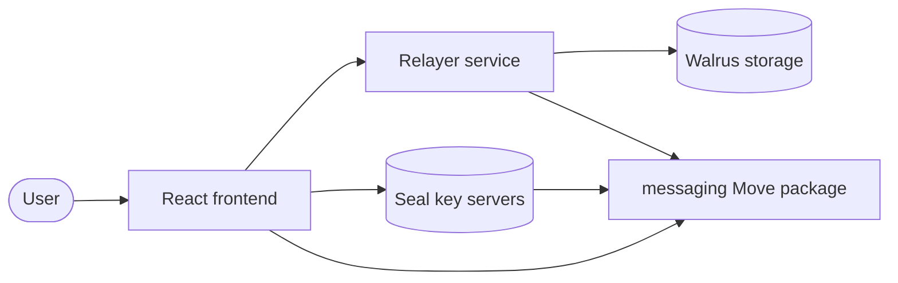

This example builds an end-to-end encrypted group chat app on Sui. The client encrypts messages with AES-256-GCM before they leave the browser, routes them through an offchain relayer that never sees plaintext, and archives them to Walrus for decentralized persistence. Onchain Move contracts manage group membership, 7 granular permission types, and versioned encryption keys through Seal threshold encryption.

## When to use this pattern

Use this pattern when you need to:

- Build a messaging or collaboration app where the server never sees plaintext content.
- Manage group membership and granular permissions (send, read, edit, delete, rotate keys) onchain.
- Implement key rotation so removed members lose access to future messages while existing members retain access to history.
- Route encrypted data through an offchain service that enforces onchain permissions without decrypting the payload.
- Store encrypted files and messages on Walrus for decentralized persistence with automatic archival.

## What you learn

This example teaches:

- **Permissioned groups:** A `PermissionedGroup<Messaging>` shared object tracks members and their permissions onchain. The relayer caches these permissions and enforces them on every API call.
- **Envelope encryption:** The client generates a random AES-256-GCM key (the DEK), encrypts it with Seal, and stores the encrypted DEK onchain in an `EncryptionHistory` object. The client encrypts messages with the DEK locally. Seal key servers release the DEK only to members with `MessagingReader` permission.
- **Key rotation:** When a member is removed, the admin atomically revokes permissions and rotates the DEK in a single transaction. The removed member can no longer decrypt new messages.
- **Relayer pattern:** An offchain Rust service accepts encrypted messages, verifies sender signatures, checks onchain permissions through a cached membership store, and batches messages to Walrus for archival.
- **File attachments:** Each file is individually encrypted with the group DEK, uploaded to Walrus through the publisher API, and referenced by a `quiltPatchId` in the message metadata.

<Tabs className="tabsHeadingCentered--small">
<TabItem value="prereq" label="Prerequisites">

- [x] An existing [React](https://react.dev/) app and somewhere to run a Rust service.

- [x] [Install the Sui CLI](/getting-started/onboarding/sui-install) and [fund an address with Testnet SUI](/getting-started/onboarding/get-coins).

- [x] [Node.js](https://nodejs.org/) 22 or later and [pnpm](https://pnpm.io/installation) 10.17.0 or later, per the [Messaging SDK installation requirements](/sui-stack/messaging/installation), plus a [Rust toolchain](https://rustup.rs/) for the relayer.

- [x] A wallet that signs with a standard key, such as [Slush Wallet](https://slush.app/). zkLogin wallets do not work here. See [Wallet compatibility](#wallet-compatibility).

</TabItem>
</Tabs>

For SDK installation and client setup, see [Installation](/sui-stack/messaging/installation) and [Developer Setup](/sui-stack/messaging/setup).

## Architecture

This example has 3 layers and 5 actors. The diagram below shows the components and the data flow between them.

The React frontend handles wallet connection, message composition, client-side encryption and decryption, and group management. The relayer service is a Rust/Axum HTTP server that stores encrypted messages in memory, verifies sender signatures, checks onchain permissions through a cached membership store, and batches messages to Walrus for archival. Walrus stores encrypted message quilts for decentralized persistence.

The messaging Move package manages group creation, member permissions, encryption key history, and the Seal access-control gate. 

Seal key servers hold threshold encryption keys and release DEK shares only when the `seal_approve_reader` function confirms the caller has `MessagingReader` permission. 

The app uses a 2-layer encryption scheme called envelope encryption:

1. **DEK layer (Seal):** When a group is created, the SDK generates a random AES-256 key called the Data Encryption Key (DEK). The SDK encrypts the DEK with Seal and stores the encrypted DEK onchain in an `EncryptionHistory` object. Each key rotation appends a new version.

2. **Message layer (AES-256-GCM):** To send a message, the client fetches the current encrypted DEK from the chain, decrypts it through Seal (which verifies `MessagingReader` permission), and uses the plaintext DEK to encrypt the message content with AES-256-GCM. The relayer only ever sees the ciphertext.

This design means Seal handles key management and access control, while the actual message encryption uses fast symmetric crypto. The relayer, Walrus, and anyone observing the network can see encrypted bytes but never the plaintext.

## Reference app

A complete implementation lives in [`sui-stack-messaging`](https://github.com/MystenLabs/sui-stack-messaging). The `chat-app` directory holds the React frontend and `relayer` holds the Rust service.

### Configuration that matters

The frontend and relayer both need to agree on the same package and key servers:

| Setting | Notes |
| --- | --- |
| `VITE_SEAL_KEY_SERVER_OBJECT_IDS` | At least 2 object IDs from the [verified key servers](https://seal-docs.wal.app/Pricing#verified-key-servers) list. A single server fails with a threshold error. |
| `VITE_WALRUS_PUBLISHER_URL` / `VITE_WALRUS_AGGREGATOR_URL` | Where encrypted quilts are written and read. |
| `VITE_WALRUS_EPOCHS` | Storage duration for archived messages. |
| `GROUPS_PACKAGE_ID` (relayer) | The deployed Groups SDK package, listed below. |

| Network | Groups SDK package ID |
| --- | --- |
| Testnet | `0xba8a26d42bc8b5e5caf4dac2a0f7544128d5dd9b4614af88eec1311ade11de79` |
| Mainnet | `0x541840ae7df705d1c6329c22415ed61f9140a18b79b13c1c9dc7415b115c1ba8` |

### Wallet compatibility

The relayer verifies sender signatures, so the connected wallet has to use a signature scheme it recognizes. A zkLogin wallet fails with `Invalid public key format: Unknown signature scheme flag: 0x05`. Use a passphrase or imported-key wallet.

### Group membership

Creating a group does not add you to it. Add your own address as a member at creation time, or you cannot post to the group you just made.

## Key code highlights

The following steps walk through the flow:

1. The sender types a message and presses **Enter**. The frontend fetches the current encrypted DEK from the `EncryptionHistory` object onchain.

2. The frontend sends the encrypted DEK to Seal key servers along with a `seal_approve_reader` transaction. Seal dry-runs the transaction, confirms the sender has `MessagingReader` permission, and returns key shares. The frontend combines the shares to recover the plaintext DEK.

3. The frontend encrypts the message text with AES-256-GCM using the DEK and a random 12-byte nonce. It signs the ciphertext with the wallet and POSTs the encrypted payload to the relayer.

4. The relayer verifies the sender's signature, checks `MessagingSender` permission against its cached membership store, assigns a message order number, and stores the ciphertext in memory. A background service batches pending messages to Walrus as encrypted quilts.

5. The recipient's frontend polls the relayer for new messages. It receives the ciphertext, fetches the DEK through the same Seal flow (with its own `MessagingReader` permission check), decrypts the message locally, and verifies the sender's signature.

Errors can occur at the Seal step (session key expired, permission revoked), the relayer step (signature invalid, permission denied), or the Walrus step (upload timeout). The SDK retries transient failures and surfaces persistent errors through the `useMessages` hook's error state.

The following snippets are the parts of the code worth reading carefully.

### Seal access-control policy

The `seal_approve_reader` function is the onchain gate that Seal key servers call before releasing DEK shares. It checks that the caller has `MessagingReader` permission in the group.

<ImportContent source="move/packages/sui_stack_messaging/sources/seal_policies.move" mode="code" org="MystenLabs" repo="sui-stack-messaging" fun="seal_approve_reader" />

The function validates the 40-byte identity (32-byte group ID + 8-byte key version), confirms the encryption history belongs to the correct group, and verifies the caller holds `MessagingReader` permission. If any check fails, the transaction aborts and Seal denies the key shares.

### Encryption key rotation

The `rotate_encryption_key` function appends a new encrypted DEK version to the onchain history. It requires `EncryptionKeyRotator` permission.

<ImportContent source="move/packages/sui_stack_messaging/sources/messaging.move" mode="code" org="MystenLabs" repo="sui-stack-messaging" fun="rotate_encryption_key" />

Key rotation creates a new DEK version. Future messages encrypt with the new version. Removed members can still decrypt old messages (they had the old DEK cached) but cannot access the new DEK because Seal checks their permission at decryption time.

### Encryption history storage

The `EncryptionHistory` struct stores versioned encrypted DEKs as a `TableVec` on a shared object.

<ImportContent source="move/packages/sui_stack_messaging/sources/encryption_history.move" mode="code" org="MystenLabs" repo="sui-stack-messaging" struct="EncryptionHistory" />

Each entry in the `deks` table is an encrypted DEK blob (up to 1024 bytes). The key version is the index into this table. The identity format `[group_id (32 bytes)][key_version (8 bytes)]` ensures each DEK maps to exactly 1 group and version.

### Sending and receiving messages

The `useMessages` hook manages the full message lifecycle: fetching history, subscribing for updates, sending, editing, and deleting.

<ImportContent source="chat-app/src/hooks/useMessages.ts" mode="code" org="MystenLabs" repo="sui-stack-messaging" fun="useMessages" />

The hook calls `client.sendMessage()` which encrypts the text with AES-256-GCM using the group DEK, signs the ciphertext, and POSTs it to the relayer. For real-time updates, it calls `client.subscribe()` which polls the relayer and automatically decrypts incoming messages using the cached DEK.

## Troubleshooting

The following sections address common issues with this example.
### Relayer connection fails

**Symptom:** The frontend shows a network error or messages do not send.

**Cause:** The relayer is not running, `VITE_RELAYER_URL` points to the wrong address, or the Vite dev proxy is misconfigured.

**Fix:** Confirm the relayer is running on `http://localhost:3000` with `curl http://localhost:3000/health_check`. Verify `VITE_RELAYER_URL` in `.env` matches the relayer address. Restart the Vite dev server after changing `.env`.

### Permission denied on send or read

**Symptom:** The relayer returns a 403 error when sending or fetching messages.

**Cause:** The relayer's membership cache does not include the caller's permissions, or the caller's permissions were revoked onchain.

**Fix:** Verify your membership with `sui client object GROUP_ID` and check the permissions for your address. If recently added, the relayer's membership sync might have a delay. Restart the relayer to force a cache refresh.

### Decryption fails

**Symptom:** Messages appear as encrypted blobs instead of readable text, or the SDK throws a decryption error.

**Cause:** The session key expired (default TTL is 10 minutes), the caller lost `MessagingReader` permission, or the Seal key servers are unreachable.

**Fix:** Refresh the page to generate a new session key. Verify your permissions are still active. Check that the Seal key server object IDs in `.env` are correct and the servers are reachable.

### Group does not appear in sidebar

**Symptom:** After creating a group or being added to one, it does not show in the sidebar.

**Cause:** The group discovery hook queries `MemberAdded` events through GraphQL. The event indexer might lag behind the chain, or the GraphQL endpoint is unreachable.

**Fix:** Wait a few seconds and refresh. Verify `VITE_SUI_GRAPHQL_URL` is correct. The group is also cached in localStorage, so clearing `chat-app-groups` from localStorage and refreshing forces a fresh query.

### File attachment upload fails

**Symptom:** Sending a message with attachments fails or shows an uploading files message indefinitely.

**Cause:** The file exceeds the 5MB per-file or 50MB total limit, the Walrus publisher is unreachable, or the publisher URL is misconfigured.

**Fix:** Check file sizes (max 5MB each, 10 files, 50MB total). Verify `VITE_WALRUS_PUBLISHER_URL` is correct and reachable with `curl PUBLISHER_URL/v1/health`. Increase `VITE_WALRUS_EPOCHS` if storage duration is too short.

### Error: `Invalid key servers or threshold 2 for 1 key servers for package 0x04...`

**Cause:** Configured key servers are invalid, unreachable, or only one was specified.

**Fix:** Check that the Seal key server object IDs in `.env` are correct, there are at least 2, and the servers are reachable.

### Error: `Invalid public key format: Unknown signature scheme flag: 0x05`

**Cause:** zkLogin is not supported by this application, and the wallet connected to the app uses zkLogin.

**Fix:** Use a passphrase or imported key wallet instead.

### Application disappears after connecting your wallet

**Cause:** You've connected an unsupported wallet to the application.

**Fix:** Restart the application and connect a known supported wallet, such as Slush, to the application instead.
