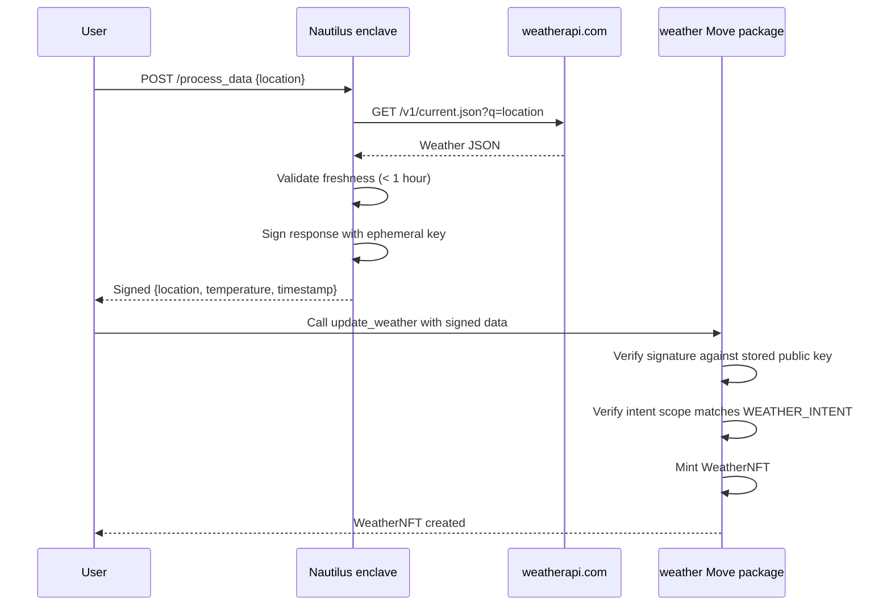

This example demonstrates a verified oracle system that fetches real-world weather data inside a Trusted Execution Environment (TEE), signs the result cryptographically, and submits it to a Move contract that mints a `WeatherNFT` only after verifying the signature. 

## When to use this pattern

Use this pattern when you need to:

- Bring external API data onchain with cryptographic proof that no one tampered with the data.

- Build an oracle where neither the operator nor the user can forge the output.

- Mint NFTs or update onchain state based on verified real-world data (weather, prices, sports scores, identity).

- Replace trust in a centralized oracle operator with trust in auditable enclave code.

## What you learn

This example teaches:

- **Trusted Execution Environments:** AWS Nitro Enclaves provide isolated compute where the host OS cannot read memory or tamper with execution. The enclave generates an ephemeral key pair that never leaves the enclave.

- **Cryptographic verification:** The Move contract stores the enclave's public key and verifies signatures on every data submission. Forged or tampered data fails verification.

- **Oracle pattern:** The enclave acts as a trusted bridge between an external API (weatherapi.com) and onchain state. The contract trusts the data because it trusts the enclave that signed it.

- **Intent scoping:** A `WEATHER_INTENT` constant (value `0`) is included in every signed message as a domain separator, preventing signatures from 1 intent from being replayed in another.

## Architecture

The example has 3 actors and 1 onchain package. The diagram below traces 1 full interaction from a weather request to a minted NFT.



The following steps walk through the flow:

1. The user sends a POST request to the enclave's `/process_data` endpoint with a location string (for example, `London`).

2. The enclave fetches the current weather from `weatherapi.com` and extracts the location name, temperature in Celsius, and the last-updated timestamp.

3. The enclave validates that the weather data is fresh (the timestamp is within the last hour). If the data is stale, the enclave returns an error.

4. The enclave creates a `WeatherResponse` struct, serializes it with BCS (Binary Canonical Serialization) to match the Move struct layout, and signs the serialized bytes with its ephemeral key pair. The signature includes the intent scope (`0`) and the timestamp.

5. The user submits the signed data to the Move contract's `update_weather` function along with a reference to the `Enclave` object.

6. The Move contract verifies the signature against the enclave's stored public key. If verification succeeds, it mints a `WeatherNFT` owned by the caller. If verification fails, the transaction aborts with `EInvalidSignature`.

Errors can occur at the API fetch step (network failure, invalid API key), the freshness check (stale data), or the signature verification step (tampered data, wrong enclave key).

### How Nautilus works

Nautilus is a framework for secure offchain computation on Sui. It uses AWS Nitro Enclaves to run application code in an isolated environment where:

- The host operating system cannot read the enclave's memory.

- The enclave generates an ephemeral key pair at startup. The private key never leaves the enclave.

- An attestation document, signed by the AWS Nitro certificate chain, proves the enclave's identity and binds it to the public key.

The trust chain works through Platform Configuration Registers (PCRs), which are SHA-384 fingerprints of the enclave software:

- **PCR0:** Identifies the OS and kernel image.

- **PCR1:** Identifies the application code.

- **PCR2:** Identifies runtime configuration files.

The Move contract stores the expected PCR values at deployment. When the enclave registers, the contract verifies the attestation document against these values. After registration, you can verify every signed response from the enclave onchain using the stored public key.

The enclave exposes 3 endpoints:

- `GET /health_check`: verifies the enclave can reach allowed external domains.

- `GET /get_attestation`: returns the signed attestation document for onchain registration.

- `POST /process_data`: runs your custom logic (in this case, fetches weather data).

For the full Nautilus framework and deployment tooling, see the [Nautilus documentation](/sui-stack/nautilus/nautilus-overview).

## Prerequisites

<Tabs className="tabsHeadingCentered--small">
<TabItem value="prereq" label="Prerequisites">
- [x] [Install the latest version of Sui](/getting-started/onboarding/sui-install).

- [x] [Configure the Sui client](/getting-started/onboarding/configure-sui-client).

- [x] [Create a Sui address](/getting-started/onboarding/get-address).

- [x] [Get SUI Testnet tokens](/getting-started/onboarding/get-coins).

- [x] Download and install an IDE. The following are recommended, as they offer Move extensions:

    - [VSCode](https://code.visualstudio.com/), corresponding [Move extension](https://marketplace.visualstudio.com/items?itemName=mysten.move)

    - [Emacs](https://www.gnu.org/software/emacs/), corresponding [Move extension](https://github.com/amnn/move-mode)

    - [Vim](https://www.vim.org/download.php), corresponding [Move extension](https://github.com/yanganto/move.vim)

    - [Zed](https://zed.dev/), corresponding [Move extension](https://github.com/Tzal3x/move-zed-extension)
    
        Alternatively, you can use the [Move web IDE](https://www.playmove.dev/), which does not require a download. It does not support all functions necessary for this guide, however.

- [x] [Download and install Git](https://git-scm.com/downloads).

- [x] [Node.js](https://nodejs.org/) 18 or later

- [x] A Sui wallet ([Slush Wallet](https://slush.app/) or another compatible wallet)

- [x] A [weatherapi.com](https://www.weatherapi.com/) API key (free tier)

</TabItem>
</Tabs>

## Setup

Follow these steps to set up the example locally.

##### Step 1: Clone the repo

```bash
$ git clone -b solution https://github.com/MystenLabs/sui-move-bootcamp.git
$ cd sui-move-bootcamp/K4
```

##### Step 2: Review the example files

The K4 directory contains the 2 files you customize for any Nautilus application:

```
K4/example/
├── move/
│   └── weather.move      # Move contract: signature verification + NFT minting
└── rust/
    ├── mod.rs             # Enclave handler: API fetch + signing
    └── allowed_endpoints.yaml  # Endpoint allowlist
```

The rest of the Nautilus framework (enclave runtime, attestation, key management) comes from the [Nautilus repo](https://github.com/MystenLabs/nautilus). You only write the application logic.

##### Step 3: Create `Move.toml`

Create a Move.toml file:

```bash
$ touch example/move/Move.toml
```

Insert the following content into the new Move.toml file:

```toml 
[package]
name = "app"
edition = "2024"

[dependencies]
enclave = { git = "https://github.com/MystenLabs/nautilus.git", subdir = "move/enclave", rev = "main" }

[addresses]
app = "0x0"
```

##### Step 4: Configure the weather API key

Set the API key as an environment variable before starting the enclave:

```bash
$ export WEATHER_API_KEY=YOUR_WEATHERAPI_KEY
```

##### Step 5: Deploy the Move contract

```bash
$ sui client switch --env testnet
$ sui move build
$ sui client publish --gas-budget 200000000
```

The `init` function creates an `EnclaveConfig` with placeholder PCR values. In production, replace these with the actual PCR hashes from your built enclave image.

##### Step 6: Setup and register the enclave

Follow the Nautilus documentation to [setup and deploy your enclave](/sui-stack/nautilus/using-nautilus). After deploying the enclave to an AWS Nitro instance, call `GET /get_attestation` and submit the attestation document to the contract's `register_enclave` function. This stores the enclave's public key onchain.

## Run the example

Send a weather request to the enclave:

```bash
$ curl -X POST http://ENCLAVE_URL/process_data \
  -H "Content-Type: application/json" \
  -d '{"location": "London"}'
```

The enclave returns a signed response containing the location, temperature, and timestamp. Submit the signed response to the `update_weather` function on Sui. The contract verifies the signature and mints a `WeatherNFT` with the verified data.

To verify the NFT was created:

```bash
$ sui client tx-block TX_DIGEST --json | jq '.objectChanges[] | select(.type == "created")'
```

## Key code highlights

The following snippets are the parts of the code worth reading carefully.

### Verified weather NFT minting

The `update_weather` entry function verifies the enclave signature and mints a `WeatherNFT` from the verified data.

<ImportContent source="K4/example/move/weather.move" mode="code" org="MystenLabs" repo="sui-move-bootcamp" branch="solution" fun="update_weather" />

The function takes the weather data (location, temperature, timestamp), the enclave signature, and a reference to the `Enclave` object that holds the public key. It reconstructs the expected signed payload, calls `enclave::verify` to check the signature, and mints the NFT only if verification succeeds. The `WEATHER_INTENT` constant scopes the signature to prevent cross-intent replay.

### Weather data structures

The `WeatherNFT` struct stores verified weather data as a transferable Sui object.

<ImportContent source="K4/example/move/weather.move" mode="code" org="MystenLabs" repo="sui-move-bootcamp" branch="solution" struct="WeatherNFT" />

The `WeatherNFT` has `key` and `store` abilities. The `location`, `temperature`, and `timestamp_ms` fields are all verified by the enclave signature before the contract creates the object.

## Common modifications

- **Change the data source:** Replace the `weatherapi.com` fetch with any REST API. Update the `WeatherRequest` and `WeatherResponse` structs in both Rust and Move to match the new data shape. Add the new domain to `allowed_endpoints.yaml`.

- **Adjust the freshness window:** Change the `3_600_000` millisecond threshold in `process_data` to match your data source's update frequency. Price feeds might use 60 seconds. Daily data might use 24 hours.

- **Replace NFT minting with state updates:** Instead of minting a new `WeatherNFT` each time, update a shared object that holds the latest verified data. This pattern works better for price oracles where consumers read a single object.

- **Add access control:** Gate who can submit signed data to the contract. Add a capability or admin check in `update_weather` to restrict submissions to authorized relayers.

## Troubleshooting

The following sections address common issues with this example.
### Enclave returns `Weather API timestamp is too old`

**Symptom:** The `/process_data` endpoint returns an error about a stale timestamp.

**Cause:** The weather API returned data with a `last_updated_epoch` older than 1 hour. This can happen if the API caches results for a location that receives infrequent queries.

**Fix:** Try a more popular location (major cities update more frequently). If the issue persists, the weather API might be experiencing delays. Wait and retry.

### Signature verification fails onchain

**Symptom:** The `update_weather` transaction aborts with `EInvalidSignature` (error code `1`).

**Cause:** The enclave public key stored onchain does not match the key that signed the response. This happens if the enclave restarted (generating a new ephemeral key pair) without re-registering, or if something modified the signed data in transit.

**Fix:** Re-register the enclave by calling `GET /get_attestation` and submitting the new attestation to the contract. Verify the enclave runs the same image (same PCR values) as the contract expects.

### BCS serialization mismatch

**Symptom:** Signature verification fails even though the signature is valid, because the Move contract and Rust handler disagree on the `WeatherResponse` layout.

**Cause:** The field order or types in the Rust `WeatherResponse` struct do not match the Move `WeatherResponse` struct. BCS is sensitive to field order.

**Fix:** Ensure both structs have identical field names in the same order with compatible types. `String` in Move maps to `String` in Rust. `u64` maps to `u64`.

### Enclave cannot reach weatherapi.com

**Symptom:** The `/process_data` endpoint returns a network error.

**Cause:** The domain is not listed in `allowed_endpoints.yaml`, or the enclave has no outbound network access.

**Fix:** Verify `api.weatherapi.com` appears in `allowed_endpoints.yaml`. Check the enclave's network configuration allows outbound HTTPS on port 443.
