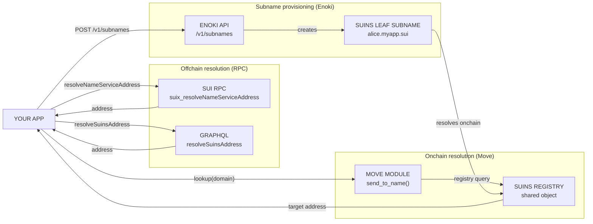

import Tabs from '@theme/Tabs';
import TabItem from '@theme/TabItem';

By the end of this page, you can:

- Resolve a SuiNS name to an address onchain in Move and offchain through the Sui RPC.
- Implement reverse lookup to display human-readable names in your UI.
- Create and manage subnames under a domain you control.
- Integrate the Enoki subname API to provision per-user identities programmatically.

<Tabs className="tabsHeadingCentered--small">
<TabItem value="prereq" label="Prerequisites">

- [x] [Sui CLI](/getting-started/onboarding/sui-install) installed (for onchain resolution examples)
- [x] Node.js 18+ with `@mysten/sui` installed: `pnpm add @mysten/sui`
- [x] A deployed Sui Move package if implementing onchain resolution
- [x] A SuiNS domain if creating subnames (register at [suins.io](https://suins.io/))
- [x] An [Enoki API key](https://portal.enoki.mystenlabs.com) if using the Enoki subname API

</TabItem>
</Tabs>

This guide uses [Sui Messenger](https://github.com/MystenLabs/messaging-sdk-example) as a concrete example throughout. Sui Messenger is a demo encrypted messaging app built on Sui that assigns every user a SuiNS subname under the `sui-stack.sui` parent domain. These subnames serve as human-readable identities in the app's channel system, replacing raw wallet addresses with names like `alice.sui-stack.sui`. The [Onchain Websites with Walrus Sites](/sui-stack/walrus/sui-stack-walrus-sites) guide uses SuiNS to attach a readable URL to a deployed Walrus Site.

## Introduction to SuiNS

Sui Name Service (SuiNS) is a decentralized naming service on the Sui blockchain. You use SuiNS to replace complex wallet addresses with human-readable names ending in `.sui`, and to resolve names to addresses at runtime, both onchain in Move and offchain through RPCs. For the full developer reference including the SuiNS SDK, active package constants, and transaction patterns, see the [SuiNS developer documentation](https://docs.suins.io/developer).

SuiNS has 3 main use cases in app development:

- **Address display:** Show `alice.sui` instead of `0xfe9c7a...` in your UI.
- **Name-based transfers:** Send assets to a name rather than a raw address. The SuiNS registry resolves the name to the correct target address at transaction time.
- **App-specific subnames:** Create subnames under a domain you control (for example, `alice.myapp.sui`) to use as per-user or per-resource identifiers within your app.

Sui Messenger uses the third pattern. The app registers a subname for each user under `sui-stack.sui`, giving every participant a unique identity that the channel UI displays in place of their wallet address.

### Resolution architecture



## Resolution types

SuiNS supports 2 types of resolution:

- **Lookup:** A name resolves to an address. For example, `example.sui` resolves to `0x2`. Use this when you want to send assets or look up what address a name points to.
- **Reverse lookup:** An address resolves to a name. For example, `0x2` resolves to `example.sui`. Use this when you want to display a human-readable name for a known address.

Both resolution types are available onchain in Move and offchain through the Sui RPC.

## Address types

Lookups work with 2 types of addresses:

- **Target address:** The address that a SuiNS name points to. The NFT holder sets this. For example, `example.sui` might point to `0x2`, making `0x2` the target address for `example.sui`.
- **Default address:** The SuiNS name that the owner of a wallet address has designated to represent that address. For example, if you own `example.sui` and its target address is your wallet, you can set `example.sui` as the default name for your wallet. The owner must sign a set-default transaction to establish this connection. The default address resets any time the target address changes.

:::caution
Do not use SuiNS NFT ownership as a resolution method. A SuiNS NFT acts as a capability to change the target address, but it does not identify any specific address. Use the target address for lookup resolution and the default address for reverse lookup resolution.
:::

## Onchain resolution

Use the SuiNS core package to resolve names from within a Move module. Add the dependency to your `Move.toml`:

<Tabs groupId="network">
<TabItem value="mainnet" label="Mainnet">

```toml
[dependencies]
suins = { git = "https://github.com/mystenlabs/suins-contracts/", subdir = "packages/suins", rev = "releases/mainnet/core/v3" }
```

</TabItem>
<TabItem value="testnet" label="Testnet">

```toml
[dependencies]
suins = { git = "https://github.com/mystenlabs/suins-contracts/", subdir = "packages/suins", rev = "releases/testnet/core/v2" }
```

</TabItem>
</Tabs>

:::caution
Use the core package only for onchain integration. The utility packages are subject to replacement and might break your logic if they change without a corresponding update to your code.
:::

The following Move module demonstrates how to transfer an object to a SuiNS name. It looks up the name in the SuiNS registry, checks that the name exists and has not expired, retrieves its target address, and transfers the object:

```move
module demo::demo {
    use std::string::String;
    use sui::clock::Clock;
    use suins::{
        suins::SuiNS,
        registry::Registry,
        domain
    };

    const ENameNotFound: u64 = 0;
    const ENameNotPointingToAddress: u64 = 1;
    const ENameExpired: u64 = 2;

    public fun send_to_name<T: key + store>(
        suins: &SuiNS,
        obj: T,
        name: String,
        clock: &Clock
    ) {
        let mut optional = suins.registry<Registry>().lookup(domain::new(name));
        assert!(optional.is_some(), ENameNotFound);
        let name_record = optional.extract();
        assert!(!name_record.has_expired(clock), ENameExpired);
        assert!(name_record.target_address().is_some(), ENameNotPointingToAddress);
        transfer::public_transfer(obj, name_record.target_address().extract())
    }
}
```

The `lookup` call takes a `Domain` value constructed from the name string. `has_expired` takes a [`Clock`](/sui-stack/on-chain-primitives/access-time) reference. `target_address` returns an `Option<address>` that you extract after verifying it is set.

The 3 error constants map to real scenarios you encounter in production:

- `ENameNotFound`: the name does not exist in the registry, or the domain has expired and been released. Check that the name exists at [suins.io](https://suins.io/) before calling `send_to_name`.
- `ENameExpired`: the name exists in the registry but its storage epoch has passed. The holder must renew it before it resolves again.
- `ENameNotPointingToAddress`: the name record exists and has not expired, but the holder has not set a target address. A name can exist without pointing anywhere until the NFT holder calls the set-target-address transaction.

Pass the `SuiNS` [shared object](/develop/objects/object-ownership/shared) as an argument to any function that performs onchain resolution. The object IDs for Mainnet and Testnet are listed in the [SuiNS active constants](https://docs.suins.io/developer#active-constants).

## Offchain resolution

For offchain resolution in a TypeScript or JavaScript app, use the Sui RPC endpoints. No additional package is required beyond `@mysten/sui`. For a higher-level TypeScript client that wraps these calls, see the [SuiNS SDK](https://docs.suins.io/developer/sdk).

**Lookup (name to address)** uses the `suix_resolveNameServiceAddress` JSON-RPC method:

```ts
import { SuiClient } from '@mysten/sui/client';

const client = new SuiClient({ url: 'https://fullnode.mainnet.sui.io:443' });

const address = await client.resolveNameServiceAddress({
  name: 'example.sui',
});
// Returns: '0x2' or null if the name does not exist
```

**Reverse lookup (address to default name)** uses the `suix_resolveNameServiceNames` JSON-RPC method, or the `defaultSuinsName` field in GraphQL:

```ts
const names = await client.resolveNameServiceNames({
  address: '0x2',
});
// Returns: { data: ['example.sui'], hasNextPage: false, nextCursor: null }
```

For GraphQL, use the `resolveSuinsAddress` query for lookup and the `defaultSuinsName` field on the `Address` type for reverse lookup. See the [Sui GraphQL reference](https://docs.sui.io/references/sui-api/sui-graphql/reference/api/queries/resolve-suins-address) for the full schema.

In Sui Messenger, the `useUserSubname` hook resolves the subname for the connected wallet by querying the Enoki subname API rather than the SuiNS registry directly. This is because subnames under `sui-stack.sui` are provisioned programmatically through Enoki rather than registered by users through the SuiNS portal:

<ImportContent
  source="frontend/src/hooks/useUserSubname.ts"
  mode="code"
  org="MystenLabs"
  repo="messaging-sdk-example"
  language="ts"
  fun="useUserSubname"
/>

The hook queries `https://api.enoki.mystenlabs.com/v1/subnames` with the wallet address and parent domain. It returns the first matching subname for that address under `sui-stack.sui`. The `staleTime` of 5 minutes avoids redundant requests while keeping data reasonably fresh.

### Enoki subname API vs the SuiNS SDK

The [Enoki subname API](https://docs.enoki.mystenlabs.com/subnames) is the right choice when your app provisions subnames on behalf of users rather than letting users register their own names. Enoki holds your SuiNS domain in a managed contract and handles subname creation, deletion, and renewal through a REST API. You authenticate with an Enoki API key and optionally a zkLogin JWT to associate the subname with the user's address automatically.

Use the Enoki subname API when:

- You want every authenticated user to receive a subname automatically (for example, `alice.myapp.sui` on first login).
- Your subnames are app-controlled, not user-registered.
- You use zkLogin for authentication.

Use the SuiNS SDK or RPC directly when:

- Users register and own their own names through the SuiNS portal.
- You need to query or resolve existing names rather than provision new ones.
- You self-host a SuiNS indexer for bulk domain queries.

The key limitation of the Enoki approach is that each user gets at most 1 subname per domain when using a public API key with zkLogin. You need a private API key to specify an arbitrary target address or create multiple subnames per user. See the [Enoki subname documentation](https://docs.enoki.mystenlabs.com/subnames) for full API details.

## Indexing

For queries beyond a single name or address lookup (for example, all subnames under a parent domain, or all names pointing to a given address), run your own instance of the [`suins-indexer`](https://github.com/MystenLabs/sui/tree/main/crates/suins-indexer). See the [custom indexer documentation](/develop/accessing-data/custom-indexer) for setup instructions.

## Subnames

Subnames are nested names under a parent name. For example, `alice.myapp.sui` is a subname under `myapp.sui`. Creating subnames has no cost. The maximum nesting depth is 8 levels (10 levels including the second-level domain (SLD) and top-level domain (TLD)).

Parent rules control whether children can be created and whether subnames can extend their expiration to match the parent.

### Subname types

SuiNS has 2 subname types:

- **Node subnames:** Have an associated NFT (`SubDomainRegistration`). The NFT holder can update the target address, create child subnames (if the parent permits), and transfer ownership. Node subnames have their own expiration, which the parent can allow extending.
- **Leaf subnames:** Have no associated NFT. The parent's NFT holder controls the leaf's configuration. Leaf subnames do not expire independently; their lifetime matches the parent. The parent holder can revoke a leaf subname at any time.

The following table summarizes the key differences:

| Capability | Node subnames | Leaf subnames |
|---|---|---|
| Has NFT | Yes | No, parent NFT acts as capability |
| Can create children | Yes, if parent allows | No |
| Expiration | Yes, parent-determined or extendable | No, tied to parent |
| Target address | NFT holder can set; can be empty | Active parent holder can set; cannot be empty |
| Reverse registry | Yes | Yes |
| Transfer ownership | Yes, through NFT | No |
| Revoke | No (except post-expiration) | Yes, parent holder can revoke |

In Sui Messenger, each user receives a leaf subname under `sui-stack.sui`. Leaf subnames are the right choice here because the app manages them programmatically through Enoki. Users do not own or transfer their subnames. The Enoki API provisions a leaf subname for each address that authenticates with the app.

### Sui Messenger: multi-service client with SuiNS subnames

The `MessagingClientProvider` in Sui Messenger composes `SuiStackMessagingClient` with `SealClient` and `WalrusStorageAdapter` into a single extended client. The `useUserSubname` hook fetches the subname for the connected wallet separately and displays it in the channel UI alongside messages:

```tsx
import { SealClient } from '@mysten/seal';
import { SuiStackMessagingClient, WalrusStorageAdapter } from '@mysten/messaging';

const extendedClient = new SuiClient({ url: 'https://fullnode.testnet.sui.io:443' })
  .$extend(
    SealClient.asClientExtension({
      serverConfigs: SEAL_SERVERS.map((id) => ({ objectId: id, weight: 1 })),
    }),
  )
  .$extend(
    SuiStackMessagingClient.experimental_asClientExtension({
      storage: (client) =>
        new WalrusStorageAdapter(client, {
          publisher: 'https://publisher.walrus-testnet.walrus.space',
          aggregator: 'https://aggregator.testnet.walrus.mirai.cloud',
          epochs: 10,
        }),
      sessionKey,
    }),
  );
```

This pattern (composing Seal, Walrus, and Messaging onto a single `SuiClient` through `$extend`) is the standard way to build a multi-service Sui Stack app. Each extension adds its methods to the client without affecting the others. `useUserSubname` then resolves the wallet's subname independently and the UI renders it next to messages and channel entries, replacing raw addresses throughout the app.

For name registration, see [suins.io](https://suins.io/). For the full developer reference including the SuiNS SDK and transaction patterns, see [docs.suins.io](https://docs.suins.io/developer).

## Failure modes

| Error | Cause | Resolution |
|---|---|---|
| Name not found (`null` or `ENameNotFound`) | Name not registered, or expired and released | Check the name at [suins.io](https://suins.io/); renew if expired |
| Target address not set (`ENameNotPointingToAddress`) | Name exists but holder has not set a target address | Holder must call set-target-address in the SuiNS portal |
| Name expired (`ENameExpired`) | Storage epoch passed; name still in registry but resolves as expired | Holder must renew at [suins.io](https://suins.io/) |
| Wrong network | Mainnet name queried on Testnet client or reverse | Match `SuiClient` URL to the network where the name is registered |
| Enoki subname creation fails (domain not `LIVE`) | Domain linked but not published in Enoki Portal | Publish the domain in the Enoki Portal before calling the API |
| Subname not resolving after creation | Enoki subname is asynchronous; status is `PENDING` | Poll `GET /v1/subnames` until status is `ACTIVE` |
| Domain expired, subnames stop resolving | SuiNS domain past expiry or grace period | Renew domain at [suins.io](https://suins.io/) before the 30-day grace period ends |

## Troubleshooting

**Name not found.** `lookup` returns `null` or the Move `ENameNotFound` aborts. Check that the name exists and is spelled correctly at [suins.io](https://suins.io/). Expired names return `null` even if they previously had registrations.

**Target address not set.** `target_address` returns `None` even though the name exists. The holder has not set a target address. In your UI, treat `None` as unresolvable and prompt the user to set a target address in the SuiNS portal.

**Wrong network.** `resolveNameServiceAddress` returns `null` on Mainnet for a name registered on Testnet, or the reverse. Confirm that the `SuiClient` URL matches the network where the name is registered.

**Enoki subname creation fails.** The API returns an error if the domain is not in `LIVE` status. Publish the domain in the Enoki Portal before calling the creation endpoint. If using a public API key with zkLogin, each user can only have 1 subname per domain. A second creation attempt returns an error.

**Subname not resolving after creation.** Enoki subname creation is asynchronous. The subname enters `PENDING` status and takes a few seconds to become `ACTIVE` and resolve onchain. Poll `GET /v1/subnames` until status is `ACTIVE` before assuming failure.

**Subname creation blocked after domain expiry.** If your SuiNS domain expires, Enoki cannot create or delete subnames and existing subnames stop resolving. Renew the domain at [suins.io](https://suins.io/) before the 30-day grace period ends.
