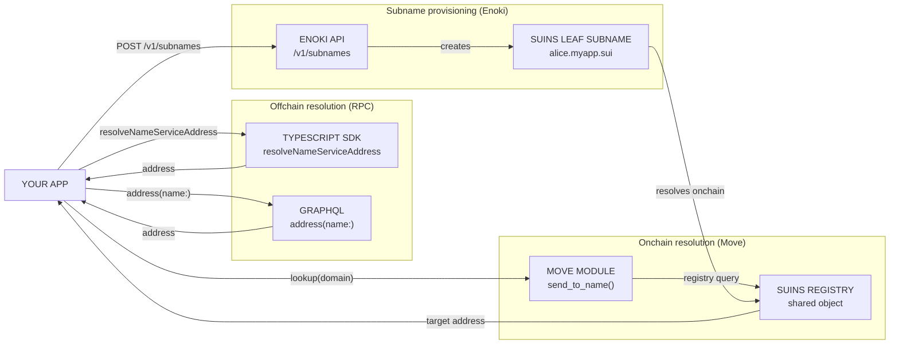

import Tabs from '@theme/Tabs';
import TabItem from '@theme/TabItem';

By the end of this page, you can:

- Resolve a SuiNS name to an address onchain in Move and offchain through the Sui RPC.
- Implement reverse lookup to display human-readable names in your UI.
- Create and manage subnames under a domain you control.
- Integrate the Enoki subname API to provision per-user identities programmatically.

<Tabs className="tabsHeadingCentered--small">
<TabItem value="prereq" label="Prerequisites">

- [x] [Sui CLI](/getting-started/onboarding/sui-install) installed (for onchain resolution examples)
- [x] Node.js 18+ with `@mysten/sui` installed: `pnpm add @mysten/sui`
- [x] A deployed Sui Move package if implementing onchain resolution
- [x] A SuiNS domain if creating subnames (register at [suins.io](https://suins.io/))
- [x] An [Enoki API key](https://portal.enoki.mystenlabs.com) if using the Enoki subname API

</TabItem>
</Tabs>

This guide uses [Sui Messenger](https://github.com/MystenLabs/messaging-sdk-example) as a concrete example throughout. Sui Messenger is a demo encrypted messaging app built on Sui that assigns every user a SuiNS subname under the `sui-stack.sui` parent domain. These subnames serve as human-readable identities in the app's channel system, replacing raw wallet addresses with names like `alice.sui-stack.sui`. The [Onchain Websites with Walrus Sites](/sui-stack/walrus/sui-stack-walrus-sites) guide uses SuiNS to attach a readable URL to a deployed Walrus Site.

## Introduction to SuiNS

Sui Name Service (SuiNS) is a decentralized naming service on the Sui blockchain. You use SuiNS to replace complex wallet addresses with human-readable names ending in `.sui`, and to resolve names to addresses at runtime, both onchain in Move and offchain through RPCs. For the full developer reference including the SuiNS SDK, active package constants, and transaction patterns, see the [SuiNS developer documentation](https://docs.suins.io/developer).

SuiNS has 3 main use cases in app development:

- **Address display:** Show `alice.sui` instead of `0xfe9c7a...` in your UI.
- **Name-based transfers:** Send assets to a name rather than a raw address. The SuiNS registry resolves the name to the correct target address at transaction time.
- **App-specific subnames:** Create subnames under a domain you control (for example, `alice.myapp.sui`) to use as per-user or per-resource identifiers within your app.

Sui Messenger uses the third pattern. The app registers a subname for each user under `sui-stack.sui`, giving every participant a unique identity that the channel UI displays in place of their wallet address.

### Resolution architecture


```mermaid
flowchart LR
    USER["YOUR APP"]

    subgraph onchain ["Onchain resolution (Move)"]
        REG["SUINS REGISTRY\nshared object"]
        MOVE["MOVE MODULE\nsend_to_name()"]
    end

    subgraph offchain ["Offchain resolution (RPC)"]
        RPC["TYPESCRIPT SDK\nresolveNameServiceAddress"]
        GQL["GRAPHQL\naddress(name:)"]
    end

    subgraph subnames ["Subname provisioning (Enoki)"]
        ENOKI["ENOKI API\n/v1/subnames"]
        LEAF["SUINS LEAF SUBNAME\nalice.myapp.sui"]
    end

    USER -->|"lookup(domain)"| MOVE
    MOVE -->|"registry query"| REG
    REG -->|"target address"| USER

    USER -->|"resolveNameServiceAddress"| RPC
    RPC -->|"address"| USER
    USER -->|"address(name:)"| GQL
    GQL -->|"address"| USER

    USER -->|"POST /v1/subnames"| ENOKI
    ENOKI -->|"creates"| LEAF
    LEAF -->|"resolves onchain"| REG
```

## Resolution types

SuiNS supports 2 types of resolution:

- **Lookup:** A name resolves to an address. For example, `example.sui` resolves to `0x2`. Use this when you want to send assets or look up what address a name points to.
- **Reverse lookup:** An address resolves to a name. For example, `0x2` resolves to `example.sui`. Use this when you want to display a human-readable name for a known address.

Both resolution types are available onchain in Move and offchain through the Sui RPC.

## Address types

Lookups work with 2 types of addresses:

- **Target address:** The address that a SuiNS name points to. The NFT holder sets this. For example, `example.sui` might point to `0x2`, making `0x2` the target address for `example.sui`. Multiple names can point to the same target address.
- **Default address:** The SuiNS name that the owner of a wallet address has designated to represent that address. For example, if you own `example.sui` and its target address is your wallet, you can set `example.sui` as the default name for your wallet. The owner must sign a set-default transaction to establish this connection.

When you display names in your UI, use the default address (reverse lookup) rather than the target address. The default address is guaranteed onchain because the wallet owner explicitly signed a transaction to set it.

### Default address reset behavior

The default name for a wallet address resets automatically any time the target address of that name changes. This prevents stale mappings where a name displays for an address it no longer points to.

For example, if `alice.sui` points to address `0xA` and `0xA` has set `alice.sui` as its default name:

1. The NFT holder changes the target address of `alice.sui` from `0xA` to `0xB`.
2. The default name for `0xA` resets to empty. Reverse lookup for `0xA` now returns `null`.
3. `0xB` does not automatically inherit the default. The owner of `0xB` must sign a new set-default transaction to display `alice.sui`.

Account for this reset in your app logic. If a user's default name suddenly returns `null`, the target address of their name might have changed.

### NFT mutability and ownership

A SuiNS NFT (`SuinsRegistration`) acts as a capability object, not an identity token. The NFT grants the holder permission to:

- Change the target address the name points to
- Create subnames (if applicable)
- Renew the registration
- Transfer the NFT to another address

Because the NFT is transferable, the holder of the NFT might not be the address that the name points to. The NFT can change hands at any time without affecting the current target address until the new holder explicitly updates it.

:::caution
Do not use SuiNS NFT ownership as a resolution method. A SuiNS NFT acts as a capability to change the target address, but it does not identify any specific address. Use the target address for lookup resolution and the default address for reverse lookup resolution.
:::

## Onchain resolution

Use the SuiNS core package to resolve names from within a Move module. Add the dependency to your `Move.toml`:

<Tabs groupId="network">
<TabItem value="mainnet" label="Mainnet">

```toml
[dependencies]
suins = { git = "https://github.com/MystenLabs/suins-contracts/", subdir = "packages/suins", rev = "releases/mainnet/core/v3" }
```

</TabItem>
<TabItem value="testnet" label="Testnet">

```toml
[dependencies]
suins = { git = "https://github.com/MystenLabs/suins-contracts/", subdir = "packages/suins", rev = "releases/testnet/core/v2" }
```

</TabItem>
</Tabs>

:::caution
Use the core package only for onchain integration. The utility packages are subject to replacement and might break your logic if they change without a corresponding update to your code.
:::

The following Move module demonstrates how to transfer an object to a SuiNS name. It looks up the name in the SuiNS registry, checks that the name exists and has not expired, retrieves its target address, and transfers the object:

```move
module demo::demo {
    use std::string::String;
    use sui::clock::Clock;
    use suins::{
        suins::SuiNS,
        registry::Registry,
        domain
    };

    const ENameNotFound: u64 = 0;
    const ENameNotPointingToAddress: u64 = 1;
    const ENameExpired: u64 = 2;

    public fun send_to_name<T: key + store>(
        suins: &SuiNS,
        obj: T,
        name: String,
        clock: &Clock
    ) {
        let mut optional = suins.registry<Registry>().lookup(domain::new(name));
        assert!(optional.is_some(), ENameNotFound);
        let name_record = optional.extract();
        assert!(!name_record.has_expired(clock), ENameExpired);
        assert!(name_record.target_address().is_some(), ENameNotPointingToAddress);
        transfer::public_transfer(obj, name_record.target_address().extract())
    }
}
```

The `lookup` call takes a `Domain` value constructed from the name string. `has_expired` takes a [`Clock`](/sui-stack/on-chain-primitives/access-time) reference. `target_address` returns an `Option<address>` that you extract after verifying it is set.

The 3 error constants map to real scenarios you encounter in production:

- `ENameNotFound`: the name does not exist in the registry, or the domain has expired and been released. Check that the name exists at [suins.io](https://suins.io/) before calling `send_to_name`.
- `ENameExpired`: the name exists in the registry but its storage epoch has passed. The holder must renew it before it resolves again.
- `ENameNotPointingToAddress`: the name record exists and has not expired, but the holder has not set a target address. A name can exist without pointing anywhere until the NFT holder calls the set-target-address transaction.

Pass the `SuiNS` [shared object](/develop/objects/object-ownership/shared) as an argument to any function that performs onchain resolution. The object IDs for Mainnet and Testnet are listed in the [SuiNS active constants](https://docs.suins.io/developer#active-constants).

## Offchain resolution

For offchain resolution in a TypeScript or JavaScript app, you have 2 options:

- **`@mysten/sui` client methods:** Every Sui client provides `resolveNameServiceAddress` for name-to-address lookup and `defaultNameServiceName` for the reverse.
- **`@mysten/suins` SDK extension:** The SuiNS SDK adds higher-level methods like `getNameRecord` to any Sui client through the `$extend` pattern. Use this when you need name record details beyond the target address (expiration, metadata, avatar).

### Lookup with `@mysten/sui`


{/* TODO: Import code from MystenLabs/sui-typescript — show resolveNameServiceAddress example */}
{/* Description: Basic name-to-address resolution using client.resolveNameServiceAddress */}

{/* TODO: Import code from MystenLabs/sui-typescript — show defaultNameServiceName example */}
{/* Description: Reverse lookup (address to default name) using client.defaultNameServiceName */}

:::info

The legacy `resolveNameServiceNames` method returned every name assigned to an address. It has no direct replacement. `defaultNameServiceName` returns only the configured default. If you need the full list, use an application indexer.

:::

For [GraphQL RPC](/develop/accessing-data/graphql/graphql-rpc), pass a name to the [`address`](/references/sui-api/sui-graphql/beta/reference/operations/queries/address) query for lookup, and read [`defaultNameRecord`](/references/sui-api/sui-graphql/beta/reference/types/objects/address) on the `Address` type for reverse lookup. To fetch a full name record, including expiration and metadata, use the [`nameRecord`](/references/sui-api/sui-graphql/beta/reference/operations/queries/name-record) query.

### Lookup with the SuiNS SDK extension

The `@mysten/suins` package provides the `suins()` extension function. Attach it to any Sui client through `$extend` to add SuiNS methods. The extension uses `ClientWithCoreApi` and `PackageInfo` internally, and automatically loads the correct constants for Mainnet and Testnet:

<ImportContent source="src/suins-client.ts" mode="code" org="MystenLabs" repo="suins-contracts" tag="suins-extension-example" language="ts" />

{/* TODO: If the suins-client.ts file does not have a docs:: tag for the extension example, import using the doc comment example at the top of the suins() function instead */}

The `getNameRecord` method returns the full name record including expiration timestamp and metadata fields. Use this when you need to check expiry or retrieve associated data like avatars and content hashes.

Install the SuiNS SDK with:

```sh
$ npm i @mysten/suins
```

In Sui Messenger, the `useUserSubname` hook resolves the subname for the connected wallet by querying the Enoki subname API rather than the SuiNS registry directly. This is because subnames under `sui-stack.sui` are provisioned programmatically through Enoki rather than registered by users through the SuiNS portal:

<ImportContent
  source="frontend/src/hooks/useUserSubname.ts"
  mode="code"
  org="MystenLabs"
  repo="messaging-sdk-example"
  language="ts"
  fun="useUserSubname"
/>

The hook queries `https://api.enoki.mystenlabs.com/v1/subnames` with the wallet address and parent domain. It returns the first matching subname for that address under `sui-stack.sui`. The `staleTime` of 5 minutes avoids redundant requests while keeping data reasonably fresh.

### Enoki subname API vs the SuiNS SDK

The [Enoki subname API](https://docs.enoki.mystenlabs.com/subnames) is the right choice when your app provisions subnames on behalf of users rather than letting users register their own names. Enoki holds your SuiNS domain in a managed contract and handles subname creation, deletion, and renewal through a REST API. You authenticate with an Enoki API key and optionally a zkLogin JWT to associate the subname with the user's address automatically.

Use the Enoki subname API when:

- You want every authenticated user to receive a subname automatically (for example, `alice.myapp.sui` on first login).
- Your subnames are app-controlled, not user-registered.
- You use zkLogin for authentication.

Use the SuiNS SDK or RPC directly when:

- Users register and own their own names through the SuiNS portal.
- You need to query or resolve existing names rather than provision new ones.
- You self-host a SuiNS indexer for bulk domain queries.

The key limitation of the Enoki approach is that each user gets at most 1 subname per domain when using a public API key with zkLogin. You need a private API key to specify an arbitrary target address or create multiple subnames per user. See the [Enoki subname documentation](https://docs.enoki.mystenlabs.com/subnames) for full API details.

## End-to-end onchain verification

When you resolve a SuiNS name to send assets or authorize actions, verify 4 conditions before using the result. Skipping any check can result in assets sent to the wrong address, expired names, or unresolvable targets.


Follow this sequence for every onchain resolution:

1. **Verify the name exists.** Call `lookup` on the SuiNS registry. If the result is `None`, the name is not registered or has been released after expiry. Abort the transaction.
2. **Check expiration.** Call `has_expired` with a `Clock` reference. Expired names remain in the registry but should not be trusted. Abort if expired.
3. **Confirm the target address is set.** Call `target_address` on the name record. A name can exist without pointing to any address until the holder sets one. Abort if `None`.
4. **Match the expected address (optional).** If you expect the name to resolve to a specific address (for example, a counterparty in a trade), compare the resolved target address to the expected value. This prevents a time-of-check to time-of-use (TOCTOU) issue where the NFT holder changes the target address between your lookup and the actual transfer.

The Move example in the [onchain resolution](#onchain-resolution) section demonstrates steps 1 through 3. Step 4 depends on your app's requirements.

### Target address snapshots

The target address returned by `lookup` is a snapshot of the current registry state at the time of the transaction. Between the time you read the target address and the time the transaction executes, the NFT holder could change the target. On Sui, this is safe within a single [programmable transaction block](/develop/transactions/ptbs/prog-txn-blocks) because the registry read and the transfer happen atomically. If you separate the lookup and the action across multiple transactions, the target address might change between them.

### Offchain verification

For offchain verification (for example, in a backend service), combine the SuiNS SDK `getNameRecord` method with expiry checks. The verification follows the same 3-step sequence as the onchain approach:

1. Call `getNameRecord` and check for a `null` return (name does not exist).
2. Compare `expirationTimestampMs` against the current time to confirm the name has not expired.
3. Check that `targetAddress` is set and non-empty before using it.

{/* TODO: Import code from MystenLabs/suins-contracts or a Sui example repo — show offchain verification pattern using getNameRecord with expiry and target address checks */}
{/* Description: TypeScript function that resolves a SuiNS name, validates expiry, and confirms target address before use */}

### Reverse lookup verification

When you display a name for an address in your UI, use reverse lookup (`defaultNameServiceName`) rather than scanning all names that point to that address. The reverse lookup returns only the name that the address owner has explicitly set as their default through a signed transaction. This guarantees that the address owner consented to being identified by that name ([SuiNS developer reference](https://docs.suins.io/developer)).

## Indexing

For queries beyond a single name or address lookup (for example, all subnames under a parent domain, or all names pointing to a given address), run your own instance of the [`suins-indexer`](https://github.com/MystenLabs/sui/tree/main/crates/suins-indexer). See the [custom indexer documentation](/develop/accessing-data/custom-indexer) for setup instructions.

## Subnames

Subnames are nested names under a parent name. For example, `alice.myapp.sui` is a subname under `myapp.sui`. Creating subnames has no cost. The maximum nesting depth is 8 levels (10 levels including the second-level domain (SLD) and top-level domain (TLD)).

Parent rules control whether children can be created and whether subnames can extend their expiration to match the parent.

### Subname types

SuiNS has 2 subname types:

- **Node subnames:** Have an associated NFT (`SubDomainRegistration`). The NFT holder can update the target address, create child subnames (if the parent permits), and transfer ownership. Node subnames have their own expiration, which the parent can allow extending.
- **Leaf subnames:** Have no associated NFT. The parent's NFT holder controls the leaf's configuration. Leaf subnames do not expire independently; their lifetime matches the parent. The parent holder can revoke a leaf subname at any time.

The following table summarizes the key differences:

| Capability | Node subnames | Leaf subnames |
|---|---|---|
| Has NFT | Yes | No, parent NFT acts as capability |
| Can create children | Yes, if parent allows | No |
| Expiration | Yes, parent-determined or extendable | No, tied to parent |
| Target address | NFT holder can set; can be empty | Active parent holder can set; cannot be empty |
| Reverse registry | Yes | Yes |
| Transfer ownership | Yes, through NFT | No |
| Revoke | No (except post-expiration) | Yes, parent holder can revoke |

### Choosing a subname type

Choose the subname type based on how you want to manage ownership and lifecycle:

- **Use leaf subnames** when your app creates and manages subnames on behalf of users. Leaf subnames are lighter (no NFT overhead), the parent holder controls them fully, and you can revoke them at any time. This is the right choice for app-assigned identities.
- **Use node subnames** when you want the subname holder to have independent control. Node subnames have their own NFT, so the holder can update the target address, create child subnames, and transfer ownership without the parent's involvement.

### Creating subnames

You can create subnames through 3 methods:

##### Step 1:

Choose your creation method based on your use case:

- **SuiNS portal ([suins.io](https://suins.io/)):** Create subnames manually through the web interface. Navigate to your domain, select the subnames tab, and create a new subname. You need to own the parent domain NFT in your connected wallet.
- **Enoki subname API:** Create subnames programmatically through a REST API. Best for apps that assign subnames to users automatically. See the [Enoki subname documentation](https://docs.enoki.mystenlabs.com/subnames) for API details.
- **Onchain through Move:** Create subnames directly in your smart contract using the SuiNS subnames package. Use this when your subname creation logic is part of an onchain workflow.

##### Step 2:

Configure the subname with the following parameters:

- **Name:** The label for the subname (for example, `alice` for `alice.myapp.sui`). Labels follow the same character rules as SuiNS names: lowercase alphanumeric characters and hyphens, 3 to 63 characters.
- **Target address:** The address the subname points to. Required for leaf subnames. Optional for node subnames (can be set later by the NFT holder).
- **Expiration (node subnames only):** The timestamp when the node subname expires. Must not exceed the parent domain's expiration.

##### Step 3:

Set up resolution so the subname can be looked up. The subname is resolvable immediately after creation through onchain `lookup` and offchain `resolveNameServiceAddress`. If the target address owner wants the subname as their default name, they must sign a separate set-default transaction. Both node and leaf subnames support reverse lookup registration.

### Subname configuration and parent rules

The parent domain holder configures rules that govern child subname behavior:

- **Allow child creation:** The parent can enable or disable subname creation under their domain. If disabled, no new subnames can be created.
- **Allow expiration extension:** For node subnames, the parent can permit the subname holder to extend the expiration up to the parent's own expiration date.
- **Revocation:** The parent holder can revoke leaf subnames at any time. Node subnames cannot be revoked by the parent until they expire.

:::info

If the parent domain expires, all subnames under it stop resolving, regardless of whether they are node or leaf subnames. Renew the parent domain at [suins.io](https://suins.io/) before the 30-day grace period ends to avoid losing subname resolution.

:::

In Sui Messenger, each user receives a leaf subname under `sui-stack.sui`. Leaf subnames are the right choice here because the app manages them programmatically through Enoki. Users do not own or transfer their subnames. The Enoki API provisions a leaf subname for each address that authenticates with the app.

### Sui Messenger: multi-service client with SuiNS subnames

The `MessagingClientProvider` in Sui Messenger composes `SuiStackMessagingClient` with `SealClient` and `WalrusStorageAdapter` into a single extended client. The `useUserSubname` hook fetches the subname for the connected wallet separately and displays it in the channel UI alongside messages:

```tsx
import { SealClient } from '@mysten/seal';
import { SuiStackMessagingClient, WalrusStorageAdapter } from '@mysten/messaging';

const extendedClient = new SuiClient({ url: 'https://fullnode.testnet.sui.io:443' })
  .$extend(
    SealClient.asClientExtension({
      serverConfigs: SEAL_SERVERS.map((id) => ({ objectId: id, weight: 1 })),
    }),
  )
  .$extend(
    SuiStackMessagingClient.experimental_asClientExtension({
      storage: (client) =>
        new WalrusStorageAdapter(client, {
          publisher: 'https://publisher.walrus-testnet.walrus.space',
          aggregator: 'https://aggregator.testnet.walrus.mirai.cloud',
          epochs: 10,
        }),
      sessionKey,
    }),
  );
```

This example targets `@mysten/messaging` 0.3.0, which depends on `@mysten/sui` 1.x and its `SuiClient`. Do not mix it with the `SuiGrpcClient` from `@mysten/sui` 2.x. Check the versions your app resolves before combining these packages.

This pattern (composing Seal, Walrus, and Messaging onto a single Sui client through `$extend`) is the standard way to build a multi-service Sui Stack app. Each extension adds its methods to the client without affecting the others. `useUserSubname` then resolves the wallet's subname independently and the UI renders it next to messages and channel entries, replacing raw addresses throughout the app.

For name registration, see [suins.io](https://suins.io/). For the full developer reference including the SuiNS SDK and transaction patterns, see [docs.suins.io](https://docs.suins.io/developer).

## Failure modes

| Error | Cause | Resolution |
|---|---|---|
| Name not found (`null` or `ENameNotFound`) | Name not registered, or expired and released | Check the name at [suins.io](https://suins.io/); renew if expired |
| Target address not set (`ENameNotPointingToAddress`) | Name exists but holder has not set a target address | Holder must call set-target-address in the SuiNS portal |
| Name expired (`ENameExpired`) | Storage epoch passed; name still in registry but resolves as expired | Holder must renew at [suins.io](https://suins.io/) |
| Wrong network | Mainnet name queried on Testnet client or reverse | Match the client `baseUrl` to the network where the name is registered |
| Enoki subname creation fails (domain not `LIVE`) | Domain linked but not published in Enoki Portal | Publish the domain in the Enoki Portal before calling the API |
| Subname not resolving after creation | Enoki subname is asynchronous; status is `PENDING` | Poll `GET /v1/subnames` until status is `ACTIVE` |
| Domain expired, subnames stop resolving | SuiNS domain past expiry or grace period | Renew domain at [suins.io](https://suins.io/) before the 30-day grace period ends |

## Troubleshooting

**Name not found.** `lookup` returns `null` or the Move `ENameNotFound` aborts. Check that the name exists and is spelled correctly at [suins.io](https://suins.io/). Expired names return `null` even if they previously had registrations.

**Target address not set.** `target_address` returns `None` even though the name exists. The holder has not set a target address. In your UI, treat `None` as unresolvable and prompt the user to set a target address in the SuiNS portal.

**Wrong network.** `resolveNameServiceAddress` resolves with `address` set to `null` on Mainnet for a name registered on Testnet, or the reverse. Confirm that the client `baseUrl` matches the network where the name is registered.

**Enoki subname creation fails.** The API returns an error if the domain is not in `LIVE` status. Publish the domain in the Enoki Portal before calling the creation endpoint. If using a public API key with zkLogin, each user can only have 1 subname per domain. A second creation attempt returns an error.

**Subname not resolving after creation.** Enoki subname creation is asynchronous. The subname enters `PENDING` status and takes a few seconds to become `ACTIVE` and resolve onchain. Poll `GET /v1/subnames` until status is `ACTIVE` before assuming failure.

**Subname creation blocked after domain expiry.** If your SuiNS domain expires, Enoki cannot create or delete subnames and existing subnames stop resolving. Renew the domain at [suins.io](https://suins.io/) before the 30-day grace period ends.
