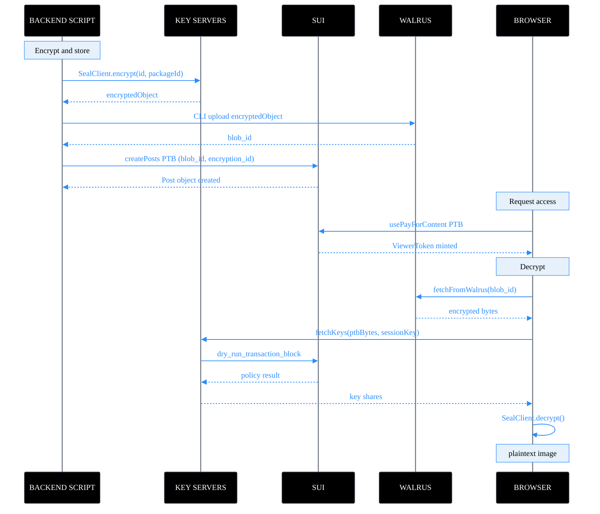

This guide continues from [Data Storage Using Walrus](/sui-stack/walrus-seal/sui-stack-walrus) and builds on the same [OnlyFins](https://github.com/MystenLabs/onlyfins-example-app) app. The Walrus guide covers how OnlyFins stores and reads images. This guide covers how it protects them: encrypting images before upload and enforcing onchain access control so only authorized users can decrypt them.

By the end of this guide, you understand how to design a [Seal](https://seal-docs.wal.app/) access control policy in [Move](/develop/write-move/sui-move-concepts), how to encrypt data before uploading it to [Walrus](https://docs.wal.app/), and how to implement the full client-side decryption flow in a browser app.

### Encrypt-upload-decrypt sequence



:::caution
Seal should not be used to protect highly sensitive data such as wallet keys, personal health information, or government-level secrets. Review the [Seal Terms of Service](https://seal-docs.wal.app/TermsOfService) and [security best practices](https://seal-docs.wal.app/) before deploying to production.
:::

## Introduction to Seal

Seal is a decentralized secrets management (DSM) service that uses access control policies defined and validated on Sui. You use Seal to encrypt sensitive data before storing it on Walrus, onchain, or in any other storage, and then issue decryption keys only to users who satisfy your onchain access conditions.

Seal has 3 core components:

- **Onchain access policies:** Move functions you write that define who is allowed to decrypt. [Key servers](https://seal-docs.wal.app/ServerOverview) evaluate your policy by running a `dry_run_transaction_block` on Sui when a user requests decryption key shares. If the policy approves, the key shares are returned.
- **Key servers:** Offchain services that hold [IBE (identity-based encryption)](https://seal-docs.wal.app/Design) master secret keys. Each server returns derived decryption key shares only when the request satisfies the associated onchain policy. You configure a threshold, so decryption requires at least `t` out of `n` servers to agree.
- **Client-side encryption:** The user encrypts and decrypts data locally in their environment. Key servers never see plaintext.

In OnlyFins, the access policy is: the user must own a `ViewerToken` object for the specific post they want to unlock. The user receives a `ViewerToken`, a [Sui object](/develop/sui-architecture/object-model), after requesting access onchain. Seal key servers check this ownership before issuing key shares.

### How Seal fits with Walrus

Walrus stores all blobs publicly. Seal provides the encryption layer on top. The workflow is:

1. Encrypt the image locally with Seal before upload.
2. Store the encrypted blob on Walrus. The blob ID is stored on the `Post` Sui object.
3. When you want to view a post, you build a transaction that proves you own a `ViewerToken`.
4. Seal key servers verify the transaction against the onchain policy and return key shares.
5. The user combines the key shares to derive the decryption key and decrypts the image locally.

The blob on Walrus is always public. What is secret is the encryption key, and access to that key is controlled entirely by the onchain policy.

## Tooling

2 tools support Seal integration: the CLI for local testing and the TypeScript SDK for application development.

### Seal CLI

The Seal CLI (`seal-cli`) lets you encrypt and decrypt data, generate key pairs, inspect encrypted objects, and fetch keys for testing. It is useful for verifying your Move policy and testing key server connectivity before integrating the SDK. See the [Seal CLI documentation](https://seal-docs.wal.app/SealCLI) for usage.

### Seal TypeScript SDK

The `@mysten/seal` package provides `SealClient` for encryption and decryption, and `SessionKey` for managing user-approved access sessions.

Install the SDK:

```bash
$ npm install --save @mysten/seal @mysten/sui
```

The `@mysten/seal` package provides 2 primary classes:

- **`SealClient`:** Handles encryption, key fetching, and decryption. Can be instantiated standalone or as a Sui client extension.
- **`SessionKey`:** Represents a user-approved session that allows a browser app to fetch decryption keys without triggering a wallet popup on every request. A session has a time-to-live (TTL) and is scoped to a specific package ID.

OnlyFins uses `SealClient` in standalone mode. The `createSealClient` factory in `seal-client.ts` initializes it with the Testnet key server object IDs:

<ImportContent
  source="frontend/src/lib/seal-client.ts"
  mode="code"
  org="MystenLabs"
  repo="onlyfins-example-app"
  language="ts"
/>

:::info
Some code examples in this guide use older Sui transports: OnlyFins uses `SuiClient` from `@mysten/sui/client`, and the seal-demo standalone script uses `SuiJsonRpcClient` from `@mysten/sui/jsonRpc`, which is deprecated. `SuiGrpcClient` from `@mysten/sui/grpc` is the recommended transport for all new integrations. All `SealClient` constructor and encrypt/decrypt APIs are identical regardless of which transport you use. See the [Sui SDK v2 migration guide](https://sdk.mystenlabs.com/sui/migrations/sui-2.0) for upgrade instructions.
:::

The key server object IDs come from `constants.ts`. These IDs point to onchain `KeyServer` objects that always hold the latest URL as the source of truth. See the [Seal documentation](https://seal-docs.wal.app/Pricing) for the full list of verified key servers and their modes (open vs. permissioned).

<ImportContent
  source="frontend/src/constants.ts"
  mode="code"
  org="MystenLabs"
  repo="onlyfins-example-app"
  language="ts"
  variable="SEAL_SERVER_IDS"
/>

## Access control management

Access control in Seal is defined by Move functions you write in your app's package. Your Seal-integrated Move module must expose at least one `entry fun seal_approve*` function. Key servers call this function through `dry_run_transaction_block` to determine whether to issue key shares. If the function aborts, access is denied. If it completes successfully, access is granted.

### The `seal_approve` convention

Write a `seal_approve` function that follows these rules:

- It must be an `entry fun`, not a public function.
- Its first parameter must always be `id: vector<u8>`. This is the inner identity. Seal prepends the package ID to form the full namespaced identity.
- It should abort with a meaningful error code if the caller does not satisfy the access condition.
- It must not be called from other [programmable transaction block (PTB)](/develop/transactions/ptbs/prog-txn-blocks) commands during Seal evaluation. Only `seal_approve*` functions are invoked directly.

You pass the identity for each encrypted object as the `id` value at encryption time. The same `id` must be used in the `seal_approve` PTB at decryption time.

### OnlyFins access control: `ViewerToken` gating

OnlyFins implements a purchase-to-access pattern. Each encrypted post has an associated `encryption_id`. To decrypt a post, the user must prove ownership of a `ViewerToken` object whose `post_id` field matches the post being unlocked.

The `seal_approve_access` function in the `posts` module enforces this:

<ImportContent
  source="frontend/move/sources/posts.move"
  mode="code"
  org="MystenLabs"
  repo="onlyfins-example-app"
  language="move"
  fun="seal_approve_access"
/>

This function receives the Seal ID, the `Post` object, and the user's `ViewerToken`. It checks that the `ViewerToken` is issued for the correct post and that the encryption ID matches. If either check fails, it aborts and the key server denies the request.

### Acquiring a `ViewerToken`

The onchain transaction mints a `ViewerToken` when a user requests access to a post. The `usePayForContent` hook builds and executes this transaction:

<ImportContent
  source="frontend/src/hooks/usePayForContent.ts"
  mode="code"
  org="MystenLabs"
  repo="onlyfins-example-app"
  language="ts"
/>

After the transaction succeeds, the user sees the `ViewerToken` object in their wallet. Seal key servers now approve decryption requests for that post from that wallet address.

### Other access control patterns

OnlyFins uses a purchase-gated pattern, but Seal's `seal_approve` mechanism is fully generic. The [seal-demo](https://github.com/MystenLabs/sui-move-bootcamp/tree/main/K5/seal-demo) in the Sui Move Bootcamp provides 3 minimal working implementations of the most common patterns.

#### Owner-only access

The most basic policy: only the wallet address encoded in the identity decrypts the content. The entire `seal_approve` function is a single assertion comparing the [Binary Canonical Serialization (BCS)](https://sdk.mystenlabs.com/sui/bcs)-encoded caller address to the `id` bytes:

<ImportContent
  source="K5/seal-demo/move/sources/private_seal.move"
  mode="code"
  org="MystenLabs"
  repo="sui-move-bootcamp"
  language="move"
/>

#### Time-lock access

Users can only decrypt data after a specific timestamp has passed. The `id` encodes a `u64` unlock time in milliseconds. The `seal_approve` function peeks the timestamp from the identity bytes and checks it against the Sui [`Clock`](/sui-stack/on-chain-primitives/access-time) object:

<ImportContent
  source="K5/seal-demo/move/sources/timelock_seal.move"
  mode="code"
  org="MystenLabs"
  repo="sui-move-bootcamp"
  language="move"
/>

#### `Allowlist` access

A shared `Allowlist` object holds a list of authorized addresses that an admin manages. The `seal_approve` function checks that the caller is a member. Because the allowlist is a [shared object](/develop/objects/object-ownership/shared), the admin can add or remove members at any time without re-encrypting the content:

<ImportContent
  source="K5/seal-demo/move/sources/allowlist_seal.move"
  mode="code"
  org="MystenLabs"
  repo="sui-move-bootcamp"
  language="move"
/>

For subscription-based access (time-bound paid access) and other patterns, see the Seal repository's [`examples/move`](https://github.com/MystenLabs/seal/tree/main/examples) directory.

## Encrypting

Encryption happens before upload, entirely on the client side. You never send the data in plaintext.

### How Seal encryption works

`SealClient.encrypt` uses identity-based encryption (IBE). Each piece of content is encrypted to a specific identity, which is a byte string composed of your package ID (prepended automatically by Seal) and the `id` you provide. The same `id` is later used in the `seal_approve` PTB to gate decryption.

The `encrypt` call returns the `encryptedObject` (the ciphertext) and a backup `key`. You can use the backup key for disaster recovery with the `seal-cli symmetric-decrypt` command. Store or discard it according to your recovery requirements.

### OnlyFins server-side encryption

In OnlyFins, encryption runs in the backend `encryptImages.ts` script before images are uploaded to Walrus. The script generates a unique `encryptionId` for each post, encrypts the image bytes, and saves the ciphertext to disk for CLI upload:

<ImportContent
  source="backend/src/encryptImages.ts"
  mode="code"
  org="MystenLabs"
  repo="onlyfins-example-app"
  language="ts"
  fun="main"
/>

A few things to note about the OnlyFins encryption setup:

- The `encryptionId` is a hex-encoded string derived from a timestamp and post index. This value becomes the Seal `id` parameter, which must later be passed to `seal_approve_access` during decryption.
- The `threshold` is 1, meaning a single key server is sufficient to issue decryption keys. In production, a higher threshold distributes trust across multiple servers.
- The `packageId` ties the encrypted object to the specific deployed Move package. Seal prepends this to the `id` to form the full namespaced identity.

The `encryptionId` is then stored as the `encryption_id` field on the `Post` Sui object when `createPosts.ts` registers the post onchain. This links the Walrus blob, the Seal encryption, and the Sui object together.

:::tip
Seal supports envelope encryption for large files. Generate a symmetric key, encrypt the image data with AES, then encrypt only the symmetric key with Seal. This is more efficient for large payloads and is the recommended pattern for anything larger than a few hundred KB. See the [Seal documentation](https://seal-docs.wal.app/UsingSeal) for details.
:::

### Browser-side encryption

For React apps, the `useSealEncrypt` hook from `walrus-pocs` shows how to encrypt a message in the browser using a nonce-based key ID derived from the sender's address:

<ImportContent
  source="walrus-seal/app/src/hooks/useSealEncrypt.ts"
  mode="code"
  org="MystenLabs"
  repo="walrus-pocs"
  language="ts"
  fun="useSealEncrypt"
/>

The underlying `encryptData` utility in `sealUtils.ts` wraps `SealClient.encrypt` in a reusable form that works across both browser and Node.js contexts:

<ImportContent
  source="walrus-seal/app/src/utils/sealUtils.ts"
  mode="code"
  org="MystenLabs"
  repo="walrus-pocs"
  language="ts"
  fun="encryptData"
/>

### Standalone script: full encrypt and decrypt flow

The seal-demo includes a Node.js script that shows the complete Seal workflow in a single file: client setup, encryption, session key creation, PTB construction, and decryption, using the owner-only access pattern:

<ImportContent
  source="K5/seal-demo/ts/src/index.ts"
  mode="code"
  org="MystenLabs"
  repo="sui-move-bootcamp"
  language="ts"
/>

## Decrypting

Decryption in OnlyFins is entirely client-side. Your browser fetches the encrypted blob from the Walrus [aggregator](https://docs.wal.app/docs/operator-guide/aggregators/operating-aggregator), requests key shares from Seal key servers, derives the decryption key, and decrypts the image locally. Key servers never see the ciphertext or the plaintext.

### Session keys

A `SessionKey` is a short-lived credential that authorizes a browser app to fetch decryption keys from Seal key servers without triggering a wallet popup on every request. The user approves a session once per package, signing a personal message in their wallet. You configure the TTL for which the session is valid.

The `useSealSession` hook from `walrus-pocs` shows the general-purpose pattern: create a `SessionKey`, prompt the user to sign, activate the session, and auto-clear it when the wallet disconnects or switches:

<ImportContent
  source="walrus-seal/app/src/hooks/useSealSession.ts"
  mode="code"
  org="MystenLabs"
  repo="walrus-pocs"
  language="ts"
  fun="useSealSession"
/>

The `createAndSignSessionKey` utility in `sealUtils.ts` shows the core signing flow in isolation, with notes on signature format requirements for both Sui wallets and non-Sui wallets:

<ImportContent
  source="walrus-seal/app/src/utils/sealUtils.ts"
  mode="code"
  org="MystenLabs"
  repo="walrus-pocs"
  language="ts"
  fun="createAndSignSessionKey"
/>

In OnlyFins, the same session key lifecycle is managed through `useSessionJWT.ts` and a `SessionKeyProvider` context, which ties session creation to Enoki-based JWT authentication rather than direct wallet signing.

### The full decryption flow

The `useSealDecrypt` hook from `walrus-pocs` shows the general-purpose decryption pattern: fetch owned `PrivateData` objects, build the approval PTB, and call `sealClient.decrypt`:

<ImportContent
  source="walrus-seal/app/src/hooks/useSealDecrypt.ts"
  mode="code"
  org="MystenLabs"
  repo="walrus-pocs"
  language="ts"
  fun="useSealDecrypt"
/>

In OnlyFins, the `usePostDecryption` hook implements the same flow scoped to the OnlyFins `Post` and `ViewerToken` objects:

<ImportContent
  source="frontend/src/hooks/usePostDecryption.ts"
  mode="code"
  org="MystenLabs"
  repo="onlyfins-example-app"
  language="ts"
  fun="usePostDecryption"
/>

The flow has 4 steps:

1. **Fetch the encrypted blob.** `fetchFromWalrus` retrieves the raw encrypted bytes from the Walrus aggregator using the blob ID stored on the `Post` object.

2. **Build the approval transaction.** A PTB is constructed that calls `posts::seal_approve_access` with the encryption ID, the `Post` object, and the user's `ViewerToken`. This transaction is never executed onchain. It is passed as `txBytes` to `fetchKeys`, where the key server uses `dry_run_transaction_block` to evaluate the policy.

3. **Fetch key shares.** `sealClient.fetchKeys` sends the PTB bytes and the session key to the configured key servers. Each server that validates the policy returns a key share. When enough shares are gathered to meet the threshold, the decryption key can be derived.

4. **Decrypt locally.** `sealClient.decrypt` combines the key shares to reconstruct the decryption key and decrypts the image bytes. The decrypted bytes are converted to a blob URL and set as the image source in the component.

The `checkShareConsistency` flag is set to `false` in OnlyFins. For production apps handling sensitive data, set it to `true` to verify that key shares from different servers are consistent before combining them.

## Failure modes

| Error | Cause | Resolution |
|---|---|---|
| Session key expired | TTL elapsed since wallet approval | Re-create session key; user re-approves |
| Key server unreachable | Network issue or server offline | Check server status; retry with exponential backoff |
| Decryption fails after grant | `ViewerToken` exists but `encryption_id` mismatch | Verify `encryption_id` matches the value stored on the `Post` object |
| `seal_approve` aborts | Access condition not met | Confirm the user owns the required object; check Move policy logic |
| Threshold not met | Fewer than `t` servers responded | Increase timeout; check key server configuration |
