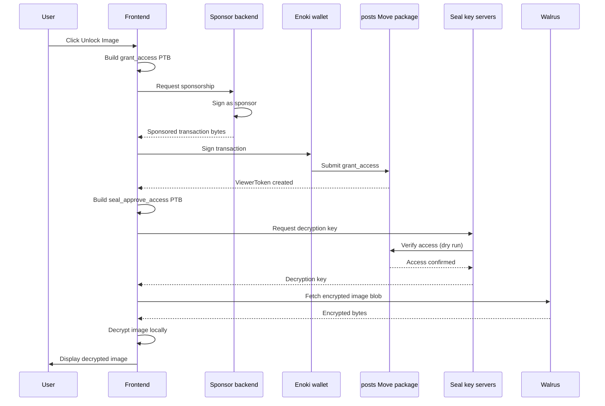

OnlyFins is a Web3 social platform that demonstrates encrypted content sharing with onchain access control. Creators publish posts with images they store on [Walrus](https://docs.wal.app) and encrypt through [Seal](https://seal-docs.wal.app), while viewers purchase `ViewerToken` capability objects to decrypt and view content. The app uses [Enoki](https://docs.enoki.mystenlabs.com/) for [zkLogin](/sui-stack/zklogin-integration/zklogin) authentication and [sponsored transactions](/develop/transaction-payment/sponsor-txn) so users interact without holding SUI for gas.

## When to use this pattern

Use this pattern when you need to:

- Gate access to encrypted content with onchain ownership tokens rather than a centralized paywall server.

- Store encrypted files on Walrus and control decryption through Seal threshold encryption tied to Move-level access control.

- Let users authenticate with Google through zkLogin and interact without holding SUI for gas.

- Build a content marketplace where creators publish and viewers pay for access, all verifiable onchain.

- Combine shared objects (posts visible to all) with owned objects (viewer tokens that prove access) in a single application.

## What you learn

This example teaches:

- **Shared objects:** Posts are [shared objects](/develop/objects/object-ownership/shared) that any user can read metadata from, but only authorized users can decrypt the attached content.

- **Capability pattern:** `ViewerToken` objects act as owned [capability](/develop/write-move/sui-move-concepts) tokens that prove a user purchased access to a specific post.

- **Seal encryption:** Threshold encryption where the Move contract itself authorizes decryption key release. Seal key servers only return the decryption key after dry-running a `seal_approve_access` transaction that confirms the caller holds a valid `ViewerToken`.

- **Sponsored transactions:** A backend pays gas so users interact without holding SUI. The frontend sends unsigned transactions to the sponsor backend, which co-signs and returns the sponsored bytes.

- **Walrus storage:** The frontend stores encrypted image blobs offchain on Walrus and references them by blob ID. Walrus blobs are publicly addressable, so you must encrypt content to restrict access.

## Architecture

The example has 4 actors and 1 onchain package. The frontend builds transactions and renders post feeds as a React app. The Enoki wallet handles zkLogin authentication and transaction signing. The posts Move package stores post metadata and issues `ViewerToken` objects as [shared](/develop/objects/object-ownership/shared) and [address-owned](/develop/objects/object-ownership/address-owned) objects on Sui. Seal key servers hold threshold encryption keys and release them only when the Move contract confirms access through `seal_approve_access`. Walrus stores the actual image blobs, both encrypted and unencrypted. The sponsor backend covers gas fees so users do not need SUI in their wallet.

The diagram below traces 1 full interaction from a user unlocking content to viewing the decrypted image.



The following steps walk through the flow:

1. The user clicks **Unlock Image** on a locked post, triggering the `usePayForContent` hook.

2. The frontend builds a `grant_access` transaction and sends it to the sponsor backend, which pays for gas and returns the co-signed transaction.

3. The wallet signs and submits the transaction. The Move package creates a `ViewerToken` owned by the user.

4. The frontend detects the new token, builds a `seal_approve_access` transaction, and sends it to the Seal key servers.

5. Seal dry-runs the transaction against the Move contract. Because the user now holds a valid `ViewerToken`, the contract confirms access.

6. Seal returns the decryption key. The frontend fetches the encrypted blob from Walrus, decrypts it locally, and renders the image.

Errors can occur at the sponsorship step (backend unreachable), the Seal step (session key expired), or the Walrus fetch (blob not found).

### How Seal and Walrus work together

Walrus is a content-addressed storage protocol where you retrieve data by blob ID. Walrus makes all blobs publicly addressable, so anyone who knows the blob ID can fetch the raw bytes. To restrict access, the frontend encrypts content before uploading to Walrus.

Seal provides the encryption layer. When a creator publishes a post, the frontend encrypts the image with a key managed by Seal's threshold key servers. The Move contract defines who can decrypt: the `seal_approve_access` function checks whether the caller is the post author or holds a `ViewerToken` for that post. Seal key servers only release the decryption key after dry-running this function and confirming it does not abort.

This combination means Walrus handles storage and availability, Seal handles key management and access control, and the Move contract defines the access policy.

## Prerequisites

<Tabs className="tabsHeadingCentered--small">
<TabItem value="prereq" label="Prerequisites">
- [x] [Install the latest version of Sui](/getting-started/onboarding/sui-install).

- [x] [Configure the Sui client](/getting-started/onboarding/configure-sui-client).

- [x] [Create a Sui address](/getting-started/onboarding/get-address).

- [x] [Get SUI Testnet tokens](/getting-started/onboarding/get-coins).

- [x] Download and install an IDE. The following are recommended, as they offer Move extensions:

    - [VSCode](https://code.visualstudio.com/), corresponding [Move extension](https://marketplace.visualstudio.com/items?itemName=mysten.move)

    - [Emacs](https://www.gnu.org/software/emacs/), corresponding [Move extension](https://github.com/amnn/move-mode)

    - [Vim](https://www.vim.org/download.php), corresponding [Move extension](https://github.com/yanganto/move.vim)

    - [Zed](https://zed.dev/), corresponding [Move extension](https://github.com/Tzal3x/move-zed-extension)

        Alternatively, you can use the [Move web IDE](https://www.playmove.dev/), which does not require a download. It does not support all functions necessary for this guide, however.

- [x] [Download and install Git](https://git-scm.com/downloads).

- [x] [Node.js](https://nodejs.org/) 18 or later, with [pnpm](https://pnpm.io/installation) installed

- [x] A Sui wallet ([Slush Wallet](https://slush.app/) or another compatible wallet) or

- [x] [Enoki](https://portal.enoki.mystenlabs.com/) zkLogin

</TabItem>
</Tabs>

## Setup

Follow these steps to set up the example locally.

##### Step 1: Clone the repo

```bash
$ git clone https://github.com/MystenLabs/onlyfins-example-app.git
$ cd onlyfins-example-app/frontend
```

##### Step 2: Install frontend dependencies

```bash
$ pnpm install
```

##### Step 3: Configure the network

```bash
$ sui client switch --env testnet
```

##### Step 4: Publish the Move package

```bash
$ cd move/posts
$ sui move build
$ sui client publish --gas-budget 200000000
```

Record the package ID from the publish output. You need it in the next step.

```bash
│ Published Objects:                                                                               │
│  ┌──                                                                                             │
│  │ PackageID: 0x29af8b7725a4cd3ba29f7c836433ea115ade7460bc5c610d9e7580d10cd991de          <---- Package ID       │
│  │ Version: 1                                                                                    │
│  │ Digest: 9joVfPViTuK6zfyxfFq23dxJcTXfgaBDKMXgVLAraWxv                                          │
│  │ Modules: posts                                                                                │
│  └──                       
```

##### Step 5: Update the package ID

Open `frontend/src/constants.ts` and replace the `POSTS_PACKAGE_ID` value with the package ID from the previous step.

##### Step 6: Set up the backend

```bash
$ cd ../../../backend/
$ cp .env.example .env
```

Edit `.env` and fill in the author private keys and the package ID:

```bash title='.env'
AUTHOR_1_PRIVATE_KEY=YOUR_ED25519_PRIVATE_KEY
AUTHOR_2_PRIVATE_KEY=YOUR_ED25519_PRIVATE_KEY
AUTHOR_3_PRIVATE_KEY=YOUR_ED25519_PRIVATE_KEY
PACKAGE_ID=PACKAGE_ID_FROM_STEP_4
```

To get your private key, use the command:

```bash
$ sui keytool export --key-identity YOUR_WALLET_ADDRESS
```

Then copy the value `exportedPrivateKey`. It should start with `suiprivkey1...`

##### Step 7: Encrypt and upload images

The backend has 2 scripts that prepare demo content. Run them in order. The first script creates encrypted image files in `backend/encrypted/` and outputs JSON mapping files:

```bash
$ pnpm install
$ pnpm encrypt-images
```

Upload the encrypted and unencrypted images to Walrus, then populate the blob IDs in the generated JSON files. The second script publishes the posts onchain using the configured author key pairs:

```bash
$ pnpm create-posts
```

## Run the example

Start the frontend:

```bash
$ cd frontend
$ pnpm dev
```

Open `http://localhost:5173` in a browser. You see a feed of posts, some with locked images behind a paywall overlay. Sign in with Google through Enoki, then click **Unlock Image** on a locked post. The frontend requests a `ViewerToken`, decrypts the image through Seal, and displays it.

## Key code highlights

The following snippets are the parts of the code worth reading carefully.

### Post creation with optional encryption

The `create_post` entry function creates a shared `Post` object with an optional encryption ID.

<ImportContent source="frontend/move/posts/sources/posts.move" mode="code" org="MystenLabs" repo="onlyfins-example-app" fun="create_post" />

When `encryption_id` contains a value, the post requires a `ViewerToken` to decrypt. When it contains `none`, the image is publicly viewable. The function shares the post so any user can read its metadata.

### Seal access control gate

The `seal_approve_access` function is the onchain gate that Seal calls before releasing decryption keys.

<ImportContent source="frontend/move/posts/sources/posts.move" mode="code" org="MystenLabs" repo="onlyfins-example-app" fun="seal_approve_access" />

This function checks 2 conditions: the caller is the post author, or the caller holds a `ViewerToken` linked to this post. It also verifies the requested `encryption_id` matches the post. If any check fails, the transaction aborts and Seal refuses to release the key.

### Granting access with viewer tokens

The `grant_access` function mints a new `ViewerToken` and returns it.

<ImportContent source="frontend/move/posts/sources/posts.move" mode="code" org="MystenLabs" repo="onlyfins-example-app" fun="grant_access" />

The function creates an owned object and transfers it to the viewer. The token links the viewer address to a specific post ID, which `seal_approve_access` checks later.

### Paying for content

The `usePayForContent` hook builds and sponsors the transaction that grants a viewer access to a post.

<ImportContent source="frontend/src/hooks/usePayForContent.ts" mode="code" org="MystenLabs" repo="onlyfins-example-app" fun="usePayForContent" />

The hook calls the `grant_access` Move function, transfers the resulting `ViewerToken` to the current account, and sponsors the transaction so the user pays no gas. After the transaction finalizes, it refetches the user's owned objects so the UI updates.

### Decrypting images through Seal

The `usePostDecryption` hook fetches encrypted images from Walrus and decrypts them using Seal session keys.

<ImportContent source="frontend/src/hooks/usePostDecryption.ts" mode="code" org="MystenLabs" repo="onlyfins-example-app" fun="usePostDecryption" />

For each encrypted post the user has access to, the hook builds a `seal_approve_access` transaction, retrieves the decryption key from the Seal key servers, fetches the encrypted blob from Walrus, and decrypts it locally. It auto-detects the image MIME type from the first bytes of the decrypted data.

## Common modifications

- **Add payment for access:** Require viewers to pay SUI or a custom token in the `grant_access` function before minting the `ViewerToken`. Transfer the payment to the post author.

- **Add subscription tiers:** Create a `Subscription` object that grants access to all posts from a creator for a set duration. Check subscription validity in `seal_approve_access` alongside the per-post `ViewerToken` check.

- **Replace Enoki with wallet-only auth:** Remove the Enoki zkLogin flow and use a standard wallet connection through dApp Kit. Remove the sponsor backend and let users pay their own gas.

- **Add content categories:** Extend the `Post` struct with a `category` field. Filter posts by category in the frontend and allow creators to organize their content.

- **Add creator profiles:** Create a shared `CreatorProfile` object per author that stores a display name, bio, and avatar blob ID on Walrus. Link posts to the profile for a richer feed experience.

## Troubleshooting

The following sections address common issues with this example.
### Package ID is missing or invalid

**Symptom:** The frontend logs `Error: invalid package ID` or transactions fail with `PackageNotFound`.

**Cause:** The `POSTS_PACKAGE_ID` in `constants.ts` still has the default value, or you published the package on a different network than the wallet targets.

**Fix:** Re-run the publish step on Testnet, then update `constants.ts` with the new package ID and restart the dev server.

### Wallet does not connect

**Symptom:** Clicking **Sign In** does nothing, or the Google OAuth flow fails.

**Cause:** The Enoki API key or Google Client ID is misconfigured, or the browser blocks third-party cookies.

**Fix:** Verify the Enoki and Google credentials in `main.tsx`. Try a different browser or disable cookie-blocking extensions.

### Session key expired

**Symptom:** A modal appears saying the session key has expired, and decryption stops working.

**Cause:** Seal session keys have a 30-minute TTL. The key expired between signing and attempting decryption.

**Fix:** Click the button in the modal to sign a new session key. The app signs automatically and resumes decryption.

### Encrypted image fails to load

**Symptom:** A post unlocks (the app grants a `ViewerToken`) but the image shows as broken or never loads.

**Cause:** The Walrus aggregator is unreachable, the blob ID is invalid, or you did not upload the encrypted image to Walrus.

**Fix:** Verify the blob ID in the post object with `sui client object POST_ID`. Check that the Walrus aggregator URL in `constants.ts` is reachable. Re-upload the image if the blob ID is a placeholder.

### Gas budget too low

**Symptom:** The transaction fails with `InsufficientGas` or a similar error.

**Cause:** The sponsor backend gas budget is below what the function consumes.

**Fix:** Increase the gas budget in the sponsor backend or the transaction builder. For CLI publishing, raise `--gas-budget` to `200000000`.
