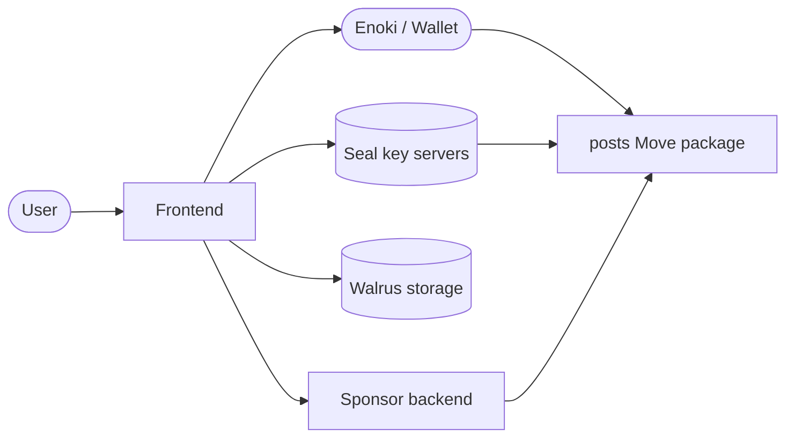
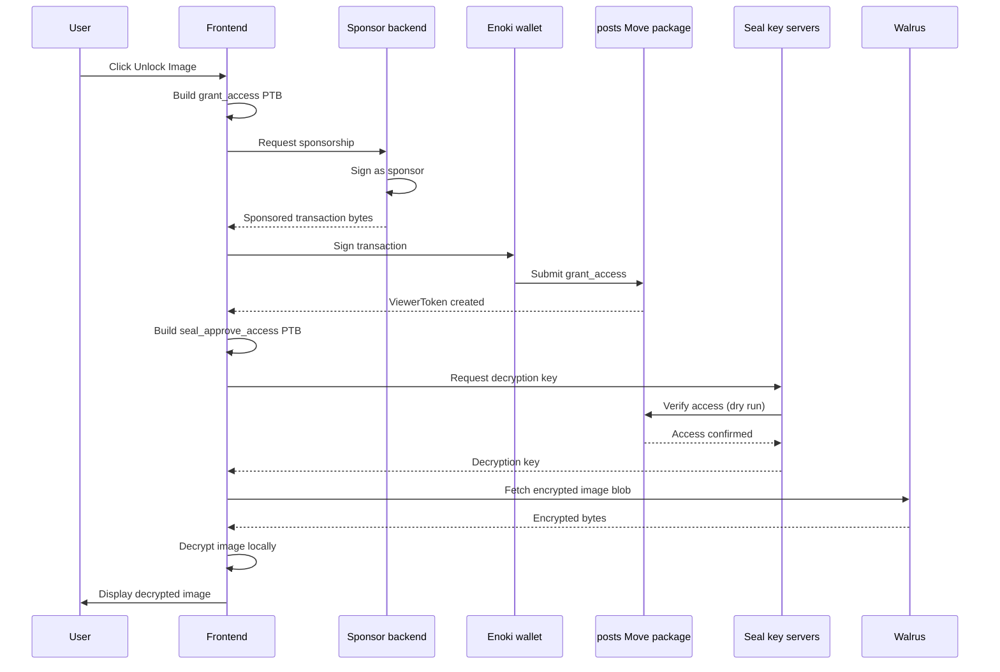

OnlyFins is a Web3 social platform that demonstrates encrypted content sharing with onchain access control. Creators publish posts with images they store on Walrus and encrypt through Seal, while viewers purchase `ViewerToken` capability objects to decrypt and view content. The example targets Testnet and suits readers who already know the basics of Move modules, React, and the Sui TypeScript SDK.

## What you learn

By the end of this page, you can:

- Create shared objects that store encrypted content references onchain.
- Use Seal threshold encryption to gate access to offchain data.
- Issue capability tokens (`ViewerToken`) that prove a viewer has access to a post.
- Integrate Enoki-based zkLogin for wallet authentication with sponsored transactions.
- Fetch and decrypt images from Walrus storage in a React frontend.

This example teaches:

- **Shared objects:** Posts function as shared objects any user can read, but only authorized users can decrypt.
- **Capability pattern:** ViewerTokens act as owned objects that prove access.
- **Seal encryption:** Threshold encryption where the Move contract itself authorizes decryption key release.
- **Sponsored transactions:** A backend pays gas so users interact without holding SUI.
- **Walrus storage:** The frontend stores encrypted image blobs offchain and references them by blob ID.

## Prerequisites

<Tabs className="tabsHeadingCentered--small">
<TabItem value="prereq" label="Prerequisites">
- [x] Sui CLI installed and configured for Testnet
- [x] Node.js 18 or later, with pnpm installed
- [x] A browser wallet (Slush Wallet or another Sui-compatible wallet) or willingness to use Enoki zkLogin
</TabItem>
</Tabs>

## Architecture

The example has 4 actors and 1 onchain package. The diagram below shows the components and the calls between them.



The **Frontend** builds transactions and renders post feeds as a React app. The **Enoki wallet** handles zkLogin authentication and transaction signing. The **posts Move package** stores post metadata and issues ViewerTokens as shared and owned objects on Sui. **Seal key servers** hold threshold encryption keys and release them only when the Move contract confirms access through `seal_approve_access`. **Walrus** stores the actual image blobs, both encrypted and unencrypted. The **Sponsor backend** covers gas fees so users do not need SUI in their wallet.

## Setup

Follow these steps to set up the example locally.

##### Step 1: Clone the repo

```bash
$ git clone https://github.com/MystenLabs/onlyfins-example-app.git
$ cd onlyfins-example-app
```

##### Step 2: Install frontend dependencies

```bash
$ cd frontend
$ pnpm install
```

##### Step 3: Configure the network

```bash
$ sui client switch --env testnet
```

##### Step 4: Publish the Move package

```bash
$ cd move/posts
$ sui move build
$ sui client publish --gas-budget 200000000
```

Record the package ID from the publish output. You need it in the next step.

##### Step 5: Update the package ID

Open `frontend/src/constants.ts` and replace the `POSTS_PACKAGE_ID` value with the package ID from the previous step.

##### Step 6: Set up the backend

```bash
$ cd ../../backend
$ cp .env.example .env
```

Edit `.env` and fill in the author private keys and the package ID:

```bash title='.env'
AUTHOR_1_PRIVATE_KEY=YOUR_ED25519_PRIVATE_KEY
AUTHOR_2_PRIVATE_KEY=YOUR_ED25519_PRIVATE_KEY
AUTHOR_3_PRIVATE_KEY=YOUR_ED25519_PRIVATE_KEY
PACKAGE_ID=PACKAGE_ID_FROM_STEP_4
```

##### Step 7: Encrypt and upload images

The backend has 2 scripts that prepare demo content. Run them in order:

```bash
$ pnpm encrypt-images
```

This creates encrypted image files in `backend/encrypted/` and outputs JSON mapping files. Upload the encrypted and unencrypted images to Walrus, then populate the blob IDs in the generated JSON files.

```bash
$ pnpm create-posts
```

This publishes the posts onchain using the configured author key pairs.

## Run the example

Start the frontend:

```bash
$ cd frontend
$ pnpm dev
```

Open `http://localhost:5173` in a browser. You see a feed of posts, some with locked images behind a paywall overlay. Sign in with Google through Enoki, then click **Unlock Image** on a locked post. The frontend requests a `ViewerToken`, decrypts the image through Seal, and displays it.

## Key code highlights

The following snippets are the parts of the code worth reading carefully.

### Move entry function for post creation

The `create_post` entry function creates a shared `Post` object with an optional encryption ID.

<ImportContent source="frontend/move/posts/sources/posts.move" mode="code" org="MystenLabs" repo="onlyfins-example-app" fun="create_post" />

When `encryption_id` contains a value, the post requires a `ViewerToken` to decrypt. When it contains `none`, the image is publicly viewable. The function shares the post so any user can read its metadata.

### Move access control gate

The `seal_approve_access` function is the onchain gate that Seal calls before releasing decryption keys.

<ImportContent source="frontend/move/posts/sources/posts.move" mode="code" org="MystenLabs" repo="onlyfins-example-app" fun="seal_approve_access" />

This function checks 2 conditions: the caller is the post author, or the caller holds a `ViewerToken` linked to this post. It also verifies the requested `encryption_id` matches the post. If any check fails, the transaction aborts and Seal refuses to release the key.

### Move function for granting access

The `grant_access` function mints a new `ViewerToken` and returns it.

<ImportContent source="frontend/move/posts/sources/posts.move" mode="code" org="MystenLabs" repo="onlyfins-example-app" fun="grant_access" />

The function creates an owned object and transfers it to the viewer. The token links the viewer address to a specific post ID, which `seal_approve_access` checks later.

### Frontend hook for paying for content

The `usePayForContent` hook builds and sponsors the transaction that grants a viewer access to a post.

<ImportContent source="frontend/src/hooks/usePayForContent.ts" mode="code" org="MystenLabs" repo="onlyfins-example-app" fun="usePayForContent" />

The hook calls the `grant_access` Move function, transfers the resulting `ViewerToken` to the current account, and sponsors the transaction so the user pays no gas. After the transaction finalizes, it refetches the user's owned objects so the UI updates.

### Frontend hook for decrypting images

The `usePostDecryption` hook fetches encrypted images from Walrus and decrypts them using Seal session keys.

<ImportContent source="frontend/src/hooks/usePostDecryption.ts" mode="code" org="MystenLabs" repo="onlyfins-example-app" fun="usePostDecryption" />

For each encrypted post the user has access to, the hook builds a `seal_approve_access` transaction, retrieves the decryption key from the Seal key servers, fetches the encrypted blob from Walrus, and decrypts it locally. It auto-detects the image MIME type from the first bytes of the decrypted data.

### Frontend session key management

The `SessionKeyProvider` manages cryptographic session keys with a 30-minute TTL that Seal requires.

<ImportContent source="frontend/src/providers/SessionKeyProvider.tsx" mode="code" org="MystenLabs" repo="onlyfins-example-app" fun="SessionKeyProvider" />

The provider persists session keys to localStorage and validates them on mount. When a key expires, the app shows a modal prompting the user to sign a new session key. The provider cleans up keys when the wallet disconnects.

## Data flow

The diagram below traces 1 full interaction from a user unlocking content to viewing the decrypted image.



The following steps walk through the flow:

1. The user clicks **Unlock Image** on a locked post, triggering `usePayForContent`.
2. The frontend builds a `grant_access` transaction and sends it to the sponsor backend, which pays for gas and returns the co-signed transaction.
3. The wallet signs and submits the transaction. The Move package creates a `ViewerToken` owned by the user.
4. The frontend detects the new token, builds a `seal_approve_access` transaction, and sends it to the Seal key servers.
5. Seal dry-runs the transaction against the Move contract. Because the user now holds a valid `ViewerToken`, the contract confirms access.
6. Seal returns the decryption key. The frontend fetches the encrypted blob from Walrus, decrypts it locally, and renders the image.

Errors can occur at the sponsorship step (backend unreachable), the Seal step (session key expired), or the Walrus fetch (blob not found). The hooks handle each case with retry logic and user-facing error messages.

## Troubleshooting

### Package ID is missing or invalid

**Symptom:** The frontend logs `Error: invalid package ID` or transactions fail with `PackageNotFound`.

**Cause:** The `POSTS_PACKAGE_ID` in `constants.ts` still has the default value, or the published package targets a different network than the wallet.

**Fix:** Re-run the publish step on Testnet, then update `constants.ts` with the new package ID and restart the dev server.

### Wallet does not connect

**Symptom:** Clicking **Sign In** does nothing, or the Google OAuth flow fails.

**Cause:** The Enoki API key or Google Client ID is misconfigured, or the browser blocks third-party cookies.

**Fix:** Verify the Enoki and Google credentials in `main.tsx`. Try a different browser or disable cookie-blocking extensions.

### Session key expired

**Symptom:** A modal appears saying the session key has expired, and decryption stops working.

**Cause:** Seal session keys have a 30-minute TTL. The key expired between signing and attempting decryption.

**Fix:** Click the button in the modal to sign a new session key. The app signs automatically and resumes decryption.

### Encrypted image fails to load

**Symptom:** A post unlocks (the app grants a `ViewerToken`) but the image shows as broken or never loads.

**Cause:** The Walrus aggregator is unreachable, the blob ID is invalid, or the encrypted image has not been uploaded to Walrus.

**Fix:** Verify the blob ID in the post object with `sui client object POST_ID`. Check that the Walrus aggregator URL in `constants.ts` is reachable. Re-upload the image if the blob ID is a placeholder.

### Gas budget too low

**Symptom:** The transaction fails with `InsufficientGas` or a similar error.

**Cause:** The sponsor backend gas budget is below what the function consumes.

**Fix:** Increase the gas budget in the sponsor backend or the transaction builder. For CLI publishing, raise `--gas-budget` to `200000000`.

## Related links

- [Seal documentation](/develop/cryptography/seal): Explains Seal threshold encryption in depth.
- [Walrus documentation](https://docs.walrus.site): The storage layer for encrypted and unencrypted image blobs.
- [Enoki documentation](https://docs.enoki.mystenlabs.com): The zkLogin wallet provider for authentication.
- [Sponsored Transactions](/develop/advanced/sponsored-transactions): How gasless transactions work on Sui.
- [Sui dApp Kit](/develop/app-development/dapp-kit): The React hooks library the frontend uses.

