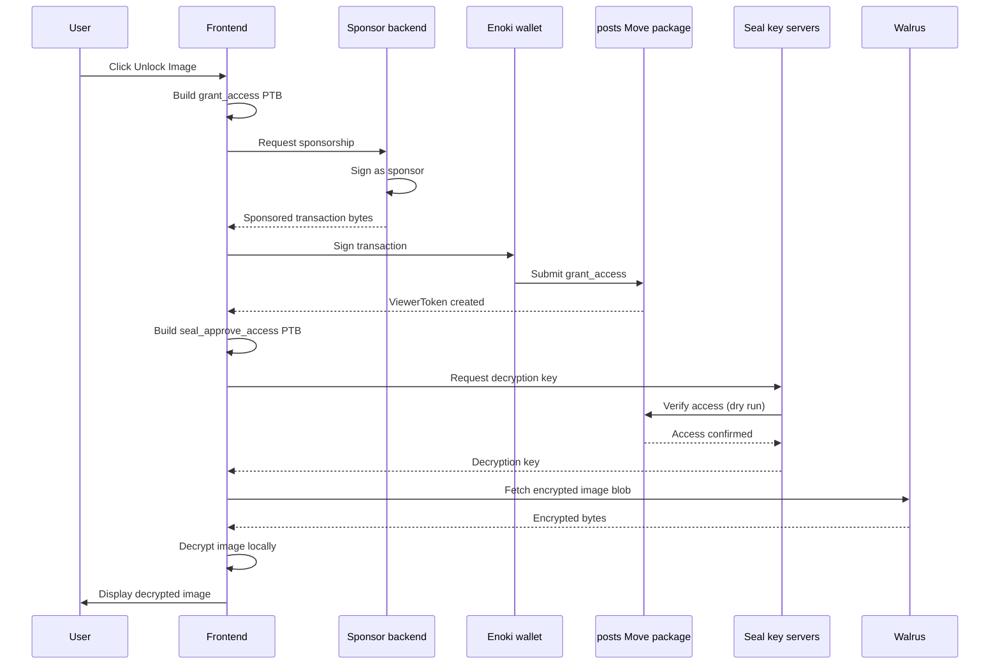

OnlyFins is a Web3 social platform that demonstrates encrypted content sharing with onchain access control. Creators publish posts with images they store on [Walrus](https://docs.wal.app) and encrypt through [Seal](https://seal-docs.wal.app), while viewers purchase `ViewerToken` capability objects to decrypt and view content. The app uses [Enoki](https://docs.enoki.mystenlabs.com/) for [zkLogin](/sui-stack/zklogin-integration/zklogin) authentication and [sponsored transactions](/develop/transaction-payment/sponsor-txn) so users interact without holding SUI for gas.

:::caution

OnlyFins is a demo pattern, not production-ready code. Before adapting it, work through this checklist: rate-limit and authorize sponsored transactions so an attacker cannot drain your gas budget; enforce Seal session-key expiry rather than holding long-lived sessions; understand the transfer semantics of the `ViewerToken` object (a transferable token grants access to whoever holds it); and remember that all post metadata, blob IDs, and onchain activity are public even when the image bytes are encrypted. See the [Security Best Practices](/develop/security/best-practices) guide.

:::

## When to use this pattern

Use this pattern when you need to:

- Gate access to encrypted content with onchain ownership tokens rather than a centralized paywall server.

- Store encrypted files on Walrus and control decryption through Seal threshold encryption tied to Move-level access control.

- Let users authenticate with Google through zkLogin and interact without holding SUI for gas.

- Build a content marketplace where creators publish and viewers pay for access, all verifiable onchain.

- Combine shared objects (posts visible to all) with owned objects (viewer tokens that prove access) in a single application.

## What you learn

This example teaches:

- **Shared objects:** Posts are [shared objects](/develop/objects/object-ownership/shared) that any user can read metadata from, but only authorized users can decrypt the attached content.

- **Capability pattern:** `ViewerToken` objects act as owned [capability](/develop/write-move/sui-move-concepts) tokens that prove a user purchased access to a specific post.

- **Seal encryption:** Threshold encryption where the Move contract itself authorizes decryption key release. Seal key servers only return the decryption key after dry-running a `seal_approve_access` transaction that confirms the caller holds a valid `ViewerToken`.

- **Sponsored transactions:** A backend pays gas so users interact without holding SUI. The frontend sends unsigned transactions to the sponsor backend, which co-signs and returns the sponsored bytes.

- **Walrus storage:** The frontend stores encrypted image blobs offchain on Walrus and references them by blob ID. Walrus blobs are publicly addressable, so you must encrypt content to restrict access.

## Architecture

The example has 4 actors and 1 onchain package. The frontend builds transactions and renders post feeds as a React app. The Enoki wallet handles zkLogin authentication and transaction signing. The posts Move package stores post metadata and issues `ViewerToken` objects as [shared](/develop/objects/object-ownership/shared) and [address-owned](/develop/objects/object-ownership/address-owned) objects on Sui. Seal key servers hold threshold encryption keys and release them only when the Move contract confirms access through `seal_approve_access`. Walrus stores the actual image blobs, both encrypted and unencrypted. The sponsor backend covers gas fees so users do not need SUI in their wallet.

The diagram below traces 1 full interaction from a user unlocking content to viewing the decrypted image.


```mermaid
sequenceDiagram
  participant User
  participant Frontend
  participant Backend as Sponsor backend
  participant Wallet as Enoki wallet
  participant Package as posts Move package
  participant Seal as Seal key servers
  participant Walrus

  User->>Frontend: Click Unlock Image
  Frontend->>Frontend: Build grant_access PTB
  Frontend->>Backend: Request sponsorship
  Backend->>Backend: Sign as sponsor
  Backend-->>Frontend: Sponsored transaction bytes
  Frontend->>Wallet: Sign transaction
  Wallet->>Package: Submit grant_access
  Package-->>Frontend: ViewerToken created
  Frontend->>Frontend: Build seal_approve_access PTB
  Frontend->>Seal: Request decryption key
  Seal->>Package: Verify access (dry run)
  Package-->>Seal: Access confirmed
  Seal-->>Frontend: Decryption key
  Frontend->>Walrus: Fetch encrypted image blob
  Walrus-->>Frontend: Encrypted bytes
  Frontend->>Frontend: Decrypt image locally
  Frontend->>User: Display decrypted image
```

The following steps walk through the flow:

1. The user clicks **Unlock Image** on a locked post, triggering the `usePayForContent` hook.

2. The frontend builds a `grant_access` transaction and sends it to the sponsor backend, which pays for gas and returns the co-signed transaction.

3. The wallet signs and submits the transaction. The Move package creates a `ViewerToken` owned by the user.

4. The frontend detects the new token, builds a `seal_approve_access` transaction, and sends it to the Seal key servers.

5. Seal dry-runs the transaction against the Move contract. Because the user now holds a valid `ViewerToken`, the contract confirms access.

6. Seal returns the decryption key. The frontend fetches the encrypted blob from Walrus, decrypts it locally, and renders the image.

Errors can occur at the sponsorship step (backend unreachable), the Seal step (session key expired), or the Walrus fetch (blob not found).

### How Seal and Walrus work together

Walrus is a content-addressed storage protocol where you retrieve data by blob ID. Walrus makes all blobs publicly addressable, so anyone who knows the blob ID can fetch the raw bytes. To restrict access, the frontend encrypts content before uploading to Walrus.

Seal provides the encryption layer. When a creator publishes a post, the frontend encrypts the image with a key managed by Seal's threshold key servers. The Move contract defines who can decrypt: the `seal_approve_access` function checks whether the caller is the post author or holds a `ViewerToken` for that post. Seal key servers only release the decryption key after dry-running this function and confirming it does not abort.

This combination means Walrus handles storage and availability, Seal handles key management and access control, and the Move contract defines the access policy.

<Tabs className="tabsHeadingCentered--small">
<TabItem value="prereq" label="Prerequisites">

- [x] An existing [React](https://react.dev/) frontend and a backend you can run scripts from.

- [x] [Install the Sui CLI](/getting-started/onboarding/sui-install) and [fund an address with Testnet SUI](/getting-started/onboarding/get-coins).

- [x] [Node.js](https://nodejs.org/) 18 or later with [pnpm](https://pnpm.io/installation).

- [x] An [Enoki](https://portal.enoki.mystenlabs.com/) project for zkLogin, or [Slush Wallet](https://slush.app/).

</TabItem>
</Tabs>

For the underlying primitives, see [Data Storage Using Walrus](/sui-stack/walrus/sui-stack-walrus) and [Encryption with Seal](/sui-stack/seal/sui-stack-seal).

## Reference app

A complete implementation lives in [`onlyfins-example-app`](https://github.com/MystenLabs/onlyfins-example-app), split into a `frontend`, a `backend` sponsor service, and the `move/posts` package.

Publish the Move package and record the package ID, which both the frontend and backend need:

```bash
$ sui client publish --gas-budget 200000000
```

The frontend reads it from `POSTS_PACKAGE_ID` in `src/constants.ts`. The backend reads it from `PACKAGE_ID` in `.env`, alongside the author key pairs that publish demo content:

```bash title='backend/.env'
AUTHOR_1_PRIVATE_KEY=YOUR_ED25519_PRIVATE_KEY
PACKAGE_ID=YOUR_PACKAGE_ID
```

Export a private key with `sui keytool export --key-identity YOUR_WALLET_ADDRESS` and copy the `exportedPrivateKey` value, which starts with `suiprivkey1`.

## How the pieces fit together

3 decisions carry over to any app that combines these primitives:

- **Encrypt before uploading.** Walrus blobs are publicly addressable by blob ID. Anything you upload unencrypted is readable by anyone who learns the ID, so access control has to live in the encryption, not in the storage.
- **Let the contract authorize decryption.** Seal key servers dry-run `seal_approve_access` before releasing a key. Access control is therefore Move code, and changing who can decrypt means changing onchain state rather than reconfiguring a server.
- **Sponsor gas if users authenticate with zkLogin.** A user who signed in with Google has no SUI. The backend co-signs transactions so the wallet never needs a funded balance. See [Sponsored Transactions](/develop/transaction-payment/sponsor-txn).

## Key code highlights

<CodeWalkthrough source="frontend/move/posts/sources/posts.move" org="MystenLabs" repo="onlyfins-example-app" language="move">
  <Step lines="25-41" title="`create_post` with optional encryption">
    The `create_post` entry function creates a shared `Post` object with an optional encryption ID. When `encryption_id` contains a value, the post requires a `ViewerToken` to decrypt. When it contains `none`, the image is publicly viewable. The function shares the post so any user can read its metadata.
  </Step>
  <Step lines="43-48" title="`grant_access` with viewer tokens">
    The `grant_access` function mints a new `ViewerToken` and returns it. The token links the viewer address to a specific post ID, which `seal_approve_access` checks later.
  </Step>
  <Step lines="50-67" title="`seal_approve_access` gate">
    The `seal_approve_access` function is the onchain gate that Seal calls before releasing decryption keys. It checks two conditions: the caller is the post author, or the caller holds a `ViewerToken` linked to this post. It also verifies the requested `encryption_id` matches the post. If any check fails, the transaction aborts and Seal refuses to release the key.
  </Step>
</CodeWalkthrough>

### Paying for content

The `usePayForContent` hook builds and sponsors the transaction that grants a viewer access to a post.

<ImportContent source="frontend/src/hooks/usePayForContent.ts" mode="code" org="MystenLabs" repo="onlyfins-example-app" fun="usePayForContent" />

The hook calls the `grant_access` Move function, transfers the resulting `ViewerToken` to the current account, and sponsors the transaction so the user pays no gas. After the transaction finalizes, it refetches the user's owned objects so the UI updates.

### Decrypting images through Seal

The `usePostDecryption` hook fetches encrypted images from Walrus and decrypts them using Seal session keys.

<ImportContent source="frontend/src/hooks/usePostDecryption.ts" mode="code" org="MystenLabs" repo="onlyfins-example-app" fun="usePostDecryption" />

For each encrypted post the user has access to, the hook builds a `seal_approve_access` transaction, retrieves the decryption key from the Seal key servers, fetches the encrypted blob from Walrus, and decrypts it locally. It auto-detects the image MIME type from the first bytes of the decrypted data.

## Common modifications

- **Add payment for access:** Require viewers to pay SUI or a custom token in the `grant_access` function before minting the `ViewerToken`. Transfer the payment to the post author.

- **Add subscription tiers:** Create a `Subscription` object that grants access to all posts from a creator for a set duration. Check subscription validity in `seal_approve_access` alongside the per-post `ViewerToken` check.

- **Replace Enoki with wallet-only auth:** Remove the Enoki zkLogin flow and use a standard wallet connection through dApp Kit. Remove the sponsor backend and let users pay their own gas.

- **Add content categories:** Extend the `Post` struct with a `category` field. Filter posts by category in the frontend and allow creators to organize their content.

- **Add creator profiles:** Create a shared `CreatorProfile` object per author that stores a display name, bio, and avatar blob ID on Walrus. Link posts to the profile for a richer feed experience.

## Troubleshooting

The following sections address common issues with this example.
### Package ID is missing or invalid

**Symptom:** The frontend logs `Error: invalid package ID` or transactions fail with `PackageNotFound`.

**Cause:** The `POSTS_PACKAGE_ID` in `constants.ts` still has the default value, or you published the package on a different network than the wallet targets.

**Fix:** Re-run the publish step on Testnet, then update `constants.ts` with the new package ID and restart the dev server.

### Wallet does not connect

**Symptom:** Clicking **Sign In** does nothing, or the Google OAuth flow fails.

**Cause:** The Enoki API key or Google Client ID is misconfigured, or the browser blocks third-party cookies.

**Fix:** Verify the Enoki and Google credentials in `main.tsx`. Try a different browser or disable cookie-blocking extensions.

### Session key expired

**Symptom:** A modal appears saying the session key has expired, and decryption stops working.

**Cause:** Seal session keys have a 30-minute TTL. The key expired between signing and attempting decryption.

**Fix:** Click the button in the modal to sign a new session key. The app signs automatically and resumes decryption.

### Encrypted image fails to load

**Symptom:** A post unlocks (the app grants a `ViewerToken`) but the image shows as broken or never loads.

**Cause:** The Walrus aggregator is unreachable, the blob ID is invalid, or you did not upload the encrypted image to Walrus.

**Fix:** Verify the blob ID in the post object with `sui client object POST_ID`. Check that the Walrus aggregator URL in `constants.ts` is reachable. Re-upload the image if the blob ID is a placeholder.

### Gas budget too low

**Symptom:** The transaction fails with `InsufficientGas` or a similar error.

**Cause:** The sponsor backend gas budget is below what the function consumes.

**Fix:** Increase the gas budget in the sponsor backend or the transaction builder. For CLI publishing, raise `--gas-budget` to `200000000`.
