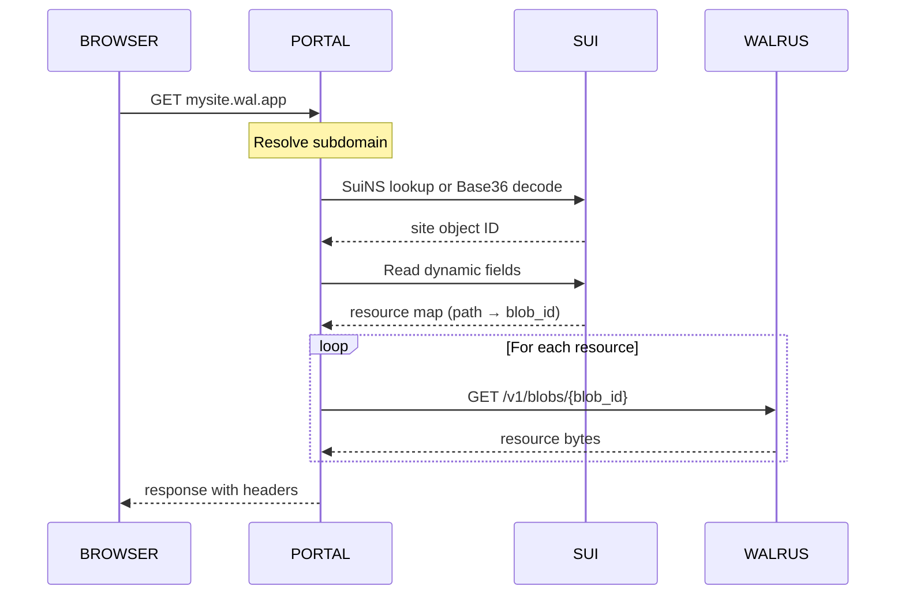

import Tabs from '@theme/Tabs';
import TabItem from '@theme/TabItem';

By the end of this guide, you can:

- Deploy a static site to Walrus and manage it with the `site-builder` CLI.
- Configure custom HTTP headers, routing, redirects, and metadata with `ws-resources.json`.
- Update a deployed site and verify it is live.
- Attach a SuiNS name to give your site a human-readable URL.

<Tabs className="tabsHeadingCentered--small">
<TabItem value="prereq" label="Prerequisites">

- [x] [Sui CLI](/getting-started/onboarding/sui-install) installed
- [x] `suiup` installed: `curl -sSfL https://raw.githubusercontent.com/Mystenlabs/suiup/main/install.sh | sh`
- [x] `site-builder` installed: `suiup install site-builder@mainnet`
- [x] A funded wallet with WAL tokens for storage costs
- [x] `$HOME/.local/bin` in your `PATH`

</TabItem>
</Tabs>

This guide uses the [Walrus Snake](https://github.com/MystenLabs/walrus-sites/tree/main/examples/snake) game as a concrete deployment example throughout. Walrus Snake is a minimal static site that demonstrates the complete Walrus Sites workflow: deploying files to Walrus, creating an onchain site object, configuring resources with `ws-resources.json`, and accessing the site through a portal. The [Domain Names with SuiNS](/sui-stack/suins/sui-stack-suins) guide builds on this guide to show how to attach a human-readable name to your deployed site.

## Introduction to Walrus Sites

A Walrus Site is a static website whose assets are stored on Walrus and whose resource index lives on Sui. There is no traditional web server. The site's content is censorship-resistant and verifiable because it is backed by decentralized storage with onchain ownership.

Walrus Sites have 4 components that work together.

### Site files on Walrus

Walrus stores your site's static assets (HTML, CSS, JavaScript, images, fonts, and so on) as blobs. The site-builder groups them into a single quilt, a Walrus storage format that reduces upload cost and improves speed. The quilt assigns each file a `QuiltPatchID` the site object uses to locate it. See [Walrus Sites Components](https://docs.wal.app/docs/sites/introduction/components) for a full breakdown of the architecture.

### The Sui site object

Each Walrus Site corresponds to a single [Sui object](/develop/sui-architecture/object-model) defined by the Walrus Sites Move contract. The object has a basic structure:

```move
struct Site has key, store {
    id: UID,
    name: String,
}
```

Each resource in the site is attached as a [dynamic field](/develop/objects/dynamic-fields) of type `Resource`:

```move
struct Resource has store, drop {
    path: String,
    blob_id: u256,
    // headers and other metadata
}
```

The `path` field corresponds to the resource's URL path (for example, `/index.html`), and `blob_id` is the Walrus identifier for the file's content. Together, the site object and its dynamic fields form an onchain index that maps every resource path to its content on Walrus.

Because the site object is a standard Sui object, it has a single owner: the wallet that deployed the site. Only that wallet can update or destroy the site. Ownership can be transferred to a different wallet. You can also assign a SuiNS name to the object to give your site a human-readable domain.

:::info
Blobs are stored for a fixed number of [epochs](/develop/sui-architecture/epochs). On Mainnet, each epoch lasts 14 days. On Testnet, each epoch lasts 1 day. The maximum storage duration is 53 epochs.
:::

### The site-builder CLI

The `site-builder` is a Rust CLI tool that creates and manages Walrus Sites. It takes your site's build output directory as input and handles uploading files to Walrus and writing the onchain index to Sui. The primary command is `deploy`, which both publishes new sites and updates existing ones.

### Portals

A portal resolves and serves a Walrus Site to a visitor's browser. When a visitor navigates to a Walrus Site URL, the portal:

1. Resolves the subdomain to a Sui object ID, either through a SuiNS name lookup or by decoding the Base36-encoded object ID from the subdomain.
2. Reads the site object's dynamic fields from Sui to get the resource map.
3. Fetches each resource from Walrus using the `blob_id` from that map.
4. Returns the resource to the browser with the appropriate headers.



The public Mainnet portal operated by Mysten Labs is at `https://wal.app`. Anyone can self-host a portal. See [Deploy a Local Portal](https://docs.wal.app/docs/sites/portals/deploy-locally) for setup instructions.

## Tooling

The `site-builder` CLI and the `sites-config.yaml` configuration file are the 2 tools you need to deploy and manage Walrus Sites.

### Installing the site-builder

Install `site-builder` using `suiup`, the recommended tool for managing Sui ecosystem tooling:

```bash
$ curl -sSfL https://raw.githubusercontent.com/Mystenlabs/suiup/main/install.sh | sh
$ suiup install site-builder@mainnet
```

Make sure `$HOME/.local/bin` is in your `PATH`. Confirm the installation:

```bash
$ site-builder --help
```

Pre-built binaries for Ubuntu, macOS, and Windows are also available. See [Install the Site Builder](https://docs.wal.app/docs/sites/getting-started/installing-the-site-builder) for binary download links, Windows PowerShell instructions, and platform-specific setup.

:::caution
The stable branch of Walrus Sites targets Mainnet. Before deploying to production, pull the latest Mainnet changes from the repository.
:::

### Configuration

`site-builder` requires a `sites-config.yaml` configuration file. Download it for your target network:

```bash
$ curl https://raw.githubusercontent.com/MystenLabs/walrus-sites/refs/heads/$NETWORK/sites-config.yaml \
    -o ~/.config/walrus/sites-config.yaml
```

Replace `$NETWORK` with `testnet` or `mainnet`. By default, `site-builder` looks for `sites-config.yaml` in the following locations, in order: the current working directory, `$XDG_CONFIG_HOME/walrus/`, `~/.config/walrus/`, and `~/.walrus/`.

To use a file in a different location, pass the `--config` flag to any command:

```bash
$ site-builder --config /path/to/sites-config.yaml deploy ./my-site
```

The file specifies the Sui package ID for the Walrus Sites contract, your wallet, gas budget, and network context. See the [Site Builder Reference](https://docs.wal.app/docs/sites/getting-started/using-the-site-builder) for a full annotated example.

### CLI commands

`site-builder` exposes the following commands. Add `--help` to any command for full details, or see the [Site Builder Reference](https://docs.wal.app/docs/sites/getting-started/using-the-site-builder) for the complete command listing.

**`deploy`:** Publishes a new site or updates an existing one. This is the recommended command for all publishing and update workflows:

```bash
$ site-builder deploy [OPTIONS] --epochs <EPOCHS> <DIRECTORY>
```

| Flag | Description |
|---|---|
| `--epochs <EPOCHS>` | Required. Number of epochs to store the site. Use `max` for maximum duration. |
| `--object-id <OBJECT_ID>` | Object ID of an existing site to update. |
| `--list-directory` | Generates an index page for directories without an `index.html`. |

`deploy` determines whether to publish or update based on whether it finds an object ID: from `--object-id`, or from the `object_id` field in `ws-resources.json`. If no ID is found, it publishes a new site and writes the resulting object ID to `ws-resources.json` automatically.

Other commands: `convert` converts a site object ID to the Base36 subdomain format; `sitemap` lists all resources at a given object ID; `update-resource` adds or replaces a single resource in an existing site; `destroy` permanently removes the site object.

:::caution
`destroy` is irreversible. Ensure you no longer need the site before running this command.
:::

## Restrictions and limitations

Walrus Sites support almost any traditional static Web2 site built for modern browsers. The key restrictions to know before building:

- **Static sites only.** No server-side rendering, no request handlers, and no runtime redirects. Use the `routes` field in `ws-resources.json` for client-side routing.
- **No secrets.** All content is fully public. Never embed API keys, private keys, or credentials in site files.
- **Maximum redirect depth.** The `https://wal.app` portal enforces a maximum of 3 consecutive redirects.
- **Service-worker portal limitations.** Sites cannot register their own service worker, PWAs are not supported, and iOS wallet in-app browsers cannot load the site. These limitations do not apply to the server-side portal at `https://wal.app`.
- **SuiNS required for human-readable URLs.** Without a SuiNS name, your site is only accessible through a Base36-encoded subdomain.

For the full list with technical detail, see [Known Restrictions](https://docs.wal.app/docs/sites/known-restrictions).

## Deploying a site

To deploy a site, your build output directory must include an `index.html` at the root. The Walrus Snake example has the following structure:

```
walrus-snake/
├── file.svg
├── index.html
├── Oi-Regular.ttf
├── walrus.svg
└── ws-resources.json
```

Clone the example repository and deploy to Testnet:

```bash
$ git clone https://github.com/MystenLabs/walrus-sites.git && cd walrus-sites
$ site-builder --context=testnet deploy examples/snake --epochs 1
```

On Testnet, 1 epoch lasts 1 day. Use a larger number to keep the site available longer. Deploying a small static site (under 1 MB) for 1 epoch on Testnet costs approximately 0.1 WAL. Mainnet costs vary with the WAL token price and the size of your site.

A successful deployment prints the object ID of the new site and the URL where it can be browsed:

```
Created new site!
New site object ID: 0x617221edd060dafb4070b73160ebf535e1516bf7f246890ed35190eba786d7ac

For local development: http://2ffmxm7j...localhost:3000
For public sharing:    http://2ffmxm7j...yourdomain.com:3000
```

The `deploy` command writes the site object ID to `ws-resources.json` automatically. Subsequent deploys read this ID to update the existing site.

To confirm the deployment succeeded, run `sitemap` with the object ID:

```bash
$ site-builder sitemap --id 0x617221edd060dafb4070b73160ebf535e1516bf7f246890ed35190eba786d7ac
```

`sitemap` lists every resource that `deploy` uploaded. If the list matches your build output, the site is live.

**Testnet note.** Testnet sites have no public portal. To browse a Testnet site, self-host a portal locally or use a third-party hosted Testnet portal. On Mainnet, your site is accessible at `https://wal.app` after you configure a SuiNS name.

**Web frameworks.** If you use a framework like React, Vue, or Vite, point `site-builder` at your build output folder, not the project root. Deploying the project root uploads `node_modules/` and source files, which results in very long upload times, higher storage costs, and unnecessary files on your site. For a Vite project, deploy the `dist/` folder:

```bash
$ site-builder --context=testnet deploy --epochs 1 my-website/dist
```

Common build output directories by framework: Vite uses `dist/`, Create React App uses `build/`, Next.js uses `out/`, Docusaurus uses `build/`.

**CI/CD.** For automated deployments on every push, the [OnlyFins deploy workflow](https://github.com/MystenLabs/onlyfins-example-app/blob/main/.github/workflows/deploy-site.yml) shows a complete GitHub Actions example using `site-builder` with a funded wallet stored as a secret.

## Configuring headers and metadata

`ws-resources.json` is a configuration file `site-builder` reads during deployment to control how your site is built and served. The site-builder does not upload this file to Walrus and visitors cannot access it.

The Walrus Snake example shows all supported fields:

<ImportContent
  source="examples/snake/ws-resources.json"
  mode="code"
  org="MystenLabs"
  repo="walrus-sites"
  language="json"
/>

The fields are:

- **`object_id`:** Written automatically by `deploy` after the first deployment. The field is absent from the source file but appears in your local copy after the first run. Subsequent deploys read it to update the same site.
- **`headers`:** Custom HTTP response headers per resource path. Supports glob patterns.
- **`routes`:** Client-side routing rules for SPAs. Wildcards may only appear at the end of a pattern.
- **`redirects`:** Static redirects with explicit HTTP status codes. The target can be an internal path or an external URL.
- **`metadata`:** Site metadata stored in the Sui object and displayed in wallets.
- **`site_name`:** The human-readable name stored in the Sui site object.
- **`ignore`:** Path patterns to exclude from deployment.

For full field reference, validation rules, and additional examples, see [Site Configuration](https://docs.wal.app/docs/sites/configuration/site-configuration) and [Specifying HTTP Headers](https://docs.wal.app/docs/sites/configuration/specifying-http-headers) in the Walrus documentation.

## Updating a site

When you update a site, the `deploy` command deletes all resources and re-uploads them together as a single quilt, even resources that have not changed. To update the Walrus Snake example, edit `examples/snake/index.html` and run `deploy` again:

```bash
$ site-builder --context=testnet deploy --epochs 1 examples/snake
```

`deploy` reads the site object ID from `ws-resources.json` and updates the existing site. To update a different site than the one recorded in `ws-resources.json`, pass the object ID explicitly:

```bash
$ site-builder --context=testnet deploy \
    --object-id 0x617221edd060dafb4070b73160ebf535e1516bf7f246890ed35190eba786d7ac \
    --epochs 1 examples/snake
```

The wallet you use must own the Walrus Site object to update it.

:::tip
Rebuild your site before running `deploy` again if you use a web framework. The `deploy` command uploads whatever is in the directory you point it at. Deploying without rebuilding uploads stale output.
:::

## Domain names

Without a SuiNS name, your site is only accessible through a Base36-encoded subdomain derived from the site object ID, for example `58gr4pinoayuijgdixud23441t55jd94ugep68fsm72b8mwmq2.wal.app`. Base36 subdomains are not supported on the `wal.app` portal, so a SuiNS name is required to browse your Mainnet site there. Base36 subdomains still work on local servers and alternative portals. To give your site a human-readable URL like `my-project.wal.app`, you must assign a SuiNS name to the site object.

SuiNS is a decentralized naming service on Sui that maps human-readable names (ending in `.sui`) to Sui object IDs and wallet addresses. After deploying your site and obtaining its object ID, you register a SuiNS name and point its target address to the site object ID. The portal at `https://wal.app` resolves SuiNS names and serves the corresponding site.

For the step-by-step process of registering a name and linking it to your site object ID, see [Setting a SuiNS Name](https://docs.wal.app/docs/sites/custom-domains/setting-a-suins-name) in the Walrus documentation. For a complete walkthrough of SuiNS integration, including resolution, reverse lookup, and subnames, see [Domain Names with SuiNS](/sui-stack/suins/sui-stack-suins).

## Failure modes

| Error | Cause | Resolution |
|---|---|---|
| `site-builder` not found | Binary not in `PATH` after install | Add `$HOME/.local/bin` to `PATH`; reload shell profile |
| Insufficient WAL | Wallet has no WAL tokens for storage | Fund wallet at [faucet.mystenlabs.com](https://faucet.mystenlabs.com) |
| Insufficient gas | Wallet has no SUI for the Sui transaction | Fund wallet with SUI on the target network |
| Deploy fails: wallet does not own site | `--object-id` points to a site owned by a different wallet | Use the wallet that originally deployed the site, or omit `--object-id` to publish a new one |
| No `index.html` at root | `deploy` directory does not contain `index.html` | Point `deploy` at the framework build output folder, not the project root |
| `ws-resources.json` validation error | Wildcard in middle of a route or ignore pattern | Move wildcards to the end of patterns only |
| Testnet site not browsable | Testnet has no public portal | Self-host a local portal; see [Deploy a Local Portal](https://docs.wal.app/docs/sites/portals/deploy-locally) |
| Base36 subdomain not working on `wal.app` | `wal.app` requires a SuiNS name | Register a SuiNS name and link it to the site object ID |

## Troubleshooting

**`site-builder` not found.** The binary is not in your `PATH`. Run `echo $PATH` and confirm `$HOME/.local/bin` appears. If not, add `export PATH="$HOME/.local/bin:$PATH"` to your shell profile and reload it.

**Deploy fails with insufficient gas or insufficient WAL.** Your wallet has no WAL tokens or not enough SUI for gas. Fund your wallet with WAL on Testnet using the faucet at [faucet.mystenlabs.com](https://faucet.mystenlabs.com), then retry.

**Deploy fails: wallet does not own the site object.** You are passing `--object-id` for a site owned by a different wallet. Run `deploy` without `--object-id` to publish a new site, or switch to the wallet that originally deployed it.

**Deploy fails: directory has no `index.html`.** `site-builder` requires `index.html` at the root of the directory you pass to `deploy`. For frameworks that output to a subfolder, pass the subfolder (for example, `dist/`, `build/`, or `out/`), not the project root.

**`ws-resources.json` validation error.** A wildcard in `routes` or `ignore` appears in the middle of a path pattern (for example, `/path/*/to`). Wildcards may only appear at the end of a pattern.

**Testnet site not visible.** Testnet has no public portal. Self-host a local portal using the [local portal setup guide](https://docs.wal.app/docs/sites/portals/deploy-locally) or use a community-hosted Testnet portal.
