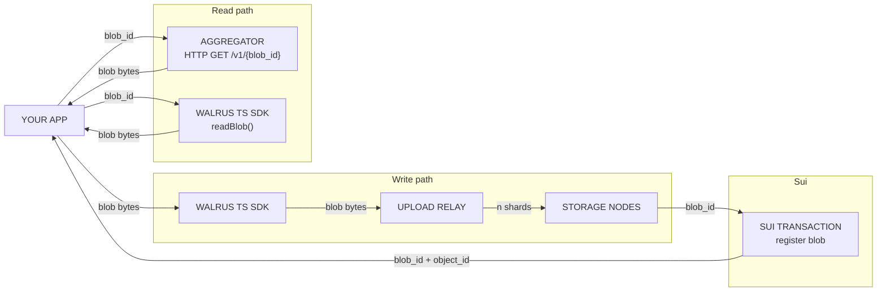

Walrus is a decentralized storage and data availability protocol built specifically for large binary files, or blobs. It uses Sui for coordination, payment, and governance, making it a natural storage layer for apps built on Sui.

Each section explains a Walrus concept or operation and shows where it appears in the encrypted social media example [OnlyFins](only-fins.mdx). OnlyFins is a demo content platform where creators post images stored on [Walrus](https://docs.wal.app/), some encrypted with [Seal](https://seal-docs.wal.app/). Each post is a Sui object. Users request access onchain to unlock encrypted posts, demonstrating how Sui, Walrus, and Seal work together as a stack.

For patterns OnlyFins does not cover, the guide draws on [Walrus Onboarding](https://github.com/MystenLabs/Walrus-Onboarding) modules and [walrus-pocs](https://github.com/MystenLabs/walrus-pocs), a collection of focused Walrus proof-of-concept examples maintained by Mysten Labs. The [Walrus SDK documentation](https://sdk.mystenlabs.com/walrus) is the authoritative reference for all SDK options. The [Encryption with Seal](/sui-stack/seal/sui-stack-seal) guide builds on this same app.

### Architecture



### Blob storage

Walrus stores data as blobs, which are arbitrary binary objects. All blobs stored on Walrus are public and discoverable by anyone.

:::caution
Do not use Walrus to store secrets or private data without additional measures to protect confidentiality. See [Data encryption](#data-encryption) for how to encrypt content before upload.
:::

Walrus uses [erasure coding](https://docs.wal.app/docs/system-overview) to distribute encoded parts of each blob across all [storage nodes](https://docs.wal.app/docs/operator-guide/storage-nodes), maintaining storage costs at approximately 5 times the size of the original blob. This is significantly more cost-efficient than full replication and more resilient than partial replication.

The `WalrusFile` API groups multiple files into a single blob when storing them together, which is more storage-efficient than uploading each file separately.

### Blob ID and object ID

Every blob has 2 identifiers:

- **Blob ID:** A content-addressed hash of the blob data, computed offchain and deterministic from the blob's contents.
- **Object ID:** The Sui object ID of the onchain blob registration record. Because blobs are [Sui objects](/develop/sui-architecture/object-model), they can be owned by addresses, transferred, wrapped in other objects, or managed through Sui smart contracts.

In OnlyFins, the `image_blob_id` field on each `Post` Sui object stores the blob ID. The frontend uses this to construct a fetch URL. The object ID lets the app manage blob lifecycle onchain, the same way it manages any other Sui object.

### Storage nodes

Storage nodes are the servers that store encoded blob data. When you write a blob, the Walrus client distributes encoded shards across the active storage node committee. When you read a blob, the client fetches enough shards to reconstruct the original data. Writing a blob directly to storage nodes requires approximately 2,200 requests. Reading requires approximately 335 requests.

### Upload relay

The [upload relay](https://docs.wal.app/operator-guide/upload-relay.html) is a server-side proxy that accepts blob data from a client and handles the distribution to storage nodes. Using an upload relay significantly reduces the number of requests a client must make to write a blob. This is especially important in browser environments where issuing thousands of direct requests to storage nodes is not practical. Reads through the Walrus SDK still require many requests regardless of whether you use an upload relay.

### Publisher

A [publisher](https://docs.wal.app/docs/operator-guide/aggregator) is an HTTP server that accepts blob data over a REST API and handles the entire Walrus write flow on your behalf. Publishers are the most direct way to integrate uploads in server-side applications without using the TypeScript SDK (TS SDK).

For production environments, use the `send-object-to` parameter when uploading through a publisher. This instructs the publisher to transfer the resulting blob object to a specified Sui address after upload, so you retain ownership of blobs stored through a shared publisher.

### Aggregator

An [aggregator](https://docs.wal.app/docs/operator-guide/aggregators/operating-aggregator) is an HTTP server that serves blobs over a standard REST API. Aggregators are the most direct way to read Walrus data without using the TS SDK, and they work well with standard caches and CDNs.

OnlyFins uses an aggregator to serve all images in the frontend. The aggregator base URL is a single constant that all image fetches are built from:

<ImportContent
  source="frontend/src/constants.ts"
  mode="code"
  org="MystenLabs"
  repo="onlyfins-example-app"
  language="ts"
  variable="WALRUS_AGGREGATOR_URL"
/>

For most apps, publishers and aggregators are the recommended integration path because they abstract away all storage node communication. The Walrus documentation covers running and configuring publishers and aggregators. The TS SDK is the right tool when your app needs direct interaction with Walrus or when users need to pay for their own storage.

## Tooling

Two tools cover most Walrus integration scenarios.

### CLI

The Walrus CLI provides direct access to all Walrus operations from the command line, including storing, reading, and managing blobs. OnlyFins uses the CLI in its seeding workflow to upload images before registering them onchain. See the [Walrus CLI documentation](https://docs.walrus.site/usage/client-cli.html) for setup and usage.

### TS SDK

The Walrus TS SDK (`@mysten/walrus`) extends the Sui TypeScript SDK client with Walrus-specific methods. It exposes high-level methods for reading and writing blobs, as well as lower-level methods for individual steps when you need more control.

The TS SDK is most useful when:

- Users need to pay for their own storage directly through their wallets.
- Your app needs to interact directly with Walrus storage nodes or an upload relay.
- You need full control over the registration, upload, and certification flow.

Install the SDK:

```bash
$ npm install --save @mysten/walrus @mysten/sui
```

Set up the client by extending a `SuiGrpcClient` with the Walrus plugin:

```ts
import { SuiGrpcClient } from '@mysten/sui/grpc';
import { walrus } from '@mysten/walrus';

const client = new SuiGrpcClient({
  network: 'testnet',
  baseUrl: 'https://fullnode.testnet.sui.io:443',
}).$extend(walrus());
```

The [Walrus SDK documentation](https://sdk.mystenlabs.com/walrus) is the single source of truth for all SDK patterns, options, and examples.

:::info
Some code examples in this guide use `SuiClient` from `@mysten/sui/client` rather than `SuiGrpcClient` from `@mysten/sui/grpc`. `SuiGrpcClient` is the recommended transport for new integrations. All Walrus SDK and transaction APIs are identical regardless of which client you use. See the [Sui SDK v2 migration guide](https://sdk.mystenlabs.com/sui/migrations/sui-2.0) for upgrade instructions.
:::

For React apps, wrap your component tree with a context provider that initializes the client once and makes it available throughout the app. The [walrus-pocs](https://github.com/MystenLabs/walrus-pocs) repo includes focused examples for each SDK operation that show this pattern in a clean Node.js context. For a React-specific provider, initialize `SuiGrpcClient.$extend(walrus())` in your app's root and pass the result through React context using the same pattern shown in the SDK client setup above.

## Uploading data

There are two primary ways to upload data to Walrus: using the CLI directly, or using the TS SDK programmatically. The TS SDK offers two upload APIs: `writeBlob` for raw blobs, and the `WalrusFile` API which stores files efficiently by grouping them together.

### Using the TS SDK with a `Signer`

Use `writeBlob` with a `Signer` instance for server-side uploads where a backend script or job controls the wallet. The Walrus Onboarding Module 07 provides two clean examples: a direct upload and an upload through the relay. Both use the `$extend(walrus())` pattern:

<ImportContent
  source="07-Walrus-SDK-upload-relay/hands-on-source-code/src/examples/basic-upload-example.ts"
  mode="code"
  org="MystenLabs"
  repo="Walrus-Onboarding"
  language="ts"
  fun="uploadBlob"
/>

To reduce the number of requests from approximately 2,200 to a single relay request, configure the upload relay when extending the client:

<ImportContent
  source="07-Walrus-SDK-upload-relay/hands-on-source-code/src/examples/basic-upload-example.ts"
  mode="code"
  org="MystenLabs"
  repo="Walrus-Onboarding"
  language="ts"
  fun="uploadWithRelay"
/>

In OnlyFins, the signer pattern appears in the post registration step. After uploading images with the CLI and recording the blob IDs, `createPosts.ts` uses a `Keypair` signer to build and execute a [programmable transaction block (PTB)](/develop/transactions/ptbs/prog-txn-blocks) that registers each post onchain with its blob ID. The signer setup in `config.ts` shows the pattern for loading `Ed25519Keypair` instances from environment variables:

<ImportContent
  source="backend/src/config.ts"
  mode="code"
  org="MystenLabs"
  repo="onlyfins-example-app"
  language="ts"
  fun="getKeypair"
/>

With signers configured, `createPosts.ts` builds a PTB that calls `posts::create_post` for each post, embedding the Walrus blob ID as a field on the resulting `Post` Sui object:

<ImportContent
  source="backend/src/createPosts.ts"
  mode="code"
  org="MystenLabs"
  repo="onlyfins-example-app"
  language="ts"
  fun="main"
/>

### Using the TS SDK with user wallets

When uploads are signed by a user wallet in a browser, wallets use popups that browsers block if they are not opened in direct response to a user interaction. The `writeFilesFlow` method breaks the upload into discrete steps, each triggered by a separate user action.

The flow has five steps:

1. `encode`: Encode the files and compute a blob ID.
2. `register`: Return a transaction that registers the blob onchain.
3. `upload`: Upload data to storage nodes or the upload relay.
4. `certify`: Return a transaction that certifies the blob onchain.
5. `listFiles`: Return the list of created files.

There is currently no example of this pattern in OnlyFins. Two external references cover it: [relay.wal.app](https://relay.wal.app/) is a deployed demo with an open-sourced repository that shows a complete production-ready browser upload flow. The [`write-from-wallet`](https://github.com/MystenLabs/ts-sdks/tree/main/packages/walrus/examples/write-from-wallet) example in the TS SDK repo is a more concise undeployed version. Both use `writeFilesFlow` with `@mysten/dapp-kit-react`.

The `walrus-pocs` SDK example shows the core `writeBlob` pattern with a signer:

<ImportContent
  source="sdk/src/write.ts"
  mode="code"
  org="MystenLabs"
  repo="walrus-pocs"
  language="ts"
  fun="write"
/>

For browser wallet upload flows using `writeBlobFlow` and `writeFilesFlow`, see the [`write-from-wallet`](https://github.com/MystenLabs/ts-sdks/tree/main/packages/walrus/examples/write-from-wallet) example in the TS SDK repo, which shows the complete dApp Kit integration pattern.

### Using the WalrusFile API to batch upload

When uploading multiple files together, use `writeFiles` with `WalrusFile.from()` to attach identifiers and tags to each file. Storing files together is more efficient than uploading them separately:

<ImportContent
  source="11-Batch-storage/hands-on-source-code/03-creation-process/ts/03-create-simple.ts"
  mode="code"
  org="MystenLabs"
  repo="Walrus-Onboarding"
  language="ts"
/>

## Reading data

Reading assumes you know the ID of the data you want to retrieve. In OnlyFins, blob IDs are stored as fields on `Post` Sui objects and discovered by querying the blockchain. For how to discover blobs you own dynamically, see [Querying blobs](#querying-blobs).

### Finding the blobs you want to read

In OnlyFins, the `Feed` component fetches a known set of post object IDs from Sui using `useSuiClientQuery` with `multiGetObjects`. This is the same pattern you use to fetch any Sui object by ID:

<ImportContent
  source="frontend/src/components/Feed.tsx"
  mode="code"
  org="MystenLabs"
  repo="onlyfins-example-app"
  language="tsx"
  component="Feed"
/>

The `transformSuiObjectsToPosts` utility extracts the `image_blob_id` field from each Sui object and constructs the aggregator URL. For encrypted posts it also extracts the `encryption_id` field used in the decryption flow:

<ImportContent
  source="frontend/src/utils/post-transform.ts"
  mode="code"
  org="MystenLabs"
  repo="onlyfins-example-app"
  language="ts"
  fun="transformSuiObjectsToPosts"
/>

### Reading metadata and attributes

Blobs support custom key-value attributes stored as [dynamic fields](/develop/objects/dynamic-fields) on the Sui blob object. Attributes can include content type, content length, or any app-specific metadata. They are set at upload time or updated afterward, travel with the blob object on Sui, and are readable alongside the blob content.

The `attributes.ts` example in the TS SDK shows all 3 operations in one script: setting attributes at upload through the `attributes` parameter on `writeBlob`, reading them with `readBlobAttributes`, and updating or deleting individual keys with `executeWriteBlobAttributesTransaction`:

<ImportContent
  source="packages/walrus/examples/basics/attributes.ts"
  mode="code"
  org="MystenLabs"
  repo="ts-sdks"
  language="ts"
/>

### Using the `WalrusFile` API

The `WalrusFile` API is the recommended way to read Walrus data with the TS SDK. The `getFiles` method accepts both individual blob IDs and IDs of batches stored together, and returns `WalrusFile` instances that work like `Response` objects from the `fetch` API. Reading files in batches is more efficient when loading multiple files that are stored together because the client can optimize requests.

The Walrus Onboarding Module 11 shows how to retrieve files by identifier:

<ImportContent
  source="11-Batch-storage/hands-on-source-code/04-retrieval-process/ts/01-get-files-identifiers.ts"
  mode="code"
  org="MystenLabs"
  repo="Walrus-Onboarding"
  language="ts"
/>

The `walrus-pocs` SDK example shows how to read a blob by ID and write it to disk:

<ImportContent
  source="sdk/src/download.ts"
  mode="code"
  org="MystenLabs"
  repo="walrus-pocs"
  language="ts"
  fun="download"
/>

:::caution
Reads through the Walrus SDK require approximately 335 requests to storage nodes regardless of whether you use an upload relay. For high-read-volume scenarios, aggregator-based reads are significantly more efficient.
:::

### Reading with an aggregator

OnlyFins reads all images using plain HTTP fetches to the aggregator. The `fetchFromWalrus` utility wraps the fetch with retry logic and a 25-second timeout:

<ImportContent
  source="frontend/src/utils/walrus-fetch.ts"
  mode="code"
  org="MystenLabs"
  repo="onlyfins-example-app"
  language="ts"
  fun="fetchFromWalrus"
/>

For unencrypted posts, the aggregator URL from `transformSuiObjectsToPosts` is used directly as an image source. For encrypted posts, `fetchFromWalrus` retrieves the encrypted bytes before passing them to Seal for decryption.

When reading directly with the TS SDK, the Walrus Onboarding Module 07 shows `readBlob` with proper typed error handling for the most common failure modes:

<ImportContent
  source="07-Walrus-SDK-upload-relay/hands-on-source-code/src/examples/basic-download-example.ts"
  mode="code"
  org="MystenLabs"
  repo="Walrus-Onboarding"
  language="ts"
  fun="downloadWithErrorHandling"
/>

## Managing blobs

Because blobs are Sui objects, you manage them using the same tools and patterns you use for any other Sui object. The sections below cover the most common blob management operations.

### Querying blobs

Blobs can be owned by individual wallet addresses or wrapped in other Sui objects. Querying personally owned blobs is done exactly like querying any owned Sui object type, using `getOwnedObjects` with a `StructType` filter on the Walrus blob type.

OnlyFins queries a fixed hardcoded list of post objects rather than dynamically discovering blobs by owner. Adding a view that displays all blobs owned by the connected wallet can be done by deploying a version of [Sui dApp Kit](https://sdk.mystenlabs.com/dapp-kit)'s `react-client-dapp` starter with an object type filter added to the owned-objects query. The result looks like this:

```ts
const { data } = useSuiClientQuery('getOwnedObjects', {
  owner: currentAccount.address,
  filter: {
    StructType: `${WALRUS_PACKAGE_ID}::blob::Blob`,
  },
  options: { showContent: true },
});
```

When displaying blob owners, resolve their [SuiNS](https://suins.io/) name if one exists rather than showing a raw address. Use `useResolveSuiNSName` from Sui dApp Kit, which returns the primary SuiNS name for any address, and fall back to a truncated hex string when no name is set.

### Sharing blobs

Walrus provides a standard for wrapping a blob in a [shared object](/develop/objects/object-ownership/shared) that can be funded and whose lifetime can be extended by anyone, not just the original owner. This is useful for content that multiple parties want to keep available.

Sharing blobs is currently only supported through the Walrus CLI or manually through Move.

### Deleting blobs

Blobs must be marked as `deletable: true` at registration time to be eligible for deletion. Permanent blobs cannot be deleted.

The `walrus-pocs` SDK example shows how to find a blob object by ID and execute a delete transaction:

<ImportContent
  source="sdk/src/delete.ts"
  mode="code"
  org="MystenLabs"
  repo="walrus-pocs"
  language="ts"
  fun="del"
/>

For browser wallet flows, compose this pattern with `useSignAndExecuteTransaction` from Sui dApp Kit: build the delete transaction using `walrus.executeDeleteBlobTransaction`, sign it with the connected wallet, and execute it through the dApp Kit hook.

### Extending the lifetime of blobs

Blob storage is purchased for a set number of [epochs](/develop/sui-architecture/epochs). You can extend the storage period of a blob before it expires.

To extend a blob, call `walrus.extendBlob` with the blob object ID and the additional number of epochs to add. The [Walrus SDK documentation](https://sdk.mystenlabs.com/walrus) covers the full API. For browser wallet flows, compose the extension transaction with `useSignAndExecuteTransaction` from Sui dApp Kit.

## Data encryption

All blobs stored on Walrus are public. To restrict access to content, you must encrypt it before uploading and decrypt it after retrieval. OnlyFins demonstrates this pattern end-to-end using Seal.

Seal is a decentralized secrets management service that provides threshold encryption and onchain access control for Walrus data. It integrates directly with Sui's object model, letting you tie decryption access to ownership of specific Sui objects or other onchain conditions. In OnlyFins, a user receives a `ViewerToken` Sui object after paying for a post, and Seal checks ownership of that token before issuing decryption key shares.

The backend `encryptImages.ts` script handles encryption before upload. The frontend `usePostDecryption` hook handles decryption after reading. Both are covered in depth in [Encryption with Seal](/sui-stack/seal/sui-stack-seal), which builds on this same OnlyFins app.
