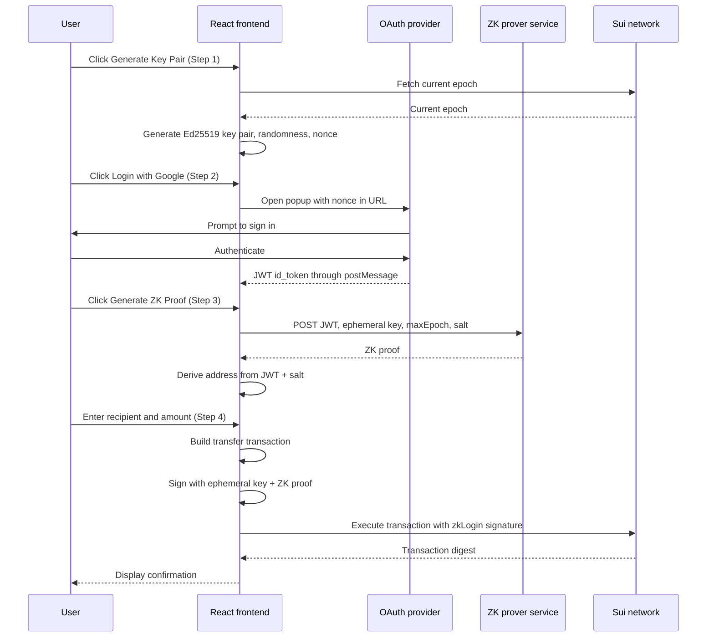

This example demonstrates how to integrate [zkLogin](/sui-stack/zklogin-integration/zklogin) into a React application so users can authenticate with familiar OAuth providers (Google, Apple) and interact with the Sui blockchain without managing private keys.

## When to use this pattern

Use this pattern when you need to:

- Onboard users who do not have a Sui wallet by letting them sign in with Google or Apple.

- Derive a deterministic Sui address from a JWT token and a salt so users always get the same address.

- Generate and manage ephemeral key pairs that sign transactions on behalf of the authenticated user.

- Fetch a zero-knowledge proof from a prover service and attach it to a transaction as a zkLogin signature.

- Build a complete zkLogin flow in a React frontend without any backend server.

## What you learn

This example teaches:

- **Ephemeral key pairs:** The zkLogin system uses short-lived Ed25519 key pairs that are valid for a configurable number of epochs. The key pair signs transactions, but a zkLogin signature wraps the result and proves the signer owns the OAuth identity without revealing it.

- **OAuth popup flow:** The application opens an OAuth provider in a popup window, extracts the `id_token` from the URL hash, and sends it to the parent window through `postMessage`. This keeps the main application state intact during authentication.

- **ZK proof generation:** The prover service takes the JWT, extended ephemeral public key, max epoch, randomness, and salt, and returns a zero-knowledge proof. This proof lets the network verify the transaction was authorized by the OAuth identity holder without seeing the JWT.

- **Address derivation:** `jwtToAddress(jwt, salt)` deterministically maps an OAuth identity to a Sui address. The same user with the same salt always gets the same address, enabling persistent wallet identity across sessions.

- **zkLogin transaction signing:** The ephemeral key pair signs the transaction bytes, then `getZkLoginSignature` combines the ephemeral signature with the ZK proof and address seed to produce a composite signature the network accepts.

## Architecture

The example has 4 actors: a React frontend, an OAuth provider, a ZK prover service, and the Sui network. There are no Move contracts; the application sends native SUI transfer transactions. The React frontend orchestrates the entire flow. It generates an ephemeral key pair, redirects the user to the OAuth provider (Google or Apple) in a popup, receives the JWT, sends proof inputs to the ZK prover service hosted by Mysten Labs, and uses the resulting proof to sign and execute transactions on the Sui network through gRPC.

The diagram below traces 1 full zkLogin flow from key pair generation to transaction execution.



The following steps walk through the flow:

1. The user clicks **Generate Key Pair**. The frontend fetches the current epoch from the Sui network, creates an Ed25519 ephemeral key pair, generates randomness, and computes a nonce. The key pair is valid for the configured number of epochs past the current one.

2. The user clicks **Login with Google**. The frontend opens a popup to the OAuth provider with the nonce embedded in the authorization URL. After the user authenticates, the provider redirects to the app's callback URL with an `id_token` in the URL hash. The popup extracts the token and sends it to the parent window through `postMessage`.

3. The user clicks **Generate ZK Proof**. The frontend sends the JWT, extended ephemeral public key, max epoch, randomness (base64-encoded), and salt to the Mysten Labs prover service. The prover returns a zero-knowledge proof. The frontend then derives the Sui address from the JWT and salt using `jwtToAddress`.

4. The user enters a recipient address and SUI amount. The frontend builds a `splitCoins` + `transferObjects` transaction, signs it with the ephemeral key pair, combines the signature with the ZK proof into a zkLogin signature using `getZkLoginSignature`, and executes the transaction through gRPC.

### How zkLogin works

The zkLogin system maps an OAuth identity (like a Google account) to a Sui address using zero-knowledge proofs. The key insight is that the user's Sui address is derived deterministically from 2 inputs: their OAuth `sub` claim (a unique user identifier from the provider) and an application-specific salt. The same user with the same salt always gets the same address.

To authorize a transaction, the user does not sign with a long-lived private key. Instead, the application generates a short-lived ephemeral key pair, embeds the key pair's nonce in the OAuth login request, and receives a JWT that binds the user's identity to that ephemeral key. A ZK prover service then generates a proof that the JWT is valid and corresponds to the claimed address, without revealing the JWT itself to the network. The ephemeral key signs the transaction bytes, and the ZK proof wraps the signature so the network can verify authorization without seeing the user's OAuth credentials.

For more details, see the [zkLogin documentation](/sui-stack/zklogin-integration/zklogin).


## Prerequisites

<Tabs className="tabsHeadingCentered--small">
<TabItem value="prereq" label="Prerequisites">

- [x] [Install the latest version of Sui](/getting-started/onboarding/sui-install).

- [x] [Configure the Sui client](/getting-started/onboarding/configure-sui-client).

- [x] [Create a Sui address](/getting-started/onboarding/get-address).

- [x] [Get SUI Testnet tokens](/getting-started/onboarding/get-coins).

- [x] Download and install an IDE. The following are recommended, as they offer Move extensions:

    - [VSCode](https://code.visualstudio.com/), corresponding [Move extension](https://marketplace.visualstudio.com/items?itemName=mysten.move)

    - [Emacs](https://www.gnu.org/software/emacs/), corresponding [Move extension](https://github.com/amnn/move-mode)

    - [Vim](https://www.vim.org/download.php), corresponding [Move extension](https://github.com/yanganto/move.vim)

    - [Zed](https://zed.dev/), corresponding [Move extension](https://github.com/Tzal3x/move-zed-extension)
    
        Alternatively, you can use the [Move web IDE](https://www.playmove.dev/), which does not require a download. It does not support all functions necessary for this guide, however.

- [x] [Download and install Git](https://git-scm.com/downloads).

- [x] [Node.js](https://nodejs.org/) 18 or later

- [x] [Rust toolchain](https://rustup.rs/) (for the relayer service)

- [x] A Sui wallet ([Slush Wallet](https://slush.app/) or another compatible wallet)

- [x] A [Google OAuth client](https://console.cloud.google.com/) and its client ID. Your Google OAuth client must have `http://localhost:5173/` set as an authorized JavaScript origin and authorized redirect URI.

</TabItem>
</Tabs>

## Setup

Follow these steps to set up the example locally.

##### Step 1: Clone the repo

```bash
$ git clone -b solution https://github.com/MystenLabs/sui-move-bootcamp.git
$ cd sui-move-bootcamp/K2
```

##### Step 2: Install dependencies

```bash
$ pnpm install
$ pnpm install @mysten/utils
```

##### Step 3: Configure environment variables

```bash
$ cp .env.example .env
```

Edit `.env` with your values:

```bash title='.env'
VITE_NETWORK=devnet
VITE_SUI_GRPC_URL=https://fullnode.devnet.sui.io:443
VITE_SALT=248191903847969014646285995941615069143
VITE_EPHEMERAL_KEY_DURATION_EPOCHS=2
VITE_OAUTH_PROVIDER_NAME=GOOGLE
VITE_OAUTH_CLIENT_ID=YOUR_GOOGLE_CLIENT_ID
```

Replace `YOUR_GOOGLE_CLIENT_ID` with the OAuth client ID from your Google Cloud project. The `VITE_SALT` can be any large random number; it determines the derived Sui address. Use the same salt consistently to get the same address.

## Run the example

Start the frontend:

```bash
$ pnpm dev
```

Open `http://localhost:5173` in a browser. The landing page explains what zkLogin is. Click **Get Started** to enter the 4-step wizard. Complete each step in order: generate a key pair, sign in with Google, generate the ZK proof, then send a test SUI transfer to verify the full flow.

## Key code highlights

The following snippets are the parts of the code worth reading carefully.

### Ephemeral key pair generation

The `useEphemeral` hook generates a short-lived Ed25519 key pair and computes the nonce that binds it to the OAuth session.

<ImportContent source="K2/src/hooks/useEphemeral.ts" mode="code" org="MystenLabs" repo="sui-move-bootcamp" branch="solution" fun="useEphemeral" />

The hook creates an `Ed25519Keypair`, extracts its public key, generates cryptographic randomness, fetches the current epoch to compute `maxEpoch`, and derives the nonce using `generateNonce`. The nonce is embedded in the OAuth URL so the JWT is bound to this specific ephemeral key. After `maxEpoch` passes, the key pair can no longer authorize transactions.

### OAuth popup token extraction

The `useOauthPopup` hook runs in the OAuth callback popup window and sends the JWT back to the parent.

<ImportContent source="K2/src/hooks/useOauthPopup.tsx" mode="code" org="MystenLabs" repo="sui-move-bootcamp" branch="solution" fun="useOauthPopup" />

When the OAuth provider redirects back to the application, the popup detects it has a `window.opener`, parses the `id_token` from the URL hash fragment, posts it to the parent window with `postMessage`, and closes itself. The parent window listens for this message in the `useOauthLogin` hook.

### ZK proof fetching

The `useZkProof` hook prepares the proof payload and fetches it from the Mysten Labs prover service.

<ImportContent source="K2/src/hooks/useZkProof.ts" mode="code" org="MystenLabs" repo="sui-move-bootcamp" branch="solution" fun="useZkProof" />

The payload includes the JWT, the extended ephemeral public key (which encodes the key type and bytes), the max epoch, base64-encoded randomness and salt, and the key claim name (`sub`). The prover verifies the JWT signature and returns a ZK proof that the frontend stores for transaction signing.

### Address derivation from JWT

The `useWallet` hook derives the deterministic Sui address from the JWT and salt.

<ImportContent source="K2/src/hooks/useWallet.ts" mode="code" org="MystenLabs" repo="sui-move-bootcamp" branch="solution" fun="useWallet" />

`jwtToAddress` maps the JWT's `sub` claim and the salt to a Sui address. `genAddressSeed` produces the address seed needed later for the zkLogin signature. The same JWT `sub` + salt always produces the same address, so the user's wallet persists across sessions.

### Transaction building and zkLogin execution

The `suiWriteClient` builds a SUI transfer transaction and executes it with a zkLogin signature.

<ImportContent source="K2/src/services/sui/writeClient.ts" mode="code" org="MystenLabs" repo="sui-move-bootcamp" branch="solution" fun="buildAndSignTransfer" />

The function fetches available coins and the reference gas price in parallel, selects the largest coin for gas, constructs a `splitCoins` + `transferObjects` transaction, and signs it with the ephemeral key pair. The `useLiveTransaction` hook then combines this signature with the ZK proof using `getZkLoginSignature` to produce the final zkLogin signature before calling `executeZkLoginTransaction`.

### ZK proof fetch utility

The `fetchZkProof` utility calls the Mysten Labs prover endpoint.

<ImportContent source="K2/src/utils/zk.ts" mode="code" org="MystenLabs" repo="sui-move-bootcamp" branch="solution" fun="fetchZkProof" />

The function POSTs the proof payload to `https://prover-dev.mystenlabs.com/v1`. The error handling distinguishes network failures (which might indicate CORS issues) from prover errors. For production applications, consider proxying prover requests through a backend to avoid CORS restrictions.

## Common modifications

- **Add session persistence:** Store the ephemeral key pair, JWT, and ZK proof in `localStorage` so users do not need to re-authenticate on page reload. Check `maxEpoch` against the current epoch to determine if the session is still valid.

- **Support multiple OAuth providers:** The `getOauthUrl` utility already handles Google and Apple. Add cases for Facebook, Twitch, or other OpenID Connect providers by constructing the appropriate authorization URL with the nonce.

- **Add sponsored transactions:** Instead of requiring the zkLogin wallet to hold SUI for gas, integrate a gas station service that sponsors transactions. Build the transaction with a separate gas owner and have the sponsor co-sign.

## Troubleshooting

The following sections address common issues with this example.
### OAuth popup is blocked

**Symptom:** Clicking **Login with Google** does nothing, or the browser shows a popup-blocked notification.

**Cause:** The browser's popup blocker is preventing the OAuth window from opening.

**Fix:** Allow popups for `localhost` in your browser settings, or click the popup-blocked icon in the address bar to allow the popup. The `openOauthPopup` function throws an error if the popup fails to open.

### Google sign-in fails

**Symptom:** The Google OAuth popup closes immediately or never appears.

**Cause:** The `VITE_OAUTH_CLIENT_ID` is misconfigured, the redirect URI does not match `http://localhost:5173/`, or third-party cookies are blocked.

**Fix:** Verify the Google Client ID and authorized redirect URIs in Google Cloud Console. Try a different browser or disable cookie-blocking extensions.

### `id_token` not found in URL hash

**Symptom:** The OAuth popup opens and authenticates, but the parent window never receives the JWT token.

**Cause:** The OAuth redirect URI in the Google Cloud console does not match the application's URL, or the response type is not set to `id_token`.

**Fix:** Verify the authorized redirect URI in the Google Cloud console matches `http://localhost:5173` exactly. Ensure the OAuth URL includes `response_type=id_token` and `scope=openid`.

### ZK proof fetch fails with CORS error

**Symptom:** The browser console shows a CORS error when calling the prover service.

**Cause:** The `prover-dev.mystenlabs.com` endpoint might not allow requests from `localhost` or your domain.

**Fix:** Use a backend proxy to forward requests to the prover service, or run the application on a domain the prover allows. For development, a browser extension that disables CORS can work as a temporary workaround.

### Derived address has no balance

**Symptom:** The wallet address is derived successfully but shows a 0 SUI balance.

**Cause:** The derived address has not received any SUI. The address is deterministic but starts with no funds.

**Fix:** Use the [Sui faucet](https://faucet.sui.io/) to request Devnet SUI for the derived address. Copy the address from the Step 3 panel and paste it into the faucet.

### Transaction fails with `InvalidSignature`

**Symptom:** The transaction is submitted but the network rejects it with a signature error.

**Cause:** The ephemeral key pair has expired (current epoch exceeds `maxEpoch`), or the nonce in the JWT does not match the ephemeral key used for signing.

**Fix:** Restart the flow from Step 1. Generate a new ephemeral key pair, re-authenticate to get a fresh JWT with the new nonce, and generate a new ZK proof. Increase `VITE_EPHEMERAL_KEY_DURATION_EPOCHS` if keys expire too quickly.
