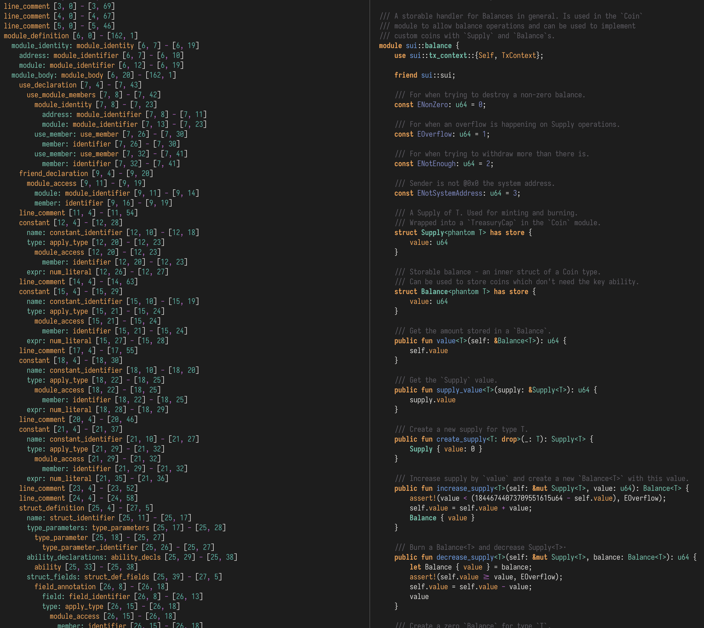

# Tree Sitter for Move

This is a WIP implementation of tree sitter for Move.

## Current Status

It should be able to parse all valid Move code (although no guarantees are made at the moment on this).

More work should probably done in terms of laying out the CST better, although it's not the worst as it stands right now.

## Running Examples

This requires you installing the tree-sitter CLI

```
cargo install tree-sitter-cli
```

You can then run the tests with

```sh
./run-tests.sh
```

Alternatively, to run a single test

```sh
tree-sitter parse -q -t path/to/file.move
```

An example of what the output CST would look like would be the following (NB: this is using tree sitter to highlight the Move code as well).


