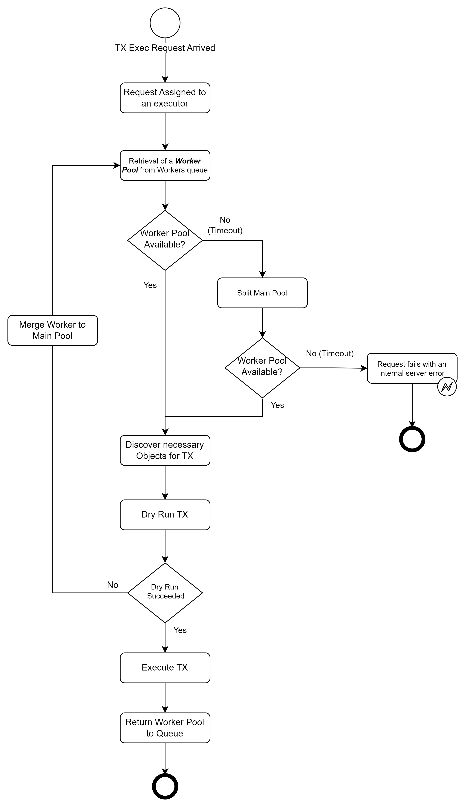

# Sui Owned Object Pools (SuiOOP)

A library that provides a set of tools for managing multiple concurrent
transactions on the Sui network to help avoid object equivocation and locking.

## Quickstart

### Installation

```bash
npm i suioop
```

### High-level usage

**Note**: _This is not a working example - it just shows a high-level overview of how
the library is used.
You can find a more detailed example in the [section below](#Example-code)._

```typescript
// Initialize the ExecutorServiceHandler.
const eshandler = await ExecutorServiceHandler.initialize(
  adminKeypair,
  suiClient,
);

/// An then for each incoming request...
/// ...get the incoming transactionBlock
const myTransactionBlock;

/// and send it for execution
const promise = eshandler.execute(myTransactionBlock, suiClient, splitStrategy);
```

## Motivation

**Equivocation** is a common pitfall for builders using owned objects:
Implementing horizontal scaling or concurrency for a service that executes
transactions on Sui in the natural way results in an architecture that issues
multiple transactions in parallel from the same account.

The community largely avoids using owned objects as a result, which also means
they don’t benefit from their lower latency, which is a **unique selling point**
for Sui. On top of that, they are impossible to completely avoid, because the
transaction’s gas coin must be owned.

Finally, the situation is exacerbated by **gas smashing** (which combines automatically
all transaction’s gas coins into one) and our SDK’s default **coin selection** logic
which uses all the `0x2::coin::Coin<0x2::sui::SUI>`s owned by an address for every transaction’s
gas payment. These defaults make sending transactions from an individual’s wallet
simple (doing so automatically cleans up coin dust), but mean that developers
writing services need to work against the defaults to maintain distinct gas
coins to run transactions in parallel.

**This library is a solution to the above, simplifying access to owned objects from
back-end services that also need to take advantage of concurrency,
without equivocating their objects.**

## Solution

The main modules of the library are `executorServiceHandler.ts` and `pool.ts`.

- `executorServiceHandler.ts` contains the logic of the executor service - meaning
  that it acts like a load balancer, distributing the transactions to the worker pools.
- `pool.ts` contains the logic of the worker pools.

As a user of the library you will only need to use the `executorServiceHandler.ts` module.

The basic idea of our solution is the `ExecutorServiceHandler` to use multiple **worker pools**
contained in a `workersQueue` where each one of them will execute one of the transactions
provided by the user when calling the `execute(...)` function.

The flow goes as follows:

1. First we initialize the `ExecutorServiceHandler` containing only one `mainPool`.
   Then whenever a transaction is submitted to the `ExecutorServiceHandler`, it will
   try to find if there is an available **worker pool** to sign and execute the transaction.

   > **Note** that the **main pool** is not a **worker pool**, meaning that it does not
   > execute transactions. It is only used to store the objects and coins of the account,
   > and to provide them to the worker pools when needed.

2. If a worker pool is not found, _the executor handler will create one by splitting
   the mainPool_ - i.e. taking a part of the **mainPool**'s objects and coins and creating a new worker pool.  
   This is how the executor handler scales up. You can define the split logic by providing
   a `SplitStrategy` object to the `ExecutorServiceHandler` on initialization. If you don't provide a splitStrategy,
   the `DefaultSplitStrategy` will be used.

### Example code

Let's define an example to make things clearer: Assume that we need to execute 10 transactions that transfer 100 MIST each to a fixed recipient.

Prerequisites for the code of this section to run:

- You need to already have **at least** one coin of type `0x2::coin::Coin<0x2::sui::SUI>` in your wallet **for each**
  transaction that you need to execute in parallel (in our case 10 coins).
- Each `Coin<SUI>` should have enough balance to execute each transaction.

```typescript
import { SuiClient } from '@mysten/sui.js/client';
import { TransactionBlock } from '@mysten/sui.js/transactions';
import { Ed25519Keypair } from '@mysten/sui.js/keypairs/ed25519';
import { fromB64 } from '@mysten/sui.js/utils';

/* HERE ARE DEFINED THE PREPARATORY STEPS IF YOU WANT TO CODE ALONG*/
// Define the transaction block
function createPaymentTxb(recipient: string): TransactionBlock {
  const txb = new TransactionBlock();
  const [coin] = txb.splitCoins(
    txb.gas,
    [txb.pure(1000000)], // Amount to be transferred to the recipient
  );
  txb.transferObjects([coin], txb.pure(recipient));
  return txb;
}
// Define your admin keypair and client
const ADMIN_SECRET_KEY: string = '<your-address-secret-key>';
const adminPrivateKeyArray = Uint8Array.from(
  Array.from(fromB64(ADMIN_SECRET_KEY)),
);
const adminKeypair = Ed25519Keypair.fromSecretKey(
  adminPrivateKeyArray.slice(1),
);

const client = new SuiClient({
  url: process.env.SUI_NODE!,
});
```

Now we set up the service handler and to execute the transactions we
defined above, we will use the `execute` method of the `ExecutorServiceHandler` class.

```typescript
import { ExecutorServiceHandler } from 'suioop';

// Setup the executor service
const eshandler = await ExecutorServiceHandler.initialize(adminKeypair, client);
// Define the number of transactions to execute
const promises = [];
let txb: TransactionBlockWithLambda;
for (let i = 0; i < 10; i++) {
  txb = new TransactionBlockWithLambda(() =>
    ceatePaymentTxb('<recipient-address>'),
  );
  promises.push(eshandler.execute(txb, client));
}

// Collect the promise results
const results = await Promise.allSettled(promises);
```

> Notice that we are using a `TransactionBlockWithLambda()` and not `TransactionBlock()`.
> `TransactionBlockWithLambda` is a more flexible way of defining transaction blocks.
> What differs is that the transaction block will be created later,
> just before the transaction execution is done by a worker pool.

It's that simple! 🚀

### Defining a custom SplitStrategy

In the above example, given that we have not defined a split strategy explicitly, we have
used the `DefaultSplitStrategy`.

This default split strategy only picks enough gas coins (i.e., coins of type `0x2::coin::Coin<0x2::sui::SUI>`)
from the `mainPool` that their sum of balances surpasses a minimum threshold, and creates a new
worker pool only containing these gas coins.

It fulfils the minimum requirement needed for a transaction block to be executed: _the client
should always need to be able to pay for the gas of the transaction_.

However, in more complex scenarios, you might want to define your own split strategy.

Let's assume that you would like to execute multiple transactions that transfer an object
of type `CapyNFT` each to a different recipient.

In order for this to work, the `ExecutorServiceHandler` would need to split
the `mainPool` in a way such that every worker:

1. Contains at least one `CapyNFT` object
2. Contains at least a coin (or set of coins) with a total balance enough to pay
   for the gas of the transaction.

To do this, you have to implement the `SplitStrategy` interface. In detail:

```typescript
class MyCustomSplitStrategy implements SplitStrategy {
  private capyIncluded = false;
  private balanceSoFar = 0;
  private readonly minimumBalance;

  public pred(obj: PoolObject | undefined) {
    if (!obj) throw new Error('No object found!.');
    // If we have fulfilled each requirement then terminate the split by returning null
    // This will stop the split process and the worker pool will be created
    const terminateWhen =
      this.balanceSoFar >= this.minimumBalance && this.capyIncluded;
    if (terminateWhen) {
      return null;
    }
    // If we have not already included a CapyNFT object, and the object is a CapyNFT, then include it
    if (!capyIncluded && obj.type.includes('CapyNFT')) {
      this.capyIncluded = true;
      return true;
    }
    // If the object is a coin and we still need to get coins, then we include it to the new pool
    if (this.balanceSoFar >= this.minimumBalance && isCoin(obj.type)) {
      this.balanceSoFar += obj.balance ?? 0;
      return true;
    } else {
      return false;
    }
  }
  // This function is called during the split process to check if the split was successful
  public succeeded() {
    return this.balanceSoFar >= this.minimumBalance && this.adminCapIncluded;
  }
}
```

You can find more examples of split strategies (including an admin cap inclusion case)
in the `splitStrategies.ts` file.

## Tying it all together: end-to-end examples

> **Tip**: You can find the code and run each use case in the [test/unit/executorServiceHandler.test.ts](./test/unit/executorServiceHandler.test.ts) file.

### Use case 1: Parallel coin transfers service—Multiple Coins

Assume that we have a service that needs to do payments of size `50000000` MIST to multiple recipients in parallel.

Before creating an `ExecutorServiceHandler` instance that will execute each incoming transaction,
we first need to have a set of coins that will be used to do the coin transferring and pay for the gas of each transaction.

> **Note**: `ExecutorServiceHandler` creates worker pools that handle the execution of the transactions.
> The maximum number of worker pools that can be created is tightly coupled with the number
> of your account's coins.

Here is the code that creates the coins by splitting a single coin 20
times and transferring the new coins to your address:

```typescript
import { TransactionBlock } from '@mysten/sui.js/transactions';
import { SuiClient } from '@mysten/sui.js/client/';
import type { SuiObjectRef, SuiObjectResponse } from '@mysten/sui.js/client/';

const client = new SuiClient({
  url: 'https://fullnode.testnet.sui.io:443',
});

const objectId: string = '<your-coin-object-id>'; // A
const yourAddressSecretKey: string = '<your-address-secret-key>';

const numberOfCoinsToCreate = 5;
/// Splits a specific coin and then transfer the new coins to the same address.
for (let i = 0; i < numberOfCoinsToCreate; i++) {
  await splitCoinAndTransferToSelf(client, objectId, yourAddressSecretKey);
}

async function splitCoinAndTransferToSelf(
  client: SuiClient,
  coinObjectId: string,
  yourAddressSecretKey: string,
) {
  const txb = new TransactionBlock();
  const coinToPay = await client.getObject({ id: coinObjectId });
  const newcoins1 = txb.splitCoins(txb.gas, [txb.pure(300000000)]);
  // const newcoins2 = txb.splitCoins(txb.gas, [txb.pure(300000000)]);
  txb.transferObjects(
    [
      newcoins1,
      // newcoins2
    ],
    txb.pure(getKeyPair(yourAddressSecretKey).getPublicKey().toSuiAddress()),
  );
  txb.setGasPayment([toSuiObjectRef(coinToPay)]);
  txb.setGasBudget(100000000);
  await client
    .signAndExecuteTransactionBlock({
      signer: getKeyPair(yourAddressSecretKey),
      transactionBlock: txb,
      requestType: 'WaitForLocalExecution',
      options: {
        showEffects: true,
      },
    })
    .then((txRes) => {
      const status = txRes.effects?.status?.status;
      if (status !== 'success') {
        throw new Error(
          `Could not split coin! ${txRes.effects?.status?.error}`,
        );
      }
      return txRes;
    })
    .catch((err) => {
      throw new Error(`Error thrown: Could not split coin!: ${err}`);
    });
}
```

Now that we have the coins, we can create the `ExecutorServiceHandler` instance and execute the transactions.

Note that we provide the `DefaultSplitStrategy` as a parameter to the `ExecutorServiceHandler` constructor
setting the `minimumBalance` equal to `300000000`, meaning that the worker pool that will be created will need
to have a set of coins that the sum of their balances is greater or equal to this.

```typescript
import { ExecutorServiceHandler } from 'suioop';
import { DefaultSplitStrategy } from 'suioop';

// Setup the executor service
const eshandler = await ExecutorServiceHandler.initialize(adminKeypair, client);
// Define the number of transactions to execute
const promises = [];
let txb: TransactionBlockWithLambda;
for (let i = 0; i < 10; i++) {
  txb = new TransactionBlockWithLambda(
    () => createPaymentTxb('<recipient-address>'), // Use a test user address to receive the txbs
  );
  promises.push(
    eshandler.execute(
      txb,
      client,
      new DefaultSplitStrategy(300000000), // Each pool will contain coins with a total balance of 300000000 MIST
    ),
  );
}

// Collect the promise results
const results = await Promise.allSettled(promises);
```

> **Note**: Providing a `SplitStrategy` is optional.
> If you don't provide one, the `DefaultSplitStrategy` will be used, which also has a default minimum balance.
> But for demonstration purposes, we provide here a minimum pool balance of 300000000.

### Use case 2: mint & transfer NFTs concurrently using multiple Admin Caps

Assume that we have a service that needs to mint and transfer NFTs concurrently to multiple recipients.
Similar to the previous example,
we first need to have a set of coins that will be used to pay for the gas of each transaction.
In addition, we need to have a set of admin caps that will be used to mint the NFTs.

Apart from the coin creation that we did earlier,
you need to create multiple admin caps for your account.

To do this, you can either use the `createAdminCap` function in your
smart contract, or generate multiple admin caps on package publishing.
You can test this by using the `move_examples/nft_app` example.
Notice how we create multiple admin caps in `genesis.move`:

```move
// ...
// Generate 20 Admin Caps, for parallelization of transactions
let i = 0;
while (i <= 20) {
// Transfer Admin Cap to sender
transfer::public_transfer(AdminCap {
id: object::new(ctx)
}, sender(ctx));
i = i + 1;
}
// ...
```

Now that we have the coins and the admin caps, we can define the
`mintNFTTxb` function that will create and return the transaction block
of type `TransactionBlockWithLambda`.

```typescript
function mintNFTTxb(
  env: EnvironmentVariables,
  adminKeypair: Ed25519Keypair,
): TransactionBlockWithLambda {
  const txbLambda = (adminCapId: string) => {
    const txb = new TransactionBlock();
    const hero = txb.moveCall({
      arguments: [
        txb.object(adminCapId),
        txb.pure('zed'),
        txb.pure('gold'),
        txb.pure(3),
        txb.pure('ipfs://example.com/'),
      ],
      target: `${env.NFT_APP_PACKAGE_ID}::hero_nft::mint_hero`,
    });

    txb.transferObjects(
      [hero],
      txb.pure(adminKeypair.getPublicKey().toSuiAddress()),
    );
    txb.setGasBudget(10000000);
    return txb;
  };
  return new TransactionBlockWithLambda(txbLambda, ['AdminCap']);
}
```

Having done the preparatory steps above, it's time to create the
`ExecutorServiceHandler` instance and execute the transactions.

```typescript
const eshandler = await ExecutorServiceHandler.initialize(adminKeypair, client);
const promises: Promise<SuiTransactionBlockResponse>[] = [];
let txb: TransactionBlockWithLambda;
for (let i = 0; i < NUMBER_OF_TRANSACTION_TO_EXECUTE; i++) {
  txb = mintNFTTxb(env, adminKeypair);
  promises.push(
    eshandler.execute(
      txb,
      client,
      new IncludeAdminCapStrategy('<your-nft-package-id>'),
    ),
  );
}

const results = await Promise.allSettled(promises);
results.forEach((result) => {
  if (result.status === 'rejected') {
    console.error(result.reason);
  }
});
```

### Use case 3: Sponsor the mints of NFTs concurrently using multiple Admin Caps

This time we need to do the same thing as in case 2, but instead of paying for the gas of the mint transactions,
another entity will sponsor the transaction block.
That entity can be either an account or another service.

We will still use the `mintNFTTxb` function that we defined in the previous example, to build 
our transaction block. 
However, this time we no longer need the worker to have coins to pay for the gas,
and therefore we need a different split strategy: [SponsoredAdminCapStrategy](./src/splitStrategies.ts#L127).
This strategy includes admin caps in the worker pool, and will not include any coins.

What we also need to do is to provide the `sponsorLambda` with the address of the sponsor account.
This function is a callback, similar to the `TransactionBlockLambda` that we defined in the previous example,
but it is executed from inside the worker pool *just before the sign and execution of the transaction block*,
meaning that we can use it
to add the **sponsor logic** to our transaction block that is built using `TransactionBlockLambda`.

To clarify, those are the steps that the worker pool will follow:
1. Build the transaction block using the `TransactionBlockLambda` of the `TransactionBlockWithLambda` object.
2. Apply the `sponsorLambda` callback to the transaction block.
3. Sign and execute the transaction block.

To make this more concrete, let's see the code of the sponsor lambda:
```typescript
// (...) 

const sponsorLambda = async (
        txb: TransactionBlock,
): Promise<[SignatureWithBytes, SignatureWithBytes]> => {
   const kindBytes = await txb.build({
      client: client,
      onlyTransactionKind: true,
   });
   const tx = TransactionBlock.fromKind(kindBytes);
   tx.setSender(env.ADMIN_ADDRESS); // Sender is the one that signs the txb ADMIN_ADDRESS
   tx.setGasOwner(env.TEST_USER_ADDRESS); // Set as sponsor (gas owner) the TEST_USER_ADDRESS
   let sponsorKeypair = getKeyPair(env.TEST_USER_SECRET);
   let sponsoredTx = await sponsorKeypair.signTransactionBlock(
           await tx.build({ client: client }),
   );
   const senderKeypair = getKeyPair(env.ADMIN_SECRET_KEY);
   let signedTX = await senderKeypair.signTransactionBlock(
           await TransactionBlock.from(sponsoredTx.bytes).build({
              client: client,
           }),
   );
   return [signedTX, sponsoredTx];
};

// (...)
```

You can find the full code of this example [here](./test/unit/executorServiceHandler.test.ts#L124).

## Processing Flow

The overall processing flow is depicted in the following flowchart:



## Local Development

### Installing the library

Install dependencies with `npm install`

### Code consistency

Before committing your changes, run `npm run lint` to check for code style consistency.

### Testing

Tests are a great way to get familiar with the library.
For each test scenario, there is a small description of the test's purpose and the library's commands to achieve that.

To **set up** the tests environment navigate to the test folder and run `./initial_setup.sh <network>` where network can be `testnet`, `mainnet` or `devnet`. Omit the network param for `localnet`.

The script will create a `.test.env` file in the test folder.
When the script is complete you only need to add a `ADMIN_SECRET_KEY` and a `TEST_USER_SECRET` to the `.env`.

Usually we use the testnet network for testing. Switch to testnet with: `sui client switch --env testnet`

At the end of the setup your .env should look like the template [.test.env.example](./test/.test.env.example).
i.e.

```[.env]
# The Admin should also be the publisher of the nft_app smart contract
ADMIN_SECRET_KEY=

# A user address that is used as a receiver of txbs. Used for testing.
TEST_USER_ADDRESS=
TEST_USER_SECRET=

# Used for testing. Get this by publishing the move_examples/nft_app/
NFT_APP_PACKAGE_ID=
NFT_APP_ADMIN_CAP=

# Example: "https://fullnode.testnet.sui.io:443"
SUI_NODE=

GET_WORKER_TIMEOUT_MS=1000
```

_Tip: You can see your addresses' secret keys by running `cat ~/.sui/sui_config/sui.keystore`. Each
secret's corresponding address is in the same row line that appears in `sui client addresses`_.

We use the [jest](https://jestjs.io/) framework for testing. Having installed the project's packages with `npm install`, you can run the tests by either:

1. The vscode `jest` extension (Extension Id: **Orta.vscode-jest**) - [Recommended]

The extension provides a flask to the IDE sidebar where you run the tests (altogether or one-by-one) and show the results in the editor. You can also run the tests in debug mode and set breakpoints in the code. Very useful when doing [TDD](https://en.wikipedia.org/wiki/Test-driven_development).

2. ... or from the command line using `npm run test` - Best for CI/CD
